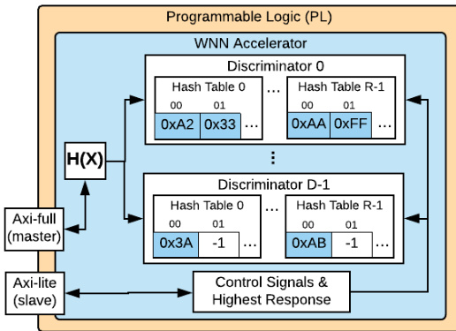
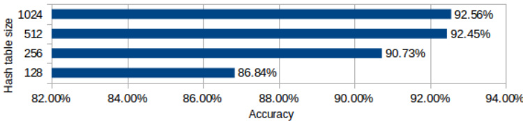
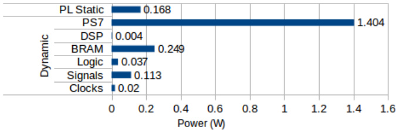

# A Feasible FPGA Weightless Neural Accelerator  

Victor C. Ferreira ∗, Alexandre S. Nery‡, Leandro A. J. Marzulo†, Leandro Santiago∗, Diego Souza § Brunno F. Goldstein∗, Felipe M. G. Fran¸ca∗, Vladimir Alves¶ ∗Programa de Engenharia de Sistemas e Computa¸ca˜o - COPPE, Universidade Federal do Rio de Janeiro (UFRJ), Brazil †Instituto de Matema´tica e Estat´ıstica, Universidade do Estado do Rio de Janeiro (UERJ), Brazil ‡Departamento de Engenharia Ele´trica, Faculdade de Tecnologia, Universidade de Bras´ılia (UnB), Brazil § WESPA Intelligent Systems, RJ, Brazil ¶ NGD Systems, Irvine, USA Corresponding e-mail: vcruz@cos.ufrj.br  

Abstract—AI applications have recently driven the computer architecture industry towards novel and more efficient dedicated hardware accelerators and tools. Weightless Neural Networks (WNNs) is a class of Artificial Neural Networks (ANNs) often applied to pattern recognition problems. It uses a set of Random Access Memories (RAMs) as the main mechanism for training and classifying information regarding a given input pattern. Due to its memory-based architecture, it can be easily mapped onto hardware and also greatly accelerated by means of a dedicated Register Transfer-Level (RTL) architecture designed to enable multiple memory accesses in parallel. On the other hand, a straightforward WNN hardware implementation requires too much memory resources for both ASIC and FPGA variants. This work aims at designing and evaluating a Weightless Neural accelerator designed in High-Level Synthesis (HLS). Our WNN accelerator implements Hash Tables, instead of regular RAMs, to substantially reduce its memory requirements, so that it can be implemented in a fairly small-sized Xilinx FPGA. Performance, circuit-area and power consumption results show that our accelerator can efficiently learn and classify the MNIST dataset in about 8 times faster than the system’s embedded ARM processor.  

Index Terms—WiSARD, Hash Table, FPGA, HLS  

# I. INTRODUCTION  

The Wilkes, Stonham and Aleksander Recognition Device, better know as WiSARD [1], is a Weightless Neural Network (WNN) comprised of multiple discriminators, which in part are composed of multiple RAMs that store data for pattern recognition. As such, it can be easily mapped into hardware and also greatly accelerated by means of a dedicated RTL architecture designed to enable various memories access in parallel. While this kind of neural network has been successfully implemented on several scenarios in software [2]– [5], its steep memory requirements prohibit a straightforward hardware implementation. Thus, due to its ram-centric architecture, different approaches should be used when placing it on hardware [6], [7].  

This work proposes a specialized Weightless Neural Network (WNN) co-processor designed and implemented on Xilinx Vivado HLS tools. Although Hardware Description Languages (HDLs) offer fine tuning control over the hardware specification and behavior, High-Level Synthesis (HLS) tools have recently matured and can exhaustively analyze highlevel code (e.g. $\mathrm { C / C + + }$ ), applying during the compilation process several different optimizations to rapidly produce RTL specification of such custom-made architectures, which greatly simplify the design process of co-processors and accelerators. The proposed weightless neural accelerator applies hash tables to substantially reduce its memory requirements, being able to fit in a relatively small-sized Xilinx FPGA (xc7z020), which could prove to be useful for Internet of Things (IoT) applications and other embedded scenarios in which resources are scarce and device size matters.  

The rest of this paper is organized as follows: Section II describes the state-of-the-art related works. The WNN architecture is presented in Section III, together with the implemented co-processor. Experimental results are presented in Section IV. Finally, Section V concludes and presents ideas for future work.  

# II. RELATED WORKS  

In [6], an automatic disease diagnosis is proposed based on the VG-RAM Weightless Neural Networks [8] with the intent of decreasing memory resource consumption and increasing performance. Their approach has focused on extending VGRAMs into a structure called VVG-RAMs that could store extra pattern information while using trie data structures [9] to manage such patterns. Although their software implementation shows higher memory consumption for a specific dataset, the hardware implementation presents great decrease in power, area consumption and classification time.  

Neural-based Node for Automatic Fingerprint Classification proposed in [7] consists of a hardware implementation which merges the WiSARD with a Virtual Neuron technique that is efficiently implemented in hardware [10]. By using a serial-parallel architecture with pipelines, they achieved a 2.9 speedup when compared to the traditional WiSARD model.  

The work in [11] presents a WiSARD architecture described in HLS without the use of hash tables. It has shown a viable solution for in-situ processing using WiSARD for face recognition, as well as a Dataflow programming model to ease the system’s programming and network communication. Although it demonstrates great performance when compared to the ARM host processor running the WiSARD software implementation, the architecture requires a high-end FPGA with several memory resources available to instantiate only 4 discriminators (classifiers).  

Therefore, this work improves on the previous one and presents an improved architecture which uses Hash Tables to substantially decrease the WNN memory requirements, enabling their implementation on low-cost FPGAs.  

# III. THE ARCHITECTURE  

In this section we introduce WiSARD arguing the motivation on why hash tables are necessary. Also, we describe the proposed WiSARD accelerator implementation using Hash Table compiled by Xilinx Vivado HLS tools.  

# A. WiSARD Neural Network  

The WiSARD is a classic Weightless Neural Network based on Random Access Memories and well-known for its simplicity and fast operations [1]. The WNN is comprised by $D$ units, called discriminators. Each discriminator has a set of $R$ RAMs of size $2 ^ { N }$ where $N$ represents address length in bits. RAMs can be depicted as Neurons where information is stored. Each RAM position consists of an address and its corresponding data. The input for the neural network is composed by $R$ addresses that will be used to access each RAM of the discriminator itself. The length of these addresses are directly related to $N$ . The classic WiSARD model stores a single bit on different positions of a RAM. The address of each position will depend on the input pattern that will be learned. Thus, total memory consumption can be calculated as follows:  

$$
D * R * 2 ^ { N }
$$  

Most implementations of the WiSARD Neural Network receive images as input. As WiSARD’s inner operations require binary input, it is necessary to translate colored pixels into a binary array of addresses. This type of transformation is called mapping. It is important to mention that mapping is a field of study itself and it directly impacts model accuracy and the incremental learning capacity [12]. The number of addresses generated, as well as their lengths, is directly related to the image size, as all pixels are commonly used for mapping.  

  
Fig. 1: A pseudo-random mapping of a black and white $4 \times 3$ picture of the letter $T$ during training phase. For this specific case $N = 3$ and $R = 4$ .  

Unfortunately, both $R$ and $N$ are directly related to the type of mapping, which by itself is directly related to the image size. This can entail into huge-sized RAMs. As an example, we took the MNIST Database which is comprised of 10 input classes with $2 8 \times 2 8$ pictures and test it for a simple pseudorandom mapping, similar to the one in Fig. 1, which generates  

28 addresses of 28 bits each. The total memory consumption was around 9 GB, yielding to a $9 2 . 7 3 \%$ inference accuracy. It is easy to see that such consumption is not feasible for most FPGAs. Furthermore, RAMs are extremely sparse after training, meaning most of their contents are empty. Because of these reasons, developers have been using Hash Tables, better known as dictionaries, to decrease their memory consumption.  

The idea behind this work is to replace each RAM to a Hash Table, where its contents are no longer a single bit, but the original input address for the corresponding RAM. By using this method we are only able to store the actual data that was trained, decreasing drastically the original size as we will discuss in Section IV. The HLS source code is available on Github [13] so that this work can be reproduced by different research groups.  

# B. Hash Table Weightless Neural Co-Processor  

The WiSARD Co-Processor is based on WiSARD’s classic implementation presented in Section III-A, but with the addition of hash tables. The ARM microprocessor reads the database and maps the image into an available input, so we should quickly be able to change datasets and mapping techniques without changing much, if anything, on the Programmable Logic (PL).  

  
Fig. 2: Block Diagram of the implemented architecture. ${ \sf H } ( { \sf x } )$ represents a hash function used on the WiSARD input data.  

The PL portion of the application is responsible for storing the discriminators, which are set of Hash Tables, as seen in Fig. 2. This was instantiated on HLS by using a static 1D array followed by pragma directives to enforce they should be implemented using Block RAMs. The static keyword ensures discriminator values will be kept after multiple calls to the module. The PL is also responsible for training and inference procedures. Each input image must be mapped into a set of addresses and translated into a hash address through a Hash Function. For this work, we decide to use the H3 Hash Function [14], since it is mainly comprised of bit-wise AND and XOR operations which are easily replicated in hardware. To deal with handling collisions, we only search for the next available positions below the current address. If a training is requested, the module must also receive the discriminator ID to indicate which unit should be trained. After the input address goes through the hash function, the original address value is written into an available Hash Table position. When an inference operation is requested, the input is also converted to a hash address and matched to the current data stored. If there is a match, the hash table will return one, otherwise zero. The output for both phases are given through an AxiLite interface [15]. For the training phase, the module sends back a True value if everything finished as expected, while for the inference phase it sends the ID of discriminator with highest response, as well as, its response value.  

The WiSARD module must receive from Axi-Lite a Boolean variable called mode to select the training or inference phase. Input addresses are retrieved by a master Axi-Full protocol [15], which represents the output of the mapping. A discriminator ID must be received through Axi-Lite for the training operation. As test scenarios, we use the MNIST Dataset [16] with the ARM microprocessor responsible for reading from a SD Card as well as mapping the file contents to the PL WiSARD. Fig. 2 depicts the overall block design diagram of the PL. We chose a pseudo-random mapping to translate the gray values of the MNIST Database into understandable inputs to the WiSARD. The first step is to find the mean of all pixel values using as a threshold to convert the pixels into a set of ones and zeroes. Finally, we pick $N$ random pixels based on a previously chosen $N$ on the PL and concatenate them forming $R \ : N$ -size addresses, which are the input for the WiSARD. The values of $N$ , $R$ and $D$ are detailed in Section IV.  

# IV. EXPERIMENTAL RESULTS  

Performance and circuit-area experimental results are presented based on the Hash Table WiSARD implementation on a Zynq-7020 FPGA, while inference accuracy results are presented based on the architecture HLS simulation targeting a Zynq Utrascale $+$ FPGA, so that different hash table sizes can be synthesized and analyzed. The Zynq-7020 development board (Zybo-Z7) is equipped with a Zynq XC7Z020- 1CLG400C FPGA, with the processing system running at $6 6 7 ~ \mathrm { M H z }$ and the Hash Table WiSARD co-processor running at $\mathrm { 1 0 0 ~ M H z }$ . The Hash Table WiSARD PL portion was implemented and synthesized through Vivado HLS and Vivado 2018.1 version. A 8 GB microSD card was employed to store the database files.  

The MNIST database was used as a baseline for measuring the hash table size as well as number of discriminators and WNN accuracy. This database consists of 10 different classes of $2 8 \times 2 8$ handwritten digits stored in a file format designed for storing vectors and multidimensional matrices [16]. The training set is formed by 60, 000 different handwritten digits, while the testing set for classification is formed by 10, 000 handwritten digits. Based on our previous experience with the same database on WiSARD versions developed on software, as highlighted by the memory consumption presented on Section III-A, we have chosen to use $D = 1 0$ , as the database have 10 different possible classes, $N = 8$ and $R = 2 8$ . Using the equation 1, we estimate the total memory resource consumption of Hash Table RAMs is around $2 8 0 \mathrm { K B }$ considering 32-bit address stored into each hash table position. With that result it should fit in most FPGAs.  

# A. Performance analysis  

This section evaluates the co-processor $( \mathrm { P S + P L } )$ ) design speedup in comparison to execution of the same logic on a bare-metal ZYNQ ARM processor (Full-PS). Both versions were executed and measured 10 times, with the average presented.  

TABLE I: Speedups measured for the neural co-processor when compared with a full ARM execution.   

<html><body><table><tr><td>Dataset</td><td>Speedup</td></tr><tr><td>60k training</td><td>8.27</td></tr><tr><td>10k inference</td><td>8.63</td></tr><tr><td>Total</td><td>2.81</td></tr></table></body></html>  

TABLE II: Time and ARM Cycle measurements for both $\mathbf { A R M + C o }$ -processor and full ARM Version.   

<html><body><table><tr><td>Measurement Type</td><td>ARM Cycles (×109)</td><td>Time (seconds)</td></tr><tr><td>60kTrain(Full-PS)</td><td>262.03</td><td>393.05</td></tr><tr><td>60k Train(PS+PL)</td><td>31.69</td><td>47.53</td></tr><tr><td>10k Inference(Full-PS)</td><td>528.86</td><td>793.29</td></tr><tr><td>10k Inference(PS+PL)</td><td>61.27</td><td>91.91</td></tr><tr><td>Total Time(Full-PS)</td><td>1098.43</td><td>1647.64</td></tr><tr><td>Total Time(PS+PL)</td><td>391.50</td><td>587.26</td></tr></table></body></html>  

Table I presents a report on the speedup using the Full-PS version as base. Table II presents how many ARM cycles it took for the co-processor to execute the $6 0 k$ training, taking into consideration sending the data, highlighted as the $\mathrm { P S + P L }$ version. There is also how long it took for the ARM to execute the same $6 0 k$ training. The same logic applies for the $1 0 k$ inference column, but it also accounts for the best response retrieved through AXI-Lite from the PL on the $\mathrm { P S + P L }$ version. The total time rows present the total execution time for both the $6 0 k$ trains and $1 0 k$ tests, as well as reading all the data from the SD Card and mapping it into a WiSARD input. The time presented in seconds was calculated assuming the 667 MHz ARM clock cycle takes 1.5 nanoseconds to execute. The speedups presented in Table I are based on the values reported in Table II.  

One of the main reasons for the speedup in both the training and inference are due to multiple parallel accesses on the Hash Tables, which are implemented as block rams. Since every hash table is independent, the training operations and response result calculation can be executed in parallel. Reading and mapping are done by the ARM microprocessor for both versions, which justify why there is a substantial decrease on total speedup in Table I. Since the mapping consists of forming 28 addresses of 28 bits, from a $2 8 \times 2 8$ picture, which is actually a pretty small size, we are confident the bottleneck stands on the readings from the SD Card.  

# B. Circuit-area analysis  

Resource consumption is presented on Table III. As expected, most of the consumed resources are Block RAMs (BRAMs), which are being used for storing the 10 discriminators with 28 Hash tables each. In fact, the discriminators are represented as a single uni-dimensional array in our HLS specification [13]. However, the ARRAY PARTITION optimization directive available in Vivado HLS splits the array into 256 smaller arrays with 280 integer positions in each. Thus, the $9 1 . 7 9 \%$ usage of BRAM is due to the partitioning directive, which maps each partitioned array onto RAMB18 (18Kb BRAM) resources, yielding around 4.5Mb block ram consumption $( 2 5 6 ~ \times ~ 1 8 K b )$ , which is more than actually necessary for implementing each discriminator and its hash tables. This approach not only facilitates the architecture specification in HLS but also enables parallel memory accesses, as each hash table position can be easily indexed using a discriminator identifier and each memory can be accessed simultaneously. Moreover, auxiliary arrays (e.g H3 matrix) and auxiliary variables are also declared, but are mapped as LUTRAM (Look-Up Table as Memory) and Flip-Flops (Registers). Also, it is important to notice that Zybo board can be considered a starter board without abundant resources, which shows how much the hash table technique can improve memory usage, possibly enabling the proposed accelerator application in IoT and embedded processing scenarios. Other resources such as Look-up Tables (LUTs), Flip-Flops (FF) and DSPs were most likely used for storing intermediate and smaller variables, as well as calculating H3 hash functions and discriminator responses.  

TABLE III: Neural Co-processor resource usage\*.   

<html><body><table><tr><td>Resource</td><td>Utilization</td><td>Available</td><td>Utilization %</td></tr><tr><td>LUT</td><td>9286</td><td>53200</td><td>17.45</td></tr><tr><td>LUTRAM</td><td>350</td><td>17400</td><td>2.01</td></tr><tr><td>FF</td><td>4568</td><td>106400</td><td>4.29</td></tr><tr><td>BRAM (RAMB18)</td><td>128.5</td><td>140</td><td>91.79</td></tr><tr><td>DSP</td><td>5</td><td>220</td><td>2.27</td></tr><tr><td>BUFG</td><td>1</td><td>32</td><td>3.13</td></tr></table></body></html>

\*Xilinx XC7Z020 FPGA  

# C. Accuracy analysis  

By using 28 Hash Tables with 256 positions, we were able to achieve a $9 0 . 7 3 \%$ accuracy for the MNIST Dataset, inferring 9073 images correctly from the $1 0 k$ testing set when running on the Zybo board described on III-A. Also, due to its limited resources, there is about $2 \%$ decrease in accuracy, because the hash tables become full before the end of the $6 0 k$ training. For this reason some training data is lost. Thus, we synthesized the same WiSARD accelerator based on a Zynq xczu9eg ultrascale $^ +$ FPGA, which provides much more resources, therefore enabling bigger hash tables. The accuracy results are presented in Fig. 3 for various sizes of hash tables.  

  
Fig. 3: Hash Table size and Accuracy comparison based on HLS synthesis and simulation results for the Zynq xczu9eg ultrascale $^ +$ FPGA.  

As expected, hash tables of 512 and 1024 positions achieved better accuracy results, which are also closer to the values given by the traditional WiSARD implementation on software (about $9 3 \%$ ). This means that a $N$ hash table address length of size 10 would enable for a similar accuracy-wise result when compared to a $N$ RAM address length of size 28 for this mapping and dataset. It is important to mention that, although a $2 \%$ accuracy decrease could present itself too much for certain applications, the decrease in memory resources from $9 G B$ to around $2 8 0 ~ \mathrm { K B }$ (or ${ 4 . 5 } \mathrm { M b }$ in our FPGA implementation) should still be accounted for.  

# D. Power estimation analysis  

The power requirement results presented in this section are estimations generated using Vivado’s 2018.1 power analysis report on vectorless mode. Fig. 4 presents the estimate power consumption per resource. The Processing System (PS7) seems to be responsible for the biggest overall consumption, followed by Block Rams (BRAM) which are the most consumed resource on the proposed accelerator architecture as seen on Table III.  

  
Fig. 4: Power consumption data with a default toggle rate set to $1 2 . 5 \%$ and static probability set to 0.5 $\mathrm { \chi } _ { \mathrm { x c } 7 z 0 2 0 }$ FPGA).  

# V. CONCLUSIONS  

This work presented a Neural Accelerator which uses Hash Tables within the WiSARD model to greatly decrease the architecture’s memory consumption, enabling its implementation on a fairly small-sized Xilinx FPGA (xc7z020). The PS is responsible for reading data from SD card and mapping such data to the expected inputs on the PL portion. Initial results show a great decrease in memory usage with a small decrease in accuracy due to resources limitations on the chosen FPGA board. Positive speedup results are also presented in comparison to a version fully executing on the ARM processor. For future works we are considering testing with other datasets, as well as other FPGA boards. Instantiating a AxiStream module could also provide a better performance. A full Verilog version is part of ongoing work, which in term could show a better management of FPGA resources and a further increase in parallelism and hash tables size. Finally, accurate power consumption results will also be presented in the future, as Vivado’s vectorless mode is not as accurate as a post-route simulation with realistic (typical or worst case scenario) stimulus.  

# ACKNOWLEDGMENT  

The authors would like to thank NGD Systems, CAPES, $\mathrm { C N P q }$ and FAPERJ for their financial support. Last but not least, also Xilinx University Program for the donation of the licenses that allowed the development of this work.  

# REFERENCES  

[1] I. Aleksander, M. De Gregorio, F. M. G. Fran¸ca, P. M. V. Lima, and H. Morton, “A brief introduction to weightless neural systems.” in ESANN. Citeseer, 2009, pp. 299–305.   
[2] M. De Gregorio, “An intelligent active video surveillance system based on the integration of virtual neural sensors and bdi agents,” IEICE TRANSACTIONS on Information and Systems, vol. 91, no. 7, pp. 1914– 1921, 2008.   
[3] P. Coraggio and M. De Gregorio, “Wisard and nsp for robot global localization,” in International Work-Conference on the Interplay Between Natural and Artificial Computation. Springer, 2007, pp. 449–458.   
[4] C. B. Do Prado, F. M. Franca, E. Costa, and L. Vasconcelos, “A new intelligent systems approach to 3d animation in television,” in Proceedings of the 6th ACM international conference on Image and video retrieval. ACM, 2007, pp. 117–119.   
[5] R. L. De Carvalho, D. S. Carvalho, F. A. C. Mora-Camino, P. V. Lima, and F. M. Fran¸ca, “Online tracking of multiple objects using wisard,” in ESANN 2014, 22st European Symposium on Artificial Neural Networks, Computational Intelligence And Machine Learning, 2014, pp. pp–541.   
[6] R. Cheruku, D. R. Edla, V. Kuppili, R. Dharavath, and N. R. Beechu, “Automatic disease diagnosis using optimised weightless neural networks for low-power wearable devices,” Healthcare technology letters, vol. 4, no. 4, pp. 122–128, 2017.   
[7] V. Conti, L. Rundo, C. Militello, G. Mauri, and S. Vitabile, “Resourceefficient hardware implementation of a neural-based node for automatic fingerprint classification,” J. Wirel. Mob. Netw. Ubiquit. Comput. Depend. Appl, vol. 8, pp. 19–36, 2017.   
[8] A. F. De Souza, C. Badue, F. Pedroni, S. S. Dias, H. Oliveira, and S. F. de Souza, “Vg-ram weightless neural networks for face recognition,” in Face Recognition. InTech, 2010.   
[9] D. E. Willard, “New trie data structures which support very fast search operations,” Journal of Computer and System Sciences, vol. 28, no. 3, pp. 379–394, 1984.   
[10] S. Vitabile, V. Conti, F. Gennaro, and F. Sorbello, “Efficient mlp digital implementation on fpga,” in Digital System Design, 2005. Proceedings. 8th Euromicro Conference on. IEEE, 2005, pp. 218–222.   
[11] V. C. Ferreira, A. S. Nery, and F. M. Franc¸a, “A smart disk for in-situ face recognition,” in 2018 IEEE International Parallel and Distributed Processing Symposium Workshops (IPDPSW). IEEE, 2018, pp. 1241– 1249.   
[12] A. Kappaun, K. Camargo, F. Rangel, F. Firmino, P. M. V. Lima, and J. Oliveira, “Evaluating binary encoding techniques for wisard,” in Intelligent Systems (BRACIS), 2016 5th Brazilian Conference on. IEEE, 2016, pp. 103–108.   
[13] “Hls hash table wisard on github,” https://github.com/vcruzer/ HLS-Wisard-Dictionary, accessed: 2018-10-25.   
[14] J. L. Carter and M. N. Wegman, “Universal classes of hash functions,” Journal of computer and system sciences, vol. 18, no. 2, pp. 143–154, 1979.   
[15] “Axi reference guide,” https://www.xilinx.com/support/ documentation/ip documentation/axi ref guide/latest/ ug1037-vivado-axi-reference-guide.pdf, accessed: 2019-02-07.   
[16] Y. LeCun, “The mnist database of handwritten digits,” http://yann. lecun. com/exdb/mnist/, 1998.  