# Extending the weightless WiSARD classifier for regression  

Leopoldo A.D. Lusquino Filho a 1 ∗, Luiz F.R. Oliveira a 1 Aluizio Lima Filho a Gabriel P. Guarisa a Lucca M. Felix b Priscila M.V. Lima a c Felipe M.G. França a  

a PESC/COPPE, Universidade Federal do Rio de Janeiro, RJ, Brazil b DCC, Universidade Federal do Rio de Janeiro, RJ, Brazil c NCE, Universidade Federal do Rio de Janeiro, RJ, Brazil  

# a r t i c l e i n f o  

# a b s t r a c t  

Article history:   
Received 15 July 2019   
Revised 11 December 2019   
Accepted 12 December 2019   
Available online 8 April 2020  

Communicated by Dr. Oneto Luca  

Keywords:   
Regression WiSARD   
WiSARD   
ClusWiSARD   
n Tuple classifier   
n Tuple Regression Network   
Ensemble   
Online learning  

This paper explores two new weightless neural network models, Regression WiSARD and ClusRegression WiSARD, in the challenging task of predicting the total palm oil production of a set of 28 (twenty eight) differently located sites under different climate and soil profiles. Both models were derived from Kolcz and Allinson’s $n$ Tuple Regression weightless neural model and obtained mean absolute error (MAE) rates of 0.09097 and 0.09173, respectively. Such results are very competitive with the state-of-the-art (0.07983), whilst being four orders of magnitude faster during the training phase. Additionally the models have been tested on three classic regression datasets, also presenting competitive performance with respect to other models often used in this type of task.  

$\mathfrak { O }$ 2020 Elsevier B.V. All rights reserved.  

# 1. Introduction  

Regression is a traditional and important machine learning task, since there is a wide range of practical situations in the real world where it is necessary to predict values in a continuous space. In a precision agriculture scenario, it would be desirable that simple devices, such as small sensors, could perform regression. Weightless Artificial Neural Networks (WANNs), due to its lean, RAMbased architecture, seem to be a suitable computational intelligence model for this type of task.  

This paper explores the use of WANNs in the KDD18 competition [3] a challenge which goal is to predict the palm oil harvest productivity of a set of 28 (twenty eight) different production fields using data provided by an agribusiness company. The dataset contains information about palm trees varieties, harvest dates, atmospheric data during the development of the trees, and soil characteristics of the fields where the trees are located in. The WANN models explored in this work are based on the $n$ Tuple Regression Network [2] which was proved to be successful when compared to other classical regression approaches in non-linear plant approximation [33] and Mackey-Glass chaotic time series prediction tasks [32] These WANN models were introduced in [5] Here, a wider theoretical background is presented, alongside a broader exploration of their parameters and how the models perform when combined as ensembles.  

The remainder of this text is organized as follows. Section 2 presents the basic models that inspired the new weightless regression ones: $n$ Tuple Classifier, WiSARD [1] ClusWISARD [8] and $n$ Tuple Regression Network [2] Section 3 presents the two weightless models proposed for regression, and the ensemble techniques explored. Section 4 discusses the various approaches used in the KDD18 competition, as well as a comparison with state-of-the-art methods. This section also contains the description of experiments using the new models in the House Prices, CalCOFI, and Parkinson datasets. Concluding remarks and ongoing work are presented in Section 5  

# 2. n Tuple Classifier and family  

# 2.1. n Tuple Classifier  

The $n$ Tuple Classifier is a binary pattern classifier [4] based on Random Access Memories (RAMs), requiring no parameter fine tuning or any error minimization technique to achieve generalized learning patterns [34,35] The basis of its operation is to use the input to construct an address set and use them to access the contents of RAM nodes. Thus, in this model, the training phase consists in writing into RAM memory adresses, while the classification phase consists in reading the addresses. Models based on n Tuple Classifier are commonly called Weightless Artificial Neural Networks (WANNs).  

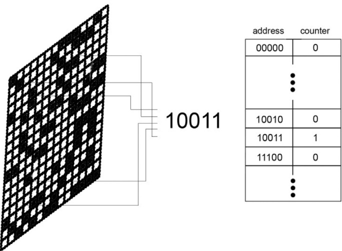  
Fig. 1. Training stage in WiSARD.  

# 2.2. WiSARD  

WiSARD [1] is a $n$ tuple classifier composed by class discriminators  each discriminator is a set of $N$ RAM nodes having n address lines each. All discriminators share a structure called input retina from which a pseudo-random mapping of its $N ^ { * } n$ bits composes the input address lines of all of its RAM nodes. While the original $n$ Tuple Classifier was designed to recognize handwritten characters, WiSARD extrapolates its operation to any kind of binary pattern.  

WiSARD has produced remarkable results in the most diverse tasks, which corroborate the choice of this model, such as data stream clustering [11–13] time-series classification [9] audio processing [10] online tracking of objects [14] part-of-speech tagging [15,16] text categorization [17] and facial emotion classification [18–20]  

# 2.2.1. Training and classification  

When the network is initialized, all RAM memory locations have ${ \bf \nabla } \cdot { \bf 0 } ^ { \cdot }$ as content. In its original definition, when receiving a binary training input, WiSARD sets to ‘1’ the contents of the memory locations accessed in the discriminator of the sample class (Fig. 1 . In the classification phase, all discriminators have each of their RAMs accessed in a single memory location and the discriminator with more memory locations with content ‘1’ accessed will determine the class (Fig. 2 .  

The original model suffered from saturation as the cardinality of the training set increased. To circumvent this limitation, an enhanced version of WiSARD was used, in which the RAM memory locations had counters instead of a single bit. The values in theses counters increases by 1 during the training phase as the memory address is accessed. During the classification phase, it continues to count the number of memory locations with non-null content to determine the score of each discriminator. However, a memory location can only be counted if its content has a value greater than a threshold called bleaching [6] which is initialized with value ‘0’. When there is a tie between the discriminators, the bleaching value is increased. If the value of the bleaching becomes greater than the counter of the most accessed memory location of WiS  

ARD, there is an absolute draw and a default class chosen beforehand is determined for the sample. This mechanism is detailed in Algorithm 1  

# Algorithm 1 Classification with bleaching in WiSARD algorithm.  

1: procedure Classifying   
2: Require $T =$ test data   
3: Ensure $\bar { d } ( o ) =$ collection of content of accessed memory lo  
cations in discriminator $d$ by observation o   
4: Ensure W SD is a trained WiSARD classifier   
5: for each observation $o \in T$ do   
6: bleaching $\mathbf { \varepsilon } = 0$   
7: scores $\mathbf { \sigma } = \mathbf { \sigma }$ null   
8: while ((  ( 1 in scores  and  ( 2 in scores  and $\mathit { s } 1 \ : = \ :$   
s2 ) and ( $\exists s \in$ scores $\mid s > 0 )$ ) or $( \mathbf { s c o r e s } = \mathbf { n u l l } )$ do   
9: for each discriminator $d$ in WSD do   
10: scores d] $= \sum { \bar { d } } ( o ) \geq$ bleaching   
11: bleaching $\mathbf { \sigma } = \mathbf { \sigma }$ bleaching $^ + 1$   
12: if $\exists s \in$ scores $\mid s > 0$ then   
13: classes o $\mathbf { \sigma } = \mathbf { \sigma }$ class(d with maximum score)   
14: else   
15: classes o $\mathbf { \sigma } = \mathbf { \sigma }$ default class   
16: Return classes  

# 2.2.2. minZero and minOne  

Another modification in the WiSARD algorithm is to ignore the contribution of a certain memory location in the classification phase if its address does not meet a certain amount of $\cdot _ { 0 ^ { \phantom { \dagger } } s }$ (minZero) and ‘1’s (minOne). The motivation for these parameters is to enable WiSARD to filter redundant input data, besides the necessary preprocessing applied to the input (via binarization). There is still no way to dynamically adjust minZero and minOne, and the best values for them vary from task to task and are empirically obtained through a simple exploration of the value space.  

These parameters are inspired by a previously used technique, which was to ignore the contribution of memory locations addressed only by bits 0, thus reducing sparse data noise [17] These parameters are specifically useful in domains where potentially noisy areas are known.  

# 2.3. ClusWiSARD  

Sometimes the same class may include non-similar patterns. Similarly to other classifiers, WiSARD’s discrimination capabilities will be stressed, probably inducing the target discriminator to become saturated due to the learning of extremely heterogeneous patterns. ClusWiSARD [8] is an extension of WiSARD which allows it to learn sub-patterns by creating more than one discriminator per class if the new examples submitted to the network are not sufficiently similar to those already learned. Since this is analogous to clustering the examples of a class, the network was called ClusWiSARD and this operation is called internal clustering.  

In the training phase, when an observation is presented to the network, it is sorted by all the discriminators in its class, which will naturally return a score with the number of active RAMs during classification. The discriminator that will learn the new pattern must satisfy the following condition:  

$$
r \geq \operatorname* { m i n } { \left( N , r _ { 0 } + \frac { N | d | } { \gamma } \right) } ,
$$  

where $r$ is the score of the discriminator when classifying the observation, $| d |$ is the discriminator size, $N$ is its number of RAMs, $r _ { 0 }$ is a threshold, which indicates the minimum response expected by a discriminator, and $\gamma$ is also a threshold, which indicates the growth interval, that is, the speed that the discriminators increase their size.  

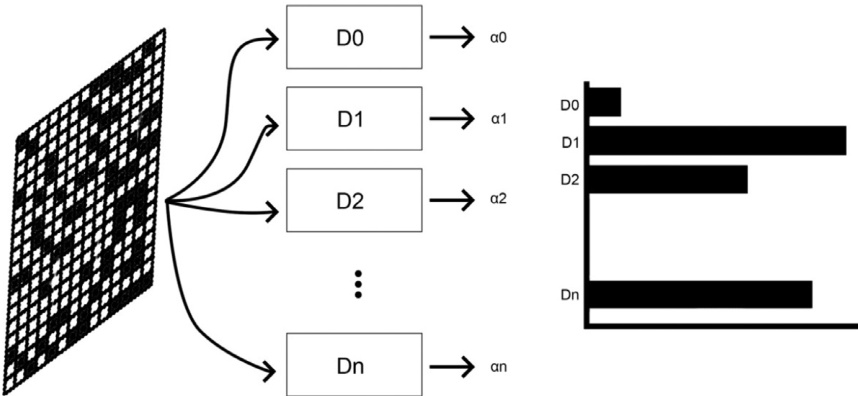  
Fig. 2. Classification stage in WiSARD.  

The classification phase of ClusWiSARD is similar to that of WiSARD, where the discriminator with the highest score will determine the pattern of the example. If there is a tie between discriminators of the same class, this class will naturally be the network response and there is no need to apply bleaching  

Although originally designed to improve accuracy in supervised tasks, by enabling sub-patterns to be learned, ClusWiSARD can also be used for semi-supervised learning (where a non-annotated example is trained by all the discriminators that present the highest score in the classification phase, being able to belong to more than one cluster per class and to more than one class) and unsupervised learning [20] (where a ClusWiSARD presents only one discriminator and applies the same policy of creating new discriminators of supervised learning, one example being always tested for all discriminators already created; this operation is known as external clustering). In a financial credit analysis challenge, ClusWiSARD outperformed SVM by two orders of magnitude in training time, while remaining competitive in accuracy [8]  

# 2.4. n Tuple Regression Network  

$n$ Tuple Regression Network 2] is a modification of the basic $n \cdot$ Tuple Classifier architecture, which allows it to operate as a nonparametric kernel regression estimator; it is also capable of approximating probability density functions (pdfs) and deterministic arbitrary function mappings; for this, the $n$ Tuple Regression Network uses a RAM-based structure, where each memory location stores a counter and a weight, which is updated through the LMS algorithm [7]  

# 3. Regression with WiSARD  

# 3.1. Regression WiSARD  

Regression WiSARD (ReW) is an extension of the $n$ Tuple Regression Network, which adds to its original structure some characteristics of the WiSARD. Here is a description of its general architecture:  

Each RAM location in the ReW model has two dimensions: a counter, and a $s u m ( y )$ , a value formed by sum of the predictions learned by the network, both updated at each pattern training; initially all values are set to zero;   
• ReW accepts binary data with exactly the size of its retina $( N ^ { * } n )$ as input, what normally require some kind of preprocessing to transform the input data into binary representation; each pseudo-randomly mapped group of $n$ bits of the input retina will access the position corresponding to its values a neuron (RAM node);  

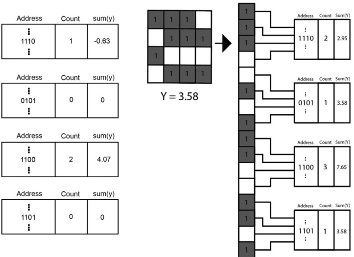  
Fig. 3. Example of ReW model behavior n he raining phase. A binary nput nd a float value $y$ are presented to the model. The pseudo-random mapping is applied to the binary input and the new pattern is divided into $n$ tuples, each one being assigned to one of the regression RAMs. The values related to the address corresponding o he uple re updated n he ollowing way: he ounter s ncremented by 1, while the summation is incremented by the value of $y$  

• When during the prediction phase, a memory location that was never accessed during the training phase is accessed, ReW will respond as a “don’t know answer” prediction, with the architecture of each system where ReW is used to handle this response according to the domain of the problem. In this work, a prediction 0 is made in cases of “don’t know answer”; • ReW uses WiSARD’s minZero and minOne.  

# 3.1.1. Training  

In the training phase (Fig. 3 , $k$ pairs $( \mathbf { x } _ { i } , y _ { i } )$ are submitted to the ReW network, and each of their corresponding addressed memory locations will have their two values updated; the counter is incremented and partial access is summed with the $y _ { i }$ of the example that generated the access.  

# 3.1.2. Prediction  

In the prediction phase the sum of counters $( \Sigma { } c )$ and partial y $( \Sigma y )$ of the positions accessed by a given $\mathbf { x }$ are used to calculate the corresponding $y$ (Fig. 4 ; unlike he $n$ Tuple Regression Network that uses only simple mean $\big ( \frac { \sum y } { \sum c } \big )$ for this calculation, ReW can also use:  

power mean: $\sqrt [ p ] { \frac { \sum _ { i = 0 } ^ { n } { ( \frac { y _ { i } } { c _ { i } } ) } ^ { p } } { n } }$ • median: central value of $\frac { y _ { i } } { c _ { i } }$ , with i in range [0, n])  

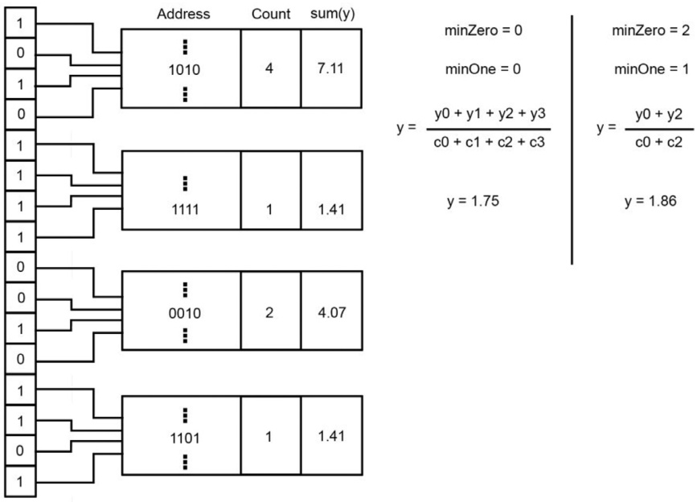  
Fig. 4. Prediction of the same example with different minZero and minOne values (simple mean).  

1 kn 1 ci y   
harmonic mean: n • harmonic power mean: n   
• geometric mean: (n=0 yc ) • exponential mean: $\begin{array} { r } { l o g ( \frac { \sum _ { i = 0 } ^ { n } e ^ { \frac { y _ { i } } { c _ { i } } } } { n } ) } \end{array}$  

Associated with each type of mean is an influence on the response set of RAMs. The median allows escape from the influence of outliers and the other mean types favor the influence of the contribution of memory locations that were most accessed during training, with different degrees of intensity (Harmonic, Power, Harmonic Power and Geometric Mean, in ascending order). The Arithmetic Mean was kept since it was adopted by the original $n$ Tuple Regression Network and is the only one that does not differentiate among RAM responses.  

# 3.2. ClusRegression WiSARD  

Inspired by ClusWiSARD, the ClusRegression WiSARD (CReW) is a network formed by several ReWs, each with distinct mappings, but with retinas of the same size and same address size as well.  

# 3.2.1. Training  

In the training phase, when a pair $( \mathbf { x } _ { i } , y _ { i } )$ is submitted to the network, $\mathbf { x }$ is presented for each ReW, which behaves as a class discriminator of the WiSARD in the classification phase, that is, each ReW will return a score obtained from the number of positions of its memories that have been accessed and have counter with value greater than zero. All ReW discriminators that satisfy the learning policy are trained with $( \mathbf { x } _ { i } , y _ { i } )$ .  

If an observation is submitted to CReW but does not meet the requirement to be learned by any of its discriminators and the threshold for creating new discriminators (if it has been established) has already been reached, then this observation will not be learned because it is likely to be an outlier. The CReW training algorithm is detailed in Algorithm 2.  

# 3.2.2. Prediction  

In the prediction phase, when an input $\textbf { x }$ is submitted to the CReW, it will be sorted by each ReW and the highest score will predict its corresponding $y$ If there is a tie between the ReWs, the tie-break policy known as bleaching, native to WiSARD, will be used. In it a threshold initialized with value zero is incremented with each tie and a new classification occurs, being considered for the score of each discriminator only the memory locations whose counter is superior to the bleaching. Just like WiSARD, if there is an absolute tie, that is, the value of the bleaching is greater than the cardinality of the training set used, a previously chosen ReW default is elected.  

Algorithm 2 ClusRegression WiSARD algorithm.   

<html><body><table><tr><td colspan="2">1:procedure TRAINING</td></tr><tr><td></td><td>Require rO = minimum score</td></tr><tr><td>2: 3:</td><td>Require γ = threshold growth interval</td></tr><tr><td>4:</td><td>Require μ = maximum discriminators</td></tr><tr><td>5:</td><td>Require T= trainingdata</td></tr><tr><td></td><td></td></tr><tr><td>6: 7:</td><td>Ensure CReW isa trained ClusRegression WiSARD regressor</td></tr><tr><td>8:</td><td>for each observationo∈T do</td></tr><tr><td></td><td>for each discriminator d currently in CReW do</td></tr><tr><td>9:</td><td></td></tr><tr><td>10:</td><td>then Y if score(d.o) ≥ min(N. ro + Nd)</td></tr><tr><td>11: 12:</td><td>ReW discriminator d learns o if no ReW discriminator learned the observation o and</td></tr><tr><td></td><td>size(CReW)<μ then</td></tr><tr><td>13:</td><td>Anewdiscriminator dOis created</td></tr><tr><td>14: CReW</td><td>dO isadded to the collection of ReWdiscriminators of</td></tr><tr><td>15:</td><td></td></tr><tr><td>16:</td><td>Discriminator dO learns observation o</td></tr></table></body></html>  

# 3.3. Ensembles  

In order to improve the predictive power of the new models, ensembles formed exclusively with ReW and CReW were also tested.  

# 3.3.1. Ensemble learning  

Ensemble learning are techniques used to solve classification, regression or clustering tasks that are based on generating a set of learning models and combining their results to obtain a more robust and accurate result than any of the models would obtain individually [21] Ensemble can be effective in problematic machine learning issues, such as class imbalance, concept drift and curse of dimensionality [22,28]  

Ensembles distance themselves from divide-to-conquer strategies because they are no more than simply dividing a dataset into smaller sets and applying different models to each of them. In ensemble learning each model is trained with a subset of data with the possibility of subsampling or even with distinct features. Ensembles usually have a pruning step, where less important models on the comitee are discarded.  

Some fundamental types of ensembles are:  

• Boosting [23]  ensemble that assigns weights to the training set samples, so that samples that have been misclassified in past validations have their weight added while the weight of properly sorted examples is decreased; weights can also be assigned to individual learners;   
• Bagging [24]  ensemble that generates several independent models trained with data with resampling; generally effective with models that have high variance; since models are independent, they can be trained in parallel;   
• GradientBoost [25,26]  a specific type of boosting algorithm, whose models are usually decision/regression trees, that generalizes their models by optimizing an arbitrary differentiable loss function.  

# 3.3.2. Regression WiSARD ensembles  

Three ensemble models were tested using ReW and CReW: Naïve (all models are trained with the entire training dataset and there is no restriction on the existence of fully redundant models), Bagging and Boosting. The weak learners are obtained by simple draw, and in the case of ReW the following parameters are drawn: address size (in range [5,32]), type of mean, minZero and minOne. For CReW, in addition to the parameters used in ReW are also randomized the minimum response, growth interval and the maximum of ReW discriminators (in range [2,6]).  

In ReWBagging, each weak learner is trained with subsets of the training dataset of the same size, with resampling. At training time, two parameters are selected: the amount of weak learners and the size of the subset. ReWBoost training also uses, for each weak learner, subsets of the same size, without resampling. $9 0 \%$ of the training subset is used for training and $10 \%$ for validation. The weight of the vote of each learner is determined by normalization of its score in the validation phase.  

Simple Mean, Median and Harmonic Mean can be chosen to calculate the average of the individual predictions, resulting in ensemble prediction. These ensembles do not yet have any refined type of pruning, and ReWBagging only discard strictly redundant learners, that is, learners with the same parameters trained with the same subset, and ReWBoost and Naïve ReW Ensemble never discards any learner.  

CReW can be considered an ensemble too. Ensembles dont necessarily need combine individual predictions for generating a more accurate prediction. It can generate a prediction choosing the best weak learner as CReW does.  

# 4. Experimental results  

This section presents the results of ReW, CReW and their ensembles in the dataset that motivated their creation: KDD18 dataset. Additionally three other datasets were used in their validation. The experimental environment used here is a Intel Core i5 1.8 GHz with 8 GB DDR. The ReW and CReW implementations used here are available, along with other weightless models, in the $C { + } { + } { / }$ Python wisardpkg library2.  

# 4.1. KDD18 experimental setup  

The data available to the competitors was divided into three types of files: first, the training and testing files, containing 5243 and 4110 observations, respectively. Both files contains as features (i) the id of the observation; (ii) the id of the field the observation was planted; (iii) the age of the palm tree; (iv) the type of the palm tree; (v) the year of harvest and (vi) the month of harvest. The training file also has information regarding the target $y _ { : }$ which is the total amount of palm oil produced by the tree. Second, a file containing information regarding the soil properties of the field in which the palm tree is planted. Finally, 28 files containing historical data regarding weather measured in each field from January 2002 to December 2007.  

The initial modeling removes the id and the f eld_ d and adds additional information from the other files. First, a time window is defined in order to search weather information in a specific period of time going backwards from the month prior to the harvest of the tree. Second, all 66 features related to the soil data are added. The new observation is then composed by 68 features (age, type, and 66 ground-related features) plus 8 features for each month contemplated by the time window.  

In a second round of experiments, variations of the initial modeling were performed. One of them ignores the soil data by creating a total of 28 ReWs, each one responsible for predicting the production of trees planted in a specific field. Other variations aims to overcome the problem of the type feature: there are values in the testing file that are not present in the training file. These variations included the removal of the feature and the usage of one-hot encoding of all possible values.  

Since the features must be binarized, a thermometer encoding is applied. Due to the short space of time, it was not possible to perform experiments aiming for the best thermometer value for each feature. As a result, the same value was applied to all features. However, a small set of different values were used for an empirical evaluation. In addition, since a binary word of size w can be divided into different sizes of n tuples, all possible n values that are less than 32 were tested.  

# 4.2. Analysis of the KDD18 experiments  

The best of RAM-based solutions reached the seventh position of 51 teams3  

Since the KDD18 test set annotations are not public, it was necessary to submit the results of the experiments to Kaggle to obtain their respective MAE and how the Kaggle API behaves problematically, losing results and even disrupting when a large flow of results is submitted, the experiments for KDD18 were not performed multiple times to obtain the standard deviation (except for ensembled tests, where each had 10 rounds). Since the data is private, it was also not possible to measure the result with any other metric than that used in challenge, MAE.  

A dataset exploration varying the address size for the ReW, CReW and $n$ Tuple Regression Network models and the amount of ReWBagging, ReWBoost and Naïve ReW Ensemble learners with their respective MAE, training time and test time obtained can be found in the Figs. 5–8  

The best results obtained by the weightless regression models and their ensembles are compared with the state-of-the-art of this task and other relevant results in the Kaggle challenge in Table 1  

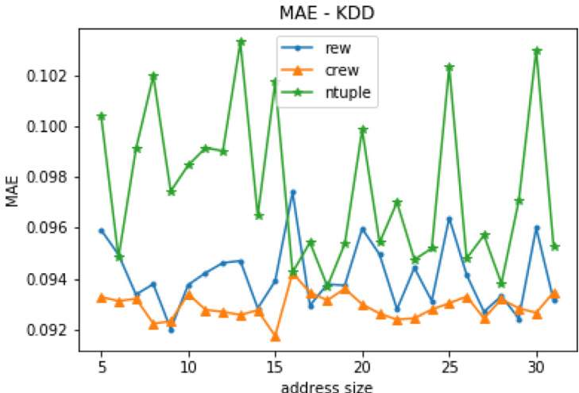  
Fig. 5. Address size X MAE for ReW, CReW and $n$ Tuple Regression Network in KDD18 dataset.  

Table 1 Comparison of WANN regressor models with state-of-the-art in Private Score of KDD18 Challenge.   

<html><body><table><tr><td>Model</td><td>MAE</td><td>Training time (s)</td><td>Test time (s)</td></tr><tr><td>XGBoost</td><td>0.07983</td><td>4.12962484</td><td>0.08239889145</td></tr><tr><td>GradientBoost</td><td>0.08239</td><td>3864.08913588</td><td>0.00241994858</td></tr><tr><td>n-Tuple Regression</td><td>0.09211</td><td>0.0037262439727</td><td>0.000348329544</td></tr><tr><td>RegressionWiSARD</td><td>0.09097</td><td>0.00035619736</td><td>0.00017619133</td></tr><tr><td>ClusRegressionWiSARD</td><td>0.09173</td><td>0.00040984154</td><td>0.00021290781</td></tr><tr><td>Naive Ensemble</td><td>0.08814</td><td>71.24</td><td>3523.83</td></tr><tr><td>ReWBagging</td><td>0.13867</td><td>58.4</td><td>3308.82</td></tr><tr><td>RewBoost</td><td>0.14996</td><td>5.16</td><td>4689.94</td></tr></table></body></html>  

In the Public Score of the KDD18 competition [3] all results were obtained from the validation dataset. ReW and CReW obtained MAE of 0.08737 and 0.08938, respectively, while XGBoost [27] the state-of-the-art, obtained MAE of 0.07569. A Naïve ReW Ensemble got MAE of 0.08468. These results are fully described in [5] The following experiments will only take into account results obtained with the test dataset, the Private Score of the KDD18 challenge.  

One caveat: the $n$ Tuple Regression Network used here shares the current implementation of dictionary-based WiSARD models where only memory locations accessed at some point in the training phase are actually allocated, causing the memory consumption of the model to be quite small. Experimental results shows that, in general, ReW and CReW outperform $n$ Tuple Regression Network in MAE, training and test time.  

Some considerations: when the address size n of a network increases, it becomes naturally more sparse, so the confidence of the network decreases; both ReW and CReW consistently present accuracy/MAE with low standard deviation; the output of an ensemble is obtained by the average output of all its members, using the same modalities used internally in the ReW model.  

It can be seen from the results of Table 1 that both proposed models presented small differences from the state-of-the-art, while surpassing its speed in many orders of magnitude. Another experiment carried out involved several ReW configurations using the KDD18 challenge winner preprocessing setup (ignoring categorical variables) and the best result was 0.09447 (thermometer $\mathbf { \Sigma } = \mathbf { \Sigma }$ time window size $\mathit { \Theta } = \ 1 0$ , $n = 3 0$ , minZero $\mathbf { \Sigma } = \mathbf { \Sigma }$ minOne $\mathit { \Theta } = 0$ , harmonic power mean). Experiments with Naïve ReW ensembles introduced a slight improvement in the performance of the models, despite the natural drop in speed.  

The best results from ReWBagging and ReWBoost are 0.13867 $4 0 \%$ of training set, 705 learners, harmonic mean, training time $= 1 . 5 4 s$ , test time $= 3 3 0 8 . 8 2 s \cdot$ ) and 0.14996 (905 learners, simple mean, training $\mathrm { t i m e } = 5 . 1 6 s$ , test ti $\mathrm { m e } = 4 6 8 9 . 8 4 s )$ , respectively. These ensembles have been found to have worse results than the individual models, and were obviously much slower. This comes as no surprise, since there is no evidence that an ensemble will outperform the best model on the committee, only that it will do so in relation to the worst model. Additionally, since no pruning strategy was applied and only ReWs and CReWs were used, the great advantage of ensembles in using the diversity of models to improve the predictive power of the system, may have been missed. In this sense, one possibility of increasing the accuracy of ReW Ensembles would be to use preprocessing or even different features for each learner, rather than just increasing the number of learners by varying their parameters. A hybrid ensemble of 45 ReWs (with different $n$ minZero, minOne and averages) and a GradientBoost ( $n$ estimators $\ l = 8 0 0 0$ , max depth $\mathit { \Theta } = 1 \mathit { \Theta }$ , los $s =$ lad, learning rate $= 0 . 0 1$ ) achieved 0.08814 in MAE.  

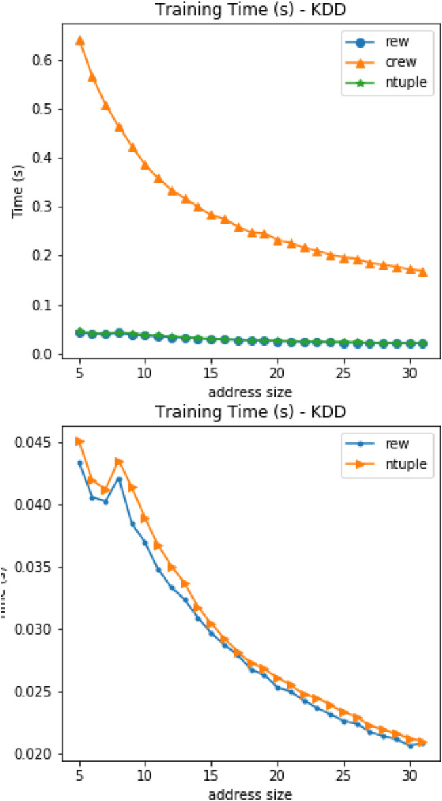  
Fig. 6. Address size X training time (s) for: (a) ReW, CReW and $n$ Tuple Regression Network n KDD18 dataset; b) ReW nd $n$ Tuple Regression Network n KDD18 dataset.  

# 4.3. Analysis of experiments of other datasets  

For a better analysis of the behavior of weightless regression models, they have been validated on datasets other than KDD18. The datasets used here are:  

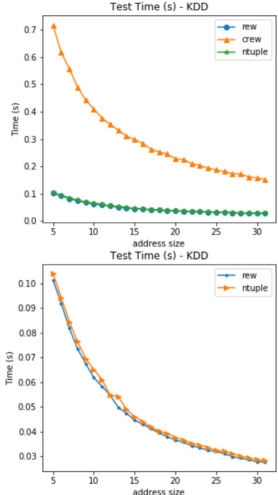  

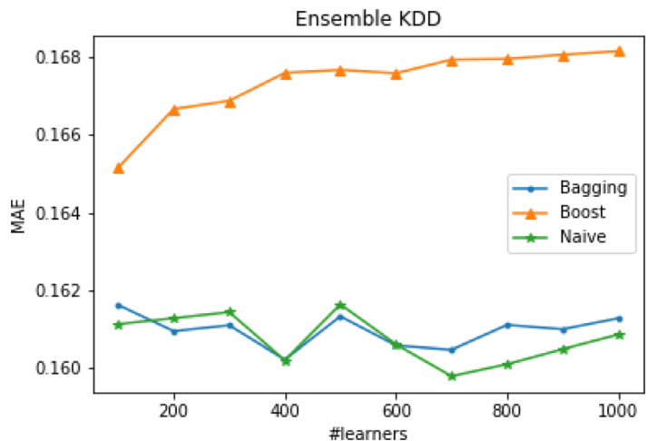  
Fig. 7. Address ize X est ime s) or: a) ReW, CReW nd $n$ Tuple Regression Network n KDD18 dataset; b) ReW nd $n$ Tuple Regression Network n KDD18 dataset.   
Fig. 8. Number of weak earners X MAE or BaggingReW, BoostReW nd Naïve ReW Ensemble in KDD18.  

• House Prices [29]  The most famous regression model benchmark, has 77 features (both categorical and numerical) and the challenge here is to predict the selling value of each home from its attributes (the training set has 973 examples and the test set has 480);  

• CalCOFI [30]  This data set represents the longest and most complete time series of oceanographic and larval fish in the world. Although this dataset can be used for many different domains, here it was used to predict sea temperature from salinity level (training set: 579458, test set: 285405);  

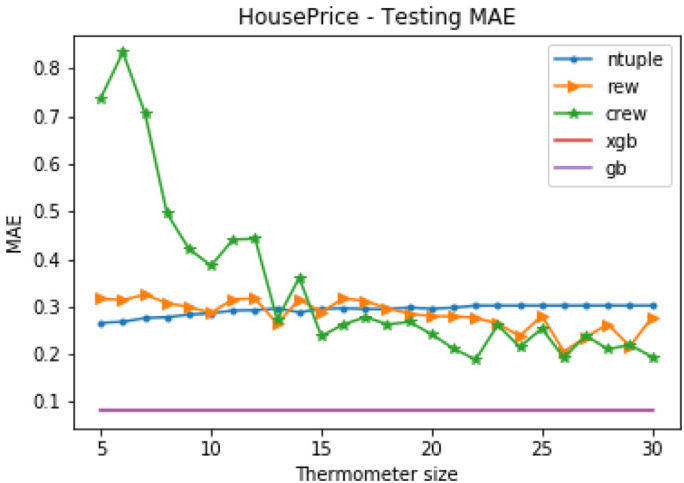  
Fig. 9. Thermometer size X MAE or ReW, CReW, n Tuple Regression Network, GradientBoost and XGBoost in House Prices.  

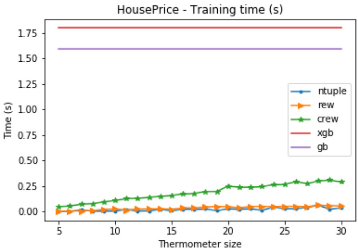  
Fig. 10. Thermometer size X training time(s) for ReW, CReW, $n$ Tuple Regression Network, GradientBoost and XGBoost in House Prices.  

• Parkinson’s dataset [31]  The purpose of this dataset is to predict for each patient their UPDRS, a continuous value on a scale that measures an individual’s motor disorder level. 12 features are provided per patient (training set: 3936, test set: 1939).  

In these datasets ReW, CReW and their ensembles were compared to the $n$ Tuple Regression Network, GradientBoost and XGBoost. The metrics collected in these experiments were Mean Absolute Error, standard deviation for Mean Absolute Error, training and test time. The models were validated 10 rounds each. For the experiments using weightless models, data preprocessing was done using one-hot enconding for categorical variables and thermometer for numerical variables. The thermometer had its size varied from 5 to 30 bits and the tuple address size range was calculated according to the size of the thermometer (all values divisible by data word length from 2 bits were used). The results of these validations are shown in Figs. 9–23 and Table 2 Overall, the average type had little impact on model error.  

In the House Prices dataset, XGBoost and GradientBoost performed better, but the weightless models were competitive, especially ReW. ReW and $n$ Tuple Regression Network were the fastest training models, followed by CReW, while XGBoost and GradientBoost achieved the worst performance. Regarding the test speed, XGBoost and GradientBoost had better performance compared to the weightless models, being CReW the slower model, due to successive draws during the classification it performs during the prediction.  

Table 2 Best results for weightless models with standard deviation and best median type. Caption: Md: median; PM: Power Mean; HM: Harmonic Mean; GM: Geometric Mean.   
HousePrice -Test time (s)- training set   

<html><body><table><tr><td></td><td>House Prices</td><td>Parkinson</td><td>CalCOFI</td><td></td></tr><tr><td>ReW</td><td>0.278 ± 0 (Md)</td><td>4.806 ± 0 (HM)</td><td></td><td>2.412 ± 4.44×e-16 (PM)</td></tr><tr><td>CReW</td><td>0.194 ± 0 (PM)</td><td>4.893 ± 0.105 (GM)</td><td></td><td>2.412 ± 4.44×e-16 (PM)</td></tr><tr><td>n-Tuple RN</td><td>0.302 ± 0</td><td>6.75±0</td><td>2.412 ± 0</td><td></td></tr></table></body></html>  

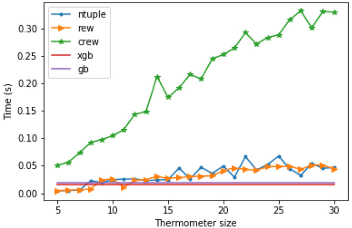  
Fig. 11. Thermometer size X test time(s) in training set for ReW, CReW, $n$ Tuple Regression Network, GradientBoost and XGBoost in House Prices.  

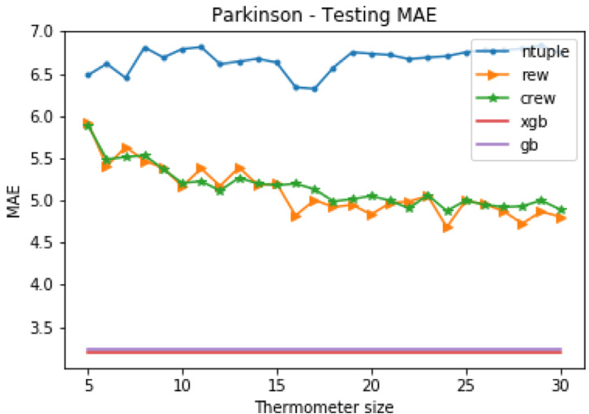  
Fig. 14. Thermometer ize X MAE or ReW, CReW, n Tuple Regression Network, GradientBoost and XGBoost in Parkinson.  

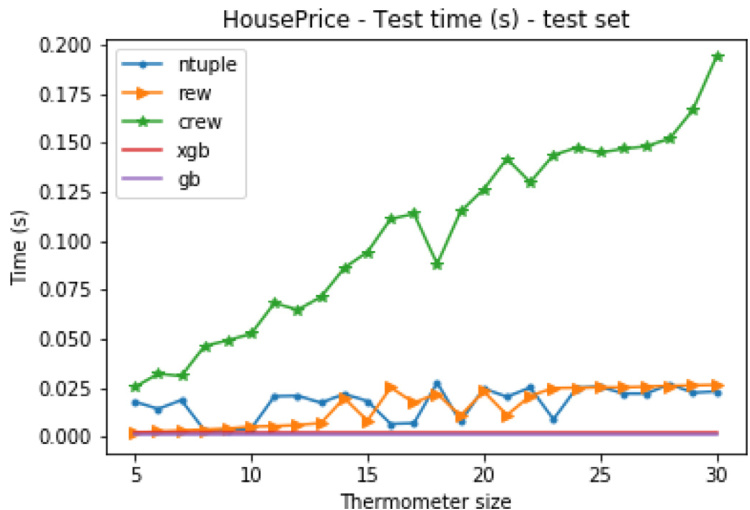  
Fig. 12. Thermometer ize X est ime(s) n est et or ReW, CReW, n Tuple Regression Network, GradientBoost and XGBoost in House Prices.  

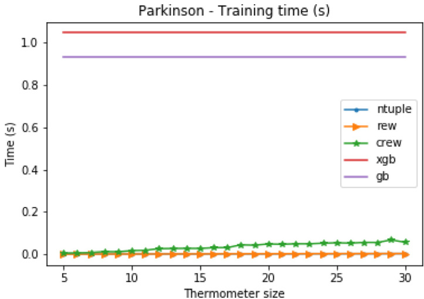  
Fig. 15. Thermometer size X training time(s) for ReW, CReW, n Tuple Regression Network, GradientBoost and XGBoost in Parkinson.  

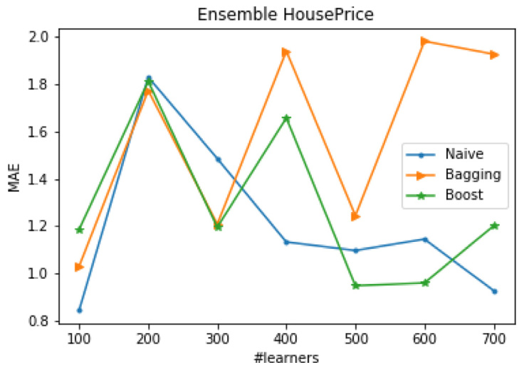  
Fig. 13. Number of weak learners X MAE for BaggingReW, BoostReW and Naïve ReW Ensemble in House Prices.  

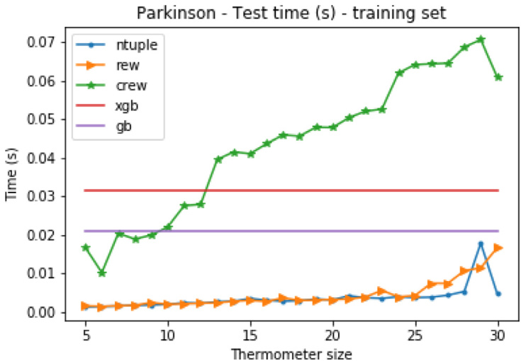  
Fig. 16. Thermometer size X test time(s) in training set for ReW, CReW, $n$ Tuple Regression Network, GradientBoost and XGBoost in Parkinson.  

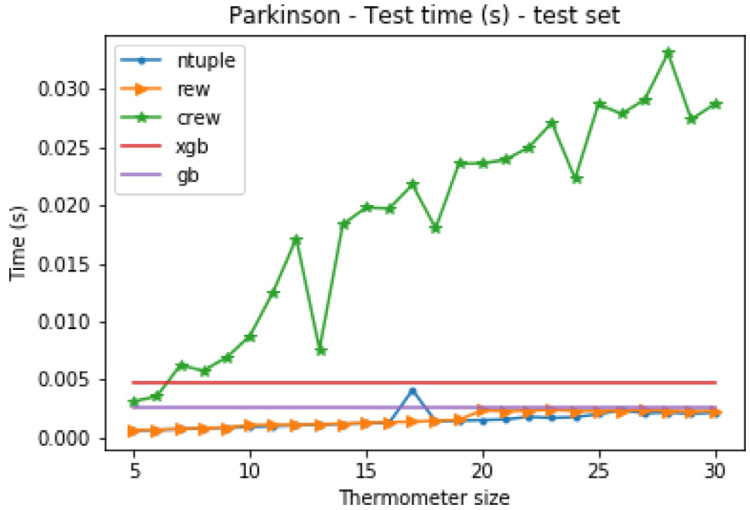  
Fig. 17. Thermometer ize X est ime(s) n est et or ReW, CReW, n Tuple Regression Network, GradientBoost and XGBoost in Parkinson.  

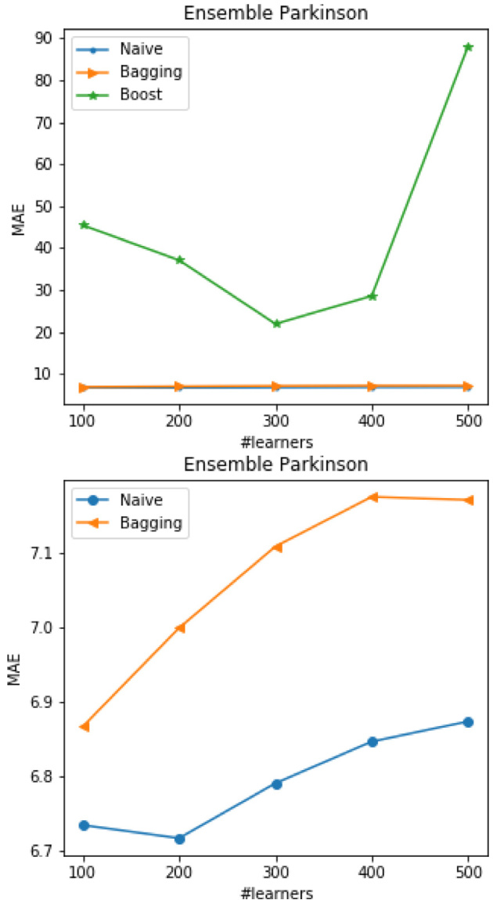  

In the Parkinson dataset, XGBoost and GradientBoost had the smallest error, followed by ReW and CReW, which were still competitive. ReW and $n$ Tuple Regression Network performed better on both training and test times, followed by CReW.  

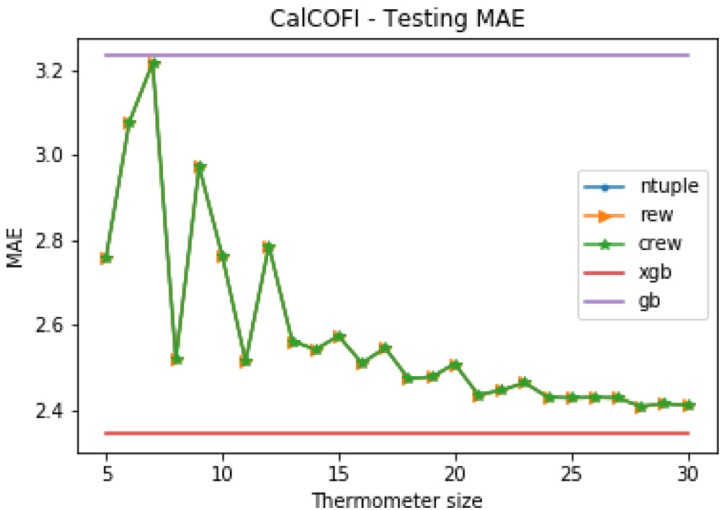  
Fig. 19. Thermometer ize X MAE or ReW, CReW, n Tuple Regression Network, GradientBoost and XGBoost in CalCOFI.  

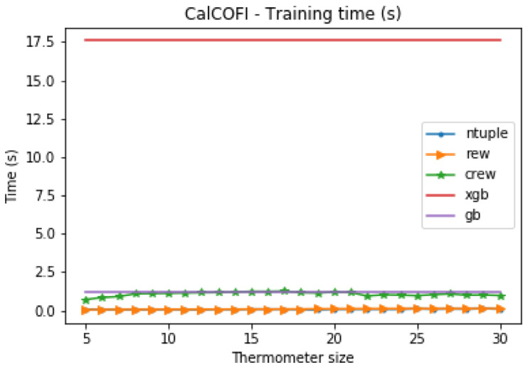  
Fig. 20. Thermometer size X training time(s) for ReW, CReW, $n$ Tuple Regression Network, GradientBoost and XGBoost in CalCOFI.  

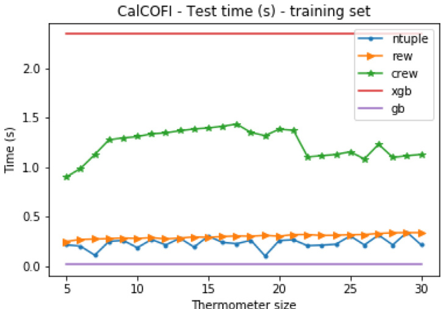  
Fig. 18. Number of weak earners X MAE or: a) BaggingReW, BoostReW nd Naïve ReW Ensemble in Parkinson; (b) BaggingReW and Naïve ReW Ensemble in Parkinson.   
Fig. 21. Thermometer size X test time(s) in training set for ReW, CReW, $n$ Tuple Regression Network, GradientBoost and XGBoost in CalCOFI.  

In the CalCOFI dataset, all weightless models performed equally in validation. This is because as only one feature was used in these experiments and no thermometer setup made any significant changes to the resulting data words. CReW also did not create any ReW discriminators other than the original in these experiments. In both the train set and the test set, the weightless models outperformed GradientBoost, but had higher error than XGBooost. At training time, ReW and $n$ Tuple Regression Network outperformed CReW, which in turn was faster than GradientBoost and XGBoost. At test time, the increasing order of performance was XGBoost, CReW, ReW, $n$ Tuple Regression Network and GradientBoost.  

  
Fig. 22. Thermometer ize X est ime(s) n est et or ReW, CReW, n Tuple Regression Network, GradientBoost and XGBoost in CalCOFI.  

In all cases, when large size thermometers were used for preprocessing, the new weightless models are competitive with XGBoost and GradientBoost. In general ReW and CReW outperformed the $n$ Tuple Regression Network, with the exception of CalCOFI dataset, where the three models were completely equivalent.  

# 4.4. Regression WiSARD’s learning curves  

Since one of the key features of WANN is precisely its training speed, this type of model becomes a strong candidate for tasks that require online learning, which necessarily implies that the model has to be able to generalize its learning from few examples. to provide an effective prediction for new examples.  

ReW, CReW, and $n$ Tuple Regression Network had their learning curves obtained from an experiment using the House Prices dataset, where at each iteration the model learned a new example of the training set and predicted the entire test set. The results presented here are the average of 10 rounds of experiments.  

The learning curves for MAE are shown in Fig. 24 proving that ReW and CReW are able to perform well from a reduced training set, performing well with far fewer examples than the original model.  

# 4.5. Analysis of ensemble composition  

An analysis of the influence of the type of model that makes up an ensemble (ReW only, CReW only or both models) was made through a comparison of the three different ensembles types in KDD18 dataset using a fixed size 28 bits thermometer and 500 learners each. Experiments were performed 10 rounds each and the MAE, standard deviation, training and test time of the ensembles are laid out in Table 3  

These data show that the increasing order of training speed is BoostReW, BaggingReW and Naïve ReW Ensemble, which is intuitive as this is the order in which the size of trainsets increases. The time to validate and determine the weight of each weak learner’s vote has made BoostReW the slowest, yet least trained ensemble. The testing speed of BaggingReW and Naïve ReW Ensemble was equivalent, since the procedure for prediction of these ensembles is equal. BoostReW was slightly slower in prediction, due to the calculation of each learner’s vote value based on the weights obtained in validation. As for the choice of models that make up the ensemble, ReW, CReW and both at the same time obtained equivalent MAE. Ensembles with only ReW were obviously faster in training and prediction, as CReW performs a classification step in both of these phases. As expected, mixed ensembles had intermediate performance between homogeneous ReW and CReW ensembles since they had both types of models.  

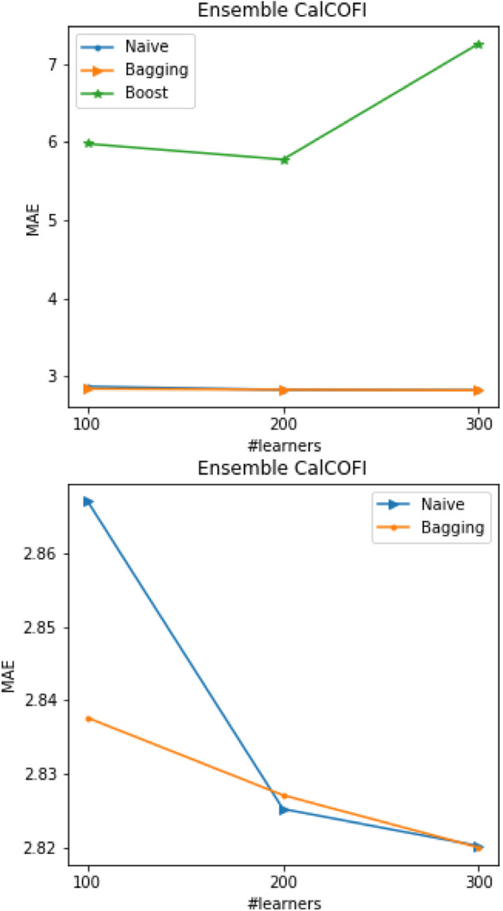  
Fig. 23. Number of weak earners X MAE or: a) BaggingReW, BoostReW nd Naïve ReW Ensemble in CalCOFI; (b) BaggingReW and Naïve ReW Ensemble in CalCOFI.  

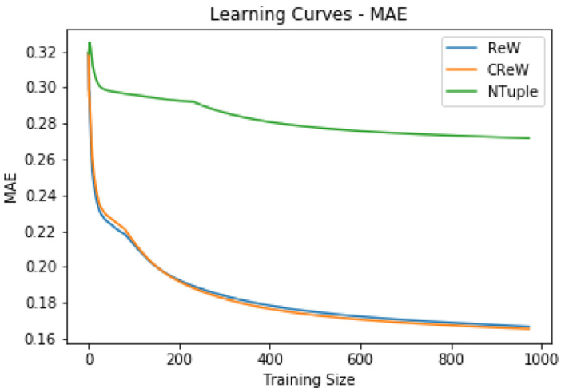  
Fig. 24. Lenght of training set X MAE for ReW, CReW and $n$ Tuple Regression Network in House Prices.  

Table 3 Comparison of the three types os ensembles using only ReW, only CReW and both models. Caption: MAE: mean absolute error; TrT: raining ime s); TT: est ime s).   

<html><body><table><tr><td>Type of Ensemble</td><td>Metric</td><td>Only ReW</td><td>Only CReW</td><td>Mix</td></tr><tr><td rowspan="3">Bagging ReW</td><td>MAE</td><td>0.162 ± 5.92× 10-4</td><td>0.16 ± 4.94× 10-4</td><td>0.16 ± 1.93× 10-3</td></tr><tr><td>TrT</td><td>19.93 ± 2.23</td><td>92.07 ± 8.09</td><td>58.14 ± 5.73</td></tr><tr><td>TT</td><td>4831.29 ± 201.64</td><td>4667.07 ± 1386.91</td><td>4571.79 ± 1326.17</td></tr><tr><td rowspan="3">Boost ReW</td><td>MAE</td><td>0.168 ± 2.26×10-4</td><td>0.168 ± 4.14 × 10-4</td><td>0.168 ± 2.17 × 10-4</td></tr><tr><td>TrT</td><td>2.12 ± 0.27</td><td>9.84 ± 1.16</td><td>5.93 ± 0.7</td></tr><tr><td>TT</td><td>4902.03 ± 192.67</td><td>5136.76 ± 459.88</td><td>5043.16 ± 261.35</td></tr><tr><td rowspan="3">Naive ReWEnsemble</td><td>MAE</td><td>0.162 ± 4.21×10-4</td><td>0.161 ± 4.62 ×10-4</td><td>0.162 ± 7.54× 10-4</td></tr><tr><td>TrT</td><td>26.74 ± 1.75</td><td>121.42 ± 11.83</td><td>74.01 ± 11.24</td></tr><tr><td>TT</td><td>5034.41 ± 174.12</td><td>5241.58 ± 501.5</td><td>4504.95 ± 1633.41</td></tr></table></body></html>  

# 5. Conclusion  

This work presented two new weightless neural networks for regression tasks based on the $n$ Tuple Regression Network model. The new models proved to be competitive in terms of state-of-theart accuracy and other results relevant to the problem of predicting palm oil productivity, posed by the KDD18 competition. The models were also competitive on House Prices, CalCOFI and Parkinson datasets. With respect to learning and prediction times, both models were, in general, superior to other solutions. Besides, due to their characteristics and simplicity these models are good candidates for situations that require online learning and low computational costs.  

Also, three types of weightless neural networks regression ensembles were explored: Naïve ReW Ensemble, ReWBagging and ReWBoost, with Naïve ReW Ensemble achieving the best performance. Further exploration of the ensembles and their bootstrap is underway.  

Ongoing and future research include: (i) adding new policies to update $s u m ( y )$ (ii) exploring the possibility of different address sizes inside CReW discriminators, with new decision policies adapted to different amounts of neurons; (iii) varying the types of preprocessing and features used in the ensembles; (iv) use Regression WiSARD as a type of logistic regressor, that is, to estimate the probability associated with the occurrence of a given event in the face of a set of explanatory variables, modifying the equation used to compute $y$ and (v) adding strategies for ensemble pruning.  

# Declaration of Competing Interest  

The authors declare that they have no known competing financial interests or personal relationships that could have appeared to influence the work reported in this paper.  

# CRediT authorship contribution statement  

Leopoldo A.D. Lusquino Filho: Conceptualization, Methodology, Software, Validation, Formal analysis, Investigation, Writing - original draft, Writing - review & editing. Luiz F.R. Oliveira: Conceptualization, Methodology, Software, Validation, Formal analysis, Investigation, Writing - review & editing. Aluizio Lima Filho: Conceptualization, Methodology, Software. Gabriel P. Guarisa: Conceptualization, Methodology, Software. Lucca M. Felix: Conceptualization. Priscila M.V. Lima: Supervision. Felipe M.G. França: Writing - review & editing, Supervision, Project administration, Funding acquisition.  

# Acknowledgments  

This study was financed in part by Coordenação de Aperfeiçoamento de Pessoal de Nível Superior – Brasil (CAPES) – Finance Code 001, CNPq, FAPERJ and NGD Systems Inc.  

# References  

[1] I. Aleksander W. Thomas P. Bowden WISARD, a radical new step forward in image recognition, Sensor Rev. 4 (3) (1984) 120–124   
[2] A. Kolcz N.M. Allinson $n$ tuple regression network, Neural Netw. 9 (1996) 855–869   
[3] https://www.kaggle.com/c/kddbr-2018/   
[4] W.W. Bledsoe I. Browning Pattern recognition and reading by machine, in: Proceedings of the Eastern Joint IRE-AIEE-ACM Computer Conference, 1959, pp. 225–232 [5] L.A.D. Lusquino Filho L.F.R. Oliveira A. Lima Filho G.P. Guarisa P.M.V. Lima F.M.G. França Prediction of palm oil production with an enhanced $n \cdot$ tuple regression network, n: Proceedings of he Twenty-seventh European Symposium on Artificial Neural Networks, Computational Intelligence and Machine Learning, 2019, pp. 301–306   
[6] B.P.A. Grieco P.M.V. Lima M. De Gregorio F.M.G. França Producing pattern examples from mental images, Neurocomputing 73 (79) (2010) 1057–1064 March [7] B. Widrow S.D. Stearns Adaptive Signal Processing, Englewood Cliffs, NJ: Prentice-Hall, 1985. [8] D.O. Cardoso et al. Financial credit analysis via a clustering weightless neural classifier, Neurocomputing 183 (2016) 70–78 [9] D.F.P. de Souza F.M.G. França P.M.V. Lima Spatio-temporal pattern classification with kernelcanvas nd wiSARD, n: Proceedings of he 2014 Brazilian Conference on Intelligent Systems (BRACIS 2014), 2014, pp. 228–233   
[10] D.F.P. de Souza F.M.G. França P.M.V. Lima Real-time music tracking based on a weightless neural network, in: Proceedings of the 2015 Ninth International Conference on Complex, Intelligent, and Software Intensive Systems, 2015, pp. 64–69   
[11] D.O. Cardoso P.M.V. Lima M. De Gregorio J. Gama F.M.G. França Clustering data treams with weightless neural networks, n: Proceedings of he 19th European Symposium on Artificial Neural Networks, Computational Intelligence and Machine Learning, 2011, pp. 201–206   
[12] D.O. Cardoso M. De Gregorio P.M.V. ima J. Gama F.M.G. rança A weightless neural network-based approach for stream data clustering, in: Proceedings of IDEAL 2012, LNCS, v. 7435, 2012, pp. 328–335   
[13] D.O. Cardoso F.M.G. França J. Gama WCDS: a two-phase weightless neural system for data tream lustering, New Gener. Comput. 35 (4) (2017) 391–416   
[14] D.N. Nascimento R.L. de Carvalho F. Mora-Camino P.M.V. Lima F.M.G. França A wiSARD-based multi-term memory ramework or online racking of objects, in: Proceedings of the Twenty-third European Symposium on Artificial Neural Networks, Computational Intelligence and Machine Learning, 2015, pp. 19–24   
[15] H.C.C. Carneiro F.M.G. França P.M.V. Lima Multilingual part-of-speech tagging with weightless neural networks, Neural Netw. 66 (2015) 11–21.   
[16] H.C.C. Carneiro C.E. Pedreira F.M.G. França P.M.V. Lima A universal multilingual weightless neural network tagger via quantitative linguistics, Neural Netw. 91 (2017) 85–101   
[17] F. Rangel F. Firmino P.M.V. Lima J. Oliveira Semi-supervised classification of social textual data using wiSARD, in: Proceedings of the Twenty-forth European Symposium on Artificial Neural Networks, Computational Intelligence and Machine Learning, 2016, pp. 165–170   
[18] F.S. Vidal H.C.C. Carneiro P.F.F. Rosa F.M.G. França Identificação de emoções a partir de expressões faciais com redes neurais sem peso, in: Proceedings of XI SBAI – Simpósio Brasileiro de Automação Inteligente, 2013 (In Portuguese)   
[19] L.A.D. Lusquino Filho F.M.G. França P.M.V. Lima Near-optimal facial emotion classification using wiSARD-based weightless system, in: Proceedings of the Twenty-sixth European Symposium on Artificial Neural Networks, Computational Intelligence and Machine Learning, 2018, pp. 85–90   
[20] L.A.D. Lusquino Filho G.P. Guarisa A. Lima Filho L.F.R. de Oliveira F.M.G. França P.M.V. Lima Actions units classification with cluswiSARD, in: Proceedings of the Twenty-eighth International Conference on Artificial Neural Networks, 2019   
[21] L.K. Hansen P. Salamon Neural network ensembles, IEEE Trans. Pattern Anal. Mach. Intell. 12 (10) (1990) 993–1001   
[22] O. Sagi L. Rokach in: Ensemble Learning: A Survey, 8, Wiley Interdisciplinary Reviews: Data Mining and Knowledge Discovery, 2018, p. e1249   
[23] R.E. Schapire The strength of weak learnability, Mach Learn. 5 (2) (1990) 197–227.   
[24] L. Breiman Bagging predictors, Mach Learn. 24 (2) (1996) 123–140.   
[25] L. Breiman Arcing the edge, Technical Report 486, Statistics Department, University of California, Berkeley, 1997.   
[26] J.H. Friedman Greedy function approximation: a gradient boosting machine, Ann. Stat. 29 (2001) 1189–1232.   
[27] Chen Tianqi Guestrin Carlos XGBoost: a scalable tree boosting system, in: Proceedings of the Twenty-second ACM SIGKDD International Conference on Knowledge Discovery and Data Mining, KDD ’16, 2016, pp. 785–794   
[28] J. Mendes-Moreira C. Soares A.M. Jorge de Sousa F. Jorge Ensemble approaches for regression: a survey, ACM Comput. Surv. 45 (2012) 10:1–10:40.   
[29] House prices: advanced regression techniques, https://www.kaggle.com/c/ house-prices- dvanced- egression-techniques/   
[30] CalCOFI: over 60 years of oceanographic data, https://www.kaggle.com/sohier/ calcofi/   
[31] Parkinso’s dataset, https://archive.ics.uci.edu/ml/datasets/parkinsons/   
[32] M.C. Mackey L. Glass Oscillation and chaos in physiological control systems, Science 197 (1977) 287–289.   
[33] A. Kolcz Approximation properties of memory-based, 1996 Ph.D. thesis Ph.D. Thesis   
[34] N.P. Bradshaw An analysis in weightless neural systems, 1996 Ph.D. thesis Ph.D. Thesis   
[35] H.C.C. Carneiro C.E. Pedreira F.M.G. França P.M.V. Lima The exact VC dimension of the wiSARD $n$ tuple classifier, Neural Comput. 31 (1) (2019) 176–207  

Gabriel P. Guarisa s M.Sc. tudent t he Systems Engineering and Computing Postgraduate Program of COPPEUFRJ. His research interests include computer vision and weightless artificial neural networks.  

  
Lucca M. Felix is a B.Sc. student at UFRJ. He is a competitor at Programming Marathons representing the algorithms tudy group of he university. His first cientific esearch ncluded he tudy of WhatsApp ryptography ystems.  

Leopoldo A.D. Lusquino Filho is a D.Sc. student at the Systems Engineering and Computing Postgraduate Program of COPPE-UFRJ, where he also received his masters degree. His esearch nterests nclude unsupervised earning, ensemble learning, empathy prediction and weightless artificial neural networks.  

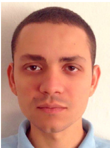  
Luiz F.R. Oliveira is a D.Sc. student at the Systems Engineering and Computing Postgraduate Program of COPPEUFRJ, where he also received his masters degree. His research interests include computer vision, pattern recognition, optimization using metaheuristics and weightless artificial neural networks.  

  
Priscila M. V. Lima is an Associate Professor at Tercio Pacitti Institute, Federal University of Rio de Janeiro (UFRJ), Brazil and Associate Professor of Computer Science nd Engineering, COPPE, ederal University of Rio de Janeiro (UFRJ), Brazil. She received her B.Sc. in Computer Science from UFRJ (1982), the M.Sc. in Computer Science from COPPE/UFRJ (1987), and her Ph.D. from the Department of Computing, mperial College ondon, U.K. 2000). She has research and teaching interests in computational intelligence, computational logic, distributed algorithms and other aspects of parallel and distributed computing.  

Felipe M. G. França is Professor of Computer Science and Engineering, COPPE, Federal University of Rio de Janeiro (UFRJ), Brazil. He eceived his Electronics Engineer degree from UFRJ (1982), the M.Sc. in Computer Science from COPPE/UFRJ (1987), and his Ph.D. from the Department of Electrical and Electronics Engineering of the Imperial College ondon, U.K. 1994). He has esearch nd eaching interests in computational intelligence, distributed algorithms and other aspects of parallel and distributed computing.  

  

  

Aluizio Lima Filho is pursuing a MSc degree in the Systems Engineering and Computing Postgraduate Program at COPPE-UFRJ. His current research focus is Explainable Artificial ntelligence XAI).  