# Weightless Neural Networks as Memory Segmented Bloom Filters  

Leandro Santiago a ∗, Leticia Verona a Fabio Rangel a Fabrício Firmino a Daniel S. Menasché a Wouter Caarls b Mauricio Breternitz Jr c Sandip Kundu d Priscila M.V. Lima a Felipe M.G. França a  

a Universidade Federal do Rio de Janeiro (UFRJ), RJ, Brazil b Pontifcia Universidade Catlica do Rio de Janeiro (PUC), RJ, Brazil c isbon University Institute- ISCTE-IUL & ISTAR-IUL, Lisbon, Portugal d University of Massachusetts Amherst, Dept. of Electrical and Computer Engineering, USA  

# a r t i c l e i n f o  

# a b s t r a c t  

Article history:   
Received 16 July 2019   
Revised 2 November 2019   
Accepted 8 January 2020   
Available online 10 April 2020   
2010 MSC:   
00-01   
99-00  

Keywords:   
Weightless neural network   
Bloom filter   
Discriminator  

Weightless Neural Networks (WNNs) are Artificial Neural Networks based on RAM memory broadly explored as solution for pattern recognition applications. Memory-oriented solutions for pattern recognition are typically very simple, and can be easily implemented in hardware and software. Nonetheless, the straightforward implementation of a WNN requires a large amount of memory resources making its adoption impracticable on memory constrained systems. In this paper, we establish a foundational relationship between WNN and Bloom filters, presenting a novel unified framework which encompasses the two. In particular, we indicate that a WNN can be framed as a memory segmented Bloom filter. Leveraging such finding, we propose a new model of WNNs which utilizes Bloom filters to implement RAM nodes. Bloom filters reduce memory requirements, and allow false positives when determining if a given pattern was already seen in data. We experimentally found that for pattern recognition purposes such false positives can build robustness into the system. The experimental results show that our model using Bloom filters achieves competitive accuracy, training time and testing time, consuming up to 6 orders of magnitude less memory resources when compared against the standard Weightless Neural Network model.  

$\mathfrak { O }$ 2020 Elsevier B.V. All rights reserved.  

# 1. Introduction  

Weightless Neural Networks (WNNs) [1] are neuron models based on Random Access Memory (RAM) where each neuron is defined through a RAM node. These models have been shown as attractive solutions to solve pattern recognition and artificial consciousness applications achieving competitive performance against other state of the art solutions. WiSARD (Wilkie, Stoneham and Aleksander’s Recognition Device) is the pioneering WNN distributed commercially [2] which provides simple and efficient implementation enabling to deploy learning capabilities into realtime and embedded systems.  

The straightforward WiSARD implementation needs a considerable amount of memory resources to obtain good learning features. For example, a $1 0 2 4 \times 1 0 2 4$ binary input with total size of 1,048,576 bits can be split into 16,384 tuples of 64 bits each $6 4 \times$  

16 $3 8 4 = 1$ 048 576 . Each tuple is then mapped into a RAM. In this configuration, each RAM consumes $2 ^ { 6 4 }$ locations which is impracticable to be implemented in current embedded systems. To deal with those constraints, the RAMs are commonly implemented using dictionary/hash table structures where the tuple values are stored as key-value pairs, with the key representing the memory address and the value being the content of the RAM position (either 0 or 1, under the original WiSARD design [3] or a non-negative integer, in case of WiSARD with bleaching capability [4] .  

Our key insight consists of observing that RAMs play the role of filters under WNN designs. By allowing additional flexibility in the implementation of RAMs, one can explore a wide range of solutions trading between memory costs, classifier accuracy and computational complexity. Consider an input vector divided into $N$ tuples of length M bits each. Then, the naive implementation of each of the $N$ RAMs using a vector of size $2 ^ { M }$ bits is memory expensive, but less computationally costly than a dictionary serving the purpose of indicating whether each bit in the RAM is set to 1 or 0. Alternatively, a Bloom filter may be used to trade between the aforementioned costs, opening up a broad range of opportunities to tune the model accuracy by providing additional degrees of freedom in the design of WiSARD classifiers.  

Table 1 Comparison of classifiers: simpler models such as Bloom WiSARD typically favor generalization. WiSARD and Dict WiSARD are logically equivalent whereas Bloom WiSARD has more degrees of freedom.   

<html><body><table><tr><td></td><td>Space per discriminator</td><td>Use of hashes for</td><td>Accuracy</td></tr><tr><td>WiSARD</td><td>N2M bits</td><td>no hashes</td><td>reference accuracy</td></tr><tr><td>Dict WiSARD</td><td>significantly less than WiSARD (worst case equal)</td><td>exact set membership (with collision checking)</td><td>equal to WiSARD (given mapping from input to RAM)</td></tr><tr><td>Bloom WiSARD</td><td>typically similar to Dict WiSARD (tunable by design)</td><td>approximate set membership（no collision checking)</td><td>potentially greater than WiSARD (hashes are tunable)</td></tr></table></body></html>  

We propose a new WiSARD model that leverages Bloom filters for the implementation of RAMs. Bloom filters [5,6] are probabilistic data structures which represent a set as small bit array allowing the occurrences of false positives, i.e., in a Bloom filter, an element can be incorrectly classified as member of a set when it is not. Although false positives detract certain applications, we experimentally discovered that for pattern recognition purposes they can build robustness into the system (as dropout does to deep neural networks). Bloom WiSARD presents similar accuracy when contrasted against WiSARD, but uses significantly less resources and, in this sense, is more robust than WiSARD. We discuss a unified framework to bridge Bloom filter and WiSARD concepts which might be easily extended to other machine learning tools. Our experiments analyze accuracy, training time, testing time and memory consumption of our model compared against standard WiSARD and WiSARD implemented with hash tables (see Table 1 .  

The rest of the paper is organized as follows. Background related to this work is presented in Section 2 The unified framework bridging Bloom filters and WiSARD is discussed in Section 3 Section 4 presents the new WiSARD model based on Bloom Filters and describes its implementation. In Section 5 we show the experiments and results related to Bloom WiSARD. Finally, related work is discussed in Section 6 and we conclude this work in Section 7  

# 2. Background  

In this Section, we briefly give the relevant background on the WiSARD discriminator followed by Bloom filter concepts.  

# 2.1. WiSARD  

WiSARD (Wilkie, Stoneham and Aleksander’s Recognition Device) is a multi-discriminator WNN model proposed in the early 80’s [2] that recognizes patterns from binary data. Each class is represented by a discriminator which contains a set of RAMs. A binary input with $N \times M$ bits is split into $N$ tuples of $M$ bits. Each tuple n $n = 1 , \ldots , N$ , is a memory address to an entry of the $n$ th RAM. Each RAM contains $2 ^ { M }$ locations.  

A pseudo-random mapping is a deterministic function that maps each binary input matrix to a set of $N$ tuples of $M$ bits each. The function is typically a pseudo-random shuffling of the binary input matrix, hence the name pseudo-random mapping. Each discriminator may be associated to a different pseudo-random mapping, that must remain the same across training and classification phases.  

At the training phase, initially all RAMs have their locations set to zero (0). Each training sample is treated by the corresponding discriminator which sets to one (1) all accessed RAM positions as illustrated in Fig. 1 At the classification phase, the input is sent to all discriminators generating responses per discriminators by summing all accessed RAM values as shown in Fig. 2 The discriminator with the highest response is chosen as the representative class of the input as exemplified in Fig. 3  

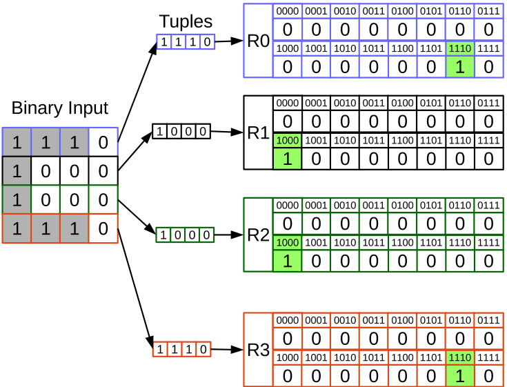  
Fig. 1. Example of training in WiSARD.  

# 2.2. WiSARD based on Dictionary  

For certain applications, the standard WiSARD implementation requires a considerable amount of memory resources in order to achieve the required learning results. To deal with this constraints, the RAMs are commonly implemented using dictionary/hash table structures (see Section 1 . The tuple values are stored as key-value pairs, with the key representing the memory address and the value being the content of the RAM position (either 0 or 1, under the original WiSARD design [3] or a non-negative integer, in case of WiSARD with bleaching capability [4] .  

Similar to standard WiSARD, each tuple from the binary input is stored to the corresponding hash table at the training phase as illustrated in Fig. 4 In the classification phase, the responses are generated by adding up the results collected from the hash tables as shown in Fig. 5  

# 2.3. Bloom filter  

Bloom filters [5] are space-efficient data structures for Approximate Membership Query (AMQ) which test whether an element belongs to a given set or not with a certain false positive probability. In other words, sometimes the membership query will respond that an element is stored in the considered set even if it is not. A Bloom filter is composed of an $m$ bit array and $k$ independent hash functions that map an element into $k$ bit array positions. The algorithm is easily extended for application in WISARD. Bloom filters are commonly used in the network and database domains to provide approximately correct answers to set membership queries, and a number of efficient implementations of Bloom filters have been proposed [7]  

For the purposes of set-membership queries, a single-index hash table is at greater risk of returning many false positives. Consider an element A that belongs to a particular set S A hash of A provides an index to a particular bit in the table, and one sets this bit to 1 to indicate membership in S However, another element B not belonging to S may hash to the same entry as A which results in the reporting of a false positive. A Bloom filter uses multiple hashes for each element, potentially setting several bits in the table for each element that belongs to class S Consider the same element A hashing into $k = 4$ different locations. In the classical Bloom filter, an element is considered to be in S when the bits at all hashed locations are set. Fig. 6 also shows element E and the four entries it hashes to. One of the entries collides with one of B’s entries; however, there exists at least one other entry that is not set, and so the Bloom filter correctly classifies $E$ as not belonging to the set. For a Bloom filter to report a false positive a hash collision must occur for each and every one of the $k$ hash functions, as in the case of element $D$  

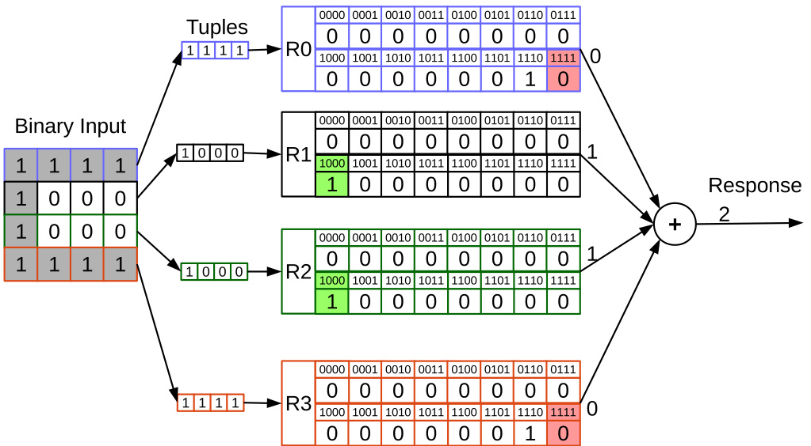  
Fig. 2. Example of testing operation in one WiSARD discriminator.  

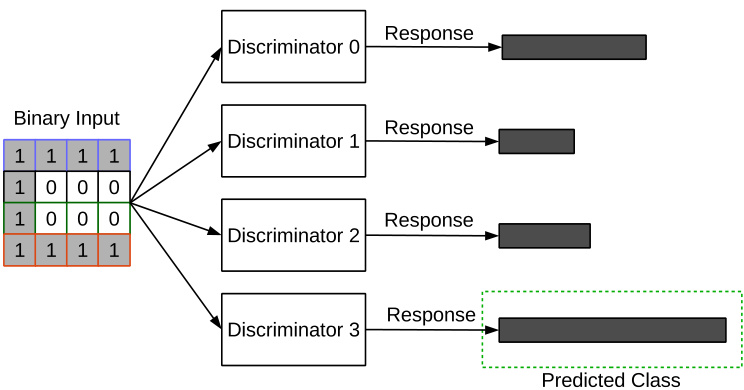  
Fig. 3. Example of testing operation to WiSARD select predicted class.  

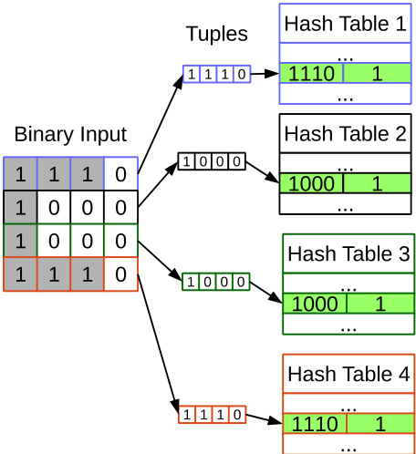  
Fig. 4. Example of training of a dictionary-based WiSARD.  

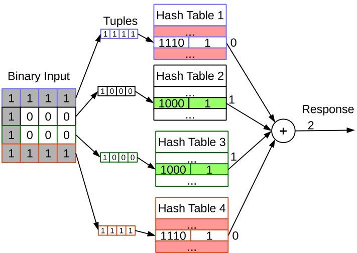  
Fig. 5. Obtaining the response from a dictionary-based WiSARD discriminator.  

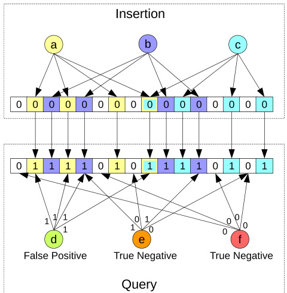  
Fig. 6. Bloom filter operations example with 16-bit array and 4 hash functions.  

The standard Bloom filter supports insertion and query operations as exemplified in Fig. 6 Initially, all bit array positions are zeroed. In the insertion operation, an element is mapped into $k$ positions of the bit array designated by the $k$ hash functions and the corresponding $k$ bits are set to 1. In the example, a, b and $c$ are inserted using 4 hash functions. The query operation looks up the $k$ positions mapped from the input element, indicating it as either a member of the set, considering a false positive rate if all values are $1 ^ { \prime } s .$ or a non-member when any value is 0. In Fig. 6 $d$ is a false positive since it was suggested as member of the set (only a, b and c were inserted), while $e$ and $f$ do not belong to the set. Note that a Bloom filter always reports a true negative whenever an element is not a member.  

The false positive probability $p$ is affected by the parameters m, n and $k$ corresponding to bit array size, number of elements to store and number of hash functions, respectively [8] Given the target false positive probability $p$ and capacity $n$ parameters $m$ and $k$ can be set as follows: $m = - n \ln ( p ) / \ln ( 2 ) ^ { 2 }$ [9] and $k = m \ln ( 2 ) / n$ [8]  

# 3. A unified framework bridging Bloom filters and WiSARD  

# 3.1. Machine learning and Bloom filters  

Machine learning can be leveraged to improve the design of Bloom filters [10,11] and, reciprocally, Bloom filters can be used in the design of general-purpose machine learning tools [12–16] In the second direction, learning useful features in an effective way is one of the key machine learning challenges. The success of convolutional neural networks (CNN) stands for its ability to efficiently derive useful features, directly from data, with few parameters [13] Alternatively, Bloom filters can be instrumental in the derivation of such features.  

Machine learning discriminators are filters as they filter the elements that should be discriminated from the remainder of the population. Such observation suggests that foundational results on Bloom filters can be applied to improve the design of discriminators, and has grounds in biological models relating familiarity mechanisms in the brain to filters [17] In this direction of research, we encompass the search for a unified classification framework wherein Bloom filters and other machine learning tools, such as WiSARD, are special instances.  

# 3.2. Similarities and differences between Bloom filters and WiSARD  

WiSARD and Bloom filters are closely related data structures. Both store data in a binary RAM indexed by a function computed over the input. In the case of WiSARD, the index is determined by the pseudo-random mapping, interpreting a certain pattern of bits from the input as a binary number. For Bloom filters, it is a hash function.  

An important distinction is the fact that WiSARD keeps a separate memory for every tuple of the pseudo-random mapping, whereas all hash functions in a Bloom filter index into the same hash table. Note that WiSARD accounts for a single hash function which maps each tuple instantiation, i.e., each string of bits comprising a tuple, into a position of the corresponding memory. Bloom filters, in contrast, account for multiple hash functions, wherein each hash function maps the whole input into a memory position, always assuming a single memory.  

# 3.3. A unified framework bridging Bloom filters and WiSARD  

# 3.3.1. Terminology  

Let $T$ be a set of vectors corresponding to the tuples comprising each input instance. The input instances are assumed to be binarized, i.e., each input instance is a binary vector of length $l = \left| x \right|$ . For example, if $T = \{ ( 1 , 2 ) , ( 3 , 4 ) , ( 5 ) \}$ then inputs of size $l = 5$ are divided into three tuples, $\left. T \right. = 3$ of sizes 2, 2 and 1. The first tuple corresponds to the first two entries of the input, the second tuple corresponds to the subsequent two entries, and the last tuple corresponds to the last entry.  

Table 2 Table of notation   

<html><body><table><tr><td>variable</td><td>description</td></tr><tr><td>X</td><td>input (binary vector of length |xl)</td></tr><tr><td>T</td><td>set of tuples</td></tr><tr><td>N= |T|</td><td>number of tuples per input</td></tr><tr><td>M</td><td>size of each tuple,M= |x|/N (when tuple sizes are heterogeneous we denote by Mt the t-th tuple size)</td></tr><tr><td>Xt</td><td>t-th tuple of input x,t=1,...,N (binary vector of length M)</td></tr><tr><td>F</td><td>set of(hash） functions (when sets are heterogeneous across tuples we denote by Ft the t-th set of hashes)</td></tr><tr><td>k = |F|</td><td>number of (hash) functions (see Section 2.3)</td></tr><tr><td>Mt</td><td>state of memory corresponding to t-th tuple (binary vector of length |Mt|，|Mt|=2M in a classical WiSARD)</td></tr><tr><td>{M,...,.MN}</td><td>discriminator state</td></tr><tr><td>f(xt)</td><td>function that maps xt into a position of Mt</td></tr></table></body></html>  

Given an input $x _ { \cdot }$ the $t { \cdot }$ th tuple of the input is denoted by $x _ { t }$ and its size is denote by $M _ { t }$ Let $F _ { t }$ be the hash functions applied over the $t \cdot$ th tuple, $t = 1 , \dots , | T |$ Each $f \in F _ { t }$ receives as input the t th tuple of the input, and generates as output a memory position, $f \in F _ { t } : x _ { t } \in \{ 0 , 1 \} ^ { M _ { t } } \to \mathbb { N }$ Whenever the hash functions applied over the tuples are all the same, we drop subscript t and denote the set of hash functions simply as $F .$ Similarly, whenever all tuples have the same size, the latter is simply referred to as $M .$  

Let $\mathcal { M } _ { t }$ be a vector characterizing the memory corresponding to the $t { \mathrm { . } }$ th tuple, $\mathcal { M } _ { t } [ i ] \in \{ 0 , 1 \}$ for $i = 1 , \dots , | \mathcal { M } _ { t } |$ Under the Bloom filter framework, there is a single memory as the input is typically assumed to correspond to a single tuple. In that case, we drop subscript t and denote the memory simply as $\mathcal { M }$ Table 2 summarizes the notation.  

# 3.3.2. Combining Bloom filters and WiSARD  

We may combine Bloom filters and WiSARD into a general framework by explicitly accounting for the decisions about the number of tuples comprising the input, which translates into the number of memories, and the number of hash functions per tuple. Consider the training stage described in Algorithm 1  

<html><body><table><tr><td>Algorithm 1 Unified framework for training Bloom filters and WiSARDdiscriminators.</td></tr><tr><td>1: for all training examples x do</td></tr><tr><td>2: foralltuplest∈Tdo</td></tr><tr><td>3: forall functions f∈Ft do</td></tr><tr><td>4: Mt[f(xt)]=1</td></tr><tr><td>5: end for</td></tr><tr><td>6: end for</td></tr><tr><td>7: end for</td></tr></table></body></html>  

If there is only a single tuple, i.e., the entire input is used at once $( | T | = 1 )$ and many functions $( | F | > 1 )$ , we have a classical Bloom filter. Each function, in this case, is typically a special hash function which maps data from a large state space (large size) onto another state space of small size. Otherwise, the required memory would be prohibitive. On the other hand, if there are many tuples $( | T | > 1 )$ and only a single function $\vert F \vert = 1 )$ we have WiSARD. In this case we may use a hash function but need a sufficiently large memory if we wish to avoid collision. WiSARD typically uses a collision-free function that simply interprets the tuple as an address.  

Given this generic framework, we can observe the possibility of using multiple hash functions per tuple, essentially creating multiple parallel Bloom filters. This greatly expands the range of usable tuple sizes, because memory size is no longer dictated by address size and can be tuned, in combination with the number of hash functions, to a desired collision rate.  

The classification phase generalization is similar to that of the training, with the caveat that multiple tuples are needed in order to distinguish the most likely class. In the case of the classic Bloom filter (single tuple), the discriminator response $R$ is a binary value, and can therefore only be used as a one-class classifier. The granularity of the discriminator responses increases when using more tuples (see Algorithm 2 .  

Algorithm 2 Unified framework for determining Bloom filters and WiSARD discriminator responses.   

<html><body><table><tr><td>1:R←0</td></tr><tr><td>2:for all tuples t∈ T do</td></tr><tr><td>forall functionsf∈Ft do</td></tr><tr><td>3:</td></tr><tr><td>4: Rt←Rt+Mt[f(xt)]</td></tr><tr><td>5: end for</td></tr><tr><td>6: if Rt = |Ft|then</td></tr><tr><td>7: R←R+1</td></tr><tr><td>8: end if</td></tr><tr><td>9:end for</td></tr><tr><td>10:return R</td></tr></table></body></html>  

Note that in line 5 of the algorithm the response from tuple $t , R _ { t }$ is compared against the maximum response, $\left| F _ { t } \right|$ . If they are equal, this means that the given tuple is stored in memory, and the final response R is incremented by one unit. In particular, note that by restricting the increment to the scenario wherein $R _ { t } = \left| F _ { t } \right|$ naturally prevents false negatives. Alternatively, requiring less than the full amount of hash hits in line consists of an additional generalization of Bloom filters, allowing for both false positives and false negatives when assessing the pertinence of a given element to a given class.  

Recall that for each target class there is a corresponding discriminator. Given an input, for each discriminator the algorithm above returns a value R Then, the discriminators are compared against each other through the corresponding returned values. The discriminator that yields maximum return is typically chosen as the class corresponding to the given input. There are multiple variations with respect to how the returned value $R$ is computed given the input (e.g., depending on whether one accounts for bleaching [4] , but the algorithm above serves to capture the essence behind all variants.  

# 3.4. Collision rates  

There is a vast literature on dimensioning and tuning Bloom filters to achieve a given target collision rate [18] We envision that by establishing connections between Bloom filters and WiSARD we can leverage such results for the dimensioning of WiSARD. The dimensioning of WiSARD, based on first principles, in turn, is a vastly unexplored field. The same holds for many other discriminators, including CNNs [13,19,20] for which most of the tuning is executed in an ad-hoc experimental fashion. The perspective of doing such tuning of Bloom WiSARD based on first principles may shed light into other discriminators.  

Note that collisions are a negative side effect in the realm of Bloom filters. In the realm of WiSARD, in contrast, collisions may actually increase the accuracy of the discriminator. This is because a higher collision rate may correspond to an increased capacity of generalization, which may, in turn, benefit the system. Therefore, the system should first be tuned to attain a desired target collision rate, greater than zero. Then, as a second step that target may be varied to find the best spot accounting for the training and test sets.  

# 3.4.1. Perspectives towards collision rate tuning  

Next, we briefly overview two different approaches for collision rate tuning. The first is inspired by the architectural design of Bloom filters in hardware. The second is based on an extension of Bloom filters to answer queries such as “is x close to an element in $S ? ^ { \mathfrak { n } }$ rather than “is x an element in S?” [21,22]  

Recent advances in the design of Bloom filters [7] accounting for its hardware implementation suggest that dividing the memory used to implement a Bloom filter into separate memory banks is beneficial. The efficient implementation of Bloom filters in hardware involves the manipulation of hash functions to avoid collisions and to make simultaneous access to multiple memory banks. Such manipulation of hash functions proposed in [7] accounting for multiple memory banks is similar in spirit to the manipulation of hash functions and of sizes of the memories of a WiSARD discriminator, as advocated in this work, albeit for very different purposes. Whereas in [7] the goal is to improve the efficiency of the Bloom filter implementation in hardware, our goal is to increase the accuracy of WiSARD discriminators. In both cases, the collision rates must be controlled to achieve the desired goals.  

A structured way of dealing with collisions under the Bloom WiSARD framework to improve classification accuracy may involve “distance sensitive Bloom filters” [23] Under distance sensitive Bloom filters, similar inputs are mapped into similar memory positions. We envision that such similarity may be explored in the design of Bloom WiSARD, and leave that as subject for future work [21]  

# 4. WiSARD based on Bloom Filters  

When adopting a WiSARD architecture, the binary transformation impacts the accuracy and the learning capacity of the model affecting its input size, which determines the number of RAMs and the tuple size for each discriminator. Thus, huge RAMs might be required to achieve a good accuracy.  

The memory structures subsumed by a WiSARD WNN are typically sparse. We extend WiSARD by replacing RAMs with Bloom filters to reduce its memory footprint by avoiding storage of irrelevant zero positions. The new model is termed Bloom WiSARD.  

On the training phase, the tuples are inserted into Bloom filters by updating the $k$ bit array positions as depicted in Fig. 7 On the classification phase, the tuples are queried into their associated Bloom filters returning whether each tuple is a member or not by ANDing all $k$ bit values as presented in Fig. 8 Similar to WiSARD, the discriminator responses are calculated by summing the $N$ Bloom filter membership results. The responses of the discriminators are then compared, and the class corresponding to the discriminator with the highest response is selected.  

Our Bloom WiSARD implementation utilizes a double hashing technique [24] to generate $k$ hash functions in the form: $h ( i , k ) =$ $( h _ { 1 } ( k ) + i \times h _ { 2 } ( k ) )$ (mod $n$ )  where $h _ { 1 }$ and $h _ { 2 }$ are universal hash functions. We adopt MurmurHash for $h _ { 1 }$ and $h _ { 2 }$ [25]  

# 5. Experiments and Results  

To evaluate the proposed model, we compare Bloom WiSARD against two different WiSARD versions: standard WiSARD introduced in Section 2.1 and dictionary WiSARD discussed in Section 2.2 (see Table 1 . The implementations are made available on a GitHub repository [26]  

# 5.1. Dataset  

We select the MNIST database [27] and a subset of binary classification and multiclass classification datasets used in [28] Most of the problems were taken from UCI public repository [29] and they have different characteristics in terms of number of samples, number of classes and number of features. Some datasets do not provide the training set and testing set in separated files. For these datasets, we adopt the same methodology applied in [28]  we randomly shuffle the data and partition it in 3 parts, such that $2 / 3$ and $1 / 3$ are used for training and testing sets, respectively. Table 3 and Table 4 show the parameters of the binary and multiclass classification data sets, respectively.  

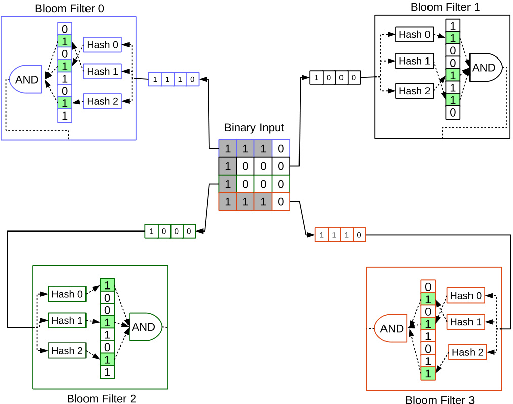  
Fig. 7. Example of training in Bloom WiSARD with 16-bit input, 4-bit tuples and 4 Bloom filters.  

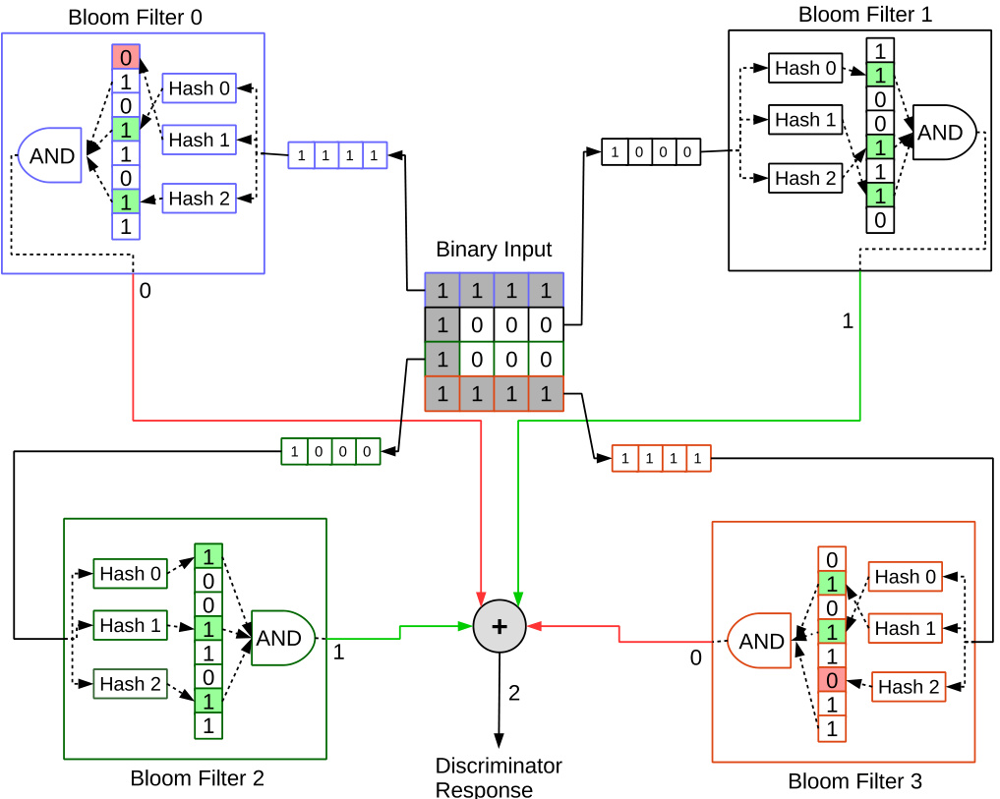  
Fig. 8. Example of classification in Bloom WiSARD with 16-bit input, 4-bit tuples and 4 Bloom filters.  

# 5.2. Experimental Setup  

The experiments were performed on an Intel Core i7- 6700(3.40GHz) processor with 32GB of RAM running Ubuntu Linux 16.04. The core of all WiSARD experiments was implemented in a single-thread $\mathsf { C } + + 1 1$ library accessed through a Python interface. To convert the input attributes to binary format, we concatenate all binary attributes using thermometer (resp., hot encoding) to transform the continuous (resp., categorical) attributes. The input size, number of RAMs and tuple size varied according to the dataset, but were kept constant across all considered WiSARD architectures. Bloom filters are setup with $10 \%$ of false positive probability. The capacities were empirically selected for each dataset and $m$ and $k$ were obtained through the formulas presented in Section 2.3 Tables 5 and 6 show the hyper-parameters of the binary and multiclass classification data sets, respectively.  

Table 3 Specification of binary classification data sets.   

<html><body><table><tr><td>Dataset</td><td># Train</td><td># Test</td><td># Features</td></tr><tr><td>Adult</td><td>32,561</td><td>16,281</td><td>14</td></tr><tr><td>Australian</td><td>460</td><td>230</td><td>14</td></tr><tr><td>Banana</td><td>3,532</td><td>1,768</td><td>2</td></tr><tr><td>Diabetes</td><td>512</td><td>256</td><td>8</td></tr><tr><td>Liver</td><td>230</td><td>115</td><td>6</td></tr><tr><td>Mushroom</td><td>5,416</td><td>2,708</td><td>22</td></tr></table></body></html>  

Table 4 Specification of multiclass lassification data ets.   

<html><body><table><tr><td>Dataset</td><td># Train</td><td>#Test</td><td># Features</td><td># Classes</td></tr><tr><td>Ecoli</td><td>224</td><td>112</td><td>7</td><td>8</td></tr><tr><td>Glass</td><td>142</td><td>72</td><td>9</td><td>7</td></tr><tr><td>Iris</td><td>100</td><td>50</td><td>4</td><td>3</td></tr><tr><td>Letter</td><td>13,332</td><td>6,668</td><td>16</td><td>26</td></tr><tr><td>MNIST</td><td>60,000</td><td>10,000</td><td>784</td><td>10</td></tr><tr><td>Satimage</td><td>4,435</td><td>2,000</td><td>36</td><td>6</td></tr><tr><td>Segment</td><td>1,540</td><td>770</td><td>19</td><td>7</td></tr><tr><td>Shuttle</td><td>43,500</td><td>14,500</td><td>9</td><td>7</td></tr><tr><td>Vehicle</td><td>564</td><td>282</td><td>18</td><td>4</td></tr><tr><td>Vowel</td><td>660</td><td>330</td><td>10</td><td>11</td></tr><tr><td>Wine</td><td>118</td><td>60</td><td>13</td><td>3</td></tr></table></body></html>  

Table 5 Hyper-parameters of binary lassification data ets. All he parameters re he ame for he hree WiSARD versions: hermometer bit Therm.) s he ength of numerical attributes n binary ormat, nominal bit s he number of 1’s used o epresent each value of the categorical attribute using one hot encoding and capacity is the Bloom filter configuration. The value - indicates that there is no numerical (Therm.) or categorical attributes in the dataset.   

<html><body><table><tr><td>Dataset</td><td>Tuple size</td><td>Therm. (Bits)</td><td>Nominal (Bits)</td><td>Capacity</td></tr><tr><td>Adult</td><td>28</td><td>128</td><td>30</td><td>500</td></tr><tr><td>Australian</td><td>20</td><td>20</td><td>5</td><td>460</td></tr><tr><td>Banana</td><td>20</td><td>512</td><td>-</td><td>50</td></tr><tr><td>Diabetes</td><td>20</td><td>20</td><td></td><td>512</td></tr><tr><td>Liver</td><td>20</td><td>64</td><td></td><td>100</td></tr><tr><td>Mushroom</td><td>20</td><td></td><td>5</td><td>100</td></tr></table></body></html>  

Table 6 Hyper-parameters of multiclass classification data sets. All the parameters are the same or he hree WiSARD versions: hermometer bit Therm.) s he ength of numerical attributes in binary format, nominal bit is the number of 1’s used to represent each value of the categorical attribute using one hot encoding and capacity is the Bloom filter configuration. The value - indicates that there is no numerical (Therm.) or categorical attributes in the dataset.   

<html><body><table><tr><td>Dataset</td><td>Tuple size</td><td>Therm. (Bits)</td><td>Nominal (Bits)</td><td>Capacity</td></tr><tr><td>Ecoli</td><td>20</td><td>20</td><td></td><td>100</td></tr><tr><td>Glass</td><td>20</td><td>128</td><td></td><td>100</td></tr><tr><td>Iris</td><td>20</td><td>20</td><td></td><td>100</td></tr><tr><td>Letter</td><td>28</td><td>20</td><td></td><td>500</td></tr><tr><td>MNIST</td><td>28</td><td></td><td></td><td>5000</td></tr><tr><td>Satimage</td><td>20</td><td>20</td><td></td><td>100</td></tr><tr><td>Segment</td><td>20</td><td>20</td><td></td><td>100</td></tr><tr><td>Shuttle</td><td>20</td><td>20</td><td></td><td>100</td></tr><tr><td>Vehicle</td><td>20</td><td>20</td><td></td><td>100</td></tr><tr><td>Vowel</td><td>20</td><td>20</td><td></td><td>100</td></tr><tr><td>Wine</td><td>20</td><td>20</td><td>1</td><td>100</td></tr></table></body></html>  

Table 7 Accuracy and memory results of classifiers in binary classification problems.   

<html><body><table><tr><td>Dataset</td><td>WNN</td><td>Acc</td><td>Acc (Std)</td><td>Memory (KB)</td><td>Stats. signif.</td></tr><tr><td>Adult</td><td>WiSARD</td><td>0.722</td><td>0.0069129626</td><td>8978432</td><td></td></tr><tr><td></td><td>Dict WiSARD</td><td>0.721</td><td>0.0055560122</td><td>383.535</td><td>X</td></tr><tr><td></td><td>Bloom WiSARD</td><td>0.718</td><td>0.0061495748</td><td>80.173</td><td>√</td></tr><tr><td>Australian</td><td>WiSARD</td><td>0.843</td><td>0.0166130202</td><td>4096</td><td></td></tr><tr><td></td><td>DictWiSARD</td><td>0.841</td><td>0.0141203978</td><td>11.299</td><td>X</td></tr><tr><td></td><td>Bloom WiSARD</td><td>0.834</td><td>0.0223775813</td><td>8.613</td><td>X</td></tr><tr><td>Banana</td><td>WiSARD</td><td>0.87</td><td>0.0054630514</td><td>13312</td><td></td></tr><tr><td></td><td>Dict WiSARD</td><td>0.871</td><td>0.0061359655</td><td>23.428</td><td>X</td></tr><tr><td></td><td>Bloom WiSARD</td><td>0.864</td><td>0.0057860498</td><td>3.047</td><td>√</td></tr><tr><td>Diabetes</td><td>WiSARD</td><td>0.698</td><td>0.0202749051</td><td>2048</td><td></td></tr><tr><td></td><td>Dict WiSARD</td><td>0.689</td><td>0.0195351559</td><td>6.553</td><td>×</td></tr><tr><td></td><td>Bloom WiSARD</td><td>0.69</td><td>0.0262359291</td><td>4.793</td><td>X</td></tr><tr><td>Liver</td><td>WiSARD</td><td>0.593</td><td>0.0406562425</td><td>5120</td><td></td></tr><tr><td></td><td>Dict WiSARD</td><td>0.587</td><td>0.0271486839</td><td>6.387</td><td>X</td></tr><tr><td></td><td>Bloom WiSARD</td><td>0.591</td><td>0.0483371899</td><td>2.344</td><td>X</td></tr><tr><td>Mushroom</td><td>WiSARD</td><td>1.0</td><td>0</td><td>8192</td><td></td></tr><tr><td></td><td>Dict WiSARD</td><td>1.0</td><td>0</td><td>19.209</td><td>X</td></tr><tr><td></td><td>Bloom WiSARD</td><td>1.0</td><td>0</td><td>3.75</td><td>X</td></tr></table></body></html>  

Table 8 Accuracy and memory results of classifiers in multiclass classification problems.   

<html><body><table><tr><td>Dataset</td><td>WNN</td><td>Acc</td><td>Acc (Std)</td><td>(KB) Memory</td><td>Stats. signif.</td></tr><tr><td>Ecoli</td><td>WiSARD</td><td>0.793</td><td>0.0284596026</td><td>7168</td><td></td></tr><tr><td rowspan="3"></td><td>Dict WiSARD</td><td>0.799</td><td>0.0233683077</td><td>5.664</td><td>X</td></tr><tr><td>Bloom WiSARD</td><td>0.799</td><td>0.0202621531</td><td>3.281</td><td>X</td></tr><tr><td>WiSARD</td><td>0.72</td><td>0.030516073</td><td>51968</td><td></td></tr><tr><td>Glass</td><td>Dict WiSARD</td><td>0.73</td><td>0.0286242553</td><td>20.884</td><td>X</td></tr><tr><td rowspan="3">Iris</td><td>Bloom WiSARD</td><td>0.726</td><td>0.0367137219</td><td>23.789</td><td>X</td></tr><tr><td>WiSARD</td><td>0.985</td><td>0.01396424</td><td>1536</td><td></td></tr><tr><td>Dict WiSARD</td><td>0.977</td><td>0.0284780617</td><td>0.747</td><td>X</td></tr><tr><td rowspan="3">Letter</td><td>Bloom WiSARD</td><td>0.976</td><td>0.0215406592</td><td>0.703</td><td>X</td></tr><tr><td>WiSARD</td><td>0.845</td><td>0.006130619</td><td>10223616</td><td></td></tr><tr><td>Dict WiSARD</td><td>0.846</td><td>0.0044277676</td><td>121.748</td><td>X</td></tr><tr><td rowspan="3">MNIST</td><td>Bloom WiSARD</td><td>0.848</td><td>0.0045028728</td><td>91.292</td><td>√</td></tr><tr><td>WiSARD</td><td>0.917</td><td>0.0043519651</td><td>9175040</td><td></td></tr><tr><td>Dict WiSARD</td><td>0.916 0.915</td><td>0.0042990086</td><td>1368.457</td><td>X</td></tr><tr><td rowspan="3">Satimage</td><td>Bloom WiSARD</td><td></td><td>0.0056781577</td><td>819.049</td><td>X</td></tr><tr><td>WiSARD</td><td>0.851</td><td>0.0080425043</td><td>27648</td><td></td></tr><tr><td>Dict WiSARD Bloom WiSARD</td><td>0.853 0.851</td><td>0.0083887946 0.0057708318</td><td>69.141</td><td>X</td></tr><tr><td rowspan="3">Segment</td><td></td><td></td><td></td><td>12.656</td><td>X</td></tr><tr><td>WiSARD</td><td>0.935</td><td>0.0079103597</td><td>17024</td><td></td></tr><tr><td>Dict WiSARD</td><td>0.934</td><td>0.0077444423</td><td>7.724</td><td>X</td></tr><tr><td rowspan="3">Shuttle</td><td>Bloom WiSARD</td><td>0.933</td><td>0.0080506388</td><td>7.793</td><td>X</td></tr><tr><td>WiSARD</td><td>0.87</td><td>0.0107019751</td><td>8064</td><td></td></tr><tr><td>Dict WiSARD Bloom WiSARD</td><td>0.869</td><td>0.0112712713</td><td>4.956</td><td>X</td></tr><tr><td rowspan="3">Vehicle</td><td></td><td>0.868</td><td>0.012279044</td><td>3.691</td><td>X</td></tr><tr><td>WiSARD</td><td>0.67</td><td>0.021343718</td><td>9216</td><td></td></tr><tr><td>Dict WiSARD Bloom WiSARD</td><td>0.672</td><td>0.017094994</td><td>17.617</td><td>X</td></tr><tr><td rowspan="3">Vowel</td><td></td><td>0.662</td><td>0.0238480121</td><td>4.219</td><td>X</td></tr><tr><td>WiSARD</td><td>0.876</td><td>0.0161340516</td><td>14080</td><td></td></tr><tr><td>Dict WiSARD</td><td>0.876</td><td>0.0135044121</td><td>16.221</td><td>X</td></tr><tr><td rowspan="3">Wine</td><td>Bloom WiSARD</td><td>0.876</td><td>0.0262235043</td><td>6.445</td><td>X</td></tr><tr><td>WiSARD</td><td>0.932</td><td>0.0260741464</td><td>4992</td><td></td></tr><tr><td>Dict WiSARD</td><td>0.924</td><td>0.030945741</td><td>4.248</td><td></td></tr><tr><td></td><td>Bloom WiSARD</td><td>0.926</td><td>0.0260741464</td><td>2.285</td><td>X</td></tr></table></body></html>  

# 5.3. Accuracy, Performance and Memory Consumption Results  

All results are obtained through the mean of 20 runs with negligible standard deviation. Tables 7 and 8 show the results for binary classification and multiclass classification datasets, respectively. Note that the accuracy of Dict WiSARD and WiSARD slightly differ as we used different pseudo-random mappings at each training epoch (see Table 1 . We ran statistical hypothesis tests to check if the gain or loss in accuracy of Bloom WiSARD against WiSARD is statistically significant. We used a two tail test, with significance value of $5 \%$ The results are reported in the last column of Tables 7 and 8 A check mark indicates that the gains or losses of accuracy of Bloom WiSARD and Dict WiSARD are statistically significant when compared against WiSARD.  

Table 9 Training and testing time of classifiers in binary classification problems.   

<html><body><table><tr><td>Dataset</td><td>WNN</td><td>Training (s)</td><td>Training (Std)</td><td>Testing (s)</td><td>Testing (Std)</td></tr><tr><td>Adult</td><td>WiSARD</td><td>4.414</td><td>0.8035190</td><td>1.05</td><td>0.0036088</td></tr><tr><td rowspan="3"></td><td>Dict WiSARD</td><td>1.947</td><td>0.0023436</td><td>1.188</td><td>0.0021732</td></tr><tr><td>Bloom WiSARD</td><td>1.932</td><td>0.0024696</td><td>1.166</td><td>0.000236</td></tr><tr><td>WiSARD</td><td>0.002</td><td>1.5453E-05</td><td>0.001</td><td>1.5212E－05</td></tr><tr><td rowspan="3">Australian</td><td>Dict WiSARD</td><td>0.002</td><td>8.1612E-06</td><td>0.001</td><td>7.6577E-06</td></tr><tr><td>Bloom WiSARD</td><td>0.002</td><td>1.0162E-05</td><td>0.001</td><td>1.5519E-05</td></tr><tr><td>WiSARD</td><td>0.052</td><td>9.7794E-05</td><td>0.028</td><td>0.0003726</td></tr><tr><td rowspan="3">Banana</td><td>Dict WiSARD</td><td>0.054</td><td>0.0001169</td><td>0.033</td><td>9.0079E-05</td></tr><tr><td>Bloom WiSARD</td><td>0.058</td><td>3.9803E-05</td><td>0.036</td><td>0.0001168</td></tr><tr><td>WiSARD</td><td>0.001</td><td>9.269E-06</td><td>0.0007</td><td>7.0736E-06</td></tr><tr><td rowspan="3">Liver</td><td>Dict WiSARD</td><td>0.001</td><td>0.000004</td><td>0.0008</td><td>4.5087E-06</td></tr><tr><td>Bloom WiSARD</td><td>0.001</td><td>4.0986E-06</td><td>0.0008</td><td>1.6984E-05</td></tr><tr><td>WiSARD</td><td>0.001</td><td>1.47E-05</td><td>0.0007</td><td>1.3299E-05</td></tr><tr><td rowspan="4">Mushroom</td><td>Dict WiSARD</td><td>0.001</td><td>4.2355E-06</td><td>0.0008</td><td>3.3714E-06</td></tr><tr><td>Bloom WiSARD</td><td>0.001</td><td>1.6464E-06</td><td>0.0009</td><td>1.1822E-06</td></tr><tr><td>WiSARD</td><td>0.0509</td><td>8.7859E-05</td><td>0.0278</td><td>0.0003098</td></tr><tr><td>Dict WiSARD</td><td>0.054</td><td>0.0001117</td><td>0.0335</td><td>8.932E-05</td></tr><tr><td></td><td>Bloom WiSARD</td><td>0.057</td><td>0.0002169</td><td>0.0348</td><td>0.0001105</td></tr></table></body></html>  

Table 10 Training and testing time of classifiers in multiclass classification problems.   

<html><body><table><tr><td>Dataset</td><td>WNN</td><td>Training (s)</td><td>Training (Std)</td><td>Testing (s)</td><td>Testing (Std)</td></tr><tr><td>Ecoli</td><td>WiSARD</td><td>0.0005</td><td>8.0849E-06</td><td>0.0005</td><td>0.000020714</td></tr><tr><td rowspan="3"></td><td>Dict WiSARD</td><td>0.0005</td><td>2.3084E-06</td><td>0.0005</td><td>4.390E-06</td></tr><tr><td>Bloom WiSARD</td><td>0.0005</td><td>0.000001152</td><td>0.0007</td><td>2.7085E-06</td></tr><tr><td>WiSARD</td><td>0.003</td><td>2.6116E-05</td><td>0.003</td><td>4.6433E-05</td></tr><tr><td rowspan="3">Glass</td><td>Dict WiSARD</td><td>0.003</td><td>2.0587E－05</td><td>0.003</td><td>0.000032357</td></tr><tr><td>Bloom WiSARD</td><td>0.003</td><td>3.5548E-06</td><td>0.003</td><td>1.1031E-05</td></tr><tr><td>WiSARD</td><td>0.0001</td><td>8.5413E-06</td><td>0.000009</td><td>0.000002083</td></tr><tr><td rowspan="3">Iris</td><td>Dict WiSARD</td><td>0.0001</td><td>6.9818E-06</td><td>0.000008</td><td>9.8382E- 07</td></tr><tr><td>Bloom WiSARD</td><td>0.0001</td><td>0.00000131</td><td>0.0001</td><td>6.6729E-06</td></tr><tr><td>WiSARD</td><td>1.483</td><td>0.9651815243</td><td>0.16</td><td>0.0082967305</td></tr><tr><td rowspan="3"></td><td>Dict WiSARD</td><td>0.0717</td><td>0.0001674798</td><td>0.22</td><td>0.0006118143</td></tr><tr><td>Bloom WiSARD</td><td>0.07</td><td>0.000032443</td><td>0.208</td><td>0.0003070775</td></tr><tr><td>WiSARD</td><td>4.317</td><td>2.1310536808</td><td>0.33</td><td>0.0095871641</td></tr><tr><td rowspan="3">Satimage</td><td>Dict WiSARD</td><td>0.811</td><td>0.0025265669</td><td>0.475</td><td>0.0036404496</td></tr><tr><td>Bloom WiSARD</td><td>0.775</td><td>0.0037293041</td><td>0.369</td><td>0.0007896101</td></tr><tr><td>WiSARD</td><td>0.048</td><td>6.9346E-05</td><td>0.034</td><td>0.0006351119</td></tr><tr><td rowspan="3">Segment</td><td>Dict WiSARD</td><td>0.05</td><td>8.8147E-05</td><td>0.049</td><td>0.0002178829</td></tr><tr><td>Bloom WiSARD</td><td>0.053</td><td>7.6182E-05</td><td>0.05</td><td>0.0001132872</td></tr><tr><td>WiSARD</td><td>0.009</td><td>3.3891E-05</td><td>0.007</td><td>4.7123E-05</td></tr><tr><td rowspan="3">Shuttle</td><td>Dict WiSARD</td><td>0.009</td><td>2.0399E-05</td><td>0.01</td><td>6.513E-05</td></tr><tr><td>Bloom WiSARD</td><td>0.01</td><td>2.3205E-05</td><td>0.011</td><td>2.9526E-05</td></tr><tr><td>WiSARD</td><td>0.119</td><td>0.0001553173</td><td>0.064</td><td>0.0013783008</td></tr><tr><td rowspan="3">Vehicle</td><td>Dict WiSARD</td><td>0.12</td><td>0.0002099746</td><td>0.078</td><td>0.0006038582</td></tr><tr><td>Bloom WiSARD</td><td>0.132</td><td>8.0745E-05</td><td>0.103</td><td>0.0003318945</td></tr><tr><td>WiSARD</td><td>0.003</td><td>1.9918E-05</td><td>0.0021</td><td>3.9435E-05</td></tr><tr><td rowspan="3"></td><td>Dict WiSARD</td><td>0.003</td><td>1.0621E-05</td><td>0.0026</td><td>1.4197E-05</td></tr><tr><td>Bloom WiSARD</td><td>0.003</td><td>3.2052E－06</td><td>0.0028</td><td>8.6081E-06</td></tr><tr><td>WiSARD</td><td>0.0023</td><td>1.6889E-05</td><td>0.0025</td><td>4.5306E-05</td></tr><tr><td rowspan="3">Vowel</td><td>Dict WiSARD</td><td>0.0023</td><td>1.083E-05</td><td>0.0032</td><td>5.1637E-05</td></tr><tr><td>Bloom WiSARD</td><td>0.0022</td><td>7.5554E－06</td><td>0.0036</td><td>0.000012788</td></tr><tr><td>WiSARD</td><td>0.0006</td><td>1.0351E-05</td><td>0.0003</td><td>1.54E-05</td></tr><tr><td rowspan="3">Wine</td><td>Dict WiSARD</td><td>0.0005</td><td>6.0381E-06</td><td>0.0003</td><td>2.096E-06</td></tr><tr><td>Bloom WiSARD</td><td>0.0005</td><td>6.4565E-06</td><td>0.0004</td><td>1.2886E-06</td></tr><tr><td></td><td></td><td></td><td></td><td></td></tr></table></body></html>  

The training and testing time results are shown in Tables 9 and 10 for binary classification and multiclass classification datasets, respectively. Overall, Bloom WiSARD achieved comparable accuracy, training time and testing time when compared against WiSARD and Dict WiSARD, while consuming a smaller amount of memory. Bloom WiSARD’s memory consumption is reduced up to 6 orders of magnitude (Adult and Letter) compared against standard WiSARD and approximatelly 7.7 times (Banana) when compared against dictionary WiSARD. The memory resources can be further reduced by increasing the false positive rate and the accuracy can be increased by tuning the hash functions to capture  

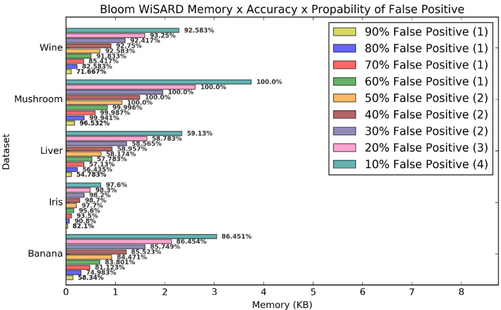  
(a)Part 1:Wine,Mushroom,Liver,Iris and Banana  

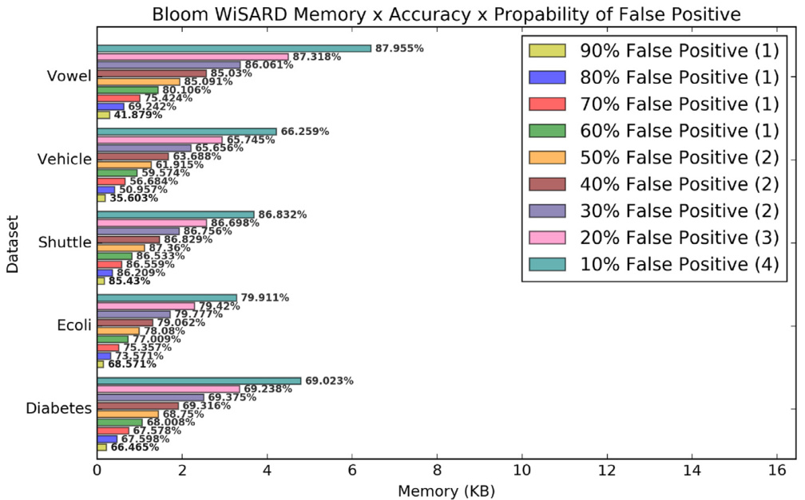  
(b)Part 2:Vowel,Vehicle,Shuttle,Ecoli and Diabetes.  

Fig. 9. Accuracy and memory consumption results when varying the false positive rate of Bloom WiSARD. In the legend, the number of hash functions is shown in parentheses at end of each false positive rate. The accuracy is shown at right side of each bar.  

essential aspects of the data, which we leave as subject for future work.  

# 5.4. False Positive Rate vs. Accuracy vs. Memory Analysis  

In Section 5.3 the false positive rate of Bloom filters were fixed to $1 0 \%$ . In contrast to traditional use of Bloom filters where one needs to ensure correct query responses with high probability, Bloom WiSARD does not require low false positive rate because even if a tuple is erroneously returned as member of a Bloom filter, the model is not compromised and false positives can still improve the generalization capability of the system. In order to evaluate the potential of Bloom WiSARD, the accuracy and memory consumption are evaluated for different configurations of the false positive rate. For all data sets, the rate is varied from $1 0 \%$ to $90 \%$ .  

Results are presented in Fig. 9 Memory consumption and accuracy decrease as the false positive probability increases. Overall, the accuracy is kept acceptable until reaching a $5 0 \%$ false positive rate. At that point, accuracy is decreased on average by $1 . 3 \%$ with a worst case of about $4 . 3 \%$ (Vehicle). Accordingly, memory consumption is reduced by roughly 3.3 times after an increase in $1 0 \%$ of false positive rate. In addition, as the false positive rate increases the number of hash functions, for each Bloom filter is reduced from 4 $( 1 0 \% )$ to 2 $( 5 0 \% )$ hash functions resulting in a slight increase of speed up at the training and classification phases.  

Table 11 (binary classification datasets), Table 12 (multiclass classification datasets) and Table 13 (multiclass classification datasets) present the standard deviation of the accuracy related to different false positive probability configurations in Bloom WiSARD related to the accuracy results in Fig. 9  

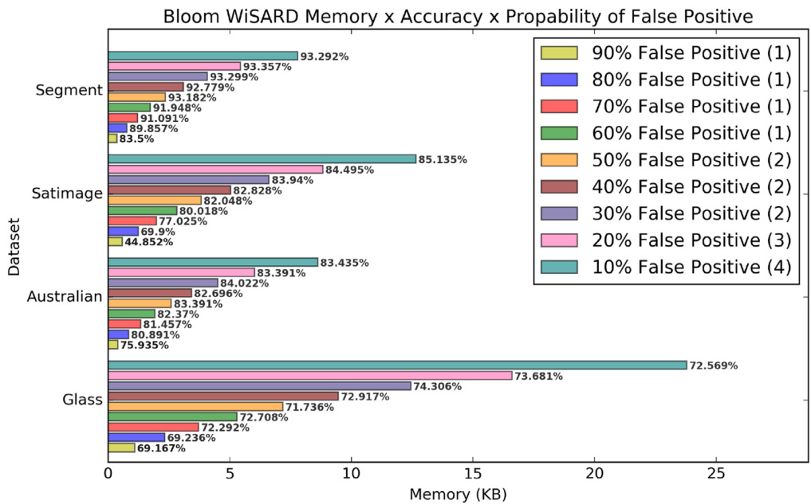  
(c) Part 3:Segment,Satimage,Australian and Glass.  

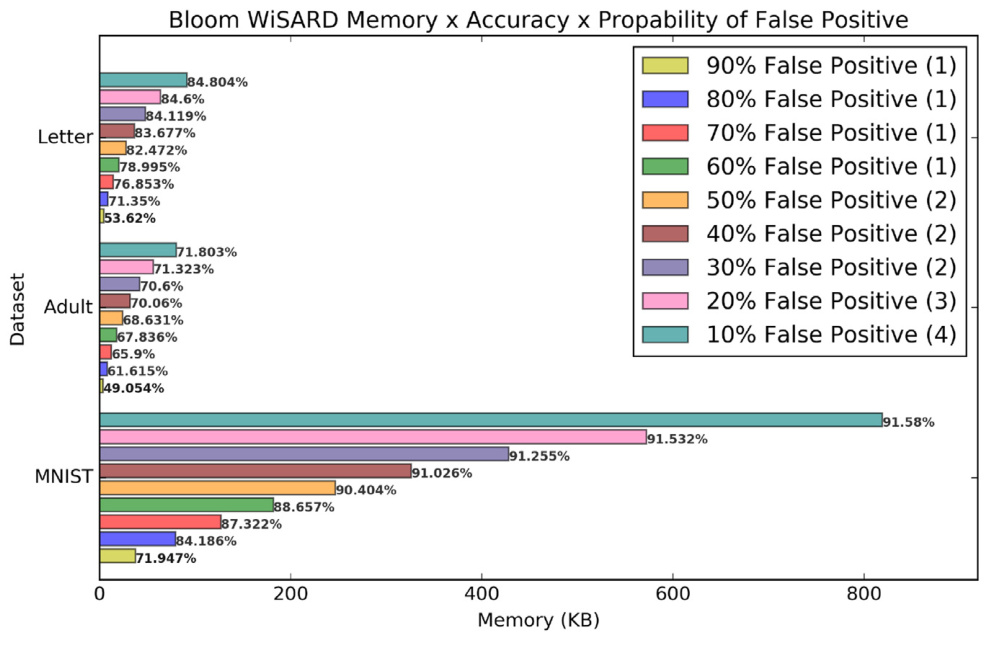  
(d)Part 4:Letter,Adult andMNIST.   
Fig. 9. Continued  

Table 11 Standard deviation of accuracy when varying the false positive rate (FPP) of Bloom WiSARD for binary classification problems.   

<html><body><table><tr><td>FPP</td><td>Adult</td><td>Australian</td><td>Banana</td><td>Diabetes</td><td>Liver</td><td>Mushroom</td></tr><tr><td>10%</td><td>0.0061496</td><td>0.0223776</td><td>0.0057860</td><td>0.0262359</td><td>0.0483372</td><td>0</td></tr><tr><td>20%</td><td>0.0058269</td><td>0.0155309</td><td>0.0058466</td><td>0.0284882</td><td>0.0366251</td><td>0</td></tr><tr><td>30%</td><td>0.0044720</td><td>0.018285</td><td>0.0078729</td><td>0.0250549</td><td>0.0299053</td><td>0</td></tr><tr><td>40%</td><td>0.0035480</td><td>0.021014</td><td>0.0061894</td><td>0.0166406</td><td>0.0413020</td><td>0</td></tr><tr><td>50%</td><td>0.0049795</td><td>0.019081</td><td>0.009687</td><td>0.0183635</td><td>0.030360</td><td>0</td></tr><tr><td>60%</td><td>0.0072392</td><td>0.0177929</td><td>0.0068795</td><td>0.0234342</td><td>0.035050</td><td>0.000161</td></tr><tr><td>70%</td><td>0.0059162</td><td>0.0185115</td><td>0.0168765</td><td>0.0175129</td><td>0.03928</td><td>0.0001761</td></tr><tr><td>80%</td><td>0.0082073</td><td>0.0226118</td><td>0.0269275</td><td>0.0239359</td><td>0.028563</td><td>0.000787</td></tr><tr><td>90%</td><td>0.0091519</td><td>0.0237056</td><td>0.0359376</td><td>0.0183749</td><td>0.0461771</td><td>0.0191718</td></tr></table></body></html>  

Table 12 Standard deviation of accuracy when varying the false positive rate (FPP) of Bloom WiSARD for multiclass classification problems.   

<html><body><table><tr><td>FPP</td><td>Ecoli</td><td>Glass</td><td>Iris</td><td>Letter</td><td>MNIST</td><td>Satimage</td></tr><tr><td>10%</td><td>0.0202621</td><td>0.0367137</td><td>0.0215406</td><td>0.0045029</td><td>0.0056781</td><td>0.0057708</td></tr><tr><td>20%</td><td>0.0196581</td><td>0.0257881</td><td>0.0170587</td><td>0.005713</td><td>0.0042678</td><td>0.0076205</td></tr><tr><td>30%</td><td>0.0150135</td><td>0.027252</td><td>0.0177764</td><td>0.0056912</td><td>0.0027261</td><td>0.0056868</td></tr><tr><td>40%</td><td>0.0257965</td><td>0.0352734</td><td>0.014526</td><td>0.0050576</td><td>0.004139</td><td>0.0130475</td></tr><tr><td>50%</td><td>0.0179628</td><td>0.0225133</td><td>0.0247184</td><td>0.006447</td><td>0.0042574</td><td>0.0101778</td></tr><tr><td>60%</td><td>0.0252341</td><td>0.030198</td><td>0.02498</td><td>0.0084854</td><td>0.0046192</td><td>0.0139484</td></tr><tr><td>70%</td><td>0.0311094</td><td>0.0371317</td><td>0.0339853</td><td>0.0065570</td><td>0.0054063</td><td>0.0140646</td></tr><tr><td>80%</td><td>0.025939</td><td>0.0421900</td><td>0.0435431</td><td>0.006557</td><td>0.0056860</td><td>0.0229456</td></tr><tr><td>90%</td><td>0.0375212</td><td>0.0250770</td><td>0.048775</td><td>0.0082801</td><td>0.0086809</td><td>0.05209</td></tr></table></body></html>  

Table 13 Standard deviation of accuracy when varying the false positive rate (FPP) of Bloom WiSARD or multiclass lassification problems cont.).   

<html><body><table><tr><td>FPP</td><td>Segment</td><td>Shuttle</td><td>Vehicle</td><td>Vowel</td><td>Wine</td></tr><tr><td>10%</td><td>0.0080506</td><td>0.012279</td><td>0.023848</td><td>0.0262235</td><td>0.0260741</td></tr><tr><td>20%</td><td>0.0079239</td><td>0.012454</td><td>0.0267349</td><td>0.0165499</td><td>0.0255359</td></tr><tr><td>30%</td><td>0.0081353</td><td>0.011607</td><td>0.024524</td><td>0.0160635</td><td>0.0335307</td></tr><tr><td>40%</td><td>0.0092052</td><td>0.0107775</td><td>0.0237721</td><td>0.0173125</td><td>0.0308558</td></tr><tr><td>50%</td><td>0.0077433</td><td>0.023087</td><td>0.0242694</td><td>0.0136733</td><td>0.0226538</td></tr><tr><td>60%</td><td>0.0079103</td><td>0.0109617</td><td>0.0317173</td><td>0.0185388</td><td>0.0235112</td></tr><tr><td>70%</td><td>0.013266</td><td>0.0152805</td><td>0.0220679</td><td>0.0187756</td><td>0.0473975</td></tr><tr><td>80%</td><td>0.0126708</td><td>0.0086389</td><td>0.0319956</td><td>0.0227475</td><td>0.0583274</td></tr><tr><td>90%</td><td>0.0199910</td><td>0.0102771</td><td>0.0231014</td><td>0.0261485</td><td>0.0361325</td></tr></table></body></html>  

# 6. Related Work  

Weightless neural networks have been studied for more than six decades [30] A significant body of work has tackled the memory and computational efficiency of weighted [31] and weightless neural networks [32]  

The memory required by the Virtual Generalising RAM weightless neural model (VG-RAM) [32,33] for instance, is bounded by the size of the training set. Input/output pairs presented during training phase are kept in memory. In the test phase, the memory of VG-RAM neurons is searched associatively by comparing the input presented to the network against all inputs in the learned input/output pairs. The output of each VG-RAM neuron is taken from the pair whose input is nearest to the input presented.  

A number of recently proposed methods such as Bitwise Neural Networks [34] XNOR-Net [35] binarized neural networks [36] and ternary neural networks [37] leverage the binarization of the input or of the neural network weights to improve efficiency. The training phase considered in those models is similar in spirit to that of WiSARD (and Bloom WiSARD), as they are all memory-oriented approaches. Nonetheless, whereas WiSARD (and Bloom WiSARD) is intrinsically weightless, which renders it a natural choices to extend Bloom filters, the relationship between [34–37] and Bloom filters is not as straightforward, and is left as subject for future work.  

# 7. Conclusion  

WiSARD is a powerful WNN model based on RAM memory that can be easily implemented in hardware and real-time systems. Nevertheless, certain applications require a considerable amount of memory to achieve good learning capabilities becoming impracticable to implement it in current technology. Alternative structures like dictionaries are required to implement the RAM nodes and turn feasible the use of the model.  

In this work we propose the Bloom WiSARD model which extends WiSARD by implementing RAM nodes as Bloom filters. By using Bloom filters, memory resources are significantly reduced and for pattern recognition purposes we experimentally found that  

Bloom filters can build robustness into the system. Our experiments show that the model provides good accuracy and requires low training and testing times. In addition, it consumes up to 6 orders of magnitude less resources than standard WiSARD and about 7.7 times less resources than WiSARD implemented with dictionaries. In addition, increasing the false positive rate of Bloom WiSARD $5 0 \%$ results in 3.3 times less memory and average of $1 . 7 7 \%$ decreased accuracy compared against a false positive rate of $10 \%$ configuration.  

This work opens up a number of avenues for future research. Future work will focus on leveraging extended Bloom filter operations such as the Bloom filter false free zone [38] or frequency counts of elements stored [39,40] in order to enable Bloom WiSARD to use improved techniques such as DRASiW [41] In this work, we focused on the use of Bloom filters for the implementation of discriminators, i.e., two-class classifiers. Bloom filters have been extended to allow for more than two output classes [42] and those extensions may be instrumental in the design of general purpose multi-class classifiers. More broadly, we envision that this work is one step further towards the use of Bloom filters for machine learning purposes [6,14]  

# Declaration of Competing Interest  

The authors declare that they have no known competing financial interests or personal relationships that could have appeared to influence the work reported in this paper.  

# Acknowledgment  

The authors would like to thank CAPES, COPPETEC, CNPq and FAPERJ for the financial support to this work.  

# References  

[1] I. Aleksander M.D. Gregorio F.M.G. França P.M.V. Lima H. Morton A brief introduction to weightless neural systems, ESANN 2009, 17th European Symposium on Artificial Neural Networks, 2009   
[2] I. Aleksander, W. Thomas, P. Bowden, Wisard  a radical step forward in image recognition, Sensor Review 4 (3) (1984) 120–124, doi:10.1108/eb007637   
[3] R. Mitchell, . Bishop, P. Minchinton, Optimising memory usage n n-tuple neural networks, Mathematics and Computers in Simulation 40 (5) (1996) 549– 563, doi:10.1016/0378-4754(95)00006-2.   
[4] D.S. Carvalho H.C. Carneiro F.M. França P.M. Lima B-bleaching: Agile overtraining avoidance in the wisard weightless neural classifier., ESANN, 2013.   
[5] B.H. Bloom, Space/time trade-offs in hash coding with allowable errors, Commun. ACM 13 (7) (1970) 422–426, doi:10.1145/362686.362692.   
[6] L. Luo D. Guo R.T.B. Ma O. Rottenstreich X. Luo Optimizing Bloom filter: Challenges, olutions, nd omparisons, EEE Communications Surveys nd Tutorials 2019)   
[7] M. Breternitz G.H. Loh B. Black J. Rupley P.G. Sassone W. Attrot Y. Wu A segmented bloom filter algorithm for efficient predictors, in: 2008 20th International Symposium on Computer Architecture and High Performance Computing, IEEE, 2008, pp. 123–130   
[8] P.C. Dillinger P. Manolios Bloom filters n probabilistic verification, n: A.J. Hu, A.K. Martin (Eds.), Formal Methods in Computer-Aided Design, Springer Berlin Heidelberg, Berlin, Heidelberg, 2004, pp. 367–381   
[9] P. Sterne, Efficient and robust associative memory from a generalized bloom filter, Biological Cybernetics 106 (4) (2012) 271–281, doi:10.1007/ s00422-012-0494-6   
[10] M. Mitzenmacher A model for learned Bloom filters and optimizing by sandwiching, in: Annual Conference on Neural Information Processing Systems (NeurIPS), 2018   
[11] M. Mitzenmacher, A model for learned Bloom filters and related structures (2018) arXiv:1802.00884   
[12] M. Hearn M. Corallo Connection bloom filtering, Bitcoin Improvement Proposal 37 (2012).   
[13] J.W. Rae, S. Bartunov, T.P. Lillicrap, Meta-learning neural bloom filters, in: International Conference on Machine Learning (ICML), 2019 arXiv:1906.04304   
[14] M.M. Cisse N. Usunier T. Artieres P. Gallinari Robust Bloom filters for large multilabel classification tasks, in: Advances in Neural Information Processing Systems, 2013, pp. 1851–1859   
[15] A. Odena, . Goodfellow, Tensorfuzz: Debugging neural networks with coverage-guided fuzzing (2018) arXiv:1807.10875   
[16] S. Dasgupta T.C. Sheehan C.F. Stevens S. Navlakha A neural data structure for novelty detection, Proceedings of the National Academy of Sciences 115 (51) (2018) 13093–13098   
[17] R. Bogacz M.W. Brown Comparison of computational models of familiarity discrimination in the perirhinal cortex, Hippocampus 13 (4) (2003) 494–524   
[18] M. Mitzenmacher E. Upfal Probability and computing: randomization and probabilistic techniques in algorithms and data analysis, Cambridge university press, 2017   
[19] S. Chandar, S. Ahn, H. Larochelle, P. Vincent, G. Tesauro, Y. Bengio, Hierarchical Memory Networks (2016) arXiv:1605.07427   
[20] A. Graves Wayne M . Reynolds T. Harley I. Danihelka A. Grabska-Barwinska S.G. Colmenarejo E. Grefenstette T. Ramalho J. Agapiou et al. Hybrid omputing using neural network with dynamic external memory, Nature 538 (7626) (2016) 471.   
[21] L. Carter R. Floyd J. Gill G. Markowsky M. Wegman Exact and approximate membership testers, in: Proceedings of the tenth annual ACM symposium on Theory of computing, ACM, 1978, pp. 59–65   
[22] X. Wang Y. Ji Z. Dang X. Zheng B. Zhao Improved weighted bloom filter and space lower bound analysis of algorithms for approximated membership querying, in: International Conference on Database Systems for Advanced Applications, Springer, 2015, pp. 346–362   
[23] A. Kirsch M. Mitzenmacher Distance-sensitive bloom filters, in: 2006 Proceedings of the Eighth Workshop on Algorithm Engineering and Experiments (ALENEX), SIAM, 2006, pp. 41–50   
[24] A. Kirsch M. Mitzenmacher Less hashing, ame performance: Building better Bloom filter, in: Y. Azar, T. Erlebach (Eds.), Algorithms – ESA 2006, 2006   
[25] Wikipedia, Murmurhash fuction, 2019. https://en.wikipedia.org/wiki/ MurmurHash   
[26] L. Santiago, Bloomwisard implementation, 2019. https://github.com/ leandro-santiago/bloomwisard   
[27] Y. LeCun, The mnist database of handwritten digits, 1998. http://yann.lecun. com/exdb/mnist/.   
[28] G. Huang, H. Zhou, X. Ding, R. Zhang, Extreme learning machine for regression and multiclass classification, IEEE Transactions on Systems, Man, and Cybernetics, Part B Cybernetics) 42 2) 2012) 513–529, doi:10.1109/TSMCB.2011. 2168604   
[29] D. Dheeru, E. Karra Taniskidou, UCI machine learning repository, 2017.   
[30] W.W. Bledsoe I. Browning Pattern recognition and reading by machine, in: Papers of the Eastern Joint IRE-AIEE-ACM Computer Conference, 1959, pp. 225–232   
[31] M. Rhu N. Gimelshein J. Clemons A. Zulfiqar S.W. Keckler vdnn: Virtualized deep neural networks for scalable, memory-efficient neural network design, in: The 49th Annual IEEE/ACM International Symposium on Microarchitecture, IEEE Press, 2016, p. 18   
[32] J. Mrsic-Flogel Aspects of planning with neural ystems., mperial College ondon (University of London), 1992 Ph.D. thesis   
[33] I. Aleksander From wisard to magnus: A family of weightless virtual neural machines, in: RAM-Based Neural Networks, World Scientific, 1998, pp. 18–30   
[34] M. Kim P. Smaragdis Bitwise neural networks, rXiv preprint rXiv:1601.06071 (2016)   
[35] M. Rastegari V. Ordonez J. Redmon A. Farhadi Xnor-net: Imagenet classification using binary convolutional neural networks, in: European Conference on Computer Vision, Springer, 2016, pp. 525–542   
[36] I. Hubara M. Courbariaux D. Soudry R. El-Yaniv Y. Bengio Binarized neural networks, in: Advances in neural information processing systems, 2016, pp. 4107–4115.   
[37] H. Alemdar V. eroy A. Prost-Boucle F. Pétrot Ternary neural networks or esource-efficient i pplications, n: 2017 nternational oint Conference on Neural Networks (IJCNN), IEEE, 2017, pp. 2547–2554.   
[38] S.Z. Kiss É. Hosszu J. Tapolcai L. Rónyai O. Rottenstreich Bloom filter with a false positive free zone, IEEE INFOCOM, 2018.   
[39] F. Bonomi M. Mitzenmacher R. Panigrahy S. Singh G. Varghese An improved construction for counting bloom filters, in: European Symposium on Algorithms, Springer, 2006, pp. 684–695   
[40] O. Rottenstreich Y. Kanizo I. Keslassy The variable-increment counting Bloom filter, IEEE/ACM Transactions on Networking (TON) 22 (4) (2014) 1092–1105   
[41] M. De Gregorio M. Giordano Cloning DRASiW systems via memory transfer, Neurocomputing 192 (2016) 115–127   
[42] B. Chazelle J. Kilian R. Rubinfeld A. Tal The bloomier filter: an efficient data  

structure for static support lookup tables, in: Proceedings of the fifteenth annual ACM-SIAM symposium on Discrete algorithms, Society for Industrial and Applied Mathematics, 2004, pp. 30–39  

  

  

  

  

  

  

Leandro Santiago s PhD andidate n System Engineering and Com- puter Science at Federal University of Rio de Janeiro. Currently, his research focuses on hardware security and neuromorphic computing. His other works include area of high performance computing, where explores dataflow models to leverage performance in heterogeneous environment in transparency way. As a multidisciplinary researcher, his research interests lies in the areas of neu- ral computing, hardware security, reconfigurable computing, high performance computing and distributed lgorithms.  

Letícia Verona is a PhD candidate in Information Systems and substitute teacher at Federal University of Rio de Janeiro. Currently, her research focuses on influence analysis and propagation over networks. The areas of interest are heterogeneous information integration, focusing on metadata, ontologies, semantic web and computational intelligence.  

Fabio Rangel holds a B.S. in Computer Science from the Federal Uni- versity of Rio de Janeiro (2015), and a M.S. from the Graduate Program in Informatics at the same university (2017). His research is associated with Machine Learning in Nonstationary Environments, focusing on Semi-Supervised and Online Learning. Fabio was parttime lecturer at Federal University of Rio de Janeiro, teaching Python Programming, Linear Algebra, Computational Intelligence, and Data Mining. He supervised the work entitled Predicting Per- formance of ENEM Candidates Through Socioeconomic Data, elected s one of he nine best undergraduate research works in Brazil by the 36th Undergraduate Research Work Contest (2017).  

Fabricio Firmino is a PhD student at Federal University of Rio de Janeiro. His main research areas include Machine Learning, Content-Based Image Re- trieval and Semantic Technologies. abricio holds BSc. nd MSc n Computer Science from Federal University of Rio de Janeiro. He also has experience in soft- ware engineer, having worked in companies such as Petrobras (Brazil), Brazilian Navy, Brazilian National Laboratory of Scientific Computing, Digital Enterprise Research Institute ( Ireland).  

Daniel Sadoc Menasché received the Ph.D. degree in computer science from the University of Massachusetts Amherst, Amherst, in 2011. He is cur- rently an Assistant Professor with he Computer Science Department, ederal University of Rio de Janeiro, Rio de Janeiro, Brazil. His interests are in mod- eling, analysis, and performance evaluation of computer systems. He was a recipient of the Best Paper Awards t GLOBECOM 2007, CoNEXT 2009, NFOCOM 2013, nd CGSE 2015. He s urrently n ffiliated member of the Brazilian Academy of Sciences.  

Wouter Caarls is an Assistant Professor at the Pontifical Catholic Uni- versity of Rio de Janeiro, Brazil. He received his M.Sc. degree in Artificial Intelligence from the University of Amsterdam, The Netherlands (2002), and his Ph.D. from the Department of Applied Sciences of the Delft University of Technology, The Netherlands (2008). His research and teaching interests include reinforcement learning, machine learning, robotics and computer vision.  

  

Mauricio received the Electronics Engineer degree with honors at ITA- Instituto Tecnologico de Aeronautica, Brazil, MSc n Computer Science t UNICAMP, Brazil nd the Ph.D. in Computer Engineering at Carnegie-Mellon University. He worked on parallelizing compilers for a research multiprocessor and for VLIW architectures, binary translation of x86 codes, on IP telephony libraries and on parallelizing database server programs. He is interested in scale- up and scale-out frameworks for Deep Neural Networks using CPUs and GPUs as well as codesigned efficient SW/HW organizations for Machine Learning. He worked at IBM (TJWatson and Austin), Motorola, Intel Labs and TimesN Systems, an Austin startup and  

AMD Research. He holds 55 U.S. patents and has 56 more pending in areas related to compilation, code optimization, binary translation, processor, cache and memory system organization and cryp- tography. Mauricio’s academic service include ACM/IEEE conferences such as IISWC (general chair), HPCA(finance chair),AMASBT/ISCA Workshop (or- ganizer chair), ISCA and multiple program committees. He is Principal Researcher t STAR-IUL nd nvited Associate Professor t isbon University nstitute SCTE-IUL.  

Sandip Kundu is a Professor of Electrical and Computer Engineering at the University of Massachusetts Amherst (2005-date). Currently, he s on eave rom UMass, erving as Program Director t he National Science oundation. He obtained his Ph.D in Electrical Computer Engineering from University of owa 1988) nd B.Tech Hons.) n Electronics Electrical Communication Engi- neering from the Indian Institute of Technology, Kharagpur (1984). His research nterests nclude Security of Mobile nd Embedded devices, Computer Microar- hitecture, VLSI Circuit Design and Testing, CAD algorithms, and Information and Coding Theory.  

  

  

Priscila M. V. Lima is an Adjunct Professor at Tercio Pacitti Institute, Federal University of Rio de Janeiro (UFRJ), Brazil. She received her B.Sc. in Computer Science from UFRJ (1982), the M.Sc. in Computer Science from COPPE/UFRJ (1987), and her Ph.D. from the Department of Computing, m- perial College ondon, U.K. 2000). She has research and teaching interests in computational intelligence, omputational ogic, distributed lgorithms nd other aspects of parallel and distributed computing.  

Felipe M. G. França is Professor of Computer Science and Engineering, COPPE, Federal University of Rio de Janeiro (UFRJ), Brazil. He eceived his Electronics Engineer degree from UFRJ (1982), the M.Sc. in Computer Science from COPPE/UFRJ (1987), and his Ph.D. from the Department of Electrical and Electronics Engineering of the Imperial College ondon, U.K. 1994). He has esearch nd eaching interests in computational intelligence, distributed algorithms and other aspects of parallel and distributed computing.  

  