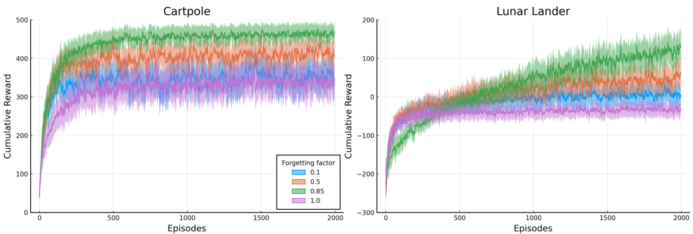

# Rafael Fontella Katopodis  

Dissertação de Mestrado apresentada ao Programa de Pós-graduação em Engenharia de Sistemas e Computação, COPPE, da Universidade Federal do Rio de Janeiro, como parte dos requisitos necessários à obtenção do título de Mestre em Engenharia de Sistemas e Computação.  

Orientadores: Priscila Machado Vieira Lima Felipe Maia Galvão França  

Rio de Janeiro Janeiro de 2022  

Rafael Fontella Katopodis  

DISSERTAÇÃO SUBMETIDA AO CORPO DOCENTE DO INSTITUTO ALBERTO LUIZ COIMBRA DE PÓS-GRADUAÇÃO E PESQUISA DE ENGENHARIA DA UNIVERSIDADE FEDERAL DO RIO DE JANEIRO COMO PARTE DOS REQUISITOS NECESSÁRIOS PARA A OBTENÇÃO DO GRAU DE MESTRE EM CIÊNCIAS EM ENGENHARIA DE SISTEMAS E COMPUTAÇÃO.  

Orientadores: Priscila Machado Vieira Lima Felipe Maia Galvão França  

Aprovada por: Prof. $\mathbf { a }$ Priscila Machado Vieira Lima Prof. Daniel Ratton Figueiredo Prof. Wouter Caarls  

Katopodis, Rafael Fontella Reinforcement Learning with Weightless Neural   
Networks/Rafael Fontella Katopodis.  Rio de Janeiro:   
UFRJ/COPPE, 2022. XI, 76 p.: il.; 29, 7cm. Orientadores: Priscila Machado Vieira Lima Felipe Maia Galvão França Dissertação (mestrado)  UFRJ/COPPE/Programa de   
Engenharia de Sistemas e Computação, 2022. Referências Bibliográcas: p. 71  74. 1. Articial Intelligence. 2. Machine Learning.   
3. Reinforcement Learning. 4. Weightless Neural   
Networks. I. Lima, Priscila Machado Vieira et al.   
II. Universidade Federal do Rio de Janeiro, COPPE,   
Programa de Engenharia de Sistemas e Computação. III.   
Título.  

# Acknowledgements  

To my parents, Stela and Willy, I am deeply grateful for having taught me the importance of pursuing education and to do so striving for excellence. To my sister, Ana Clara, I must thank her for being such an inspiration with her accomplishments, even in a completely dierent career path. I am indebted to my advisors, Priscila and Felipe, for guiding me through my rst steps into the world of academic research and shaping what I want for my future. Finally, I would like to thank Clara, for keeping me company almost every day throughout the writing of this dissertation, and the very well-known lows and highs of graduate school.  

Resumo da Dissertação apresentada à COPPE/UFRJ como parte dos requisitos necessários para a obtenção do grau de Mestre em Ciências (M.Sc.)  

APRENDIZADO POR REFORÇO COM REDES NEURAIS SEM PESOS  

Rafael Fontella Katopodis  

Janeiro/2022  

Orientadores: Priscila Machado Vieira Lima Felipe Maia Galvão França  

Programa: Engenharia de Sistemas e Computação  

Pilotagem de veículos, alocação de recursos, controle de plantas industriais: esses são apenas alguns exemplos dentre os muitos problemas interessantes que exigem tomar decisões ao longo do tempo. Dados os impactos no mundo real e custos dessas tarefas, o estudo de métodos para automatizá-las é de grande importância. Aprendizado por reforço (RL) é o ramo de aprendizado de máquina que lida com tomada de decisão sequencial. Resultados impressionantes foram vistos em anos recentes devido a RL, especialmente quando fazendo uso de modelos de aprendizado profundo. Comparado a essas redes neurais, o uso de modelos de aprendizado alternativos não recebeu a mesma atenção em trabalhos recentes. A adoção de redes neurais sem peso, em particular, é pouco explorada. Não obstante, o estudo de seu uso nesse contexto é de interesse, já que pode prover uma ferramenta a mais para a abordagem de problemas de tomada de decisão sequencial e permitir que trade-os mais favoráveis sejam feitos em instâncias especícas. Fazer uso de redes de $n$ -tuplas em RL, no entanto, não é uma questão de simplesmente acoplar arquiteturas existentes a métodos de RL, visto que essas têm suposições subjacentes incompatíveis com as diculdades impostas por tomada de decisão sequencial. Para conciliar essa classe de redes com RL, duas novas arquiteturas são propostas, uma fazendo uso de um mecanismo simples semelhante ao esquecimento, e outra tomando inspiração com aprendizado online com kernels. Com essas duas variantes, redes sem pesos podem ser empregadas em métodos baseados em aproximação de função valor e política. Os modelos propostos são avaliados em quatro tarefas de benchmark, cuidadosamente analisando os efeitos de seus hiperparâmetros e as comparando com redes feedforward, com resultados que mostram serem capazes de alcançar performances competitivas.  

Abstract of Dissertation presented to COPPE/UFRJ as a partial fulllment of the requirements for the degree of Master of Science (M.Sc.)  

REINFORCEMENT LEARNING WITH WEIGHTLESS NEURAL NETWORKS  

Rafael Fontella Katopodis  

January/2022  

Advisors: Priscila Machado Vieira Lima Felipe Maia Galvão França  

Department: Systems Engineering and Computer Science  

Driving vehicles, allocating resources, controlling industrial plants: these are just a few examples of the many interesting problems that require making decisions over time. Given the real-world impacts and costs of such tasks, the study of methods to automate these is of great importance. Reinforcement learning (RL) is the branch of machine learning that deals with sequential decision-making. Impressive results have been seen in recent years due to RL, especially when making use of deep learning models. Compared to these neural networks, the use of alternative learning models has not been as much of a focus in recent research. The adoption of weightless neural networks, in particular, is underexplored. Nevertheless, the study of their use in this context is worthwhile, as it can provide one more tool in tackling decision-making problems and possibly allows more favorable trade-os to be made for specic instances. Making use of $n$ -tuple nets in RL, however, is not a matter of simply plugging existing architectures in RL methods, as these are based on assumptions incompatible with the issues imposed by sequential decision-making. To reconcile this class of networks with RL, two novel architectures are proposed, one leveraging a simple mechanism akin to forgetting, and the other drawing inspiration from online learning with kernels. With these two variants, weightless nets can be employed both in action-value and policy search methods. The proposed models are evaluated in four benchmarks tasks, thoroughly assessing the eects of their hyperparameters and comparing them to feedforward networks, with results showing that they can attain competitive performance.  

# Contents  

# List of Figures ix  

List of Tables xi  

# 1 Introduction 1  

1.1 Objectives and contributions . 2   
1.2 Structure of the text 2  

# 2 Reinforcement learning 4  

2.1 Markov decision processes 4   
2.2 Value functions and policies 5   
2.3 Value-based algorithms 7   
2.3.1 Generalized policy iteration 8   
2.3.2 Value function estimation 9   
2.3.3 m-Step SARSA 11   
2.3.4 Value function approximation 12   
2.4 Policy-based algorithms 13   
2.4.1 Policy-gradient 14   
2.4.2 Actor-Critic methods 15  

# 3 Kernel methods and $n$ -tuple networks 17  

3.1 Learning with kernels . 17   
3.1.1 Feature maps and positive-denite kernels 18   
3.1.2 Online learning 19   
3.2 $n$ -tuple neural networks 21   
3.2.1 Discriminator networks . 22   
3.2.2 $n$ -tuple regression . 23   
3.2.3 Encoding schemes for real and vector valued inputs 25   
3.2.4 Resolution, tuple size and the complexity-generalization   
trade-o . 27  

# 4 $n$ -Tuple-based reinforcement learning 29  

4.1 The limitations of the $n$ -tuple regression network 29   
4.1.1 The assumption of a xed joint distribution 31   
4.1.2 The assumption of the error measure 32   
4.2 Value function approximation with a forgetting $n$ -tuple neural network 33   
4.2.1 Forgetting $n$ -tuple regression network . 34   
4.2.2 Multi-step SARSA with a forgetting $n$ -tuple regression network 35   
4.3 Policy search with a $n$ -tuple system . 36   
4.3.1 Functional gradient-inspired $n$ -tuple network 38   
4.3.2 $n$ -tuple REINFORCE . 43   
4.3.3 Parameterization of policies 44   
4.3.4 $n$ -tuple Actor-Critic . 47  

# 5 Experimental results 49  

5.1 Benchmark tasks and experimental setup . 49  

5.1.1 Discrete action space tasks . 50   
5.1.2 Continuous action space tasks . 52   
5.1.3 Experimental considerations . 53   
5.2 Forgetting $n$ -tuple SARSA evaluation . 54   
5.2.1 Eect of the encoding resolution and tuple size 54   
5.2.2 Eect of the encoding scheme 56   
5.2.3 Eect of the forgetting factor 58   
5.3 $n$ -tuple Policy Gradient evaluation 60   
5.3.1 Eect of the encoding resolution and tuple size 60   
5.3.2 Eect of the encoding scheme 62   
5.3.3 Eect of the learning rate 63   
5.4 Comparative assessment . 64  

# 6 Conclusion 68  

6.1 Future work 69  

# References 71  

A Hyperparameters used in the Comparative assessment  

# List of Figures  

2.1 Interaction between agent and environment in a Markov decision process. 5   
2.2 Generalized policy iteration scheme of cyclic policy improvement and evaluation 8   
3.1 (a) Single-bit RAM neuron. Its activation consists simply of the state of the bit addressed by the input. (b) RAM discriminator, a network of RAM neurons that behave as a learned similarity function. Each neuron observes only part of the input, in a manner that the network can generalize to novel patterns. 22   
3.2 (a) A multidiscriminator classier, also known as a WiSARD model. Each discriminator is trained with samples of a particular class. When the model is employed to classify an input, all discriminators respond to it, and a class is assigned based on the greatest response. (b) A $n$ -tuple regression network, an $n$ -tuple net made up of RAM neurons that hold a real value estimate and a counter per memory position. The update rule and output function of the model are given by (3.15) and (3.16). . 23   
3.3 Thermometer and circular encodings with 5-bit resolutions of two real values dened in the $[ 0 , 1 ]$ interval. While thermometer encodings entail a variable number of active bits, circular encodings have a xed set given a resolution. The example also showcases the wrap-around behavior of the circular encoder. . 26   
4.1 A simplied example of the negative eect of an estimation that assumes xed distribution in a changing environment. The solid line denotes the probability density function from the true underlying distribution,ticks along the $x$ axis denote samples drawn from it, and the dashed line denotes a density estimate from all available samples. As the distribution shifts, the estimate becomes a progressively worst approximation of the true density. .  

4.2 Weighted density estimation example. As in g. 4.1, the solid line denotes the probability density function of the unknown distribution, ticks along the $x$ axis are samples drawn from the distribution, and the dashed line is an estimate of the density. Once again, the estimation takes into account all available samples. However, older samples have their weights multiplied by a factor of 0.1 every time a new batch of samples is drawn, in a manner that the estimate is better able to track the underlying distribution.  

4.3 Two approaches to modeling a vector-valued (three-dimensional vectors in the example) function with discriminator-based $n$ -tuple networks. In (a), a single discriminator with vector-valued memory positions is used. Alternatively, as in (b), multiple real-valued discriminators can be used, with each discriminator being in charge of a component of the output. 3  

5.1 The Cartpole (a) and Lunar Lander (b) environments. 50   
5.2 The Mountain Car (a) and Hopper (b) environments. 52   
5.3 Learning curves for the cartpole task and an assortment of resolutions and tuple sizes 55   
5.4 Learning curves for the lunar lander task and an assortment of resolutions and tuple sizes 57   
5.5 Learning curves for the cartpole and lunar lander tasks using the simple and circular thermometer encodings . 58   
5.6 Learning curves for the cartpole and lunar lander tasks using dierent forgetting factor values . 59   
5.7 Learning curves for the mountain car task and an assortment of resolutions and tuple sizes . 61   
5.8 Learning curves for the hopper task and a assortment of resolutions and tuple sizes . 63   
5.9 Learning curves for the mountain car and hopper tasks using the simple and circular thermometer encodings . 64   
5.10 Learning curves for the mountain car and hopper tasks using dierent learning rates 65   
5.11 Feedforward network architectures used in the baseline experiments. Output layers diered based on whether the model was being used to approximate a value function or parameterize a policy. . 66  

# List of Tables  

5.1 Invariant hyperparameters for the resolution and tuple size experiment with $n$ -tuple SARSA and discrete action space tasks 54   
5.2 Invariant hyperparameters for the encoding scheme experiment with $n$ -tuple SARSA and discrete action space tasks 58   
5.3 Invariant hyperparameters for the forgetting factor experiment with $n$ -tuple SARSA and discrete action space tasks 59   
5.4 Invariant hyperparameters for the resolution and tuple size experiment with $n$ -tuple REINFORCE and continuous action space tasks . 62   
5.5 Invariant hyperparameters for the encoding scheme experiment with $n$ -tuple REINFORCE and continuous action space tasks 64   
5.6 Invariant hyperparameters for the learning rate experiment with $n$ - tuple REINFORCE and continuous action space tasks . 65   
5.7 Average cumulative rewards in the discrete action space environments 66   
5.8 Average cumulative rewards in the continuous action space environments 67   
A.1 Hyperparameters for $n$ -tuple SARSA 75   
A.2 Hyperparameters for $n$ -tuple REINFORCE . 75   
A.3 Hyperparameters for $n$ -tuple Actor-Critic . 76   
A.4 Hyperparameters for SARSA . 76   
A.5 Hyperparameters for REINFORCE 76   
A.6 Hyperparameters for Actor-Critic . 76  

# Chapter 1  

# Introduction  

A plethora of interesting problems may be understood as instances of sequential decision-making. Playing games, allocating resources, driving vehicles, and even controlling robots. These are all examples of tasks where actions or control commands must be chosen based on what is known of the problem at a given time and be appropriately chained together to achieve a desirable end.  

Some of these tasks are performed by humans as a matter of routine, relying solely on muscle memory and demanding very little conscious eort. The ease with which people approach them, however, belies the complexities involved. Complexities due to which these have historically required direct human control or, at the very least, supervision. This hidden sophistication may be seen in the simple act of driving a car. Most drivers wouldn't think much of the work they realize when steering a vehicle, but a lot is going on. A driver must be constantly interpreting a stream of information coming from heterogeneous sources. Simultaneously, it has to interface with its vehicle through a steering wheel, pedals, stick, and other commands.  

Car driving is a member of a set of problems where, despite their intricacies, humans can excel. Evidently, this cannot be said of all tasks. For others, intuition and reex aren't nearly as eective, and sometimes can even be harmful. Financial decision making, where there is a large number of possibilities and a great deal of uncertainty, is one of several possible examples. What both groups of decisionmaking tasks have in common is a growing interest in automating them. The push for automation is easily apprehensible. For those activities that can be accomplished by a person through muscle memory, automation is an opportunity to avoid drudgery and free time for more creative endeavors. For the tasks where humans struggle, automation can be a way to achieve better results and increase productivity.  

Due to their aforementioned pervasiveness, the challenge of automating decisionmaking has been tackled independently from dierent elds, such as statistics, control theory, and articial intelligence. One approach that has been garnering particular interest in recent years is reinforcement learning (RL), a branch of machine learning [1]. This can be attributed to promising results in challenging instances of decision-making, such as robotic control [2] and game playing [3, 4].  

# 1.1 Objectives and contributions  

The results mentioned above were attained by leveraging deep neural networks, machine learning models with great representation capability that have fueled the most recent wave of interest in the eld [5]. Compared to these neural networks, the use of alternative learning models has not been as much of a focus in recent research. The adoption of weightless neural networks [6], in particular, is underexplored. Nevertheless, the study of their use in this context is worthwhile, as it provides one more tool in tackling decision-making problems and possibly allows more favorable tradeos to be made for specic instances. However, weightless networks were devised to solve supervised and unsupervised learning problems. RL, on the other hand, is a separate paradigm, with its particular issues, and existing weightless architectures are not equipped to handle them.  

The goal of this dissertation is to develop new $n$ -tuple learning algorithms suitable for reinforcement learning. To achieve this end, the previously proposed $n$ -tuple regression network is analyzed in light of the unique requirements of RL, to showcase the obstacles that must be surmounted. These observations underpin the proposal of two novel $n$ -tuple architectures, leveraging dierent ideas and tackling the task of training RL agents with value-based and policy-search approaches. Lastly, the effects of the hyperparameters of the proposed algorithms in the agent's performance is carefully studied and comparisons are made to feedforward networks.  

# 1.2 Structure of the text  

Chapter 2 is a brief review of the fundamental concepts of reinforcement learning: the problem setting and the framework of Markov Decision Processes, value functions and policies, and the major approaches based on approximating these quantities. Chapter 3 presents $n$ -tuple neural networks, with a focus on the $n$ - tuple regression network, given the interest in modeling value functions and policies (vector-valued functions, in general). This chapter also touches upon fundamental elements of learning with kernels that are later leveraged by a new architecture.  

In chapter 4, the $n$ -tuple regression network is further examined, pointing at its shortcomings when considered from a RL perspective. To address these shortcomings, two novel $n$ -tuple architectures are proposed in sections 4.2 and 4.3, suitable for value function approximation and policy search, respectively. Chapter 5 evaluates the proposed architectures with four benchmark tasks, thoroughly examining the eects of the algorithm's hyperparameters in the nal performance of agents. This Chapter also compares the proposed architectures to feedforward networks, to showcase that the former are competitive in terms of reward maximization. Finally, chapter 6 gives some concluding remarks on the work developed and point to future work opportunities in this line of research.  

# Chapter 2  

# Reinforcement learning  

In a few words, reinforcement learning (RL) concerns both problems of sequential decision-making and the algorithms to solve them. This problem statement is shared with other elds, such as control theory, and is not exclusive to RL. What sets RL apart is not the tasks that motivate its algorithms, but a focus on large-scale problems and approximate solutions, making use of models learned from data.  

In the following sections, the mathematical framework of Markov decision processes, through which many decision-making problems can be formulated, is presented. The formalization of the goal of reinforcement learning in Markov decision processes leads to the central concepts of value functions and policies. Ultimately, these give rise to the two major approaches in RL: value function approximation and policy search.  

# 2.1 Markov decision processes  

In the Markov decision process (MDP) framework [7], problems are framed as an interaction between an agent and its environment (g. 2.1). The interaction happens by an exchange of signals: the agent inuences its environment through an action signal. In response, the environment produces a state and reward signals to the agent. This dissertation focuses solely on discrete and episodic MDPs, meaning that agent-environment interactions occur at discrete time steps and eventually reach a terminal state. An episode, therefore, consists of a nite sequence of state, action, and reward random variables (2.1).  

$$
S _ { 0 } , A _ { 0 } , R _ { 1 } , S _ { 1 } , A _ { 1 } , R _ { 2 } , \ldots , S _ { T - 1 } , A _ { T - 1 } , R _ { T } , S _ { T }
$$  

The sequence (2.1) in an episode is governed by the agent's behavior and the MDP's dynamics. This dynamics can be formalized as the joint probability distribution of next state and reward given the history of all previous states and actions (2.2). However, as MDPs exhibit the Markov property, the next state and reward are independent of the entire history given just the previous state and action (2.3). In other words, the current state summarizes all information from the history relevant for the next state transition.  

  
Figure 2.1: Interaction between agent and environment in a Markov decision process.  

$$
\begin{array} { r } { P ( S _ { t } = s _ { t } , R _ { t } = r _ { t } | S _ { 0 } = s _ { 0 } , A _ { 0 } = a _ { 0 } , \ldots , S _ { t - 1 } = s _ { t - 1 } , A _ { t - 1 } = a _ { t - 1 } ) } \\ { = P ( S _ { t } = s _ { t } , R _ { t } = r _ { t } | S _ { t - 1 } = s _ { t - 1 } , A _ { t - 1 } = a _ { t - 1 } ) } \end{array}
$$  

# 2.2 Value functions and policies  

As the MDP framework models a decision-making process where the agent embodies its goal-seeking aspect, it naturally should take into account the feedback from the environment when selecting its actions. This closed-loop behavior does not need to be deterministic and can be thought of as a map between states and probability distributions over the possible actions. This mapping is known as a policy (2.4).  

$$
\pi ( a | s ) = p ( A _ { t } = a | S _ { t } = s ) \quad t = 0 , 1 , 2 , \ldots , T
$$  

The desirable ends sought in decision-making tasks might be quite diverse, but they take a precise and common meaning when the problem is formulated as an MDP: to maximize the long-term cumulative reward attained. As rewards are random variables, this maximization is done in terms of expectation. With this goal, the agent's action at each time step should strive to take into account not just the immediate reward, but all forthcoming ones. The concept of return formalizes this as a sum of rewards from a given time step onwards (2.5). $\gamma \in [ 0 , 1 ]$ is the discount rate, used to modulate the emphasis given to near-term reward.  

$$
G _ { t } = R _ { t + 1 } + \gamma R _ { t + 2 } + \ldots + \gamma ^ { T - t - 1 } R _ { T } = \sum _ { k = 0 } ^ { T - t - 1 } \gamma ^ { k } R _ { t + k + 1 }
$$  

An agent's behavior, governed by a policy, together with the MDP's dynamics and reward signal, induces dierent degrees of desirability, or value, over the possible states. If a state has the potential to lead to highly rewarding future states and the policy can take benet from it, that is a valuable state. On the other hand, if a state does not carry that potential, such as a terminal state, for instance, the agent doesn't want to nd itself in it, no matter how eective its policy is.  

Value functions [8, chapter 3] allow for the quantication of the desirability of states. They are dened as the expected return given a state (2.6). As the return involves future rewards that depend on the agent's policy, so does the value function. A similar concept is that of action-value functions, which quantify not the value of a state, but of state-action pairs. That is the value of nding oneself in a state and then executing a particular action (2.7).  

$$
\begin{array} { r l } & { v _ { \pi } ( s ) = \mathbb { E } _ { \pi } [ G _ { t } | S _ { t } = s ] } \\ & { q _ { \pi } ( s , a ) = \mathbb { E } _ { \pi } [ G _ { t } | S _ { t } = s , A _ { t } = a ] } \end{array}
$$  

The values and action-values of states and state-action pairs can be related to the ones of their successors in a recursive manner, in much the same way as the return in a time step corresponds to the discounted return of the next time step plus the reward of the next transition These recursive relations are known as the Bellman equations for the value function (2.8) and action-value function (2.9) [9]. These are fundamental properties, with application throughout the eld of RL.  

$$
\begin{array} { r l r } { \mathcal { D } _ { x } \left( s \right) = \mathrm { { E } } _ { x } [ \mathcal { Q } _ { i } ] S _ { t } = s ] } \\ & { = \mathrm { { E } } _ { x } [ \mathcal { L } _ { 1 } [ \hat { \mathcal { L } } _ { 1 } [ \hat { \mathcal { L } } _ { 1 } [ \hat { \mathcal { L } } _ { 1 } ] S _ { t } = s ] } \\ & { = \mathrm { { E } } _ { y } [ \mathcal { L } _ { 1 } [ G _ { i } ] | S _ { t } = s , A _ { t } ] } \\ & { = \sum _ { \sigma } z [ z | \boldsymbol { s } ] \mathrm { { E } } _ { x } [ \mathcal { L } _ { 1 } [ \hat { \mathcal { L } } _ { 1 } [ S _ { t } = s ] A _ { t } = a ] } \\ & { = \sum _ { \sigma } z [ z | \boldsymbol { s } ] \mathrm { { E } } _ { x } [ \mathrm { { E } } _ { x } [ \mathrm { { R } } _ { i \in \mathcal { 1 } } + \gamma G _ { i \in \mathcal { 1 } } | \boldsymbol { S } _ { 1 } = s , A _ { i } = \sigma , R _ { i \in \mathcal { 1 } } ] , S _ { t + 1 } ] \Big | } \\ & { = \displaystyle \sum _ { \sigma } z [ z | \boldsymbol { s } ] \sum _ { \sigma } y ( s , \sigma ) S _ { \sigma } [ \mathcal { L } _ { 1 } , \sigma ] \mathrm { { E } } _ { \sigma } [ R _ { i + \mathbf { 1 } } , \ \gamma { G } G _ { i - 1 } | S _ { s } = s , A _ { t } = a , R _ { i + 1 } - r , S _ { { t + 1 } } = } \\ & { = \displaystyle \sum _ { \sigma } z [ z | \boldsymbol { s } ] \sum _ { \sigma } y ( s , \sigma ) \{ \bar { x } , \sigma \} \{ \bar { x } , \sigma \} \left[ \hat { \mathcal { L } } _ { 1 } ( \mathbf { 1 } + \gamma { G } _ { 1 } | \mathbf { 1 } S _ { t } = s , A _ { 1 } = s ] \right] \} } \\ & { = \displaystyle \sum _ { \sigma } z [ z | \boldsymbol { s } ] \sum _ { \sigma } y ( s , \sigma ) \{ \bar { x } , \sigma \} \{ \bar { x } , \sigma \} \big ( \hat { \mathcal { L } } _ { 1 } [ \hat { \mathcal { L } } _ { 1 } [ \mathbf { 1 } ] - \gamma \mathrm { { E } } _ { x } [ \mathcal { L } _ { 1 } ] - \gamma \mathrm { { E } } _ { \sigma } [ \mathcal { L } _ { 1 } ] \big ) \xi } \\ & { = \displaystyle \sum _ { \sigma } z [ z | \boldsymbol { s } ] \sum _ { \sigma } y ( s , \sigma ) \{ \bar { x } , \sigma \} \big ( \hat { \mathcal { L } } _ { 1 } [ \mathbf { 1 } ] - \gamma z _ { 1 } ( \boldsymbol { \varepsilon } ) \big ) \} } &  ( 2 \mathbf { s } ) \end{array}
$$  

$$
\begin{array} { r l r l } & { \phi _ { \tau } ( s , s ) = \mathbf { E } _ { \tau } [ \phi _ { 1 } | s _ { 1 } > s , \phi _ { 1 } = s , \tilde { a } _ { 1 } ] } \\ & { = \mathbf { E } _ { \tau } [ \phi _ { 1 } | T _ { \tau } [ \tilde { a } _ { 1 } - \tau ] \cdot \mathcal { G } _ { t - 1 } [ S _ { t - 1 } = s , \tilde { A } _ { 1 } = \alpha , D _ { t + 1 } , S _ { t + 1 } ] ] } \\ & { = \sum _ { \tau } \gamma \varepsilon ^ { 2 } \langle \nabla _ { \tau } s , \sigma _ { t } \rangle \mathbf { E } _ { 1 } [ P _ { 1 1 } + \tilde { Q } _ { t + 1 1 } ] \cdot \mathcal { G } _ { s } = s , \tilde { A } _ { 1 } = \alpha , R _ { t + 1 } = \tau , \tilde { S } _ { t - 1 } = s ] } \\ & { = \sum _ { \tau } \gamma \varepsilon ^ { 2 } \langle \nabla _ { \tau } s , \sigma _ { t } \rangle \big \} \mathbf { E } _ { t } [ P _ { 1 2 } , } \\ & { \quad - \sum _ { \tau } \gamma \varepsilon ^ { 2 } \langle \nabla _ { \tau } s , \sigma _ { t } \rangle \big \rangle \big \langle \tau ^ { - 1 } \gamma \mathbf { \tilde { Z } } _ { \tau } [ \tilde { S } _ { t + 1 } ] \tilde { S } _ { t + 1 } - \varepsilon ^ { 2 } \big | \big \rangle } \\ & { = \displaystyle \sum _ { \tau \neq \tau } \gamma \varepsilon _ { \tau } ^ { 2 } \gamma \varepsilon , \sigma _ { t } \rangle \bigg \{ \mathbf { \tilde { \tau } } ^ { - 1 } \gamma \mathbf { \tilde { Z } } _ { \tau } [ \mathbf { \tilde { Z } } _ { t } ] \big ( \tilde { S } _ { t + 1 } , \nabla _ { t + 1 } = s , \tilde { A } _ { t - 1 } \big | \big \} } \\ & { \quad + \sum _ { \tau } \gamma \varepsilon ^ { 2 } \langle \nabla _ { \tau } s , \sigma _ { t } \rangle \bigg \{ \tau + \tau \} \sum _ { \tau } \alpha _ { t } [ \sigma _ { t } ^ { 2 } ] \big \langle R _ { t } [ \mathbf { \tilde { Z } } _ { t } ] \mathbf { \tilde { Z } } _ { \tau } [ \tilde { S } _ { t + 1 } ] \sigma _ { t + 1 } ^ { - 1 } \mathcal { G } _ { t + 1 - s } ] \bigg \} } \\ &  = \displaystyle \sum _ { \tau \neq \tau } \gamma \varepsilon ^ { 2 } \gamma , \sigma _ { t } \rangle \bigg \{ \tau ^ { - 1 } \gamma \varepsilon ^ { 2 } \big | \mathbf { \tilde { Z } } _ { t } [ \tilde { S } _ { t } ] \big ( \mathbf { \tilde { Z } } _ { t } \mid \mathbf { \tilde { Z } } _ { t + 1 } = \tilde { S } _ { t + 1 } \big | \mathbf  \tilde  Z \end{array}
$$  

Value functions and policies are fundamental concepts because they immediately tie into how MDPs might be solved. The goal of maximizing the expected cumulative reward can be translated into one of nding a good, if not optimal, policy. One option would be to directly search for good policies. Alternatively, if the actionvalue function associated with a good policy was known, it could be queried at each step with dierent possible actions, in search of the one with the greatest value. These ideas underlie the two major approaches in RL: value-based and policy-based methods.  

# 2.3 Value-based algorithms  

In value-based algorithms, the focus is on building approximations for value or action-value functions. It might not be evident at rst what would be the point in doing so, as the goal in RL demands the estimation of a policy, but not necessarily value functions. The justication for this approach comes from the fact that good policies can, in a sense, be extracted from good value functions. The following subsections present how value functions can be iterated ever closer to an optimal one, how these functions can be estimated from experience collected by agent-environment interaction and what are the issues involved in representing these functions.  

  
Figure 2.2: Generalized policy iteration scheme of cyclic policy improvement and evaluation  

# 2.3.1 Generalized policy iteration  

Given an arbitrary policy $\pi$ and its action-value function $q _ { \pi }$ , it is possible to obtain a new policy $\pi ^ { \prime }$ by selecting actions in a greedy manner. That is, selecting at a state, not the action suggested by $\pi$ , but the one that maximizes $q _ { \pi }$ at that state (2.10). What is remarkable about this greedy policy is that it can be shown that, as long as $\pi$ wasn't already optimal, $\pi ^ { \prime }$ is a better policy, in the sense that state values under $\pi ^ { \prime }$ are greater or equal than those under $\pi$ , with at least one state value being strictly greater. This result is known as the policy improvement theorem [9].  

$$
\pi ^ { \prime } = \arg \operatorname* { m a x } _ { a } q _ { \pi } ( s , a )
$$  

This mechanism of policy improvement can be put to use in a framework for solving MDPs known as generalized policy iteration (GPI) [8, chapter 4]. The basic idea is that a sequence of policies can be built, with each one being the improved version of its predecessor, in an attempt to get policies ever closer to an optimal one. To produce this sequence, two main steps are necessary. One is the already mentioned policy improvement. however, this improvement can only take place if the action-value function for the current policy is known. Therefore, the second fundamental step in GPI is evaluating a policy. That is, estimating its action-value function, which is the subject matter of the next two sections. This alternating scheme of evaluation and improvement is summarized in g. 2.2.  

GPI is not a particular algorithm, but the basic idea that underlies several valuebased algorithms. It's a general structure that leaves room for a variety of possible approaches in its steps. For instance, there is no requirement for value functions and policies to be represented in a particular manner. Also, neither of the steps need to be performed to their completion. For example, the policy evaluation step could produce only a coarse approximation of the action-value function. The computational savings in that could enable more evaluation-improvement cycles. Dierent instantiations of GPI can undertake dierent trade-os in this manner.  

# 2.3.2 Value function estimation  

The previous subsection highlighted the central role that estimating value functions can have in solving MDPs. Such estimates can be obtained in a number of ways. One possibility is to make use of the Bellman equations as update rules (2.11), (2.12). By iteratively applying these updates, it is possible to approximate the values functions with arbitrary precision. A major shortcoming with this method, however, is that it requires knowledge of the dynamics of the MDP, in the form of a distribution over transitions. For many interesting problems, this is simply not feasible.  

$$
\begin{array} { l } { { \displaystyle v _ { k + 1 } ( s ) = \sum _ { a } \pi ( a | s ) \sum _ { s ^ { \prime } , r } p ( s ^ { \prime } , r | s , a ) \left[ r + \gamma v _ { k } ( s ^ { \prime } ) \right] } } \\ { { \displaystyle q _ { k + 1 } ( s , a ) = \sum _ { s ^ { \prime } , r } p ( s ^ { \prime } , r | s , a ) \left[ r + \gamma \sum _ { a ^ { \prime } } \pi ( a ^ { \prime } | s ^ { \prime } ) q _ { k } ( s ^ { \prime } , a ^ { \prime } ) \right] } } \end{array}
$$  

When the distribution of transitions is unknown, it is not possible to compute the functions as above, but learning them from experience is. To do so, it's necessary to be able to interact with either the real decision problem or a simulated version of it. These interactions result in data that can be regarded as samples from the unknown distribution. These samples can be employed to estimate the expectation in value functions by empirical means.  

The most direct way this estimation can be done is by sampling entire episodes, computing the returns for each of the states or state-action pairs visited, and averaging them. This is known as a Monte Carlo evaluation [8, chapter 5]. Let $Q$ be the estimate for $q _ { \pi }$ . $Q$ can be updated in an incremental, episode-by-episode manner. If $G _ { t }$ is a sampled return starting from state-action pair $( S _ { t } , A _ { t } )$ , $Q$ can be updated according to (2.13). $\alpha \in ( 0 , 1 ]$ is a step size parameter. A simple average of the experiences can be obtained by setting $\alpha = \mathrm { \Omega } ^ { 1 / } N ( S _ { t } , A _ { t } )$ , where $N ( S _ { t } , A _ { t } )$ is the number of times $( S _ { t } , A _ { t } )$ was visited, including the visit that originated $G _ { t }$ . However, a running average, favoring newer experiences, can be benecial in dealing with nonstationarities. To do so, a constant step size can be used.  

$$
Q _ { t } ( S _ { t } , A _ { t } )  Q ( S _ { t } , A _ { t } ) + \alpha [ G - Q ( S _ { t } , A _ { t } ) ]
$$  

The update rule (2.13) can be seen as pushing the estimate to a point between the previous estimate $Q$ and the sampled return. $G _ { t }$ is, in this view, and update target. The rationale behind it is that returns are themselves estimates of $q _ { \pi }$ , precisely because $q _ { \pi }$ is dened as the expected value of the return. One disadvantage with this choice of update target, however, is that it requires an entire episode to be sampled before an update can take place. One idea that allows avoiding this issue is targeting not a sampled return, but an estimated one.  

If the true action-value function was known, it would be possible to take a single transition and estimate the return as the sum of the observed reward and discounted action-value of the next state-action pair. Just as the sample return, this is an unbiased estimate of $q _ { \pi }$ (eqs. (2.14) to (2.16)). With the true action-value function being unknown, $q _ { \pi }$ can be replaced by its estimate, $Q$ , as in (2.17). This is a 1-step (truncated) return (2.17), and gives rise to a new rule (2.18), that requires only taking a single step in the MDP, observing the reward, next state and sampling the next action from $\pi$ . The idea of using the very estimate in its update target is known as bootstrapping, and the overall idea of predicting by taking the dierence between estimates made in dierent moments is known as temporal-dierence (TD) learning [10].  

$$
\begin{array} { r l } & { q _ { \pi } ( s , a ) = \mathbb { E } _ { \pi } [ G _ { t } | S _ { t } = s , A _ { t } = a ] } \\ & { \qquad = \mathbb { E } _ { \pi } [ R _ { t + 1 } + \gamma q _ { \pi } ( S _ { t + 1 } , A _ { t + 1 } ) | S _ { t } = s , A _ { t } = a ] } \\ & { \qquad = \mathbb { E } _ { \pi } [ R _ { t + 1 } + \gamma G _ { t + 1 } | S _ { t } = s , A _ { t } = a ] } \end{array}
$$  

$$
G _ { t : t + 1 } = R _ { t + 1 } + \gamma Q ( S _ { t + 1 } , A _ { t + 1 } )
$$  

$$
Q _ { t + 1 } ( S _ { t } , A _ { t } ) = Q _ { t } ( S _ { t } , A _ { t } ) + \alpha [ G _ { t : t + 1 } - Q _ { t } ( S _ { t } , A _ { t } ) ]
$$  

The one-step TD rule (2.17) allows for frequent updating, but biases learning, as the possibly quite inaccurate current estimate, $Q$ , is reinforced in each update. This bias is a direct consequence of bootstrapping, and, therefore, inevitable in TD learning, but its eects can be regulated. The bias is particularly damaging when $Q$ is a poor approximation of $q _ { \pi }$ , but the rewards sampled to form the update targets are not enough to steer the estimate in the correct direction. One simple idea to counteract this detrimental bias is taking not a single transition, but multiple ones before bootstrapping (2.19). In this way, it is possible to have targets that are more representative of $q _ { \pi }$ . The update rule takes a similar form to previous ones, diering only in its use of the $m$ -step return as target (2.20). This is known as multi-step $^ { \prime } I ^ { \prime } D$ learning and can be understood as a generalization of both Monte Carlo and one-step TD methods.  

$$
G _ { t : t + m } = R _ { t + 1 } + \gamma R _ { t + 2 } + \ldots + \gamma ^ { m - 1 } R _ { t + m } + \gamma ^ { m } Q ( S _ { t + m } , A _ { t + m } )
$$  

$$
Q _ { t + m } ( S _ { t } , { \cal A } _ { t } ) = Q _ { t + m - 1 } ( S _ { t } , { \cal A } _ { t } ) + \alpha [ G _ { t : t + m } - Q _ { t + m - 1 } ( S _ { t } , { \cal A } _ { t } ) ]
$$  

# 2.3.3 $m$ -Step SARSA  

With the value function estimation techniques discussed above, it is nally possible to come up with concrete algorithms that instantiate the GPI framework. One such algorithm that makes use of multi-step TD learning is $m$ -step SARSA 2.1 [8, chapter 7]. This is an on-policy method, meaning that the policy being iterated and improved is the same used by the agent to collect experiences. All RL algorithms considered in this text are of this type.  

# Algorithm 2.1: $m$ -Step SARSA  

Input: Initial action-value function estimate $Q$   
Number of steps $m$   
step size $\alpha \in ( 0 , 1 ]$   
Exploration $\epsilon$ , and discount rate $\gamma$   
1 $\pi  \epsilon$ -greedy policy with respect to $Q$   
2 for each episode do   
3 $S _ { 0 } $ initial state   
4 $A _ { 0 } $ sample from $\pi ( \cdot | S _ { 0 } )$   
5 $t \longleftarrow 0$   
6 T个 118   
7 $T \longleftarrow \infty$   
8 while $\tau < T - 1$ do   
9 if $t < T$ then   
10 Execute $A _ { t }$ , observe $S _ { t + 1 } , R _ { t + 1 }$   
11 if $S _ { t + 1 }$ is terminal then $T \longleftarrow t + 1$   
12 else $A _ { t + 1 } $ sample from $\pi ( \cdot | S _ { t + 1 } )$   
13 $\tau \longleftarrow t - m + 1$   
14 if $\tau \geq 0$ then   
15 $\begin{array} { r } { G \longleftarrow \sum _ { i = \tau + 1 } ^ { m i n ( \tau + m , T ) } \gamma ^ { i - \tau - 1 } R _ { i } } \end{array}$   
16 if $\tau + m < T$ then $G \longleftarrow G + \gamma ^ { m } Q ( S _ { \tau + m } , A _ { \tau + m } )$   
17 Q(Sτ , Aτ ) ←− Q(Sτ , Aτ ) + α[G − Q(Sτ , Aτ )]   
18 t t + 1  

Staying true to GPI scheme, the two major steps of evaluation and improvement can be identied in this algorithm. To evaluate the current policy, transitions must be sampled. This is done in lines 9 through 12, where episode termination is also checked for. Line 14 checks whether conditions for updating have been met. they can only take place after $m$ transitions or episode termination. Lines 15 and 16 compute the update target, bootstrapping in case it's a truncated return. Finally, line 17 updates $Q$ .  

Policy improvement takes place by acting greedily with respect to the actionvalue function estimate, as in 2.10. This also means that there is no need for an explicit representation of the policy. Only for $Q$ . One issue regarding the policy, however, is the matter of exploration. Monte Carlo and TD methods can estimate value functions with great precision, without knowledge of the dynamics of the MDP, but only if enough data and coverage are provided. For example, if certain stateaction pairs are never visited, no data regarding those are collected and the learning method would never be able to adequately assess their value.  

This is something that could happen if actions were always selected greedily according to $Q$ , implying a deterministic policy. The problem that this poses is that the learning algorithm could end up being stuck with a drastically suboptimal action-value estimate, with the agent, acting according to a deterministic policy, being unable to collect experiences that suggest otherwise. To avoid this issue, it is necessary to have the agent explore the space of state-action pairs. Stochastic policies are a natural way to endow agents with an exploring behavior. In algorithm 2.1, this is done by having the policy be $\epsilon$ -greedy with respect to $Q$ (line 1). This means that actions are selected greedily with a probability of $1 - \epsilon$ . With probability $\epsilon$ , however, actions are sampled uniformly from the space of possible actions, not necessarily maximizing the value estimate.  

In choosing the value of $\epsilon$ , a balance must be struck. Too small a $\epsilon$ could lead to a restricted exploration of the state-action space, insucient to guide the estimates towards the true values. Too big a $\epsilon$ , on the other hand, could also impair the estimates. The credit attributed to a state-action pair is a function of the sequence of action taken afterward. If a great number of those were to be sampled randomly, estimates would be biased by trajectories unrepresentative of the policy. Furthermore, as sampling random actions means not following the actionvalue function estimate, what was learned is not entirely leveraged in maximizing rewards. This tension is known as the exploration-exploitation dilemma.  

# 2.3.4 Value function approximation  

One aspect not adequately explored in the two previous subsections is in what way value function estimates are encoded or represented. In fact, the update rules seen above operated under an assumption that updates to a state-action pair could be made without inuencing the estimates of other pairs. That could only be possible if those estimates resided each in an individual cell, as in a table. A tabular representation would have the benet of isolated updates but comes with several drawbacks. For control problems with large state and action spaces, such tables could be prohibitively large. large tables impose a diculty not only in the memory needed to store them but also in the number of experiences required to produce suciently good estimates. Given the locality of updates, each state-action pair would have to be experienced a number of times for its value to be estimated with any degree of condence. The inviability of this approach becomes even more pronounced when the action or state spaces are continuous, with the number of state-action pairs being innite and possibly with none of them being visited more than once.  

In face of a scenario where the use of a table would be impractical, a learning model could be employed to approximate the desired function, with a limited capacity in comparison to the number of table cells that would be required. This limited capacity implies that an update localized to a single state-action pair is not possible. It necessarily must aect several ones. The use of models, therefore, trades in the ability, aorded by full-blown tables, of driving estimation errors to zero. On the other hand, it stands to reason that state-action pairs that are, in some sense, similar also have similar values. that is, an underlying structure in the true value function correlates them. The purpose of a learning model is to identify and leverage these similarities, in a way that what is learned for a given input can be generalized to similar ones. In the context of action-value function approximation, this would mean being able to adequately evaluate a state-action pair even without ever experiencing it before, only similar pairs.  

An important comment that must be made about the use of learning models is that the workings of RL demand certain characteristics from them, ones that possibly wouldn't be relevant in a dierent context. First, as experiences are collected by interaction, it is expected that the model can be trained incrementally, in an online manner. This precludes the use of many learning methods that operate in a batch mode, under the assumption that all data are known beforehand. Second, in the framework of policy iteration, as the agent's policy changes for improvement, so does its associated true value function. Therefore, the model's target is a moving one, even if the environment's dynamics is stationary. It is expected that it can learn under these shifting conditions.  

# 2.4 Policy-based algorithms  

The methods presented in the previous section centered around the idea of modeling and improving value functions, and extracting policies from those. However, if the goal in solving MDPs is nding eective behaviors, why not search directly for good policies? This is the premise of a host of methods collectively known as policybased, where eorts are directed to parameterizing policies with learning models [11]. besides being conceptually simpler and more straightforwardly aligned with the goals of reinforcement learning, this approach can also have some advantages in comparison to value-based ones in certain scenarios.  

For problems where the action space is continuous, value-based algorithms shown before are not applicable, as they implied querying an action-value function for each possible action in a state in search of the one pointing towards the greatest value. Having a policy parameterized by a model, on the other hand, enables selecting actions directly, regardless of whether the action space is discrete or continuous, by choosing a suitable distribution to be parameterized [12]. A second context where policy-based techniques may come out ahead is one of partial information. Often when the agent is incapable of observing certain aspects of the environment relevant for its decision-making, the best course of action is behaving stochastically [8, chapter 13]. This can be achieved through policy search. Finally, it is not inconceivable to have problems where good behaviors are quite simple, while their associated value function is complex. For situations like this, it is preferable to learn the policy directly.  

# 2.4.1 Policy-gradient  

One way policy search can be done is by framing the problem as an optimization one, dening a performance measure, $J$ , and iteratively updating a policy backed by a model, $\hat { \pi }$ , according to gradients of such measure. This perspective leads to policy gradient methods. In the episodic case, the performance can be dened as the value of the start state of the episode (2.21). Now, it is necessary to know what is the gradient of this metric with respect to the model underlying the policy. That a change in the policy would enact a change in performance is a matter of course. However, this relation between performance and policy could be expected to be quite complex, as the latter aects the former in more than one way.  

$$
J ( \hat { \pi } ) = v _ { \hat { \pi } } ( s _ { 0 } )
$$  

The rst level of inuence of the policy over the performance is through the action selection process. That is because this process determines the transitions and their subsequent rewards. Furthermore, the policy, together with the dynamics of the environment, dene which states are visited, something that also has a bearing on the performance. A change in the policy implies a change in the distribution of states visited, outlining the second level of inuence of the policy over the performance.  

Given this complex interaction, it might come as a surprise that the gradient of the performance can be related to the gradient of the policy itself through a remarkably simple expression (2.22). This is known as the policy gradient theorem [11], and is one of the most fundamental results in the theory of RL. In spite of its simplicity, the theorem doesn't immediately lend itself to a method for policy optimization. The reason is twofold: rst, it depends on quantities generally unknown, such as $q _ { \hat { \pi } }$ , the action-value function, and $\mu ( s )$ , the distribution of states visited under $\hat { \pi }$ . Second, it requires integrating over the entire state-action space. However, several approximate gradient methods can be devised having the theorem as their basis.  

$$
\begin{array} { r l } {  { \nabla ^ { J } ( \tilde { x } ) \} \propto \sum _ { s } \mu ( s ) \sum _ { \alpha } \nabla \tilde { x } ^ { \perp } ( \alpha | s ) \log ( s , \alpha ) } } \\ & { = \mathbb { E } _ { \mathbf { x } } [ \sum _ { s } a ( s ; \alpha , \omega ) \nabla \tilde { x } ( a | S _ { s } ) ] } \\ & { = \mathbb { E } _ { \mathbf { x } } [ \sum _ { s } a ( ( S , \alpha , \omega ) \tilde { \gamma } ( a | S _ { s } ) ] } \\ & { = \mathbb { E } _ { \mathbf { x } } [ \sum _ { s } a ( ( S , \alpha , \omega ) \tilde { \gamma } ( a | S _ { s } ) ] } \\ & { = \mathbb { E } _ { \mathbf { x } } [ \sum _ { s } \tilde { a } ( a | S _ { s } ) \mathbf { q } _ { s } ( S , \alpha ) \nabla \mathrm { N } \tilde { \gamma } ( a | S _ { s } ) ] } \\ & { = \mathbb { E } _ { \mathbf { x } } [ \mathbb { E } _ { \mathbf { x } } [ \| \tilde { a } ( \mathbf { \tilde { S } } , \mathbf { \tilde { q } } _ { s } ) \nabla \mathrm { N } \tilde { \gamma } ( a | S _ { s } ) ] } \\ & { = \mathbb { E } _ { \mathbf { x } } [ \mathbb { E } _ { \mathbf { x } } [ \| \tilde { a } ( \mathbf { \tilde { S } } , \mathbf { \tilde { q } } _ { s } ) \nabla \mathrm { N } \tilde { \gamma } ( \mathbf { \tilde { A } } _ { t } | S _ { s } ) ] ] } \\ & { = \mathbb { E } _ { \mathbf { x } } [ \mathbb { E } _ { \mathbf { x } } [ \nabla \mathrm { i } [ \mathbf { E } _ { \mathbf { x } } [ \mathbf { \tilde { A } } _ { t } | S _ { s } ] ] ] } \end{array}
$$  

$$
\nabla J ( \hat { \pi } ) \approx G _ { t } \nabla \ln \hat { \pi } ( A _ { t } | S _ { t } )
$$  

One approach to realize this gradient-based optimization approximately is to frame the right-hand side of the theorem as an expected value (2.23) and approximate the gradient from samples of the underlying distribution of the expectation (2.24). In essence, this formulation does away with requiring knowledge of the state distribution and action-value function by using, in place of them, sample trajectories and full-episode returns. Algorithm 2.2 is known as REINFORCE [13] and makes use of the approximate gradient (2.24) in its update rule. Line 6 does not specify how the gradient is used in updating the model, as that is something that varies between dierent learning models.  

# 2.4.2 Actor-Critic methods  

The REINFORCE gradient estimate (2.24) enables computing approximations of the performance measure in a sample-based manner and without bias. That is, the estimates are, in expectation, equal to the true gradient. However, other qualities besides unbiasedness are of interest in a stochastic gradient-based method. The individual estimates produced during learning are noisy, meaning that they are likely to dier in some amount from the expected value. this is the variance inherent to a stochastic estimation procedure. A large variance is highly undesirable, as it demands a great number of updates, and therefore experiences, for convergence to be reached.  

Algorithm 2.2: REINFORCE   

<html><body><table><tr><td colspan="2">Input: Policy ㎡,parameterized by learning model Discount rate y 1 for each episode do</td></tr><tr><td colspan="2">Sample trajectory So,Ao,R1,...,ST-1, AT-1,Rr according to π</td></tr><tr><td>2 3</td><td>G←0</td></tr><tr><td>4</td><td>for t=T-1,T,...,0 do</td></tr><tr><td>5</td><td>G←Rt+1+γG</td></tr><tr><td>6</td><td>Update learning model in the direction of GV ln π(At| St)</td></tr><tr><td></td><td></td></tr></table></body></html>  

One source of variance in (2.24) is the episodic return. Returns can vary widely from one episode to another. As was done in value-based algorithms, returns can be replaced by bootstrapped estimates. Bootstrapping enables reducing variance because the multi-step returns dier from an approximate value function only for a limited number of sample rewards. A second variance-reducing modication that can be adopted is subtracting the state's value from its return, in order to weigh the policy gradient by its performance relative to what was expected, and not the raw return. This is known as adding a baseline, and the resulting weight, as an advantage (2.25). The gradient estimate (2.26) combines these two techniques. This new estimation procedure requires employing not only a learning model to approximate a policy, but also one to approximate a value function. Actor-Critic methods make use of estimates of the form (2.26), where actor denotes the approximate policy, and critic, the approximate value function [14].  

$$
\begin{array} { r } { A _ { t } = G _ { t : t + m } - \hat { v } ( S _ { t } ) } \\ { \nabla J ( \hat { \pi } ) \approx A _ { t } \nabla \ln \hat { \pi } ( A _ { t } | S _ { t } ) } \end{array}
$$  

# Chapter 3  

# Kernel methods and n-tuple networks  

In the previous chapter, the problem targeted by RL and approaches to tackle it were presented. The algorithms discussed focused on making use of learning models to approximate policies and value functions, but no particular family of models was assumed. In this dissertation, $n$ -tuple neural networks are considered for the task of approximating the quantities of interest in RL. For a model to be suitable for this purpose, it must satisfy a set of requirements, as the workings of RL algorithms impose unique challenges. To evaluate the properties of $n$ -tuple nets and also devise variants able to meet the challenges of RL, it can be useful to frame them as kernel methods.  

In the following sections, kernel methods are briey introduced and, being a key characteristic of RL, online learning in kernel machines is discussed. Next, $n$ -tuple networks are presented, with a focus on regression-capable architectures, given the goal of representing value functions and policies. The connection between $n$ -tuple nets and kernel machines is highlighted, something that is further explored in chapter 4. Given that actions and states of the RL tasks later considered are real- or vector-valued, encoding techniques must be employed to use these as inputs to $n$ -tuple nets. Finally, the interaction between encoding resolution and tuple size, and its eect in the trade-o between model capacity and its generalization ability is deliberated.  

# 3.1 Learning with kernels  

Kernel methods are learning algorithms that primarily build upon the concept of similarity between inputs. Kernel models produce their responses for a given input by comparing it (either explicitly or implicitly) to training examples using a similarity measure, or a kernel. For the regression case, kernel models could take the form of (3.1), where $\{ x _ { i } \} | _ { i = 1 } ^ { N }$ is the set of training samples. An alternative view of how a model like this works is that an output is made up of contributions of all samples, and how strongly a sample contributes is a function of how similar it is to the query input, according to the kernel in use. Kernel methods propose a supervised learning paradigm where training samples have an active role when the model is put to use. This could be contrasted to parametric models, where the data set is used only insofar as nding an appropriate parameterization.  

$$
f ( x ) = \sum _ { i = 1 } ^ { N } \alpha _ { i } k ( x _ { i } , x )
$$  

A lot relies on how good a similarity measure the kernel is in building models in the form of (3.1) that are useful. The appropriateness of a measure, however, is not an intrinsic quality, but a task-dependent one. For a linearly separable classication problem in a Euclidean space, for instance, the Euclidean distance could be a perfectly reasonable similarity metric. For more elaborate contexts, on the other hand, such as image classication, simple measures probably won't do. In these more complex scenarios, however, it may be far from obvious how to design contextually relevant similarity functions. One idea that comes up in cases such as these is to map inputs into a more suitable, possibly higher dimensional, space, one where simple, geometric-based, measures became appropriate. This is a central idea for kernel-based algorithms, and kernels able to measure similarity in higher dimensional spaces in a computationally ecient manner are of special interest.  

# 3.1.1 Feature maps and positive-denite kernels  

The kernels that are generally adopted in kernel methods can be stated as inner products in feature spaces (3.2), where $\phi$ is a feature map, a function that maps inputs into the desired feature space. Furthermore, the kernels sought are ones able to perform these inner products without having to explicitly map into feature spaces. The reason is that rst mapping inputs into a high-dimensional space and subsequently computing the inner product of these large vectors could be rather costly, both in terms of memory and time complexity. For instance, with $w , x \in \mathbb { R } ^ { m }$ , the polynomial kernel $k _ { \mathrm { p o l y } } ( w , x ) = \langle w , x \rangle ^ { d }$ requires only a inner product in the input space and an exponentiation operation. Its corresponding feature map, however, consists of all $d$ th degree products of entries of an input vector, yielding a feature vector with $\binom { d + m - 1 } { d }$ dimensions [15]. If $m \ : = \ : 3$ and $d \ = \ 1 0$ , this would imply 66-dimensional feature vectors.  

$$
k ( w , x ) = \langle \phi ( w ) , \phi ( x ) \rangle
$$  

Kernels that admit being stated as above are also known as positive-denite (PD) kernels, and this is an if and only if condition, meaning that if a map $\phi$ can be found such that (3.2) holds, the kernel must be PD [16]. A PD kernel can have more than one associated feature space. One special feature space that can always be associated with a PD kernel $k$ by construction is one where the members are itself functions. The feature map for this space is given by $\phi ( x ) ( \cdot ) = k ( \cdot , x )$ . That is, $x$ is mapped to $k ( \cdot , x )$ , the function that compares any valid input to $x$ .  

This function space can be used to highlight some important properties of PD kernels. First, the feature space is a vector one, meaning that members can be added together and multiplied by scalars to produce new members. $f ( \cdot )$ and $g ( \cdot )$ in (3.3), for instance, are valid members of the feature space. These linear combinations are of the same form as to how kernel models were presented, in (3.1). Therefore, a learned model is one particular member of the function space spanned by its kernel. A inner product can be dened in the space (3.4), and the operation satises linearity (3.5). Finally, (3.6) follows directly from the denition of inner product and vector spaces. This is known as the reproducing property, and has the special case (3.7).  

$$
\begin{array} { l } { \displaystyle \cdot f ( \cdot ) = \sum _ { i = 1 } ^ { m } k ( \cdot , x _ { i } ) , \quad g ( \cdot ) = \sum _ { j = 1 } ^ { m ^ { \prime } } \beta _ { j } k ( \cdot , x _ { j } ^ { \prime } ) } \\ { \displaystyle \cdot \langle f , g \rangle = \sum _ { i = 1 } ^ { m } \sum _ { j = 1 } ^ { m ^ { \prime } } \alpha _ { i } \beta _ { j } k ( x _ { i } , x _ { j } ^ { \prime } ) } \\ { \displaystyle \cdot \langle \lambda f , g \rangle = \lambda \langle f , g \rangle } \\ { \displaystyle \cdot \langle k ( \cdot , x ) , f \rangle = f ( x ) } \\ { \displaystyle \cdot \langle k ( \cdot , x ) , k ( \cdot , x ^ { \prime } ) \rangle = k ( x , x ^ { \prime } ) } \end{array}
$$  

# 3.1.2 Online learning  

The training of kernel models usually takes place in an o-line manner and assumes all data is known as a large batch before any learning can take place, such as in the popular Support Vector algorithms [16]. However, domains such as reinforcement learning present a problem setting where data becomes available only gradually. Batch algorithms could be adapted to this context by using a sliding window over the data, but that would constitute a computationally-intensive and wasteful recourse, as models would be trained from scratch and then discarded. It is possible, though, to learn kernel models in a manner more suitable to the online setting by leveraging  

the idea of gradient-based optimization.  

Gradient descent is a widely used technique in the context of parametric models to navigate in the space of possible parameters, in search of a locally optimal setting. In the context of kernel models, on the other hand, the gradient is to be used as a tool to navigate in the function space spanned by the chosen kernel. The interpretation that allows this usage for learning with kernels is of the gradient as the linear component of a change in a function in face of a small change $\epsilon$ in its input [17]. For functions of real or vector values, this could be seen as (3.8). However, in the function space-view of the problem, the interest is in taking gradients of functionals: functions that take as input other functions. The concept of gradient following this interpretation can be extended to the functional case through the implicit denition in (3.9), where $E$ is a functional.  

$$
\begin{array} { l } { { h ( x + \epsilon ) = h ( x ) + \epsilon \nabla h ( x ) + \mathcal { O } ( \epsilon ^ { 2 } ) } } \\ { { E [ f + \epsilon g ] = E [ f ] + \epsilon \langle \nabla _ { f } E [ f ] , g \rangle + \mathcal { O } ( \epsilon ^ { 2 } ) } } \end{array}
$$  

In a similar way to traditional gradient descent, the functional version makes updates seeking to minimize a loss functional. Let $f$ denote the model. At time step $t$ , an update is made upon observing a new sample by taking a step in the opposite direction of the gradient, with step size $\eta _ { t }$ , according to the update rule (3.10). $L _ { x , y }$ is the single-sample loss functional. The key element in computing the gradient of a loss functional is rst writing it in terms of the evaluation functional (3.11), which, given a function, returns its value when evaluated at a given input. The gradient of the evaluation functional can be derived following the implicit denition (3.9) and the reproducing property (3.6): $\nabla _ { f } E _ { x } [ f ] = k ( x , \cdot )$ (3.12).  

$$
f _ { t + 1 } \gets f _ { t } - \eta _ { t } \nabla _ { f _ { t } } L _ { x _ { t } , y _ { t } } [ f _ { t } ]
$$  

$$
\begin{array} { r l } & { \quad E _ { x } [ f ] = f ( x ) } \\ & { \quad E _ { x } [ f + \epsilon g ] = f ( x ) + \epsilon g ( x ) + 0 } \\ & { \quad E _ { x } [ f + \epsilon g ] = f ( x ) + \epsilon \langle k ( x , \cdot ) , g \rangle + 0 } \\ & { \quad E _ { x } [ f + \epsilon g ] = f ( x ) + \epsilon \langle \nabla _ { f } E _ { x } , g \rangle + \mathcal { O } ( \epsilon ^ { 2 } ) } \end{array}
$$  

For instance, if the chosen loss is the squared error functional (3.13), its gradient can be computed by applying the chain rule and replacing it in the gradient of the evaluation functional (3.14). This example highlights that functional gradients are themselves functions, and their update steps add a new function to the kernel expansion of the model, essentially moving it in the function space associated with the PD kernel in use. Once again, this can be contrasted to gradient descent in parametric models, where steps update a xed set of parameters. One issue in the functional approach, therefore, is that the kernel expansion grows with the number of samples, which would result in growing memory usage and inferencetime complexity if the member functions in the expansion were all to be stored in a list. This functional gradient-based approach for online learning with kernels have been used in NORMA algorithms [18], which additionally propose dealing with growing complexities by maintaining only a xed number of the most relevant member functions. Furthermore, functional gradient descent has been employed in the past in the context of policy search [19].  

$$
\begin{array} { r l } & { \quad L _ { x , y } [ f ] = ( y - f ( x ) ) ^ { 2 } } \\ & { \qquad = ( y - E _ { x } [ f ] ) ^ { 2 } } \\ & { \quad \nabla _ { f } L _ { x , y } [ f ] = \nabla _ { f } ( y - E _ { x } [ f ] ) ^ { 2 } } \\ & { \qquad = - 2 ( y - E _ { x } [ f ] ) ^ { 2 } \nabla _ { f } E _ { x } [ f ] } \\ & { \qquad = - 2 ( y - f ( x ) ) ^ { 2 } k ( x , \cdot ) } \end{array}
$$  

# 3.2 $n$ -tuple neural networks  

Weightless, or $n$ -tuple, neural networks are a class of learning architectures very loosely inspired by the workings of the brain, with a long history [6, 20]. Its distinguishing feature is the use of RAM-based neurons. In contrast to the McCullochPitts neuron [21], where its output is a function of an inner product between the neuron's inputs and a weight vector, a RAM neuron consists of a memory element, and uses its input to address a position. The content of an addressed position is what a RAM neuron outputs for a given input. To realize this addressing, it is expected that the input is a binary pattern. This does not need not to be a hard limitation on the domains RAM neurons and weightless nets can be applied, as techniques can be applied to encode other forms of inputs into suitable binary patterns (see section 3.2.3).  

One of the simplest RAM neurons is one where a memory position stores only a single bit (g. 3.1a). Learning with such a neuron is quite simple. Given a desired input-output mapping, it can be learned by setting the bit addressed by the input to the value of the output, without aecting any other positions. Thus, this kind of neuron can learn any Boolean mapping. A big downside, however, is that RAM neurons cannot generalize. What was learned from a given input cannot benet some other one, no matter how similar the two are, because they address distinct positions and have, therefore, uncorrelated outputs. One of the essential properties of a learning model is that of being able to generalize to previously unseen entries. A single RAM neuron is incapable of doing that. However, generalization can be obtained by organizing these neurons into networks [22].  

  
Figure 3.1: (a) Single-bit RAM neuron. Its activation consists simply of the state of the bit addressed by the input. (b) RAM discriminator, a network of RAM neurons that behave as a learned similarity function. Each neuron observes only part of the input, in a manner that the network can generalize to novel patterns.  

# 3.2.1 Discriminator networks  

One of the simplest network organizations able to exhibit a generalization behavior is the discriminator (g. 3.1b). It consists of a set of single-bit RAM neurons, and the way that it approaches generalization is having each of these neurons observe only part of the binary input pattern. The subset of the input under observation by a particular neuron is commonly referred to as a tuple. The alternative name for models such as these, $n$ -tuple networks, comes from this convention, with $n$ denoting the number of bits that make up a tuple. In this work, tuples are formed by randomly sampling the bits from the input pattern, with no overlap between tuples. The network's output, known as the discriminator's response, is computed as the sum of the activations of the neurons. Therefore, a discriminator can produce for a novel input a response that extrapolates from the training data, as long as at least one neuron is able to match its tuple to the ones seen during training.  

The discriminator architecture can serve as the basis for several more complex $n$ -tuple models. Its response ranges from 0 up to the number of neurons, $N$ . A response of zero occurs when all tuples in the input are completely foreign to their neurons. $N$ , on the other hand, happens when all tuples were previously seen during training. intermediate values of response denote a partial level of recognition. In this way, discriminators can be regarded as learned similarity functions, comparing their inputs to the concept underlying the training samples. This similarity function could be used as a building block for a classication system, with several discriminators, each in charge of recognizing one class among all classes under consideration (g. 3.2a). To classify a novel input, the pattern is presented to each discriminator, and the one with the greatest response attributes its class to it. Multidiscriminator classier systems such as these are known as $W i S A R D$ models, in reference to one of the rst implementations [23].  

  
Figure 3.2: (a) A multidiscriminator classier, also known as a WiSARD model. Each discriminator is trained with samples of a particular class. When the model is employed to classify an input, all discriminators respond to it, and a class is assigned based on the greatest response. (b) A $n$ -tuple regression network, an $n$ -tuple net made up of RAM neurons that hold a real value estimate and a counter per memory position. The update rule and output function of the model are given by (3.15) and (3.16).  

# 3.2.2 $n$ -tuple regression  

The workings of the RAM discriminator lend it almost immediately to use in classication tasks. However, it can be adapted to the domain of regression with only few changes. The $n$ -tuple regression network (NTRN) [24] does precisely so, serving as a model capable of approximating real-valued functions. The network is organized as the RAM discriminator seen before, but its neurons dier. Instead of being singlebit, memory positions store two values: a real value estimate, $V$ , and a counter, $C$ . When training on a data set $\{ ( \mathbf { x } _ { t } , y _ { t } ) \} _ { t = 1 } ^ { T }$ , consisting of pairs of inputs and target values, the network is updated, for each pair, by simply adding the target to the addressed estimates, and incrementing the addressed counters, as in (3.15). Here,  

$V ^ { [ i ] } ( \mathbf { x } _ { t } )$ denotes the estimate addressed by input $\mathbf { x } _ { t }$ in neuron $i$ , and $C ^ { [ i ] } ( \mathbf { x } _ { t } )$ , the counter addressed by it in the same neuron. The output of the model is computed by summing the addressed estimates and dividing by the addressed counters (3.16). The network is depicted in g. 3.2b.  

$$
\begin{array}{c} \begin{array} { r } { \{ \begin{array} { l l } { V ^ { [ i ] } ( \mathbf { x } _ { t } )  V ^ { [ i ] } ( \mathbf { x } _ { t } ) + y _ { t } } \\ { C ^ { [ i ] } ( \mathbf { x } _ { t } )  C ^ { [ i ] } ( \mathbf { x } _ { t } ) + 1 } \end{array} , i = 1 , \dots , N , t = 1 , \dots , T } \end{array}   \end{array}
$$  

$$
f ( \mathbf { x } ) = \frac { \sum _ { i = 1 } ^ { N } V ^ { [ i ] } ( \mathbf { x } ) } { \sum _ { i = 1 } ^ { N } C ^ { [ i ] } ( \mathbf { x } ) }
$$  

The NTRN highlights the connection that can be drawn between $n$ -tuple nets and kernel methods, as its architecture, update rule and output function were designed to implement, in a memory and computationally ecient manner, a Nadaraya-Watson kernel regression [25, 26]. This connection can be made clear by rst recognizing that the tuple sampling performed by networks such as the NTRN naturally lead to a distance measure between inputs. Let $\tau ^ { \lfloor i \rfloor } ( \mathbf { x } )$ be the tuple observed by neuron $i$ in input $\mathbf { x }$ . That is, $\tau ^ { [ i ] } ( \mathbf { x } )$ denotes the address that $\mathbf { x }$ indexes in neuron $i$ . A distance measure can be dened for two patterns in terms of the number of diering tuples between them (3.17). If the two patterns are identical, all their tuples are the same, and, as would be expected, their tuple distance is zero. On the other hand, if the patterns dier, some of their tuples wouldn't be the same, resulting a strictly positive distance.  

$$
\rho ( \mathbf { x } , \mathbf { z } ) = \sum _ { i = 1 } ^ { N } [ \tau ^ { [ i ] } ( \mathbf { x } ) \neq \tau ^ { [ i ] } ( \mathbf { z } ) ]
$$  

The tuple function $\tau$ can further be used in dening an indicator variable $M _ { t } ^ { [ i ] } ( \mathbf { x } )$ , denoting whether the pattern $\mathbf { x }$ addresses the same position as sample $\mathbf { x } _ { t }$ in neuron $i$ (3.18). At rst nonintuitive, this indicator allows expressing both the value and the counter addressed in a neuron, $V ^ { [ i ] } ( { \bf x } )$ and $C ^ { [ i ] } ( \mathbf { x } )$ , in terms of a summation over the entire data set ((3.19), (3.20)). Furthermore, the indicator can be related to the tuple distance when summed over all neurons (3.21).  

$$
M _ { t } ^ { [ i ] } ( \mathbf { x } ) = \left\{ { \begin{array} { l l } { 1 } & { \mathrm { i f ~ } \tau ^ { [ i ] } ( \mathbf { x } ) = \tau ^ { [ i ] } ( \mathbf { x } _ { t } ) } \\ { 0 } & { \mathrm { o t h e r w i s e } } \end{array} } \right.
$$  

$$
V ^ { [ i ] } ( { \bf x } ) = \sum _ { t = 1 } ^ { T } y _ { t } M _ { t } ^ { [ i ] } ( { \bf x } )
$$  

$$
C ^ { [ i ] } ( \mathbf { x } ) = \sum _ { t = 1 } ^ { T } M _ { t } ^ { [ i ] } ( \mathbf { x } )
$$  

$$
\sum _ { i = 1 } ^ { N } M _ { t } ^ { [ i ] } ( { \bf x } ) = N - \rho ( { \bf x } , { \bf x } _ { t } ) = N \left( 1 - \frac { \rho ( { \bf x } , { \bf x } _ { t } ) } { N } \right)
$$  

With Equations (3.19) to (3.21), it is possible to demonstrate the equivalence between the NTRN and a Nadaraya-Watson estimator (3.22). The proof also stress the kernel function being implicitly used by the network under this perspective. Given the equivalence in behavior, the appeal of using a NTRN instead of an explicit Nadaraya-Watson kernel estimator is that the weightless network allows inferring outputs in constant time and use a constant amount of memory, once the number of neurons and tuple size has been set. An explicit kernel machine, on the other hand, would have computational and storage requirements proportional to the number of samples.  

$$
\begin{array} { r l } { f ( x ) = } & { \frac { \sum _ { j = 1 } ^ { n } \frac { \partial \sin \theta } { \partial x } \left( \sin \theta \right) } { \sum _ { j = 1 } ^ { n } \frac { \partial \sin \theta } { \partial x } \left( x \right) } } \\ & { = \frac { \sum _ { j = 1 } ^ { n } \sum _ { k = 1 } ^ { n } \frac { \partial \sin \theta } { \partial x } \left( x \right) } { \sum _ { j = 1 } ^ { n } \frac { \partial \sin \theta } { \partial x } \left( x \right) } } \\ & { = \frac { \sum _ { k = 1 } ^ { n } \frac { \partial \sin \theta } { \partial x } \left( x \right) } { \sum _ { j = 1 } ^ { n } \frac { \partial \sin \theta } { \partial x } \left( x \right) } } \\ & { = \frac { \sum _ { k = 1 } ^ { n } \frac { \partial \sin \theta } { \partial x } \left( x \right) } { \sum _ { j = 1 } ^ { n } \frac { \partial \sin \theta } { \partial x } \left( x \right) } } \\ & { = \frac { \sum _ { k = 1 } ^ { n } \frac { \partial \sin \theta } { \partial x } \left( x \right) } { \sum _ { j = 1 } ^ { n } \frac { \partial \sin \theta } { \partial x } \left( x \right) } } \\ & { = \frac { \sum _ { k = 1 } ^ { n } \frac { \partial \sin \theta } { \partial x } \left( 1 - \frac { \partial \sin \theta } { \partial x } \right) } { \sum _ { j = 1 } ^ { n } \frac { \partial \sin \theta } { \partial x } \left( 1 - \frac { \partial \sin \theta } { \partial x } \right) } } \\ & { = \frac { \sum _ { k = 1 } ^ { n } \frac { \partial \sin \theta } { \partial x } \left( 1 - \frac { \partial \sin \theta } { \partial x } \right) } { \sum _ { j = 1 } ^ { n } \frac { \partial \sin \theta } { \partial x } \left( 1 - \frac { \partial \sin \theta } { \partial x } \right) } } \\ & { = \frac { \sum _ { k = 1 } ^ { n } \frac { \partial \sin \theta } { \partial x } \left( 1 - \frac { \partial \sin \theta } { \partial x } \right) } { \sum _ { j = 1 } ^ { n } \frac { \partial \sin \theta } { \partial x } \left( 1 - \frac { \partial \theta } { \partial x } \right) } } \\ &  = \frac { \sum _ { k = 1 } ^ { n } \frac { \partial \sin \theta } { \partial x } \left( 1 - \frac { \partial \theta } { \partial x } \right) } { \sum _ { j = 1 } ^ { n } \frac { \partial \sin \theta } { \partial x } \left( 1 - \frac { \partial \theta } { \partial x } \right) } \end{array}
$$  

# 3.2.3 Encoding schemes for real and vector valued inputs  

As mentioned previously, the formation of tuples and addressing of RAM neurons require inputs to be binary patterns. To handle data in dierent formats, a preprocessing step is necessary. However, not any conversion scheme is appropriate. As mentioned in section 3.2.2, $n$ -tuple networks measure the similarity between binary inputs in terms of the tuple distance (3.17), which could be regarded as a generalized Hamming distance. Therefore, in order to preserve the similarity between inputs, an encoding scheme should map similar inputs to binary patterns with a small tuple distance between them. For instance, two IEEE 754-encoded numbers with small tuple distance may not necessarily represent close numbers, as that will depend on where on the pattern the diering bits lie (sign, exponent or signicand parts). In reinforcement learning tasks, environment observations used as inputs to learning models are commonly vectors of real values. In the present work, two encoding schemes are considered in order to binarize samples of this nature: the thermometer [27] and circular encoders [28]. These are suitable for encoding scalars. To binarize vectors, it only takes encoding its components individually and stacking the resulting patterns together.  

  
Figure 3.3: Thermometer and circular encodings with 5-bit resolutions of two real values dened in the $[ 0 , 1 ]$ interval. While thermometer encodings entail a variable number of active bits, circular encodings have a xed set given a resolution. The example also showcases the wrap-around behavior of the circular encoder.  

# Thermometer encoding  

The thermometer encoder takes its name from the resemblance of its behavior to the one of a thermometer when submitted to dierent temperatures. Under this scheme, real values are mapped to binary arrays that are more or less lled depending on whether it's closer to a given minimum or maximum. Formally, let $\mathbf { x }$ be the value to be encoded, dened in a interval $[ l , u ]$ , and $S$ , the output vector, made up of $R$ bits. $S _ { i }$ is the value of the $i$ -th bit of $S$ , given by equation (3.23).  

$$
S _ { i } = \left\{ \begin{array} { l l } { 1 } & { \mathrm { i f ~ } \mathbf { x } > l + ( i - 1 ) \times \frac { u - l } { R } } \\ { 0 } & { \mathrm { o t h e r w i s e } } \end{array} \right. , ~ i \in [ 1 , R ]
$$  

The thermometer encoding splits the interval in which the input is dened into R subintervals, and all values belonging to a given subinterval are mapped to a identical binary pattern. The extent of this aliasing of inputs is regulated by the encoding parameter $R$ . On one hand, the eect may be detrimental, as the network becames unable to tell apart aliased inputs. On the other hand, it enables the model to draw answer to previously unseen inputs, favoring generalization.  

# Circular encoding  

The second encoding scheme considered, circular encoding, maps to patterns with a xed number of activated bits, arranged contiguously as a block. Larger inputs, in terms of how close they are to the upper bound of their interval, are mapped to patterns where the block of activated bits is more shifted to the right. Furthermore, the activated bits can be shifted beyond the edge of the pattern, wrapping around. Besides aliasing inputs that fall into the same subinterval, this circular behavior favors a radial similarity, as extreme values are mapped to similar patterns.  

Instead of starting from a equation that determines the state of given bit in the encoded pattern, as with the thermometer encoding, the circular encoding of an input is more simply described as a two-step procedure. First, start with a base pattern of $R$ bits, where the rst $\lfloor { R } / { 2 } \rfloor$ ones are activated. Next, right-shift the pattern $n _ { \mathrm { s h i f t } }$ units, given by (3.24), where, once again, $[ l , u ]$ is the interval where $\mathbf { x }$ is dened and $R$ , the encoding resolution. Figure 3.3 presents examples of both thermometer and circular encodings.  

$$
n _ { \mathrm { s h i f t } } = \left\lfloor { \frac { { \bf x } - l } { u - l } } \times R \right\rfloor
$$  

# 3.2.4 Resolution, tuple size and the complexitygeneralization trade-o  

The previous section touched upon the eect that the choice of encoding scheme and resolution have on generalization. For the two schemes presented, making use of a smaller encoding resolution allows the model to generalize what was seen in a limited data set to a wider range of inputs, as doing so entails a greater amount of aliasing. However, this increase in generalization comes with an obvious price: limiting the complexity of the model, and, therefore, the set of functions it can represent.  

The tuple size used by the network has a similar eect. Using small tuples relative to the size of the binary input means having several RAM neurons, each connected to only a few bits of the input. The small tuples imply a reduced number of possible addresses in the neurons. This, together with a large number of neurons, increases the odds that the network is able to produce a response that generalizes from the training set. However, the partition of the input into small tuples means that important correlations between bits of the input might be missed when these are broken and dispersed through several neurons.  

Larger tuples, on the other hand, might be able to capture the correlations hidden in the data set, but at the expense of a few neurons with large address spaces. Under these conditions, it's not unlikely that a novel input will address positions in all neurons that weren't accessed during training. In a situation such as this, the model is unable to generalize. The degenerate case that exemplies this point is a network made up of a single RAM neuron. Such a model is able to memorize all training samples, but can only produce a default response to previously unseen data.  

Both encoding resolution and tuple size, therefore, aect the trade-o between model complexity and generalization, doing so jointly. The resolution does so both directly, by inuencing the likelihood of aliasing between input, and indirectly, by determining the size of the binary patterns and the relative size of tuples.  

# Chapter 4  

# n-Tuple-based reinforcement learning  

As previously discussed, there are two main ways in which reinforcement learning tasks may be tackled: value function approximation or policy search. In either of the approaches, the role of the learning model in the general case is that of approximating real or vector-valued functions. Therefore, to employ $n$ -tuple systems, they must be capable of performing regression.  

The $n$ -tuple regression network presented in the last chapter can represent functions of this nature. However, it is a model originally devised for supervised learning and its training algorithm operates under a set of assumptions associated with this context. Reinforcement learning, on the other hand, imposes its own particular issues. The desired $n$ -tuple network, thus, must not only perform regression but also meet the challenges of reinforcement learning.  

# 4.1 The limitations of the $n$ -tuple regression network  

To assess the suitability of the $n$ -tuple regression network for reinforcement learning, it is necessary to rst delve deeper into its inner workings. Let $\mathbf { X }$ and $Y$ denote observation and target random variables. The goal in a regression problem is to ascertain a function $m : \Omega _ { \mathbf { X } } \mapsto \Omega _ { Y }$ which is an estimator that provides a realization of $Y$ given a realization of $\mathbf { X }$ .  

Being an estimator, it suers from estimation errors. Naturally, $m$ should be chosen to minimize the estimation errors in some sense. One sense in which it may be minimized is in a mean squared one (4.1), which may be decomposed into two terms (4.2). As the rst term is independent of the choice of estimator, $m$ must be chosen to minimize the second term. Doing so leads to the conclusion that the conditional expectation is the estimator that minimizes the mean squared error (4.3).  

$$
\begin{array} { r l } & { m \in \underset { g } { \arg \operatorname* { m i n } } \mathbb { E } [ ( Y - g ( \mathbf { x } ) ) ^ { 2 } | \mathbf { X } = \mathbf { x } ] } \\ & { \quad = \underset { g } { \arg \operatorname* { m i n } } \mathrm { V a r } [ Y - g ( \mathbf { x } ) | \mathbf { X } = \mathbf { x } ] + \mathbb { E } [ Y - g ( \mathbf { x } ) | \mathbf { X } = \mathbf { x } ] ^ { 2 } } \\ & { \quad = \underset { g } { \arg \operatorname* { m i n } } \mathrm { V a r } [ Y | \mathbf { X } = \mathbf { x } ] + \left\{ \mathbb { E } [ Y | \mathbf { X } = \mathbf { x } ] - g ( \mathbf { x } ) \right\} ^ { 2 } } \end{array}
$$  

$$
\begin{array} { r l } { m ( \mathbf { x } ) = \mathbb { E } [ Y | \mathbf { X } = \mathbf { x } ] } \\ { = \displaystyle \int y \cdot p ( y | \mathbf { x } ) \mathrm { d } y } \\ { = \displaystyle \int y \cdot \frac { p ( \mathbf { x } , y ) } { p ( \mathbf { x } ) } \mathrm { d } y } \\ { = \frac { \int y \cdot p ( \mathbf { x } , y ) \mathrm { d } y } { p ( x ) } } \end{array}
$$  

The conditional expectation estimator, however, is not very practical. Its exact computation depends on the joint distribution $p _ { \mathbf { X } , Y } ( \mathbf { x } , y )$ (4.4), which is generally unknown. Yet, the estimator can be approximated. Let $\{ ( \mathbf { x } _ { j } , y _ { j } ) | j = 1 , \dotsc , T \}$ be a set of independent and identically distributed samples. Further, (4.5) and (4.6) provide kernel density estimates of $p _ { \mathbf { X } , Y } ( \mathbf { x } , y )$ and $p _ { \mathbf { X } } ( \mathbf { x } )$ , respectively.  

$$
\begin{array} { c } { { \displaystyle { \hat { p } } _ { \mathbf { X } , Y } ( \mathbf { x } , y ) = \frac { 1 } { T } \sum _ { j = 1 } ^ { T } k ( \mathbf { x } , \mathbf { x } _ { j } ) k ( y , y _ { j } ) } } \\ { { \displaystyle { \hat { p } } _ { \mathbf { X } } ( x ) = \frac { 1 } { T } \sum _ { j = 1 } ^ { T } k ( \mathbf { x } , \mathbf { x } _ { j } ) } } \end{array}
$$  

These density estimates, in turn, can be used to approximate the conditional expectation. (4.7) is known as the Nadaraya-Watson kernel regression, and as discussed in the previous chapter, is what the output function of the $n$ -regression network computes. This is the basis by which this network can approximate realvalued functions. However, it is also the source of limitations when considered in a reinforcement learning context.  

$$
\begin{array} { r l } & { m ( \mathbf { x } ) \approx \frac { \int y \cdot \hat { p } ( \mathbf { x } , y ) \mathrm { d } y } { \hat { p } ( x ) } } \\ & { \quad \quad = \frac { \int y \cdot \sum _ { j = 1 } ^ { r } k ( \mathbf { x } , \mathbf { x } _ { j } ) k ( y , y _ { j } ) \mathrm { d } y } { \sum _ { j = 1 } ^ { r } k ( \mathbf { x } , \mathbf { x } _ { j } ) } } \\ & { \quad \quad = \frac { \sum _ { j = 1 } ^ { r } k \left( \mathbf { x } , \mathbf { x } _ { j } \right) \int y \cdot k ( y , y _ { j } ) \mathrm { d } y } { \sum _ { j = 1 } ^ { r } k ( \mathbf { x } , \mathbf { x } _ { j } ) } } \\ & { \quad \quad = \frac { \sum _ { j = 1 } ^ { r } y _ { j } \cdot k ( \mathbf { x } , \mathbf { x } _ { j } ) } { \sum _ { j = 1 } ^ { r } k ( \mathbf { x } , \mathbf { x } _ { j } ) } } \end{array}
$$  

# 4.1.1 The assumption of a xed joint distribution  

The rst issue stems from the approximation of the conditional expectation estimator. This estimator builds upon the assumption that the joint distribution of the observation and target variables, $p _ { { \bf X } , Y } ( { \bf x } , y )$ , is xed, albeit unknown. This assumption is present in the approximation itself when it is stated that the samples are independent and equally distributed.  

To assume that the joint distribution is xed may be natural for lots of supervised learning tasks. Several of them conform to a pattern where the entire set of samples is known before any training takes place and a deterministic mapping must be uncovered from it. This assumption, however, is hardly reasonable in a reinforcement learning scenario, where an agent learns while interacting with its environment.  

Learning through interaction is a characteristic feature of reinforcement learning. At the beginning of the training process, the agent does not possess a good policy. More likely than not, it visits poor states and selects bad actions. As it explores its environment, it gains evidence that greater returns can be attained by behaving dierently.  

It is in this manner that the agent renes its policy and learns. As training proceeds, it is expected that the visitation of undesirable states becomes less frequent and the selection of good actions, more often. What takes place is a shift in the distribution of observed states and performed actions. Unlike in batch learning, the samples are generated sequentially, one at a time, and drawn from a distribution that changes in lockstep with the change in behavior by the agent. For approximations to be made from these samples, be it of value functions or policies, this periodic change must be taken into account.  

The assumption of a xed joint distribution precludes the $n$ -tuple regression network of properly adapting to the altering distributions. As samples are presented to the network, all of them are equally taken into account in an implicit approximation of the joint distribution. The result is that samples from the beginning of the learning process hold as much inuence in the model as newer samples. This works against the fundamental idea of deprecating older policies in favor of newer, more eective ones. Figure 4.1 illustrates how an estimate can deteriorate if it attributes equal importance to samples that are drawn from a distribution that shifts over time.  

  
Figure 4.1: A simplied example of the negative eect of an estimation that assumes xed distribution in a changing environment. The solid line denotes the probability density function from the true underlying distribution,ticks along the $x$ axis denote samples drawn from it, and the dashed line denotes a density estimate from all available samples. As the distribution shifts, the estimate becomes a progressively worst approximation of the true density.  

# 4.1.2 The assumption of the error measure  

A second limitation of the $n$ -tuple regression network also originates from one of its assumptions. Not pertaining to the data generating process, but the error measure being minimized and the resulting learning procedure. That is, the fact that the network attempts to minimize the mean squared error and that the update rule of the model is tied to this metric.  

By implicitly realizing a Nadaraya-Watson kernel regression, the learning model is fundamentally coupled to the mean squared error as an objective function. For the classical regression setting, where the correct output for each sample is known, this can be a useful objective. The reinforcement learning case, however, has an additional layer of complexity, as the correct behavior for each sample observation is not readily available.  

This is a fundamental challenge of reinforcement learning, known as the creditassignment problem. The agent is only able to observe reward signals and not the appropriate behavior. As the success or failure at the task at hand is the result of a sequence of actions, it is not a simple matter to determine, from rewards alone, which actions were adequate and which were not.  

In the value function approach, this problem can be worked around. As discussed in chapter 2, bootstrapped returns can be computed from a history of rewards and the partially trained model and used as noisy samples from the real value function. These computed samples allow the problem to be cast as classic regression and the minimization of mean squared error can be used.  

For the goal of direct policy search, such recasting of the problem is not possible. That is not to say that the goal is infeasible, as the policy gradient theorem is one theoretical result that enables the direct approximation of policies. The result, however, assumes the objective function is task-dependent and updates make use of gradient information.  

The $n$ -tuple regression network doesn't fulll any of the requirements. Once again, the network cannot support dierent objective functions, being tied to the mean squared error. Furthermore, its update rule is not gradient-based. Such architecture cannot make use of the policy gradient theorem without modications.  

# 4.2 Value function approximation with a forgetting $n$ -tuple neural network  

For the approach based on value function approximation, the major hurdle in employing weightless systems is the change in the state, action and reward distributions triggered by a change in policy. The NTRN is capable of representing real-valued mappings such as value functions and would be usable were it not for its assumption of a xed joint distribution. Fortunately, a minimal and intuitive modication to the model enables a lessening of the eects of this assumption.  

As mentioned in the previous section, the learning algorithm of the NTRN attributes equal weights to all observations. As training proceeds, incoming observations have a progressively smaller inuence on the approximation encoded by the model. In a sense, the problem is that the network never forgets older observations in favor of newer ones. One idea that is naturally elicited from this consideration is to force the network to forget.  

# 4.2.1 Forgetting $\boldsymbol { n }$ -tuple regression network  

To enforce forgetting, a new learning model is proposed. Its architecture is the same as the NTRN, consisting of a RAM discriminator where memory positions store a value and a counter. The dierence lies in the update rule and the output function, which also introduces a new hyperparameter: the forgetting factor, denoted by $\varphi$ and dened in the $[ 0 , 1 ]$ interval.  

$$
\begin{array} { r l } & { v _ { t + 1 } ^ { [ i ] } ( \mathbf { x } _ { t + 1 } ) = \varphi v _ { t } ^ { [ i ] } ( \mathbf { x } _ { t + 1 } ) + y _ { t + 1 } } \\ & { c _ { t + 1 } ^ { [ i ] } ( \mathbf { x } _ { t + 1 } ) = c _ { t } ^ { [ i ] } ( \mathbf { x } _ { t + 1 } ) + 1 } \end{array} \quad i = 1 , \dots , N
$$  

The intuition behind the update rule (4.8) is the following: when a memory position is to be updated, its content is rst multiplied by the forgetting factor and then incremented by the value associated with a new observation. In doing so, the contribution of past observations decays exponentially and newer observations became signicantly more determinant in the outcome of the approximation. Figure 4.2 illustrates the idea of employing exponentially decaying weights to handle a shifting distribution.  

$$
f _ { t } ( \mathbf { x } ) = \left\{ \begin{array} { l l } { \frac { \sum _ { i = 1 } ^ { N } v _ { t } ^ { [ i ] } ( \mathbf { x } ) } { \sum _ { i = 1 } ^ { N } s _ { t } ^ { [ i ] } ( \mathbf { x } ) } } & { \sum _ { i = 1 } ^ { N } s _ { t } ^ { [ i ] } ( \mathbf { x } ) \neq 0 } \\ { 0 } & { \mathrm { O t h e r w i s e } } \end{array} \right.
$$  

In the original model, the output function was akin to a simple mean, with the denominator being the total number of observations contributing to the output, obtained by summing the addressed counters. In the modied model, as the observations have dierent weights, the output function (4.9) needs to take the form of a weighted mean. The denominator (4.10) can no longer be the sum of counters, it must be the sum of weights. Fortunately, this is easily obtainable, since it is simply the sum of the rst terms of a geometric series.  

$$
s _ { t } ^ { [ i ] } ( \mathbf { x } ) = \left\{ \begin{array} { l l } { \frac { 1 - \varphi ^ { c _ { t } ^ { [ i ] } ( \mathbf { x } ) } } { 1 - \varphi } } & { c _ { t } ^ { [ i ] } ( \mathbf { x } ) > 0 \mathrm { ~ a n d ~ } \varphi \neq 1 } \\ { c _ { t } ^ { [ i ] } ( \mathbf { x } ) } & { \mathrm { O t h e r w i s e } } \end{array} \right.
$$  

  
Figure 4.2: Weighted density estimation example. As in g. 4.1, the solid line denotes the probability density function of the unknown distribution, ticks along the $x$ axis are samples drawn from the distribution, and the dashed line is an estimate of the density. Once again, the estimation takes into account all available samples. However, older samples have their weights multiplied by a factor of 0.1 every time a new batch of samples is drawn, in a manner that the estimate is better able to track the underlying distribution.  

# 4.2.2 Multi-step SARSA with a forgetting $n$ -tuple regression network  

The introduction of the forgetting factor allows for learning under changing distributions, but one issue remains before it can be put to use in a generalized policy improvement scheme. To determine a greedy policy from value estimates, an approximation of a state-value function would only be enough if the agent had access to a model of the dynamics of the task to simulate the possible next states and compare their values. In the absence of that, action-value functions are required.  

The obvious diculty is the fact that action-value functions take two inputs, while $n$ -tuple regression architectures expect a single binary pattern. One possible solution that merits exploration is to jointly encode state and action into a pattern. However, a much simpler approach is handling state and action separately. The separation could be understood as modeling a state-value function for each possible action. With $n$ -tuple systems, this means having multiple RAM discriminators. Alternatively, a single discriminator could be used, but its memory positions would store vectors of lengths corresponding to the number of actions. In either of the implementations, only states require being encoded into a binary pattern. These two approaches are exemplied in g. 4.3.  

Algorithm 4.1 summarizes the use of forgetting $n$ -tuple regression networks with multi-step SARSA. The algorithm follows the structure of its counterpart in the tabular case closely, with the use of $m$ -step bootstrapped returns as the update targets for the model. Due to the aforementioned action-value representation issue, the notation regarding the parts of the $n$ -tuple network deviates slightly from what was used in the previous section. The action taken as a second argument in the output, value and counter functions simply resolve what is the correct discriminator, as discussed above. $f ( { \bf e n c o d e } ( S _ { \tau + m } ) , A _ { \tau + m } )$ , as an example, denote the output of the $n$ -tuple network bound to $A _ { \tau + m }$ and given as input the encoded value of $\boldsymbol { S } _ { \tau + m }$ .  

  
Figure 4.3: Two approaches to modeling a vector-valued (three-dimensional vectors in the example) function with discriminator-based $n$ -tuple networks. In (a), a single discriminator with vector-valued memory positions is used. Alternatively, as in (b), multiple real-valued discriminators can be used, with each discriminator being in charge of a component of the output.  

One last comment must be made with relation to the $\epsilon$ -greedy policy. Unlike policy search approaches, methods based on GPI, such as algorithm 4.1, do not maintain an explicit representation of a policy. Instead, policies are dened implicitly with respect to an action-value function (or an approximation of one). Actions are selected based on the greatest action-value or, with low probability, selected randomly. Algorithm 4.2 illustrates this procedure.  

# 4.3 Policy search with a $n$ -tuple system  

In the last section, the use of $n$ -tuple systems for the approximation of value functions was explored. In this one, the focus is on employing them for direct policy search. As highlighted earlier in the chapter, the use of a learning model in this context is challenging. It must be capable not only of realizing regression, but doing so under with distributions that change once the behavior of the agent is updated and using gradient information, if it is to make use of the policy gradient theorem.  

Algorithm 4.1: Forgetting $n$ -tuple multi-step SARSA   

<html><body><table><tr><td>Input: Tuple size n, neuron count N,encoding, forgetting factor Φ Number of steps m,exploration ∈, discount γ T ←— ∈-greedy policy with respect to n-tuple network for each episode do So ←—initial state Ao ← sample from π(·|So) t←0 1←118 T←8 whileτ<T-1do ift<Tthen Execute At, observe St+1, Rt+1 if St+1 is terminal then T← t+1 else At+1 ← sample from π(·|St+1) T←t-m+1 if τ≥O then Scode ← encode(S-) for i=1,...,N do ul](Scode,A,) ← φuli](Scode,A-) +G cli](Scode,A-) ←clil(Sode,Ar)+1 t←t+1</td></tr></table></body></html>  

<html><body><table><tr><td colspan="2">Algorithm 4.2: Action selection of e-greedy policy wrt forgetting n-tuple action-value approximation</td></tr><tr><td rowspan="3">encoding, forgetting factor </td><td>Input: Action-value approximation,with tuple size n, neuron count N,</td></tr><tr><td>Exploration e, discrete, finite action space A</td></tr><tr><td>State S Output: Selected action A</td></tr><tr><td colspan="2">if Uniform(O,1)<∈ then</td></tr><tr><td colspan="2">A←— Sample uniformly from A</td></tr><tr><td colspan="2">else _ A ← Sample uniformly from arg maxaε.A f(encode(S),a)</td></tr></table></body></html>  

To meet those demands, the connection between $n$ -tuple networks and kernel methods is further explored and a new architecture is proposed. It builds upon the foundation of the $n$ -tuple regression network but draws inspiration from online learning with kernel machines using functional gradient descent. The end result is a model that combines the strengths of both $n$ -tuple networks and online kernel methods.  

# 4.3.1 Functional gradient-inspired $n$ -tuple network  

The new learning model is organized as a RAM discriminator. Unlike the NTRN, however, the memory positions do not need to store access counters. They hold only values, that are either scalars or vectors, depending on the dimensionality of the target function. One additional dierence between the networks is that the new model requires the choice of an error metric, not having one implicitly.  

The update rule and the output function are given by (4.11) and (4.12). The notation is similar to the one used by the NTRN. $\left( \mathbf { x } _ { t } , y _ { t } \right)$ is the training sample at time $t$ , consisting of an input and a target. $v _ { t } ^ { [ i ] } ( \mathbf { x } )$ denotes the value addressed by the tuple formed by $\mathbf { x }$ for neuron $i$ after $t$ samples. Once again, $v _ { 0 } ^ { [ i ] } ( \mathbf { x } ) = 0 , \forall \mathbf { x } \in$ $\mathcal { X } , i = 1 , \ldots , N$ . $c : \mathcal { X } \times \mathbb { R } ^ { 2 } \mapsto \mathbb { R }$ is a dierentiable loss function, taking an input, its correct target and a target prediction and returning a measure of the error made by the prediction. Finally, $\eta _ { t }$ is a learning rate that regulates how much values change in the direction of the gradient.  

$$
v _ { t } ^ { [ i ] } ( \mathbf { x } _ { t } ) = v _ { t - 1 } ^ { [ i ] } ( \mathbf { x } _ { t } ) + \eta _ { t } \delta _ { t } , \qquad i = 1 , \dots , N
$$  

$$
\delta _ { t } = \partial _ { f _ { t - 1 } ( \mathbf { x } _ { t } ) } c ( \mathbf { x } _ { t } , y _ { t } , f _ { t - 1 } ( \mathbf { x } _ { t } ) ) = \frac { \partial } { \partial z } c ( \mathbf { x } _ { t } , y _ { t } , z ) \big | _ { f _ { t - 1 } ( \mathbf { x } _ { t } ) }
$$  

$$
f _ { t } ( \mathbf { x } ) = \frac { 1 } { N } \sum _ { i = 1 } ^ { N } v _ { t } ^ { [ i ] } ( x )
$$  

The equations above describe the operation of the model, but they do not suce in convincing that it is promising for policy search, let alone suitable for regression. The NTRN was underpinned by the Nadaraya-Watson kernel regression, but the same doesn't hold for the new model. Instead, it leverages the idea of functional gradient descent in kernel machines. In the following subsections, the connection between the proposed $n$ -tuple system and this form of learning with kernels is established.  

# Connection to kernel methods  

As the update rule (4.11) and output function (4.12) are considerably dierent than their counterparts in the NTRN, it is not obvious that the new network still implements a kernel machine. However, it is straightforward to show that it does. Once again, the proof revolves around the idea of tuple distance, $\rho$ , a measure of similarity between patterns in terms of the intersection of their tuple sets.  

First, the content of a memory position at any point in time may be stated in terms of all model updates up to that time (4.13). $M _ { t } ^ { [ i ] }$ , here, serves as an indicator variable denoting whether $\mathbf { x }$ addresses the same memory position as $\mathbf { x } _ { t }$ in neuron $i$ (4.14). $\tau ^ { [ i ] } ( \mathbf { x } )$ denotes the tuple formed by input $\mathbf { x }$ for neuron $i$ . As in the NTRN, a relationship may be established between the summation of the indicator variables across all neurons and the tuple distance, and this distance, in turn, may be seen in terms of a similarity function, that is, a kernel (4.15).  

$$
v _ { t } ^ { [ i ] } ( \mathbf { x } ) = \sum _ { j = 1 } ^ { t } \eta _ { j } \delta _ { j } M _ { j } ^ { [ i ] } ( \mathbf { x } )
$$  

$$
M _ { j } ^ { [ i ] } ( \mathbf { x } ) = \left\{ { \begin{array} { l l } { 1 } & { { \mathrm { i f ~ } } \tau ^ { [ i ] } ( \mathbf { x } ) = \tau ^ { [ i ] } ( \mathbf { x } _ { j } ) } \\ { 0 } & { { \mathrm { o t h e r w i s e } } } \end{array} } \right.
$$  

$$
\begin{array} { l } { { \displaystyle \sum _ { i = 1 } ^ { N } { \cal M } _ { t } ^ { [ i ] } ( { \bf x } ) = N - \rho ( { \bf x } , { \bf x } _ { t } ) } \ ~ } \\ { { \displaystyle ~ = N \left( 1 - \frac { \rho ( { \bf x } , { \bf x } _ { t } ) } { N } \right) } \ ~ } \\ { { \displaystyle ~ = N k ( { \bf x } , { \bf x } _ { t } ) , ~ k ( { \bf x } , { \bf x } _ { t } ) = \left( 1 - \frac { \rho ( { \bf x } , { \bf x } _ { t } ) } { N } \right) } \ ~ } \end{array}
$$  

Finally, (4.13) and (4.15) can be replaced into the output function (4.12). The result (4.16) demonstrates that the network does indeed implement a kernel machine: its output can be written as a summation of basis functions, positioned over the data points and with weights $\eta _ { j } \delta _ { j } , j = 1 , \ldots , t$ learned from said data.  

$$
\begin{array} { r l } { \bar { K } ( \mathbf x ) = \displaystyle \frac 1 { \mathcal { K } } \sum _ { i = 1 } ^ { N } \nu _ { i i } ^ { \Delta } ( \mathbf x ) } & { } \\ & { = \displaystyle \frac 1 { \mathcal { K } } \sum _ { i = 1 } ^ { N } \nu _ { i i } \partial _ { i } ^ { i } \nu _ { i i } ^ { \Delta } ( \mathbf x ) } \\ & { = \displaystyle \frac 1 { \mathcal { K } } \sum _ { i = 1 } ^ { N } \nu _ { i i } \partial _ { i } ^ { i } \nu _ { i i } ^ { \Delta } ( \mathbf x ) } \\ & { = \displaystyle \frac 1 { \mathcal { K } } \sum _ { i = 1 } ^ { N } \nu _ { i i } \partial _ { i } ^ { i } \nu _ { i i } ^ { \Delta } ( \mathbf x ) } \\ & { = \displaystyle \frac 1 { \mathcal { K } } \sum _ { i = 1 } ^ { N } \nu _ { i i } \partial _ { i } ^ { i } \nu _ { i i } ^ { \Delta } ( \mathbf x , \mathbf x _ { i } ) } \\ & { = \displaystyle \sum _ { i = 1 } ^ { N } \eta _ { i i } \delta _ { i } ^ { i } \nu _ { i i } ^ { \Delta } ( \mathbf x , \mathbf x _ { i } ) } \end{array}
$$  

# Implicit functional gradient descent  

Proving that the network amounts to the summation of basis functions, as done above, is only the rst step in understanding its connection to kernel methods. The next one concerns how the basis functions weights are learned and, more specically, how that ties into functional gradient descent. This can be seen by noticing that a recurrence relation can be stated about the content of a memory position in this model.  

$$
v _ { t } ^ { [ i ] } ( \mathbf { x } ) = v _ { t - 1 } ^ { [ i ] } ( \mathbf { x } ) + \eta _ { t } \delta _ { t } M _ { t } ^ { [ i ] } ( \mathbf { x } )
$$  

The key idea is that, according to the update rule, for each time step the memory positions that are addressed by the data point have their contents incremented by $\eta _ { t } \delta _ { t }$ . The other memory positions, on the other hand, remain unchanged. Both possibilities can be unied, by means of the indicator variable $M _ { t } ^ { [ i ] }$ , in a single equation that relates the value of an arbitrary position at a given moment with its value in the previous step (4.17).  

By replacing (4.17) into (4.12), a recurrence relation for the output function of the model can also be established (4.19). What is noteworthy about this relationship is that it takes the form of a functional gradient descent update step, with $\mathcal { R } [ f _ { t } , \mathbf { x } _ { t } , y _ { t } ] = c ( \mathbf { x } _ { t } , y _ { t } , f _ { t } ( \mathbf { x } _ { t } ) )$ being the dierentiable risk functional that guides the optimization. With this result and the one in the previous section, the operation of the proposed $n$ -tuple network is made clear: the system implicitly implements a kernel machine that learns according to functional gradient descent.  

$$
\begin{array} { r l } & { f ( \vec { \mathbf { s } } ) = - \displaystyle \frac { 1 } { \lambda } \sum _ { i = 1 } ^ { n } q ^ { \lambda } ( \mathbf { s } ) } \\ & { \quad - \frac { 1 } { \lambda } \sum _ { i = 1 } ^ { n } \bigg [ \nabla _ { i } \lambda ^ { ( 1 ) } \nabla _ { i } \lambda ^ { ( 1 ) } \nabla _ { i } \lambda ^ { ( 1 ) } \nabla _ { i } \lambda ^ { ( 1 ) } \bigg ] } \\ & { \quad - \frac { 1 } { \lambda } \sum _ { i = 1 } ^ { n } \bigg [ \nabla _ { i } \lambda ^ { ( 1 ) } \nabla _ { i } \lambda ^ { ( 1 ) } \nabla _ { i } \lambda ^ { ( 1 ) } \nabla _ { i } \lambda ^ { ( 1 ) } \nabla _ { i } \lambda ^ { ( 1 ) } \bigg ] } \\ & { \quad - \frac { 1 } { \lambda } \sum _ { i = 1 } ^ { n } \lambda ^ { ( 1 ) } \nabla _ { i } \lambda ^ { ( 1 ) } - \frac { \nabla _ { i } \lambda ^ { ( 1 ) } } { \lambda } \sum _ { i = 1 } ^ { n } \lambda ^ { ( 1 ) } \nabla _ { i } \nabla _ { i } \lambda ^ { ( 1 ) } } \\ & { \quad - \lambda \partial _ { i } \partial _ { i } \nabla _ { i } ^ { ( 1 ) } + \frac { \nabla _ { i } \lambda ^ { ( 1 ) } } { \lambda } \sum _ { i = 1 } ^ { n } \lambda ^ { ( 1 ) } \nabla _ { i } \nabla _ { i } \lambda ^ { ( 1 ) } } \\ & { \quad - \partial _ { i } \partial _ { i } \nabla _ { i } ^ { ( 1 ) } + \frac { \nabla _ { i } \lambda ^ { ( 1 ) } } { \lambda } \sum _ { i = 1 } ^ { n } \lambda ^ { ( 1 ) } \nabla _ { i } \nabla _ { i } \lambda ^ { ( 1 ) } } \\ & { \quad - \partial _ { i } \partial _ { i } \nabla _ { i } ^ { ( 1 ) } + \partial _ { i } \partial _ { i } \nabla _ { i } \lambda ^ { ( 1 ) } \nabla _ { i } \nabla _ { i } \lambda ^ { ( 1 ) } } \\ & { \quad - \lambda \partial _ { i } \nabla _ { i } ^ { ( 1 ) } + \partial _ { i } \partial _ { i } \nabla _ { i } \lambda ^ { ( 1 ) } \nabla _ { i } \lambda ^ { ( 1 ) } \nabla _ { i } \nabla _ { i } \lambda ^ { ( 1 ) } \nabla _ { i } \lambda ^ { ( 1 ) } } \\ & { \quad - \partial _ { i } \partial _ { i } \nabla _ { i } ^ { ( 1 ) } + \partial _ { i } \nabla _ { i } \lambda ^ { ( 1 ) } \nabla _ { i } \lambda ^ { ( 1 ) } \nabla _ { i } \lambda ^ { ( 1 ) } \nabla _ { i } \lambda ^ { ( 1 ) } \nabla _ { i } \lambda ^ { ( 1 ) } } \\ &  \quad - \lambda \partial _ { i } \nabla _ { i } ^  \end{array}
$$  

# Positive-deniteness of the tuple distance kernel  

In the last two sections, the relation between the proposed $n$ -tuple system and online learning with kernels using functional gradient descent was elaborated. However, in doing so one result was assumed to hold without previous comment. From step (4.18) to (4.19) the gradient of the evaluation functional $\nabla _ { f } E _ { \mathbf { x } } [ f _ { t } ] = k ( \mathbf { x } , \cdot )$ was used. This result, though, hinges on the kernel being positive-denite and, consequently, exhibiting the reproducing property.  

One central result in kernel theory is that kernels are positive-denite if, and only if, they can be represented as inner products in a feature space. One possible way to prove that the tuple distance kernel is positive-denite, therefore, is to come up with a feature map for it. Before doing so, it is important to notice that the kernel can be stated in a slightly dierent manner.  

$$
\begin{array} { l } { { \displaystyle k ( { \bf w } , { \bf x } ) = 1 - \frac { \rho ( { \bf w } , { \bf x } ) } { N } } \ ~ } \\ { { \displaystyle ~ = \frac { 1 } { N } \big ( N - \rho ( { \bf w } , { \bf x } ) \big ) } \ ~ } \\ { { \displaystyle ~ = \frac { 1 } { N } \sum _ { i = 1 } ^ { N } [ \tau ^ { [ i ] } ( { \bf w } ) = \tau ^ { [ i ] } ( { \bf x } ) ] } \ ~ } \\ { { \displaystyle ~ = \frac { 1 } { N } \sum _ { i = 1 } ^ { N } \sum _ { j = 0 } ^ { 2 ^ { N - 1 } } [ \tau ^ { [ i ] } ( { \bf w } ) = \tau ^ { [ i ] } ( { \bf x } ) = j ] } \ ~ } \end{array}
$$  

The tuple distance kernel is directly proportional to the number of tuples shared between the inputs (4.20). One alternative way of tallying this number is counting the number of tuples between inputs that are simultaneously equal to a particular value and summing for all possible tuple values (4.21). This somewhat convoluted accounting is the basis for a feature map (4.22).  

$$
\phi ( \mathbf { x } ) = \frac { 1 } { \sqrt { N } } \left[ \begin{array} { c } { \phi _ { 1 } ( \mathbf { x } ) } \\ { \phi _ { 2 } ( \mathbf { x } ) } \\ { \vdots } \\ { \phi _ { 2 ^ { n } } ( \mathbf { x } ) } \end{array} \right] \mathrm { ~ w h e r e ~ } \phi _ { i } ( \mathbf { x } ) = \left[ \begin{array} { c } { \left[ \mathbb { T } ^ { [ 1 ] } ( \mathbf { x } ) = i - 1 \right] } \\ { \left[ \mathbb { T } ^ { [ 2 ] } ( \mathbf { x } ) = i - 1 \right] } \\ { \vdots } \\ { \left[ \mathbb { T } ^ { [ N ] } ( \mathbf { x } ) = i - 1 \right] } \end{array} \right] , i = 1 , \dots , 2 ^ { n }
$$  

$\phi ( \mathbf { x } )$ maps into a $N 2 ^ { n }$ binary vector, with each position denoting whether a certain tuple of $x$ is equal to a certain value. Every $N$ -element block refers to one possible tuple value. Now, the connection between the map and the kernel can be veried simply by the inner product of two transforms.  

$$
\begin{array} { l } { \displaystyle \langle \phi ( \mathbf { w } ) , \phi ( \mathbf { x } ) \rangle = \frac { 1 } { N } \sum _ { i = 1 } ^ { 2 ^ { n } } \langle \phi _ { i } ( \mathbf { w } ) , \phi _ { i } ( \mathbf { x } ) \rangle } \\ { = \frac { 1 } { N } \sum _ { i = 1 } ^ { 2 ^ { n } } \sum _ { j = 1 } ^ { N } [ \mathbf { r } ^ { i } ] \langle \mathbf { w } \rangle = \tau ^ { i \lambda } | \mathbf { x } ) = i - 1 ] } \\ { \displaystyle - \frac { 1 } { N } \sum _ { i = 1 } ^ { N } \sum _ { i = 1 } ^ { 2 ^ { n } } [ \mathbf { r } ^ { i \lambda } | \langle \mathbf { w } \rangle = \tau ^ { i \lambda } | \langle \mathbf { x } \rangle = i - 1 ] } \\ { = \frac { 1 } { N } \sum _ { j = 1 } ^ { N } [ \mathbf { r } ^ { i \lambda } | \langle \mathbf { w } \rangle = \tau ^ { i \lambda } | \langle \mathbf { x } \rangle ] } \\ { = k \langle \mathbf { w } , \mathbf { x } \rangle } \end{array}
$$  

In (4.23), the inner product is stated as the sum of $N$ -element inner products. Next, it is important to notice that the inner product of binary vectors corresponds to the number of positions that have simultaneously value 1 in both vectors. As the positions are associated with logical predicates, this operation corresponds to realizing a conjunction of these predicates and counting the ones which are true (4.24). From this point forward, it is a simple matter to show that it corresponds to the tuple distance kernel and, in doing so, proving that the kernel is positive-denite.  

# 4.3.2 $n$ -tuple REINFORCE  

In the last few sections, a novel $n$ -tuple learning model was introduced, realizing a kernel machine in a considerably dierent way than the $n$ -tuple regression network. However, it is not yet clear how this new system ties into policy search. By drawing inspiration from online learning with kernels, it turns, the new $n$ -tuple system can solve the two issues highlighted in section 4.1 and approximate policies in much the same manner as traditional neural networks.  

The rst issue, regarding the shift in distributions that is inherent to reinforcement learning, is handled by the iterative updating of functional gradient descent, as long as the step size is judiciously chosen. For the commonly used constant step size, as an example, a new observation will aect the current approximation by a constant and predetermined amount, regardless of how many observations were seen before. This is quite a dierent behavior than the decreasing inuence of new observations in the $n$ -tuple regression network.  

The second issue, concerning the objective function, is immediately resolved by the updating mechanism of the new model. The error measure is no longer implicit, being selected as a hyperparameter and minimized according to gradient descent. In this way, objectives may be set on a case-by-case basis, imbuing the model with greater exibility.  

Having dealt with these two fundamental challenges, the network is capable of being employed in policy search. This is possible by making use of the policy gradient theorem. In practice, as both the theorem and the model operate under the assumption of gradient descent learning, this simply means that the choice of objective function must satisfy a certain requirement.  

The idea is that the objective should be chosen such that its gradient is, in expected value, proportional to the gradient of the metric of performance in policy gradient: the value of the initial state. One possible risk functional choice is given in (4.25). This is inspired by the REINFORCE policy gradient algorithm and (4.26) shows that its gradient leads to the same update target as the algorithm. The negative sign is necessary because the $n$ -tuple network minimizes its objective, while what is strived in policy gradient is the maximization of the initial state's value. These results can be put together into an algorithm (4.3) for policy search.  

$$
\begin{array} { r } { \begin{array} { c } { \mathcal { R } [ f _ { t } , S _ { t } , A _ { t } , G _ { t } ] = - G _ { t } \ln \pi _ { f _ { t } } ( A _ { t } | S _ { t } ) } \\ { \nabla _ { f _ { t } } \mathcal { R } [ f _ { t } , S _ { t } , A _ { t } , G _ { t } ] = - G _ { t } \nabla _ { f _ { t } } \ln \pi _ { f _ { t } } ( A _ { t } | S _ { t } ) } \end{array} } \end{array}
$$  

One yet unattended question is how exactly policies are represented. The issue is made more complex by the fact that policies are probability distributions. If a direct representation was used, that is, using a $n$ -tuple network to map state-action pairs to densities, two challenges would be raised. The rst is the previously mentioned challenge of handling state-action inputs. The second is ensuring that the network behaves as a valid probability distribution.  

<html><body><table><tr><td>Input: Tuple size n, neuron count N, encoding, learning-rate n Discount γ for each episode do Sample trajectory So,Ao,R1,...,ST-1,AT-1,Rr from environment for h=0,1,...,T-1do G←∑=h+12k-h-1Rk Sode ←encode(Sh) fori=1,..,Ndo according to πf 1T</td></tr></table></body></html>  

A solution to both challenges is to opt for am indirect representation. This can be done by adopting a family of distributions and parameterizing it with an $n$ -tuple network. The network takes as input the encoded state and outputs the parameters of the distribution. From this parameterized distribution, actions can be sampled. In this way, the network is adjusted during learning in the direction of producing parameters that lead to distributions where appropriate actions are more likely to be sampled.  

# 4.3.3 Parameterization of policies  

The indirect representation of policies through parameterization makes it possible to adopt a wide range of distribution families. The choice of a family is due in large part to the action space of the task at hand. As actions are sampled from the parameterized distribution, its support must be the same, or at least be close to, the action space. In this section, parameterizations for three common types of action spaces are considered.  

# Sigmoid-based policy for binary action spaces  

One of the common scenarios in reinforcement learning tasks is having binary action spaces: that is, at any point in time, the agent is faced with only two options for actions. Let $+ 1$ and $- 1$ be the two possible actions. The natural choice of a distribution to be used as a policy would be a Bernoulli, with $p _ { s }$ denoting the probability of sampling action $+ 1$ when the agent nds itself in state $s$ and $1 - p _ { s }$ ,  

the probability of sampling $- 1$ .  

Having the network learn $p _ { s }$ , however, would once again raise the issue of ensuring that it behaves as a distribution. An alternative is having the network represent not a probability, but a numerical preference, and the relation between this preference and the probability of sampling $+ 1$ is established by the sigmoid function (4.27). The probability of sampling action $- 1$ is easily shown to be (4.28) and a single formula describing the entire policy can be given using the sign function (4.29).  

$$
\pi _ { f } ( a = + 1 | s ) = { \frac { 1 } { 1 + \exp ( f ( s ) ) } }
$$  

$$
\begin{array} { l } { \displaystyle \pi _ { f } ( a = - 1 | s ) = 1 - \pi _ { f } ( a = + 1 | s ) } \\ { \displaystyle = 1 - \frac { 1 } { 1 + \exp ( f ( s ) ) } } \\ { \displaystyle = \frac { \exp ( f ( s ) ) } { 1 + \exp ( f ( s ) ) } } \\ { \displaystyle = \frac { 1 } { 1 + \exp ( - f ( s ) ) } } \end{array}
$$  

$$
\pi _ { f } ( a | s ) = { \frac { 1 } { 1 + \exp ( \mathrm { s i g n } ( a ) f ( s ) ) } }
$$  

The probability density function (4.29) is used to sample actions from the policy, but in order to update the model, it is necessary to also know the functional gradient of its logarithm, as in (4.26). This functional gradient is given by (4.30).  

$$
\begin{array} { r l } & { \quad \ln \pi _ { f } ( a | s ) = - \ln [ 1 + \exp ( \mathrm { s i g n } ( \alpha ) f ( s ) ) ] } \\ & { \quad \quad \quad \quad \quad \quad \quad \quad \nabla _ { f } \ln \pi _ { f } ( a | s ) = - \frac { \nabla _ { f } \exp ( \mathrm { s i g n } ( \alpha ) f ( s ) ) } { 1 + \exp ( \sin ( \alpha ) f ( s ) ) } } \\ & { \quad \quad \quad \quad \quad \quad \quad \quad \quad \quad \quad \quad \quad \quad \quad \quad \quad \quad \quad \quad \quad \quad \quad \quad } \\ & { \quad \quad \quad \quad \quad \quad \quad \quad \quad \quad \quad - \mathrm { s i g n } ( a ) \frac { \exp ( \mathrm { s i g n } ( \alpha ) f ( s ) ) } { 1 + \exp ( \mathrm { s i g n } ( \alpha ) f ( s ) ) } \nabla _ { f } f ( s ) } \\ & { \quad \quad \quad \quad \quad \quad \quad \quad \quad \quad \quad \quad \quad \quad \quad \quad \quad \quad \quad \quad \quad \quad \quad \quad \quad \quad \quad \quad } \\ & { \quad \quad \quad \quad \quad \quad \quad \quad \quad \quad \quad \quad \quad \quad \quad \quad \quad \quad \quad \quad \quad \quad \quad \quad \quad \quad \quad \quad \quad \nabla _ { f } f ( s ) } \\ & { = - \mathrm { s i g n } ( a ) \left[ 1 - \frac { \pi } { \pi f } ( a | s ) \right] \nabla _ { f } f ( s ) } \\ & { \quad \quad \quad \quad \quad \quad \quad \quad \quad \quad \quad \quad \quad \quad \quad \quad \quad \quad \quad \quad \quad \quad \quad \quad \quad \quad \quad \quad } \\ & { = - \mathrm { s i g n } ( a ) [ 1 - \pi _ { f } ( a | s ) ] k ( s , \cdot ) } \end{array}
$$  

# softmax-based policy for discrete and nite action spaces  

Another usual scenario is having an agent faced with choosing one action out of a discrete and nite set of options. Let $1 , \ldots , l$ be the set of actions. By seeing this as an extension of the previous case, the choice of probability distribution to use as policy would be a categorical distribution, parameterized by a vector of probabilities ${ \bf p } _ { s }$ of dimension $l$ .  

The approach of using the $n$ -tuple network to represent preferences once again can be adopted, but this time one must be learned for each possible action. Therefore, the network's output is no longer a scalar, but a vector of length $l$ . In order to relate the preferences to the probability of selecting an action, the softmax function is used (4.31). $\hat { \mathbf { e } } _ { i }$ denotes the unit vector in the $i$ th direction.  

$$
\pi _ { f } ( a | s ) = \frac { \exp ( f ( s ) [ a ] ) } { \sum _ { i = 1 } ^ { l } \exp ( f ( s ) [ i ] ) } = \frac { \exp ( f ( s ) ^ { \intercal } \hat { \mathbf { e } } _ { a } ) } { \sum _ { i = 1 } ^ { l } \exp ( f ( s ) ^ { \intercal } \hat { \mathbf { e } } _ { i } ) }
$$  

$$
\begin{array} { l } { { \displaystyle \ln \pi _ { f } ( a | s ) = f ( s ) ^ { \top } { \hat { \mathbf { e } } } _ { a } - \ln \displaystyle \sum _ { i = 1 } ^ { l } \exp ( f ( s ) ^ { \top } { \hat { \mathbf { e } } } _ { i } ) } } \\ { { \displaystyle \nabla _ { f } \ln \pi _ { f } ( a | s ) = \nabla _ { f } f ( s ) ^ { \top } { \hat { \mathbf { e } } } _ { a } - \frac { \displaystyle \sum _ { i = 1 } ^ { l } \exp ( f ( s ) ^ { \top } { \hat { \mathbf { e } } } _ { i } ) \nabla _ { f } f ( s ) ^ { \top } { \hat { \mathbf { e } } } _ { i } } { \displaystyle \sum _ { i = 1 } ^ { l } \exp ( f ( s ) ^ { \top } { \hat { \mathbf { e } } } _ { i } ) } } } \\ { { \displaystyle \qquad = { \hat { \mathbf { e } } } _ { a } k ( s , \cdot ) - \displaystyle \sum _ { i = 1 } ^ { l } \pi _ { f } ( i | s ) { \hat { \mathbf { e } } } _ { i } k ( s , \cdot ) } } \\ { { \displaystyle \qquad = \left[ { \hat { \mathbf { e } } } _ { a } - \displaystyle \sum _ { i = 1 } ^ { l } \pi _ { f } ( i | s ) { \hat { \mathbf { e } } } _ { i } \right] k ( s , \cdot ) } } \end{array}
$$  

The functional gradient of the logarithm of the policy is given by (4.32). the weight that accompanies the basis function is naturally a vector of length $l$ . As an example, if the action space consisted of three actions and the rst one was selected, the gradient would be given by (4.33).  

$$
\nabla _ { f } \ln \pi _ { f } ( 1 | s ) = \left[ \begin{array} { l } { { 1 - \pi _ { f } \bigl ( 1 | s \bigr ) } } \\ { { - \pi _ { f } \bigl ( 2 | s \bigr ) } } \\ { { - \pi _ { f } \bigl ( 3 | s \bigr ) } } \end{array} \right] k ( s , \cdot )
$$  

# Gaussian-based policy for continuous action spaces  

Finally, one last common action space is a continuous one, where the agent must select an action out of the innite possibilities contained in a continuous interval. Evidently, assigning individual preferences as done in the last two sections is not feasible. A continuous distribution must be used, and one possible candidate is the Gaussian distribution (4.34). $\zeta$ denotes the density function normalizing constant, while $\Sigma$ is a predened covariance matrix. The gradient of interest is given by (4.35).  

$$
\pi _ { f } ( a | s ) = { \frac { 1 } { \zeta } } \exp \left( - { \frac { 1 } { 2 } } ( f ( s ) - a ) ^ { \intercal } \Sigma ^ { - 1 } ( f ( s ) - a ) \right)
$$  

$$
\begin{array} { r l } & { \quad \ln \pi _ { f } ( a | s ) = - \ln \zeta - \frac { 1 } { 2 } \left( f ( s ) - a \right) ^ { \top } \Sigma ^ { - 1 } ( f ( s ) - a ) } \\ & { \quad \nabla _ { f } \ln \pi _ { f } ( a | s ) = - \frac { 1 } { 2 } \nabla _ { f } \left[ ( f ( s ) - a ) ^ { \top } \Sigma ^ { - 1 } ( f ( s ) - a ) \right] } \\ & { \quad \quad = - \frac { 1 } { 2 } \left( \Sigma ^ { - 1 } + \Sigma ^ { - \tau } \right) ( f ( s ) - a ) \nabla _ { f } \left[ f ( s ) - a \right] } \\ & { \quad \quad = - \frac { 1 } { 2 } 2 \Sigma ^ { - 1 } ( f ( s ) - a ) \nabla _ { f } f ( s ) } \\ & { \quad \quad = - \Sigma ^ { - 1 } ( f ( s ) - a ) k ( s , \cdot ) } \\ & { \quad \quad = \Sigma ^ { - 1 } ( a - f ( s ) ) k ( s , \cdot ) } \end{array}
$$  

# 4.3.4 $n$ -tuple Actor-Critic  

The $n$ -tuple REINFORCE algorithm introduced in subsection 4.3.2 makes use of a functional $n$ -tuple network in a method based solely on the approximation of a policy. However, as previously discussed in subsection 2.4.2, a more stable learning can be obtained by maintaining models for both value function and policy and learning them simultaneously, in an approach known as Actor-Critic. $n$ -tuple systems can also be employed in this manner.  

More specically, an $n$ -tuple-based Actor-Critic approach would use a forgetting $n$ -tuple network to approximate a value function and once again a functional $n$ -tuple network to represent a policy. As this approach makes use of a model to bootstrap state-value estimates, the risk functional adopted by the policy network is slightly dierent than the one used before.  

In the new objective (4.36), $m$ -step bootstrapped returns are used in place of full returns. This allows the models to be updated with a limited number of steps, instead of only after full episodes. Additionally, the policy gradient is weighted not be a state-value estimate but by the dierence between a new state-value estimate and the current value approximation given by the model, a dierence known as advantage (see section 2.4.2).  

$$
\begin{array} { r l } & { \mathcal { R } [ f _ { t } ^ { \mathrm { v a l u e } } , f _ { t } ^ { \mathrm { p o l i c y } } , S _ { t } , A _ { t } , G _ { t : t + m } ] = } \\ & { \qquad - ( G _ { t : t + m } + \gamma ^ { m } f _ { t } ^ { \mathrm { v a l u e } } ( S _ { t + m } ) - f _ { t } ^ { \mathrm { v a l u e } } ( S _ { t } ) ) \nabla _ { f ^ { \mathrm { p o l i c y } } } \ln \pi _ { f ^ { \mathrm { p o l i c y } } } ( \cdot | S _ { t } ) } \end{array}
$$  

Input: Value net: Tuple size $n ^ { \mathrm { v a l u e } }$ , neuron count $N ^ { \mathrm { v a l u e } }$ , forgetting factor $\varphi$ Policy net: Tuple size $n ^ { \mathrm { p o l i c y } }$ , neuron count $N ^ { \mathrm { p o l i c y } }$ , learning-rate $\eta$ Encoding Number of steps $m$ , discount $\gamma$  

for each episode do $S _ { 0 } $ initial state $A _ { 0 } $ sample from $\pi _ { f ^ { \mathrm { p o l i c y } } } ( { \bf \cdot } | S _ { 0 } )$ $t \longleftarrow 0$ 1↑118 $T \longleftarrow \infty$ while $\tau < T - 1$ do if $t < T$ then Execute $A _ { t }$ , observe $S _ { t + 1 } , R _ { t + 1 }$ if $S _ { t + 1 }$ is terminal then $T \longleftarrow t + 1$ else $A _ { t + 1 } $ sample from $\pi _ { f ^ { \mathrm { p o l i c y } } } ( \cdot | S _ { t + 1 } )$ $\tau \longleftarrow t - m + 1$ if $\tau \geq 0$ then $\begin{array} { r l } & { G \longleftarrow \sum _ { i = \tau + 1 } ^ { m i n ( \tau + m , T ) } \gamma ^ { i - \tau - 1 } R _ { i } } \\ & { \mathbf { i f } \ \tau + m < T \ \mathbf { t h e n } \ G \longleftarrow G + \gamma ^ { m } f _ { \mathrm { v a l u e } } ( \mathbf { e n c o d e } ( S _ { \tau + m } ) ) } \\ & { S _ { \tau } ^ { \mathrm { c o d e } }  \mathbf { e n c o d e } ( S _ { \tau } ) } \\ & { \alpha \longleftarrow G - f ^ { \mathrm { v a l u e } } ( S _ { \tau } ^ { \mathrm { c o d e } } ) } \\ & { \mathbf { f o r } \ i = 1 , . . . , N ^ { p o l i c y } \ \mathbf { d o } } \\ & { \bigcup \ v _ { \mathrm { p o l i c y } } ^ { [ j ] } ( S _ { \tau } ^ { \mathrm { c o d e } } )  \ v _ { \mathrm { p o l i c y } } ^ { [ j ] } ( S _ { \tau } ^ { \mathrm { c o d e } } ) + \eta \alpha \partial _ { f } \ln \pi _ { f } ( A _ { \tau } | S _ { \tau } ^ { \mathrm { c o d e } } ) } \end{array}$ for $j = 1 , \dots , N ^ { v a l u e } \ \mathbf { d }$ o $v _ { \mathrm { v a l u e } } ^ { [ j ] } ( S _ { \tau } ^ { \mathrm { c o d e } } , A _ { \tau } ) \longleftarrow { \varphi } v _ { \mathrm { p o l i c y } } ^ { [ j ] } ( S _ { \tau } ^ { \mathrm { c o d e } } , A _ { \tau } ) + G$ $c _ { \mathrm { v a l u e } } ^ { [ j ] } ( S _ { \tau } ^ { \mathrm { c o d e } } , A _ { \tau } ) \longleftarrow c _ { \mathrm { p o l i c y } } ^ { [ j ] } ( S _ { \tau } ^ { \mathrm { c o d e } } , A _ { \tau } ) + 1$ $t \longleftarrow t + 1$  

# Chapter 5  

# Experimental results  

In this chapter, the algorithms previously proposed are put to test through benchmark reinforcement learning tasks. The goal is to not only assess the resulting agents' nal performance but also to understand how the distinguishing characteristics of these $n$ -tuple systems interact with the already mentioned reinforcement learning challenges and inuence learning. Furthermore, algorithms making use of multilayer perceptrons are also examed, to evaluate how weightless networks fare against more established learning models in the context of RL.  

# 5.1 Benchmark tasks and experimental setup  

Reinforcement learning algorithms are commonly tested using simulated control problems. The advantages of using simulators instead of learning directly in physical systems are numerous. It allows for simpler troubleshooting of algorithms, by separating failures stemming from the control scheme itself from other real-world sources, such as mechanical or electronic ones. Further, as learning often demands a great number of samples, interactions between agent and environment can be simulated in faster than real-time.  

Besides the aforementioned ease of experimentation, simulated tasks also allow a more rigorous evaluation and quantication of performance. For a xed set of simulation parameters, no systematic bias can arise between executions of the algorithm. That is, no gradual or sudden change in the experimental conditions can happen. This leads to a degree of reproducibility. Physical systems, in contrast, can have several sources of systematic bias, whose eect on performance can be hard to lter out, such as mechanical wear, for example.  

Reinforcement learning control algorithms are not generally expected to handle arising systematic biases, as the one exemplied above. They are, however, expected to be robust in the face of random errors. These take many forms: sensor noise or starting-state uncertainty, to name a few. In simulation, random errors are modeled by making use of (pseudo)random number generators. Therefore, even full reproducibility of experiments can be attained by setting the generator state.  

  
Figure 5.1: The Cartpole (a) and Lunar Lander (b) environments.  

Finally, simulated tasks can be used as a simple way to compare dierent algorithms. As the simulations take the form of computer programs, they are easily shareable. Further, by setting their parameters, simulation conditions can be made the same across experiments (except for random errors). In this way, meaningful comparisons can be made in terms of the algorithm's own merits. Non-simulated experiments, on the other hand, face the additional challenge of whether to attribute distinct results to signicant dierences between algorithms or varying experimental conditions.  

For the reasons listed, a set of four simulated tasks from the Open AI Gym [29] and Bullet [30] libraries were used to assess the algorithms proposed in chapter 4. These were chosen to represent dierent kinds of control tasks and to showcase the capabilities of the algorithms. The simulations dier mainly in terms of their action spaces and the complexity of their dynamics.  

# 5.1.1 Discrete action space tasks  

Two tasks with discrete action spaces were used: Cartpole (CartPole-v1) and Lunar Lander (LunarLander-v2). The Cartpole task (g. 5.1a) consists of a cart constrained to a horizontal track and with a pole mounted on top of it. The pole, however, is not rigidly xed to the cart's frame, but held by a rotary joint. Therefore, it sways with the cart's movement and can topple towards the ground. The goal is to maintain it upright for as long as possible while avoiding the edges of the environment.  

The observations made by its controlling agent are state vectors of four numerical quantities: the horizontal position of the cart, its linear velocity, the angular position of the pole, and its angular velocity. The components of the initial state are all drawn from a uniform distribution $\mathcal { U } ( - 0 . 0 5 , 0 . 0 5 )$ . At every time step, the agent enacts one out of two possible commands: apply a force on the cart directed left or apply it directed right. As no direct control of the angle of the pole is possible, it must be balanced through the cart's motion.  

Episodes terminate when at least one out of three conditions is met. First, when the angle formed by the pole and the vertical becomes larger than a certain threshold, it is regarded as having fallen and the episode is terminated. Second, when the cart crosses the frontiers of the edges of the environment. Third, when the agent is able to maintain the pole upright and avoid the edges for 500 time steps, the episode is also terminated. This last case is the desired outcome.  

For the reward signal, the agent receives a $" + 1 "$ every time step for as long as the episode lasts. This signal is useful for attaining the desired behavior because maximizing the cumulative reward can only be done by extending the duration of episodes. The maximum duration, in turn, is reached only when the agent is able to balance the pole and stay close to the center, which is precisely the task goal.  

The lunar lander (g. 5.1b) represents a slightly more complex task than cartpole. It consists of a rocket that is initially o-ground, ying over a jagged surface. As in cartpole, the vehicle resides in a bidimensional plane, but diers in its freedom of movement: through its thrusters, the rocket is able to rotate and move both horizontally and vertically. The goal is to safely descent the rocket on a landing pad.  

The state vector observed by the agent is made up of 8 components: the horizontal and vertical coordinates of the rocket, the linear velocities along the two dimensions, the heading of the vehicle and its angular velocity, and lastly two indicator variables denoting whether the landing legs are in contact with the ground. The initial state is determined by spawning the rocket mid-air and applying a force to it whose components are randomly sampled from $\mathcal { U } ( - 1 0 0 0 , 1 0 0 0 )$ .  

The lander can maneuver in the air and reach the pad through the use of its thrusters. At every time step, there are 4 actions available: re the main, downward thruster, re the left- or right-facing thrusters, or do nothing. The heading of the rocket is not under direct control, being indirectly determined by the forces applied by the thrusters. Episodes terminate when the rocket comes to rest on the surface, either by landing or crashing down.  

The reward signals are computed based on multiple factors. Descending towards the pad contributes positively to the reward while rising contributes negatively. Crashing greatly decreases the rewards, while coming to rest smoothly greatly increases it. Having thrusters activated in a time step slightly penalizes the reward while having a landing leg touching the ground slightly abet it. Therefore, maximizing the cumulative reward entails landing the rocket in the pad as smoothly and  

  
Figure 5.2: The Mountain Car (a) and Hopper (b) environments.  

as economically as possible.  

# 5.1.2 Continuous action space tasks  

In order to represent the continuous action space control problem variant, the Mountain Car (MountainCarContinuous-v0) and Hopper (HopperBulletEnv-v0) tasks were adopted. As in Cartpole, the Mountain Car task (g. 5.2a) consists of a car that moves along a single-dimensional track. However, the track is not at but forms a valley. The goal is to reach the ag at the top of the right-side hill, but to do so it must rst gain momentum, for the car is underactuated and cannot drive from the bottom of the valley to the top of the hill directly.  

Observations are state vectors of two dimensions: the horizontal coordinate of the car's position and its linear velocity. For the initial state, the horizontal coordinate is sampled from $\mathcal { U } ( - 0 . 6 , - 0 . 4 )$ and the velocity is set to $0$ , which puts the car close to the bottom of the valley. Actions taken are scalars in the interval $\lfloor - 1 , 1 \rfloor$ . Negative values denote forces applied to the left, positive denotes to the right and 0 means the car is idle.  

Episodes terminate only under one condition: reaching the ag. For the reward signal, the agent receives a big, positive one upon reaching the goal. for all other time steps, the reward is negative and proportional to the magnitude of the action. In this way, a reward maximizing agent is incentivized not only to arrive at the hilltop but also to move in a way that strikes a balance between energy consumption and time taken to reach the goal.  

The Hopper task (g. 5.2b) diers from the previous ones by its substantially greater complexity and by having an action space that is not only continuous but also multidimensional. It consists of a one-legged robot with three joints. The goal is to simply move onward. Because of its structure, the robot can only attain consistent forward motion by hopping. This may be done by appropriately commanding the torques in the joints to launch itself forward without falling.  

The state vector observable by an agent is made of the positions and velocities of each of the joints. As the robot moves along a single dimension, a position or velocity of a joint is specied by a 2-dimensional vector. Taking into account the 3 joints makes for a total of 12 values in an observation. For the initial state, a random value for each of the components is sampled from $\mathcal { U } ( - 0 . 0 0 5 , 0 . 0 0 5 )$ . Actions are drawn from a 3-dimensional space, with each coordinate denoting the torque applied to a joint, ranging from $- 1$ to 1.  

Episodes terminate when either the number of time steps elapsed reach 1000 or when the robot falls over. Rewards given are proportional to how much forward progress was attained in a time step. The reward structure, together with the terminal conditions, encourages a learning agent to not only adopt a hopping gait but to express one that covers as much ground as possible in the limited duration of an episode.  

# 5.1.3 Experimental considerations  

One important issue to be addressed pertains to the random errors commonly present in reinforcement learning tasks. Events such as inaccurate sensing or imprecise action execution may lead two learning trials with the same task, algorithm, and hyperparameterization to perform dierently and observe distinct state-action-reward trajectories. In simulation, the source of these events is a random number generator, which could be set to behave deterministically.  

However, doing so would only serve to ignore an important nature of control problems. This could lead to the development of brittle systems, where the results are deeply dependent on the state of random generators. These results would not be very useful, as performance under less constrained conditions could vary drastically. Therefore, the assessment of reinforcement learning systems is not done based on single trials, but in terms of expected value.  

As expected performance cannot be measured directly, it must be approximated by an average of multiple trials, each with a dierent seed for its random generator. How representative this mean is of the expected value depends on the number of trials averaged. The quality of the approximation increases with the number of samples. On the other hand, executing more trials demands more time. The computational resources available for experimentation, however, are limited. Therefore, the number of trials for each of the assessments done in the following sections were chosen seeking to strike a balance between statistical representativeness and running-time reasonability.  

# 5.2 Forgetting $n$ -tuple SARSA evaluation  

In this section, the aptitude of forgetting $n$ -tuple networks in modeling value functions and deriving suitable implicit policies is put to test. The focus is on the eect of the network's hyperparameters in learning, and not on parameters such as discount factor or temporal dierence step count, as their eects are relatively invariant to the learning model used. The discrete action space tasks are used in these experiments, as the action-value function representation adopted requires one RAM discriminator for every possible action.  

# 5.2.1 Eect of the encoding resolution and tuple size  

As previously addressed in subsection 3.2.4, the input and tuple sizes in RAM discriminator architectures have a joint eect. They determine a trade-o between the model's capacity, that is, the diversity of functions it can represent, and how easily it generalizes from samples an output for a novel entry. In general, a balance between these two desirable properties must be sought.  

Too large a tuple size relative to the input may lead to a network with few neurons, capable of learning complex input-output mappings but incapable of properly generalizing. On the other hand, too small a tuple size can entail a network with many neurons, each observing only a small part of the input. These limited neurons, in their turn, may be blind to the correlations between input components and be unable to approximate the underlying function.  

In order to evaluate the impact of this trade-o in $n$ -tuple SARSA, 12 pairs of encoding resolution and tuple size values are considered in the cartpole and lunar lander tasks. As the observations made by a learning agent are state vectors of real components, they must be encoded before being used as input by a $n$ -tuple model. The encoding resolution is controlled precisely because it dictates the nal input size. All other parameters are held constant, according to the tables in 5.1.  

Table 5.1: Invariant hyperparameters for the resolution and tuple size experiment with $n$ -tuple SARSA and discrete action space tasks   

<html><body><table><tr><td>Hyperparameter</td><td>Value</td><td>Hyperparameter</td><td>Value</td></tr><tr><td>Steps (m)</td><td>500</td><td>Steps (m)</td><td>50</td></tr><tr><td>Forgetting factor (Φ)</td><td>0.85</td><td>Forgetting factor ()</td><td>0.85</td></tr><tr><td>Discount (γ)</td><td>1.0</td><td>Discount (γ)</td><td>1.0</td></tr><tr><td>Exploration (ε)</td><td>0.005</td><td>Exploration (ε)</td><td>0.01</td></tr><tr><td>Encoding</td><td>Circular</td><td>Encoding</td><td>Circular</td></tr><tr><td colspan="2">(a) Cartpole</td><td colspan="2">(b) Lunar lander</td></tr></table></body></html>  

  
Figure 5.3: Learning curves for the cartpole task and an assortment of resolutions and tuple sizes  

The average learning curves for the cartpole and lunar lander problems can be seen in gs. 5.3 to 5.4, respectively. Each of these is obtained by averaging the learning curves of 50 experiment replications, using dierent random number generator seeds to approximate the expected behavior. The shading around the curves denotes the 95% bootstrap condence interval, using 1000 bootstrap samples. Furthermore, the curves are smoothed using a simple moving average with a window of 5 points to highlight their trends.  

It is noticeable in g. 5.3 that the resolution greatly impacts the learning agent performance. In the cartpole problem, the maximum attainable return is 500, when the agent can balance the pole for the entire duration of the episode. In the experiments, only the agents using the highest resolutions can consistently achieve results close to this maximum. For a 16 bit resolution, all agents, regardless of the tuple size, behave far from optimally.  

Still on the topic of the encoding resolution, one consideration that must be made from these results is that, although too small a value can be detrimental, increasing it clearly has diminishing returns. The 64 bit resolution agents achieve nearly the same performance as their 128-bit counterparts, but use only half the encoding resolution, which means a smaller memory and computational complexity.  

Also of notice is how the performance associated with tuple size changes across the experiments. For the 64 and 128 bit encoding resolutions, the larger the tuple, the better the result attained. This pattern, however, does not hold for the smaller resolutions. For these two, the best results were achieved with tuple sizes smaller than 64 bits. This dierence can be understood through the previously mentioned interaction between input and tuple sizes.  

With a resolution of 16 bits and a state vector of length 4, the encoded cartpole observation inputs consist of only 64 bits. If a tuple size of 64 is used, the resulting network is made up of a single neuron, incapable of generalizing. For the 32 bit encoding resolution, the larger tuple size performs better, but still leads to improper generalization. These observations support the understanding that the tuple size must be chosen to lead to a reasonable number of units, capable of producing the necessary generalization for the task.  

Increasing the number of units, however, doesn't always have a positive eect. This can be seen by comparing the curves associated with the 16 bit tuple size across the dierent resolutions. With a resolution of 128, the network has eight times the number of units than with the 16 bit resolution, and yet the result is slightly worst with the larger network. This makes clear the negative eect of increasing the number of neurons to the point that each has too limited a view of the input, missing important correlations.  

Many of the observations derived from the cartpole results also apply for the lunar lander ones 5.4. The best results were achieved with the larger resolution, but the second larger lags only slightly behind. Secondly, the eect of the tuple size is greatly dependent on the resolution, with the larger tuple size only leading to the best results when larger resolutions are also used. These also support the heuristic of balancing resolution and tuple size.  

# 5.2.2 Eect of the encoding scheme  

The encoding scheme adopted, that is, the rule used to convert inputs to binary patterns, is of great importance in $n$ -tuple systems, as these rules can promote the construction of dierent similarity relationships of the inputs by the learning model. Evidently, this learned relation should be as semantically relevant as possible. In order to observe the impact of the encoding scheme choice in $n$ -tuple SARSA, models were trained using the simple and circular thermometers for both the cartpole and lunar lander tasks.  

The results can be seen in g. 5.5. Once again, the curves are computed as the mean of 50 replications, smoothed with a simple moving average and a shaded area representing the 95% bootstrap condence interval. All hyperparameters except the encoding scheme were kept constant, with values as in the tables in 5.2.  

For both tasks, the circular thermometer reaped better results than the simple one, with the dierence being more pronounced with lunar lander. This outcome can be understood by taking into consideration a characteristic shared by both control problems. Their denition and reward structure make them, in a sense, regulation tasks, where actions must be chosen to bring the state close to a given set-point and keep it that way indenitely.  

  
Figure 5.4: Learning curves for the lunar lander task and an assortment of resolutions and tuple sizes  

In cartpole, for example, an adequate behavior would be one where the pole is kept in an upright position, and the cart brought to the center of the track to avoid the edges. This behavior implies a particular evaluation of states: Those with extreme values, that is, high speeds, positions close to the edges and pole angles far from upright are all similarly of low value, while states with moderate values, with positions close to the center, pole angle close to upright and low speeds, have high values.  

Likewise for lunar lander, good agent behaviors should be able to bring the rocket down smoothly onto the landing pad, located on the origin of the coordinate system. This once again implies that extreme states, with positions far from the pad and high speeds, are regarded as of low value, while moderate states, with the rocket close to the origin and moving at low speeds, are regarded as of high value.  

For both tasks, the desired behaviors lead to state evaluations that are symmetrical around a set-point. Those closer to the set-point have higher values, while the ones farther away have lower values. Additionally, this also entails a similarity relationship between states in terms of how close they are to the set-point. This observation sheds light on the better performance seen by the agents that made use of the circular thermometer, as this encoding precisely promotes a kind of radial similarity, with inputs whose distance to the center of the encoding interval are close being mapped to similar binary patterns.  

Table 5.2: Invariant hyperparameters for the encoding scheme experiment with ntuple SARSA and discrete action space tasks   

<html><body><table><tr><td>Hyperparameter</td><td>Value</td></tr><tr><td>Steps (m)</td><td>500</td></tr><tr><td>Resolution</td><td>128</td></tr><tr><td>Tuple size</td><td>64</td></tr><tr><td>Forgetting factor (Φ)</td><td>0.85</td></tr><tr><td>Discount (γ)</td><td>1.0</td></tr><tr><td>Exploration (ε)</td><td>0.005</td></tr></table></body></html>

(a) Cartpole  

<html><body><table><tr><td>Hyperparameter</td><td>Value</td></tr><tr><td>Steps (m)</td><td>50</td></tr><tr><td>Resolution</td><td>128</td></tr><tr><td>Tuple size</td><td>32</td></tr><tr><td>Forgetting factor ()</td><td>0.85</td></tr><tr><td>Discount (γ)</td><td>1.0</td></tr><tr><td>Exploration (ε)</td><td>0.01</td></tr></table></body></html>

(b) Lunar lander  

  
Figure 5.5: Learning curves for the cartpole and lunar lander tasks using the simple and circular thermometer encodings  

# 5.2.3 Eect of the forgetting factor  

The distinguishing characteristic of forgetting $n$ -tuple networks, that separates them from the $n$ -tuple regression networks on which they are based, is the use of a forgetting factor. The factor is a mechanism that allows a weighting of observations, biasing network estimates towards the information brought by newer samples. This was introduced in subsection 4.2.1 as a means to better suit $n$ -tuple systems to online learning scenarios where distributions from which samples are drawn from might change, such as reinforcement learning problems.  

This weighting of observations is done by multiplying, on each update, the current content of an addressed memory position by the forgetting factor. The magnitude of the bias depends on the value of the factor, which ranges from 0, where only the most recent observation to address a position inuence it, to 1, where all samples to address a position inuence its content equally and the system behaves exactly as an $n$ -tuple regression network.  

  
Figure 5.6: Learning curves for the cartpole and lunar lander tasks using dierent forgetting factor values  

Table 5.3: Invariant hyperparameters for the forgetting factor experiment with $n$ - tuple SARSA and discrete action space tasks   

<html><body><table><tr><td>Hyperparameter Value</td><td>Hyperparameter</td><td>Value</td></tr><tr><td>Steps (m) 500</td><td>Steps (m)</td><td>50</td></tr><tr><td>Resolution 128</td><td>Resolution</td><td>128</td></tr><tr><td>Tuple size 64</td><td>Tuple size</td><td>32</td></tr><tr><td>Discount (γ) 1.0</td><td>Discount (γ)</td><td>1.0</td></tr><tr><td>Exploration (ε) 0.005</td><td>Exploration (ε)</td><td>0.01</td></tr><tr><td>Encoding Circular</td><td>Encoding</td><td>Circular</td></tr><tr><td colspan="3">(a) Cartpole</td></tr></table></body></html>  

To evaluate how the choice of forgetting factor value aects $n$ -tuple SARSA, agents were trained in the two discrete action space tasks using dierent factor values. All other hyperparameters were kept as in 5.3. As in the two previous subsections, curves were computed as the average of 50 replications and smoothed with a simple moving average with 5 samples for a window. Shaded areas around the curves indicate the 95% bootstrap condence interval, using 1000 bootstrap samples. Results can be seen in g. 5.6.  

For both tasks, the best results were achieved using a forgetting factor of 0.85, which corresponds to a moderate level of forgetting. That is, estimates are biased towards newer observations, but older ones still hold some inuence over said estimates, long after they were rst seen. In contrast, no forgetting at all, with a factor of 1.0, leads to considerably worst returns. This wide dierence underlines how the assumption of a xed joint distribution, made by the $n$ -tuple regression network, can be incompatible with the reinforcement learning setting.  

On the other side of the continuum, the result stemming from a factor of 0.1 shows that too strong a forgetting can also be harmful to the agent's performance. The agent, as in the no-forgetting case, plateaus in a suboptimal behavior, but for a dierent reason. As argued in subsection 4.1.1, with a shifting distribution, unequal weights must be assigned to observations in order to track a shifting distribution. However, as the shift occurs progressively, past observations are approximately valid samples for a long horizon. If a small forgetting factor is used, valuable information in older observations may be rapidly discarded, leaving the network with a limited sample set and ever unable to properly approximate the target.  

# 5.3 $n$ -tuple Policy Gradient evaluation  

In contrast with the previous section, this one concerns the tness of $n$ -tuple systems, in the form of functional $n$ -tuple networks, in representing good policies directly. Once again, the focus is on observing the eects of the distinguishing hyperparameters of the algorithm. For $n$ -tuple REINFORCE, these are the architecture-dening encoding resolution and tuple size, encoding scheme, and learning rate. The assessments are done with the mountain car and hopper control tasks, but the algorithm may be applied to any of the four tasks by appropriately choosing the policy parameterization.  

# 5.3.1 Eect of the encoding resolution and tuple size  

In a similar manner as in $n$ -tuple SARSA, encoding resolution, and tuple size also regulate a trade-o between model capacity and generalization in the context of $n$ -tuple REINFORCE. Dierent combinations of values for these hyperparameters are tested and the results can be seen in gures 5.7 and 5.8 for the two continuous action space tasks. Again, results are depicted as average learning curves and $9 5 \%$ condence intervals, using 50 replications for the mountain car tasks, and 10 for hopper. All other hyperparameters are set according to the tables in 5.4.  

One comment should be made about the variance. As the tasks have continuous action spaces, a Gaussian-based policy parameterization is used. However, the hopper task demands the use of multivariate Gaussians, while distributions for mountain car are univariate, as actions for the former are vectors in $\mathbb { R } ^ { 3 }$ , and scalars for the latter. The use of the univariate policy requires the denition of a scalar variance, while the multivariate requires a variance matrix. In order to simplify matters in the multivariate case, scaled identity matrices, that is, diagonal matrices where all nonzero elements are the same, are used.  

In the mountain car results in 5.7, one noticeable outcome is that average returns of 50 or more were attainable across all resolutions under consideration. Such returns correspond to agents capable of reaching the ag quickly. This means that in no experiment were the agent held back by the resolution of the encoded observations. Even coarse encodings using 16 bits were enough for an agent to learn an appropriate behavior.  

  
Figure 5.7: Learning curves for the mountain car task and an assortment of resolutions and tuple sizes  

If the encoding resolution did not prove to be a limiting factor, the same cannot be said for the tuple size, as performance varied drastically with this parameter. One common pattern throughout the dierent resolutions is best results being achieved with larger tuple sizes, while the smallest one considered collected the lowest returns across the board. For the 16 and 32 bit resolutions, for example, the best curves are associated with tuple sizes of 32 and 64 bits, respectively. Therefore, these results come from models with a single RAM neuron. This suggests that for the $n$ -tuple REINFORCE approach to mountain car, agents are much more beneted from greater model capacity than generalization ability.  

While agents in 5.7 were able to quickly come close to a limiting high-value return, learning was considerably slower and noisier in the hopper task, as can be seen in 5.8. It is also important to point out that the return of 500 that many of the curves oscillate around corresponds to agents able to stand upright, but not able to consistently hop. This is largely due to the greater challenge imposed by this task in comparison to the other three. Not only does it have a continuous action space,  

Table 5.4: Invariant hyperparameters for the resolution and tuple size experiment with $n$ -tuple REINFORCE and continuous action space tasks   

<html><body><table><tr><td>Hyperparameter Value</td><td>Hyperparameter</td><td>Value</td></tr><tr><td>Discount (γ) 1.0</td><td>Discount (γ)</td><td>0.9999</td></tr><tr><td>Learning rate (n) 8× 10-4</td><td>Learning rate (n)</td><td>2 × 10-5</td></tr><tr><td>Variance (σ2) 0.5 Simple</td><td>Variance (σ²)</td><td>0.2</td></tr><tr><td>Encoding</td><td>Encoding</td><td>Circular</td></tr><tr><td colspan="2">(a) Mountain car</td><td colspan="2">(b) Hopper</td></tr></table></body></html>  

but a three-dimensional one.  

It is possible to see in 5.8 that the encoding resolution has an eect in the attained returns, but a limited one. The agents using 16 bit resolution achieved lower returns than their higher-resolution counterparts (64 bit tuple size curves notwithstanding). However, it is hard to ascertain if there is any gain from going above 32 bits, especially when taking into account the signicant overlapping of the condence intervals.  

The eect of the tuple size, on the other hand, is quite clear. Across all encoding resolutions, smaller tuple sizes were associated with faster learning. In fact, agents using a tuple size of 64 bits were never able to progress beyond the starting behavior. Sizes of 16 and 32 bits attain similar performance by the end of training, but agents using the former tuple size reach this nal performance with fewer episodes.  

# 5.3.2 Eect of the encoding scheme  

As discussed in subsection 5.2.2, encoding schemes can work to highlight similarities between states that arise in certain families of control tasks. To evaluate if any benet can be gained from the choice of encoding, now in the context of $n$ -tuple REINFORCE, and the mountain car and hopper tasks, the simple and circular thermometers are once again contrasted. The learning curves can be seen in g. 5.9, averaged over 50 runs for mountain car, and 10 for hopper. Remaining hyperparameters are set according to tables in 5.5.  

The results in 5.9 point to no signicant dierences between encoding schemes, in sharp opposition to what was seen with the discrete action space benchmark tasks. This is due to the nature of mountain car and hopper. They cannot be cast as regulation problems, as pushing the state towards a set-point does not translate to good policies. In mountain car, the position of the ag could be regarded as a set-point, but it is only possible to reach it by rst moving away from this set-point. Hopper is even farther away from a regulation problem, as a hopping gait would entail a constantly changing state.  

  
Figure 5.8: Learning curves for the hopper task and a assortment of resolutions and tuple sizes  

# 5.3.3 Eect of the learning rate  

Like most iterative and gradient-based learning algorithms, functional $n$ -tuple networks are considerably sensitive to the learning rate hyperparameter. The dependency of adequate learning rate values on the nature of the task at hand complicates matters further. To evaluate how this choice impacts the performance of agents in the continuous action space benchmarks, four dierent values were considered for each task, and the results can be seen in g. 5.10. Remaining parameters are set according to 5.6.  

A common trend is that the learning rate must strike a balance between larger values that lead to unstable learning and possibly irreversible loss of progress, and smaller values that are too slow. The results for mountain car and hopper in 5.10 show that $n$ -tuple REINFORCE is no dierent. In mountain car, learning rates of $1 0 ^ { - 3 }$ and $1 0 ^ { - 4 }$ both lead to similar performances by the end of learning, but the agent using the smaller rate progressed much slower. The even smaller rate of $1 0 ^ { - 5 }$ is unable to break away from the initial behavior, while the larger rate of $1 0 ^ { - 2 }$ updates the memory positions so aggressively that the end result is worse than all other trials. Likewise for hopper, learning rates of $2 \times 1 0 ^ { - 7 }$ and $2 \times 1 0 ^ { - 6 }$ are too small for agents to improve their behavior, while the larger $2 \times 1 0 ^ { - 4 }$ leads to unstable learning.  

(a) Mountain car (b) Hopper  

Table 5.5: Invariant hyperparameters for the encoding scheme experiment with ntuple REINFORCE and continuous action space tasks   

<html><body><table><tr><td>Hyperparameter</td><td>Value</td></tr><tr><td>Resolution</td><td>16</td></tr><tr><td>Tuple size</td><td>32</td></tr><tr><td>Discount (γ)</td><td>1.0</td></tr><tr><td>Learning rate (n)</td><td>8×10-4</td></tr><tr><td>Variance (σ²)</td><td>0.5</td></tr></table></body></html>  

<html><body><table><tr><td>Hyperparameter</td><td>Value</td></tr><tr><td>Resolution Tuple size</td><td>32</td></tr><tr><td>Discount (γ)</td><td>16</td></tr><tr><td>Learning rate (n)</td><td>0.9999</td></tr><tr><td>Variance (σ²)</td><td>2 ×10-5</td></tr><tr><td></td><td>0.2</td></tr></table></body></html>  

  
Figure 5.9: Learning curves for the mountain car and hopper tasks using the simple and circular thermometer encodings  

# 5.4 Comparative assessment  

In previous sections of this chapter, measurements were made in an attempt to characterize how the main hyperparameters of the value-based and policy-based $n$ - tuple approaches inuence learning. In this section, the proposed methods, including the actor-critic one, are compared against each other across all four benchmark tasks. To contextualize these results, measurements are also made with baseline algorithms.  

One of the hypotheses of this dissertation is that $n$ -tuple networks can be successfully employed in the context of reinforcement learning. To corroborate this, it is necessary to not only demonstrate that $n$ -tuple agents can learn (which can be seen in results from previous sections), but also that they can achieve results at least comparable to the ones reached with other learning models commonly adopted in RL. The baseline algorithms used were chosen with this goal in mind. To provide a fair comparison and isolate the eect of the choice of learning model, the counterparts of the $n$ -tuple algorithms, SARSA, REINFORCE and Actor-Critic, were used as these baselines, but adopting feedforward networks as function approximators. These baseline algorithms made use of the Spinning up RL library [31].  

All networks in the baseline experiments share a common architecture except  

(a) Mountain car  

Table 5.6: Invariant hyperparameters for the learning rate experiment with $n$ -tuple REINFORCE and continuous action space tasks   

<html><body><table><tr><td>Hyperparameter</td><td>Value</td></tr><tr><td>Resolution</td><td>16</td></tr><tr><td>Tuple size</td><td>32</td></tr><tr><td>Discount (γ) Variance (o2)</td><td>1.0 0.5</td></tr><tr><td>Encoding</td><td>Simple</td></tr></table></body></html>  

<html><body><table><tr><td>Hyperparameter</td><td>Value</td></tr><tr><td>Resolution</td><td>32</td></tr><tr><td>Tuple size</td><td>16</td></tr><tr><td>Discount (γ)</td><td>0.9999</td></tr><tr><td>Variance (σ²)</td><td>0.2</td></tr><tr><td>Encoding</td><td>Circular</td></tr></table></body></html>  

  
Figure 5.10: Learning curves for the mountain car and hopper tasks using dierent learning rates  

for their output layers. Two hidden layers were used, with 32 units each and ReLU activations [32]. Parameter optimization was done using the Adam algorithm [33]. Network architectures are summarized in g. 5.11. Other hyperparameters used, in both the baseline and $n$ -tuple algorithms can be found in Appendix A.  

Output layers depend on whether the network is being used to approximate a value function or a policy. For approximate value functions, the network outputs a vector of state-action values, each entry referencing a particular action. For approximate policies, the outputs are the parameters for a distribution. With binary and discrete action spaces, these are action preferences, made into action probabilities by the application of sigmoid and softmax functions, respectively. For continuous action spaces, the output is a mean vector for the Gaussian distribution.  

Each pair of algorithm and benchmark task is executed 10 times, with distinct random initializations, for 2000 episodes, except for hopper, whose experiments are run for 5000 episodes. Tables 5.7 and 5.8 list the average cumulative rewards attained by the end of each experiment, along with their 95% bootstrap condence bounds, using 1000 bootstrap samples.  

The common trend in these results is how comparable the performances attained by $n$ -tuple algorithms are to their multilayer perceptron (MLP) counterparts. For some environments, such as Cartpole and hopper, the n-tuple algorithms can achieve slightly higher rewards, while in Lunar Lander, the MLP ones have the advantage. However, in these three environments, the results are so close that it is not possible to discard the slight dierences being on account of random eects. Mountaincar, on the other hand, diers from this norm, as the results with the n-tuple approaches are unequivocally better. This is due to the MLP methods having optimized their agents to a local optimum of not moving the car. In this way, they never incur the penalty of expending energy, but also never attain the reward of reaching the ag.  

  
Figure 5.11: Feedforward network architectures used in the baseline experiments. Output layers diered based on whether the model was being used to approximate a value function or parameterize a policy.  

<html><body><table><tr><td rowspan="2">Algorithm</td><td colspan="2">Benchmarks</td></tr><tr><td>Cartpole</td><td>Lunar Lander</td></tr><tr><td>n-tuple SARSA</td><td>425.2(354.6, 513.3)</td><td>142.9(52, 239)</td></tr><tr><td>n-tuple REINFORCE</td><td>460.3(420.6,530.1)</td><td>82.1(-0.3,161.3)</td></tr><tr><td>n-tuple Actor-Critic</td><td>500(500, 500)</td><td>102.5(24.4, 181.5)</td></tr><tr><td>SARSA</td><td>408.9(317.8, 528.3)</td><td>222.2(191.2, 528.3)</td></tr><tr><td>REINFORCE</td><td>406.4(312.8, 544.8)</td><td>106.5(35.2, 180.0)</td></tr><tr><td>Actor-Critic</td><td>486.1(472.2, 513.9)</td><td>126.6(55.9, 209.6)</td></tr></table></body></html>

Table 5.7: Average cumulative rewards in the discrete action space environments  

<html><body><table><tr><td rowspan="2">Algorithm</td><td colspan="2">Benchmarks</td></tr><tr><td>Mountaincar</td><td>Hopper</td></tr><tr><td>n-tuple REINFORCE</td><td>90.9(-12.4,92.1)</td><td>499.6(356.2, 651.7)</td></tr><tr><td>n-tuple Actor-Critic</td><td>93.3(92.9, 93.8)</td><td>748.8(741.7, 758.0)</td></tr><tr><td>REINFORCE</td><td>−1.5(-1.5, -1.4)</td><td>437.0(221.5, 653.1)</td></tr><tr><td>Actor-Critic</td><td>−0.02(-0.03,-0.02)</td><td>643.6(577.0, 746.0)</td></tr></table></body></html>

Table 5.8: Average cumulative rewards in the continuous action space environments  

# Chapter 6  

# Conclusion  

The central problem that motivated this work was sequential decision-making, particularly when cast into the framework of Reinforcement Learning, briey reviewed in chapter 2. Markov decision processes, one of the main abstractions in RL, allow representing a large range of virtual and real-world decision-making challenges in a simple and mathematically unied way, and recently developed RL algorithms making use of deep neural networks can solve even very large MDPs. The use of models other than deep learning ones is a topic that deserves consideration, as they could provide dierent kinds of trade-os, such as ones in terms of computational costs. Nevertheless, the use of such alternative models is underexplored, and this is particularly the case for weightless neural networks. Seeking to ll this gap, this dissertation focused on examining the use of weightless neural networks to encode value functions and policies. This is not a simple matter of leveraging existing weightless architectures, as these were designed for supervised and unsupervised learning tasks. RL problems, on the other hand, impose a particular set of challenges. Therefore, the use of $n$ -tuple nets in this context requires architectures that take those challenges into account.  

section 4.1 was dedicated to identifying the design choices behind the $n$ -tuple regression network that clash with issues inherent to RL. The two shortcomings of the NTRN are an assumption that the data is drawn from a xed joint distribution and that the mean squared error is the metric to be minimized. In RL, changes in distributions naturally occur due to the iterative change in the agent's behavior during training. Furthermore, in the case of policy search, the error measure that must be minimized depends on what probability distribution is parameterized by the $n$ -tuple net, which, in turn, depends on the action space of the task.  

Two weightless architectures are proposed in section 4.2 and section 4.3, exploring dierent solutions to the issues outlined previously. The rst one is a simple variation on the NTRN and focuses on the use of networks to approximate value functions. It hinges on the observation that, when NTRNs are used in this context, values are estimated through unweighted averages of the experiences. This is a poor estimator because the behavior of the agent changes, and so does the value of states or stateaction pairs. A simple solution to this predicament is to attribute more weight to the more recent experiences, which is akin to slowly forgetting older ones.  

The second architecture turns to the challenge of using $n$ -tuple nets as policies, and not value functions. To this end, one of the most popular policy search schemes, policy gradient, was used. The most challenging aspect of this combination is that weightless networks aren't usually trained using gradient-based algorithms. To reconcile the model with this family of optimization algorithms, the already known connection between weightless networks and kernel machines was further leveraged, leading to an architecture that operates in a manner equivalent to functional gradient descent. It can be deployed both in a pure policy gradient scheme, with a single network in charge of approximating a policy, or in an actor-critic scheme, bringing together both architectures.  

In chapter 5, the learning models were evaluated in four benchmark control tasks. Besides the varying complexity of their dynamics, the tasks dier on the nature of their action spaces: cartpole and lunar lander have discrete action spaces and can be handled by both the value-based and policy search algorithms. On the other hand, mountaincar and hopper have continuous action spaces, preventing the use of $n$ -tuple SARSA. The eect of the main network hyperparameters  resolution and tuple size, encoding scheme, forgetting factor, and learning rate  on the learning curves is carefully examined, and, lastly, an empirical comparison is drawn between the $n$ -tuple RL algorithms and their multilayer perceptron counterparts.  

# 6.1 Future work  

While investigating the use of weightless nets in problems of RL, this dissertation focused on theoretical characteristics that imposed barriers to this use and algorithmic ideas to overcome them. One of the most important next steps in this line of research is a more extensive experimental comparison between $n$ -tuple- and deep neural network-based RL algorithms, especially along dimensions of computational resource usage. It is not expected that one approach or the other is an unequivocal winner, but that in some applications the use of one is more advised than the other. Identifying these applications and quantifying the performance dierences could serve as a guideline for the practical use of $n$ -tuple nets in RL.  

On the subject of the theoretical understanding of $n$ -tuple nets, the mathematical workings of these networks were analyzed through the lens of kernel machines, but a connection that also merits exploration is one to linear models, with inputs mapped to feature vectors. The output of an $n$ -tuple network is a linear combination of the contents of the memory positions addressed by the input in each of the neurons. To reproduce this behavior with a linear model, the weight vector would need to have a length of $N \times 2 ^ { n }$ ( $N$ being the number of neurons and $n$ , the tuple size). The feature map would take the binary inputs and convert them to binary arrays also of length $N \times 2 ^ { n }$ , with only $N$ positions with value 1. These active positions are the ones corresponding to the memory positions that would be activated in the $n$ -tuple net.  

although this hypothesized linear model could behave exactly the same as its associated $n$ -tuple network, their computational costs would dier. The linear model approach requires computing inner products of vectors that are large, but mostly lled with zeros. Therefore, the $n$ -tuple approach could be seen as one that better leverages sparsity. Furthermore, the quantization performed by the thermometer and circular encoding schemes could also be related to tile coding [8, chapter 9], a feature extraction scheme commonly used with linear models in RL.  

Extensions on the algorithmic side of this work are also possible. For instance, one opportunity lies in the $n$ -tuple model inspired by online learning with kernels and making use of stochastic gradient descent. SGD is a simple and often eective algorithm but can lead to unstable policy updates due to its xed step size. Therefore, more sophisticated gradient-based optimization algorithms could be adopted. One option particularly auspicious is making use of the Kullback-Leibler divergence to limit policy updates. This is a technique adopted by some of the state-of-the-art policy search methods, such as TRPO [34] and PPO [35].  

Finally, the architectures developed here are not necessarily tied to applications in RL. Tasks that involve inferences in the nancial or energy sectors, or processing sensor readings, just to name a few examples, must be able to intake streaming data [36]. Furthermore, in complex domains such as these, the underlying processes are hardly stationary. Therefore, machine learning attempts for these tasks must operate online and handle variabilities. The $n$ -tuple network variants presented, albeit designed aiming at RL, could be suitable candidates for use in these application domains.  

# References  

[1] HENDERSON, P., ISLAM, R., BACHMAN, P., et al. Deep reinforcement learning that matters. In: Proceedings of the AAAI Conference on Articial Intelligence, v. 32, 2018.   
[2] LILLICRAP, T. P., HUNT, J. J., PRITZEL, A., et al. Continuous control with deep reinforcement learning, arXiv preprint arXiv:1509.02971, 2015.   
[3] MNIH, V., KAVUKCUOGLU, K., SILVER, D., et al. Playing atari with deep reinforcement learning, arXiv preprint arXiv:1312.5602, 2013.   
[4] SILVER, D., HUANG, A., MADDISON, C. J., et al. Mastering the game of Go with deep neural networks and tree search, nature, v. 529, n. 7587, pp. 484489, 2016.   
[5] LECUN, Y., BENGIO, Y., HINTON, G. E. Deep learning, Nat., v. 521, n. 7553, pp. 436444, 2015. doi: 10.1038/nature14539. Disponível em: <https: //doi.org/10.1038/nature14539 $>$ .   
[6] ALEKSANDER, I., GREGORIO, M. D., FRANÇA, F. M. G., et al. A brief introduction to Weightless Neural Systems. In: ESANN 2009, 17th European Symposium on Articial Neural Networks, Bruges, Belgium, April 22-24, 2009, Proceedings, 2009. Disponível em: <https://www.elen. ucl.ac.be/Proceedings/esann/esannpdf/es2009-6.pdf>.   
[7] BERTSEKAS, D. Dynamic programming and optimal control: Volume I, v. 1. 1 Chestnut St, Ste 222, Nashua NH 03060, U.S.A., Athena scientic, 2012.   
[8] SUTTON, R. S., BARTO, A. G. Reinforcement learning: An introduction. 2 ed. Cambridge, MIT press, 2018.   
[9] BELLMAN, R. Dynamic Programming. 1 ed. Princeton, Princeton University Press, 1957.   
[10] SUTTON, R. S. Learning to Predict by the Methods of Temporal Dierences, Mach. Learn., v. 3, pp. 944, 1988. doi: 10.1007/BF00115009.   
[11] SUTTON, R. S., MCALLESTER, D. A., SINGH, S. P., et al. Policy Gradient Methods for Reinforcement Learning with Function Approximation. In: Solla, S. A., Leen, T. K., Müller, K. (Eds.), Advances in Neural Information Processing Systems 12, [NIPS Conference, Denver, Colorado, USA, November 29 - December 4, 1999], pp. 10571063. The MIT Press, 1999.   
[12] DEISENROTH, M. P., NEUMANN, G., PETERS, J. A Survey on Policy Search for Robotics, Found. Trends Robotics, v. 2, n. 1-2, pp. 1142, 2013. doi: 10.1561/2300000021. Disponível em: <https://doi.org/10. 1561/2300000021>.   
[13] WILLIAMS, R. J. Simple Statistical Gradient-Following Algorithms for Connectionist Reinforcement Learning, Mach. Learn., v. 8, pp. 229256, 1992. doi: 10.1007/BF00992696.   
[14] DEGRIS, T., WHITE, M., SUTTON, R. S. Linear O-Policy Actor-Critic. In: Proceedings of the 29th International Conference on Machine Learning, ICML 2012, Edinburgh, Scotland, UK, June 26 - July 1, 2012. icml.cc / Omnipress, 2012. Disponível em: <http://icml.cc/2012/papers/268. pdf $>$ .   
[15] SHASHUA, A. Introduction to Machine Learning: Class Notes 67577, CoRR, v. abs/0904.3664, 2009.   
[16] SCHÖLKOPF, B., SMOLA, A. J. Learning with Kernels: support vector machines, regularization, optimization, and beyond. Adaptive computation and machine learning series. MIT Press, 2002. ISBN: 9780262194754. Disponível em: <https://www.worldcat.org/oclc/48970254>.   
[17] BAGNELL, J. A., SMITH, D. C. Functional Gradient Descent (Statistical Techniques in Robotics lecture notes). Relatório técnico, Carnegie Mellon University, Pittsburgh, PA, November 2012.   
[18] KIVINEN, J., SMOLA, A. J., WILLIAMSON, R. C. Online Learning with Kernels. In: Dietterich, T. G., Becker, S., Ghahramani, Z. (Eds.), Advances in Neural Information Processing Systems 14 [Neural Information Processing Systems: Natural and Synthetic, NIPS 2001, December 3-8, 2001, Vancouver, British Columbia, Canada], pp. 785792. MIT Press, 2001. Disponível em: <https://proceedings.neurips.cc/paper/ 2001/hash/bd5af7cd922fd2603be4ee3dc43b0b77-Abstract.html $>$ .  

[19] BAGNELL, J. A. D., SCHNEIDER, J. Policy Search in Reproducing Kernel Hilbert Space. Relatório Técnico CMU-RI-TR-03-45, Carnegie Mellon University, Pittsburgh, PA, November 2003.  

[20] BLEDSOE, W. W., BROWNING, I. Pattern recognition and reading by machine. In: Heart, F. E. (Ed.), Papers presented at the 1959 eastern joint IRE-AIEE-ACM computer conference, IRE-AIEE-ACM 1959 (Eastern), Boston, Massachusetts, USA, December 1-3, 1959, pp. 225232. ACM, 1959. doi: 10.1145/1460299.1460326. Disponível em: $<$ https: //doi.org/10.1145/1460299.1460326>.   
[21] MCCULLOCH, W. S., PITTS, W. A logical calculus of the ideas immanent in nervous activity, The bulletin of mathematical biophysics, v. 5, n. 4, pp. 115133, 1943.   
[22] ALEKSANDER, I., MORTON, H. An introduction to neural computing. Boston, International Thomson Computer Press, 1995. ISBN: 1-85032- 167-1.   
[23] ALEKSANDER, I., THOMAS, W., BOWDEN, P. WISARD a radical step forward in image recognition, Sensor review, 1984.   
[24] KOLCZ, A., ALLINSON, N. M. N-tuple Regression Network, Neural Networks, v. 9, n. 5, pp. 855869, 1996. doi: 10.1016/0893-6080(95)00116-6. Disponível em: <https://doi.org/10.1016/0893-6080(95)00116-6>.   
[25] NADARAYA, E. A. On estimating regression, Theory of Probability & Its Applications, v. 9, n. 1, pp. 141142, 1964.   
[26] WATSON, G. S. Smooth regression analysis, Sankhya	: The Indian Journal of Statistics, Series A, pp. 359372, 1964.   
[27] ALEKSANDER, I., STONHAM, T. J. Guide to pattern recognition using random-access memories, IEE Journal on Computers and Digital Techniques, v. 2, n. 1, pp. 2940, 1979.   
[28] DE O. CARDOSO, D., CARVALHO, D. S., ALVES, D. S. F., et al. Credit analysis with a clustering RAM-based neural classier. In: 22th European Symposium on Articial Neural Networks, ESANN 2014, Bruges, Belgium, April 23-25, 2014, 2014. Disponível em: <http://www.elen. ucl.ac.be/Proceedings/esann/esannpdf/es2014-107.pdf $>$ .   
[29] BROCKMAN, G., CHEUNG, V., PETTERSSON, L., et al. OpenAI Gym.  

2016.  

[30] COUMANS, E., BAI, Y. PyBullet, a Python module for physics simulation for games, robotics and machine learning. 20162019. http://pybullet.org.  

[31] ACHIAM, J. Spinning Up in Deep Reinforcement Learning, 2018.   
[32] NAIR, V., HINTON, G. E. Rectied Linear Units Improve Restricted Boltzmann Machines. In: Fürnkranz, J., Joachims, T. (Eds.), Proceedings of the 27th International Conference on Machine Learning (ICML-10), June 21-24, 2010, Haifa, Israel, pp. 807814. Omnipress, 2010.   
[33] KINGMA, D. P., BA, J. Adam: A Method for Stochastic Optimization. In: Bengio, Y., LeCun, Y. (Eds.), 3rd International Conference on Learning Representations, ICLR 2015, San Diego, CA, USA, May 7-9, 2015, Conference Track Proceedings, 2015.   
[34] SCHULMAN, J., LEVINE, S., ABBEEL, P., et al. Trust Region Policy Optimization. In: Bach, F. R., Blei, D. M. (Eds.), Proceedings of the 32nd International Conference on Machine Learning, ICML 2015, Lille, France, 6-11 July 2015, v. 37, JMLR Workshop and Conference Proceedings, pp. 18891897. JMLR.org, 2015. Disponível em: <http: //proceedings.mlr.press/v37/schulman15.html $>$ .   
[35] SCHULMAN, J., WOLSKI, F., DHARIWAL, P., et al. Proximal Policy Optimization Algorithms, CoRR, v. abs/1707.06347, 2017. Disponível em: <http://arxiv.org/abs/1707.06347 $>$ .   
[36] DITZLER, G., ROVERI, M., ALIPPI, C., et al. Learning in Nonstationary Environments: A Survey, IEEE Comput. Intell. Mag., v. 10, n. 4, pp. 12 25, 2015. doi: 10.1109/MCI.2015.2471196. Disponível em: $<$ https:// doi.org/10.1109/MCI.2015.2471196>.  

# Appendix A  

# Hyperparameters used in the Comparative assessment  

The following tables summarize the values of the hyperparameters for the dierent algorithms and benchmark tasks in the comparative assessment of section 5.4.  

Table A.1: Hyperparameters for $n$ -tuple SARSA   

<html><body><table><tr><td rowspan="2">Hyperparameter</td><td colspan="2">benchmarks</td></tr><tr><td></td><td>Cartpole Lunar Lander</td></tr><tr><td>Steps (m)</td><td>500</td><td>50</td></tr><tr><td>Tuple size (n)</td><td>64</td><td>64</td></tr><tr><td>Encoding scheme</td><td>Circular</td><td>Circular</td></tr><tr><td>Resolution</td><td>128</td><td>128</td></tr><tr><td>Forgetting factor</td><td>0.85</td><td>0.85</td></tr><tr><td>Discount (γ)</td><td>1.0</td><td>1.0</td></tr><tr><td>Exploration rate (</td><td>0.005</td><td>0.01</td></tr></table></body></html>  

Table A.2: Hyperparameters for $n$ -tuple REINFORCE   

<html><body><table><tr><td rowspan="2">Hyperparameter</td><td colspan="4">Benchmarks</td></tr><tr><td>Cartpole</td><td>Lunar Lander</td><td>Mountaincar</td><td>Hopper</td></tr><tr><td>Tuple size (n)</td><td>64</td><td>64</td><td>32</td><td>16</td></tr><tr><td>Encoding scheme</td><td>Circular</td><td>Simple</td><td>Simple</td><td>Circular</td></tr><tr><td>Resolution</td><td>128</td><td>128</td><td>128</td><td>32</td></tr><tr><td>Learning rate (n)</td><td>0.002</td><td>0.004</td><td>0.0008</td><td>0.00002</td></tr><tr><td>Discount (γ)</td><td>1.0</td><td>0.99</td><td>0.99</td><td>0.9999</td></tr><tr><td>Covariance (Σ)</td><td>一</td><td></td><td>0.5</td><td>0.3</td></tr></table></body></html>  

Table A.3: Hyperparameters for $n$ -tuple Actor-Critic   

<html><body><table><tr><td rowspan="2">Hyperparameter</td><td colspan="4">Benchmarks</td></tr><tr><td>Cartpole</td><td>Lunar Lander</td><td>Mountaincar</td><td>Hopper</td></tr><tr><td>Steps (m)</td><td>500</td><td>50</td><td>100</td><td>1000</td></tr><tr><td>Tuple size (n)</td><td>64</td><td>64</td><td>32</td><td>16</td></tr><tr><td>Encoding scheme</td><td>Circular</td><td>Simple</td><td>Simple</td><td>Circular</td></tr><tr><td>Resolution</td><td>128</td><td>128</td><td>128</td><td>32</td></tr><tr><td>Forgetting factor</td><td>0.85</td><td>0.85</td><td>0.85</td><td>0.85</td></tr><tr><td>Learning rate (n)</td><td>0.002</td><td>0.008</td><td>0.0008</td><td>2 ×10-5</td></tr><tr><td>Discount ()</td><td>1.0</td><td>1.0</td><td>1.0</td><td>0.9999</td></tr><tr><td>Covariance (∑)</td><td>1</td><td></td><td>0.5</td><td>0.3</td></tr></table></body></html>  

Table A.4: Hyperparameters for SARSA   

<html><body><table><tr><td rowspan="2">Hyperparameter</td><td colspan="2">Benchmarks</td></tr><tr><td>Cartpole</td><td>Lunar Lander</td></tr><tr><td>Steps (m)</td><td>500</td><td>5</td></tr><tr><td>Learning rate (n)</td><td>0.0008</td><td>0.001</td></tr><tr><td>Discount (γ)</td><td>1.0</td><td>0.99</td></tr><tr><td>Exploration rate (e)</td><td>0.1</td><td>0.1</td></tr></table></body></html>  

Table A.5: Hyperparameters for REINFORCE   

<html><body><table><tr><td></td><td colspan="4">Benchmarks</td></tr><tr><td>Hyperparameter</td><td>Cartpole</td><td>Lunar Lander</td><td>Mountaincar</td><td>Hopper</td></tr><tr><td>Learning rate (n)</td><td>0.0003</td><td>8×10-5</td><td>1 ×10-5</td><td>1.5 × 10-4</td></tr><tr><td>Discount (γ)</td><td>1.0</td><td>0.85</td><td>0.95</td><td>1.0</td></tr><tr><td>Covariance (Σ)</td><td></td><td></td><td>0.4</td><td>0.6</td></tr></table></body></html>  

Table A.6: Hyperparameters for Actor-Critic   

<html><body><table><tr><td></td><td colspan="4">Benchmarks</td></tr><tr><td>Hyperparameter</td><td>Cartpole</td><td>Lunar Lander</td><td>Mountaincar</td><td>Hopper</td></tr><tr><td>Steps (m)</td><td>50</td><td>500</td><td>500</td><td>1000</td></tr><tr><td>Learning rate (n)</td><td>1 × 10-4</td><td>9 × 10-5</td><td>1 × 10-5</td><td>3 × 10-5</td></tr><tr><td>Discount (γ)</td><td>1.0</td><td>0.99</td><td>0.95</td><td>0.999</td></tr><tr><td>Covariance (Σ)</td><td>-</td><td>1</td><td>0.4</td><td>0.6</td></tr></table></body></html>  