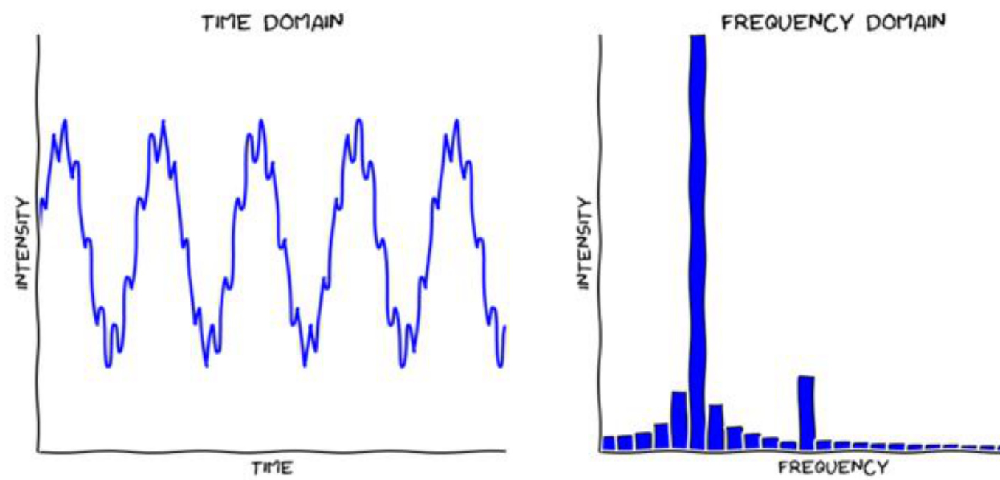
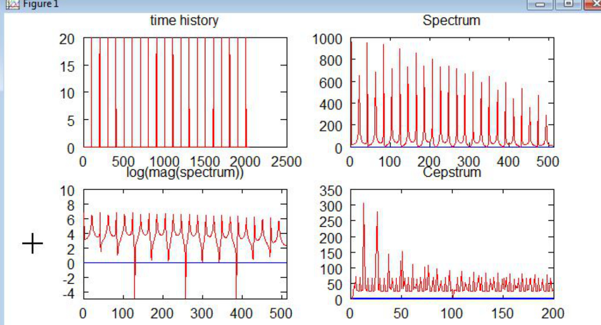
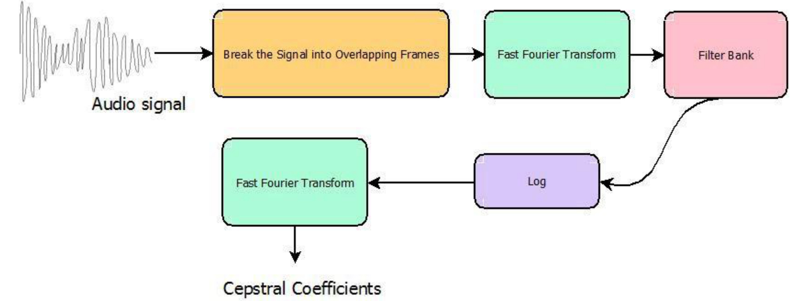

# Audio Preprocessing  

# MFCC  

Mel Frequency Cepstral Coefficients   
cepstral - spectral   
time signal $\Rightarrow$ Fourier transform $\phantom { 0 } \mathrm { - } >$ frequency spectrum Fs  

  

# MFCC  

# cepstrum $\mathbf { \tau } = \mathbf { \tau }$ Discrete Cosine Transform (log(|Fs|))  

  

# MFCC  

Mel scale - scale that relates the perceived frequency of a tone to the actual measured frequency  

$$
( f ) = 2 5 9 5 \log \left( 1 + { \frac { \ l } { 7 } } \right.
$$  

● Filter banks - Representation of the signal obtained after dividing the audio into slices, forming bandpass filters, which are excited by the original signal. MFCC - Cepstral obtained from filter banks  

  

# Pre-processing pipeline  

MFCC   
Append Sum (integration)   
Database Z-score (each signal has it means subtracted and is later divided by   
its standard deviation)   
Tanh   
Kernel Canvas  