# Redes Sem Peso WiSARD - Soluções para Memória Eficiente  

Leandro Santiago  

# WiSARD - Soluções para Memória Eficiente  

# WiSARD (Wilkie, Stoneham and Aleksander’s Recognition Device)  

Neurônio representado como nó RAM Múltiplos Discriminadores Discriminador = Conjunto de RAMs Entradas endereçam blocos de RAMs usando mapeamento pseudo-aleatório biunívoco  

# WiSARD  

# Discriminador representa uma classe a ser reconhecida  

N RAMs e tuplas M bits para cada tupla A RAM armazena 2 M bits Entrada binária: M $\times$ N bits  

# Etapa de Treinamento  

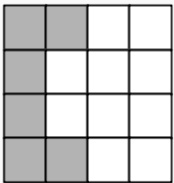  

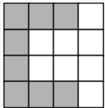  

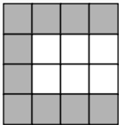  

# Etapa de Treinamento  

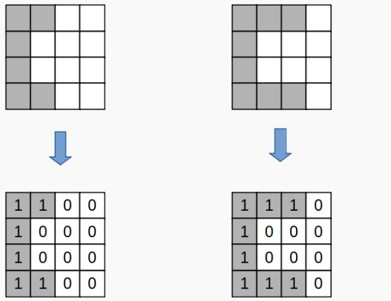  

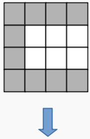  

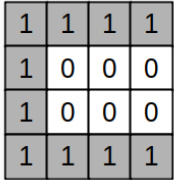  

# Etapa de Treinamento  

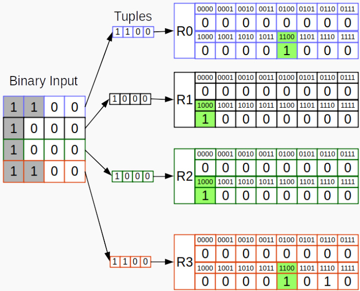  

# Etapa de Treinamento  

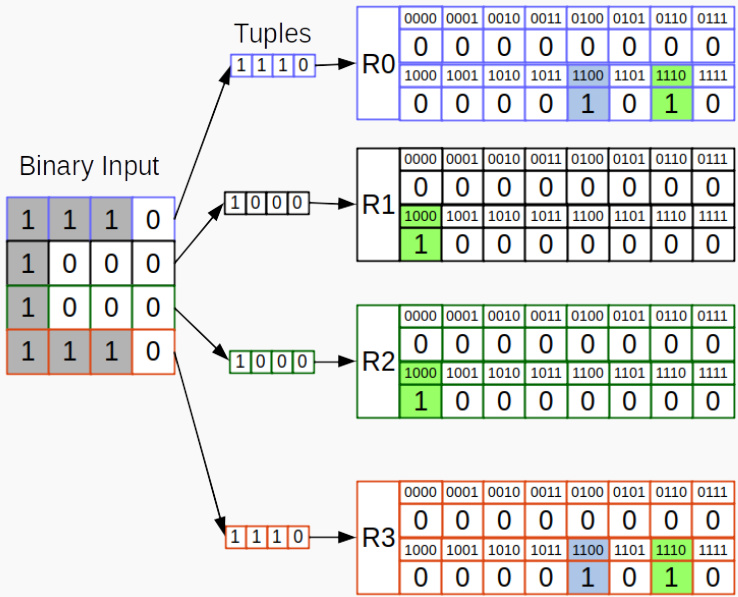  

# Etapa de Treinamento  

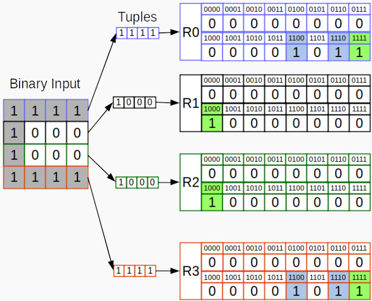  

# Etapa de Classificação  

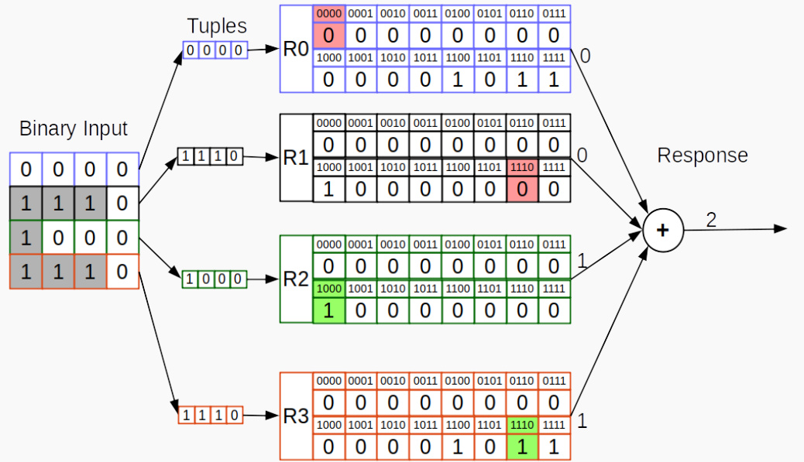  

# Etapa de Classificação  

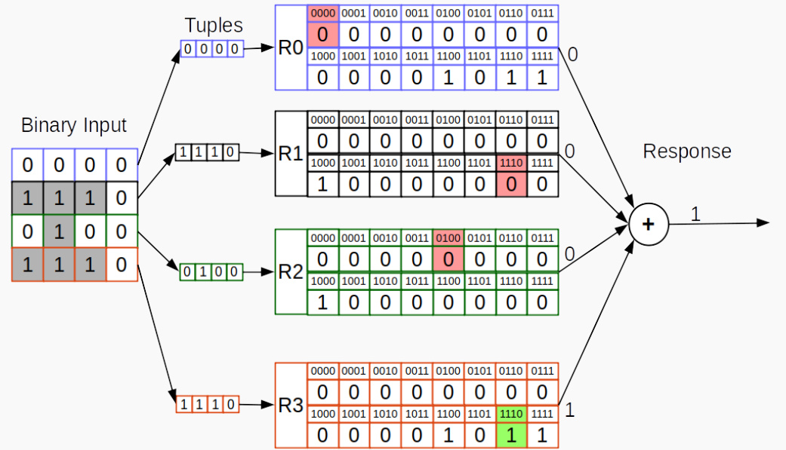  

# Etapa de Classificação  

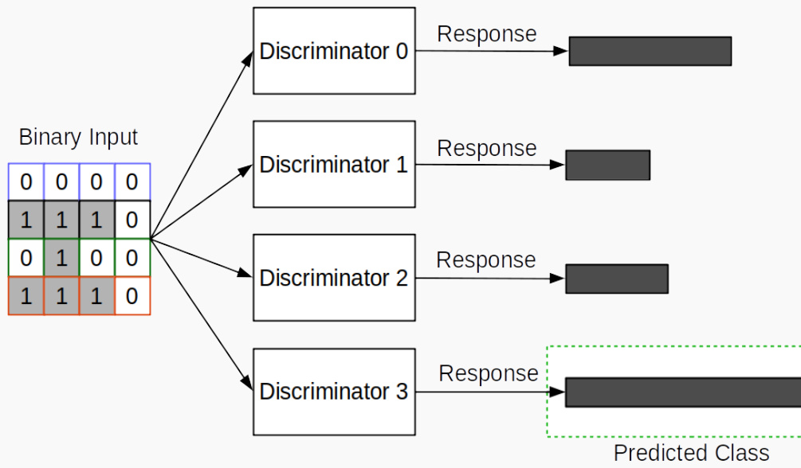  

# Confiança Relativa  

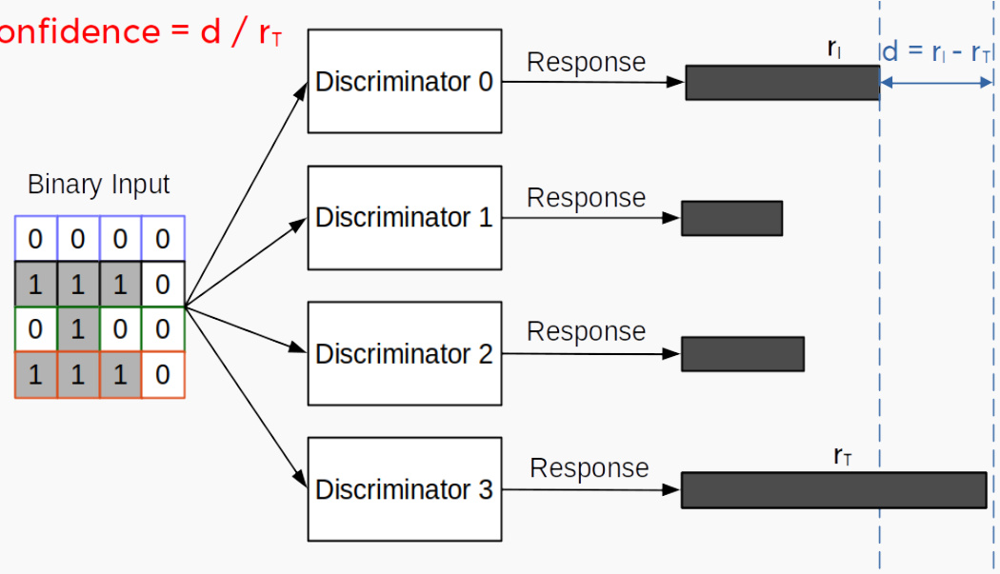  

# WiSARD: Problemas  

Capacidade de generalização do modelo depende da quantidade de posições de RAMs preenchidas  

# WiSARD: Problemas  

Capacidade de generalização do modelo depende da quantidade de posições de RAMs preenchidas  

Como lidar com saturação?  

Aumentar tamanho da tupla $$ mais endereços por neurônio Utilizar q-RAM com $q > 1$ (até 8 bits)  

# WiSARD: Problemas  

Capacidade de generalização do modelo depende da quantidade de posições de RAMs preenchidas  

Como lidar com saturação?  

Aumentar tamanho da tupla $$ mais endereços por neurônio ◦ Utilizar q-RAM com $q > 1$ (até 8 bits)  

→ Como lidar com empate nas respostas dos discriminadores? ◦ Bleaching  

# WiSARD: Problemas  

Capacidade de generalização do modelo depende da quantidade de posições de RAMs preenchidas  

Como lidar com saturação?  

Aumentar tamanho da tupla $$ mais endereços por neurônio ◦ Utilizar q-RAM com $q > 1$ (até 8 bits)  

Como lidar com empate nas respostas dos discriminadores? ◦ Bleaching  

Como lidar com grande espaço de memória?  

Tabela Hash - Dicionário Bloom WiSARD - Leandro Santiago (2020) AMQ WiSARD - Leandro Santiago (?)  

# Problema da Memória  

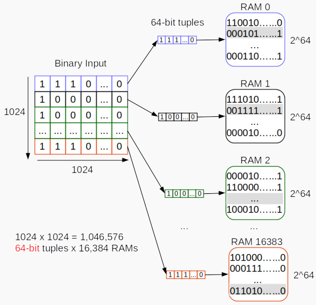  

# Bloom WiSARD  

# Approximate Membership Query - AMQ  

Exact Membership Query  

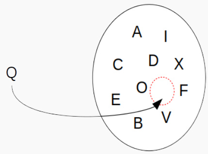  

Approximate Membership Query  

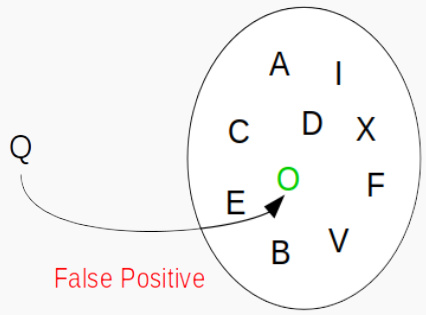  

# Bloom Filter  

Conjunto ${ \cal { S } } = \{ x _ { 1 } , x _ { 2 } , . . . , x _ { n } \}$ de $\boldsymbol { n }$ elementos é descrito como m-bit array  

As posições do array $\{ 1 , . . . , m \}$ são geradas por k funções hash independenes $h _ { 1 } , . . . , h _ { k }$  

Todas as posições começam zeradas  

Probabilidade falso positivo baixa  

# Bloom Filter - Insertion Operation  

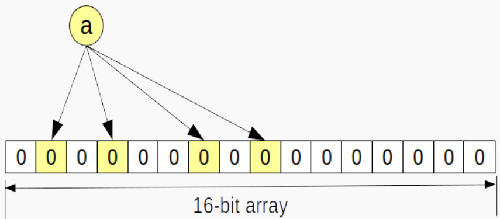  

# Bloom Filter - Insertion Operation  

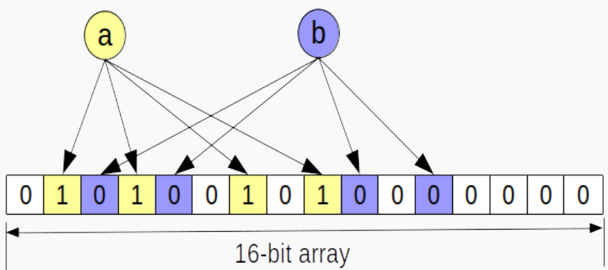  

# Bloom Filter - Insertion Operation  

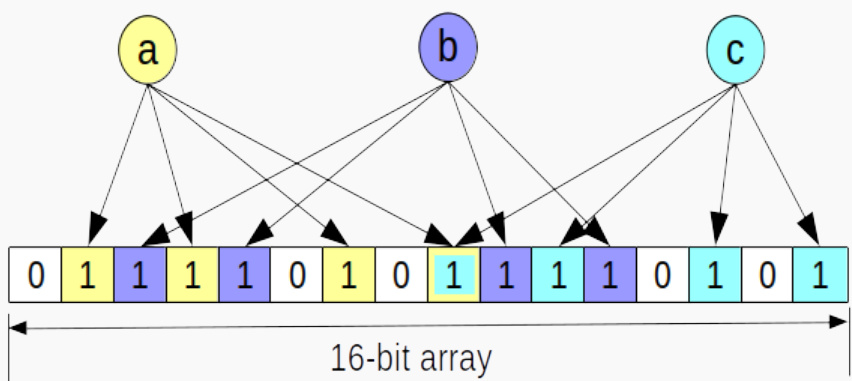  

# Bloom Filter - Query Operation  

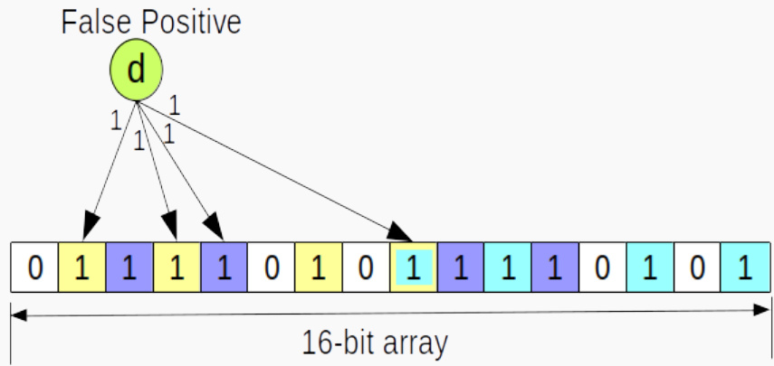  

# Bloom Filter - Query Operation  

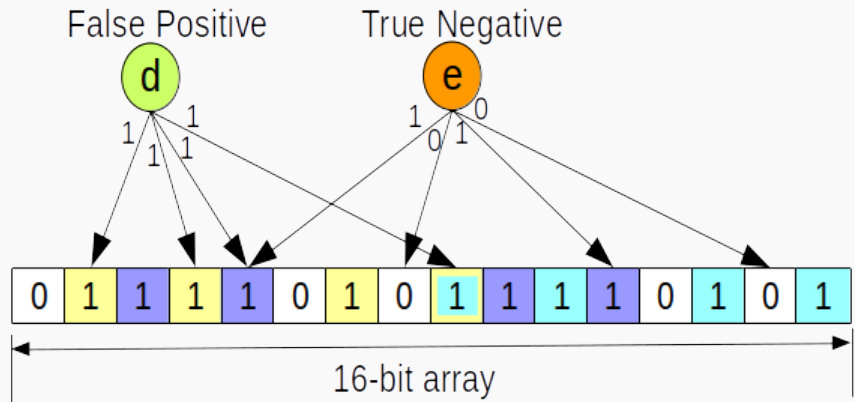  

# Bloom Filter - Query Operation  

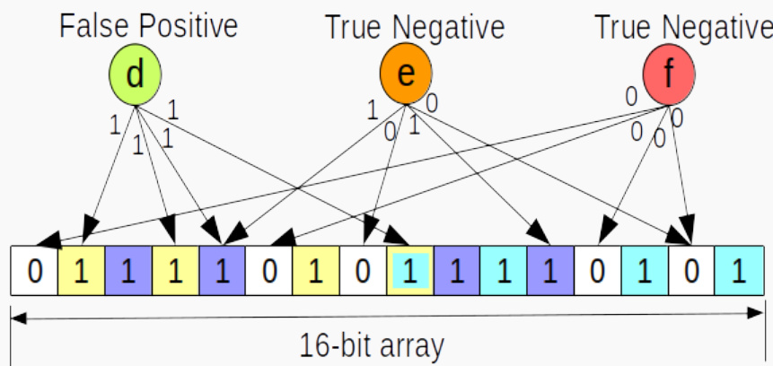  

# Optimal Parameters to Minimize False Positive  

$m =$ Number of bits.   
$c =$ Capacity of set.   
$k =$ Number of hashes.   
error = Probability of false positive.  

# Formulas:  

$$
{ \begin{array} { r l } & { \circ \ \mathbf { m } = - \mathbf { c } \times { \frac { \mathsf { l n } \mathbf { e r r o r } } { ( \mathsf { l n } 2 ) ^ { 2 } } } . } \\ & { \circ \ \mathbf { k } = \mathbf { m } \times { \frac { \mathsf { l n } 2 } { \mathbf { c } } } . } \end{array} }
$$  

# AMQ com Tuplas  

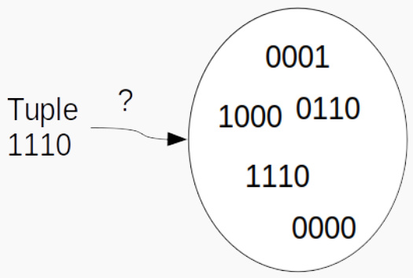  

# Bloom WiSARD Design  

Discriminadores = Conjunto de Bloom Filters  

Função hash: MurmurHash Função hash não criptográfica eficiente para pesquisa baseada em hash  

Double Hashing:  

$$
h ( i , k ) = ( h _ { 1 } ( k ) + i \times h _ { 2 } ( k ) ) { \pmod { n } }
$$  

# Bloom WiSARD - Treinamento  

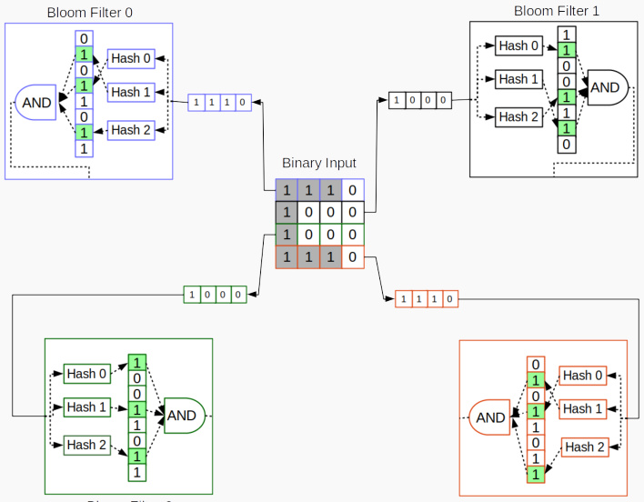  
Bloom Filter 2   
Bloom Filter 3  

# Bloom WiSARD - Inferência  

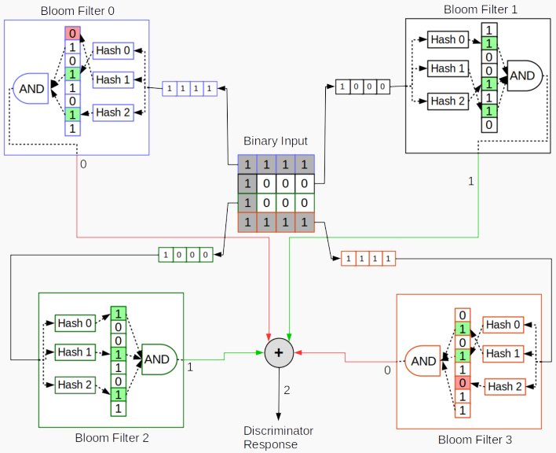  

# Experimental Setup  

WiSARD versions: Standard WiSARD Dictionary WiSARD Bloom WiSARD  

Total of 17 datasets 6 Binary Classification 11 Multiclass Classification  

Random 3-fold cross validation when dataset does not provide separately training and testing set   
20 runs for each scenario  

# Results for Binary Classification  

<html><body><table><tr><td>Dataset</td><td>WNN</td><td>Acc</td><td>Train</td><td>Test</td><td>Memory (KB)</td></tr><tr><td>Adult</td><td>WiSARD Dict WiSARD Bloom WiSARD</td><td>0.722 0.721 0.718</td><td>4.414 1.947 1.932</td><td>1.05 1.188 1.166</td><td>8,978,432.000 383.535 80.173</td></tr><tr><td>Australian</td><td>WiSARD Dict WiSARD Bloom WiSARD</td><td>0.843 0.841 0.834</td><td>0.002 0.002 0.002</td><td>0.001 0.001 0.001</td><td>4,096.000 11.299 8.613</td></tr><tr><td>Banana</td><td>WiSARD Dict WiSARD Bloom WiSARD</td><td>0.87 0.871 0.864</td><td>0.052 0.054 0.058</td><td>0.028 0.033 0.036</td><td>13,312.000 23.428 3.047</td></tr><tr><td>Diabetes</td><td>WiSARD Dict WiSARD Bloom WiSARD</td><td>0.698 0.689 0.69</td><td>0.001 0.001 0.001</td><td>0.0007 0.0008 0.0008</td><td>2,048.000 6.553 4.793</td></tr><tr><td>Liver</td><td>WiSARD DictWiSARD Bloom WiSARD</td><td>0.593 0.587 0.591</td><td>0.001 0.001 0.001</td><td>0.0007 0.0008 0.0009</td><td>5,120.000 6.387 2.344</td></tr><tr><td>Mushroom</td><td>WiSARD DictWiSARD Bloom WiSARD</td><td>1 1 1</td><td>0.051 0.054 0.057</td><td>0.028 0.033 0.035</td><td>8,192.000 19.209 3.750</td></tr></table></body></html>  

# Results for Multiclass Classification - Part 1  

<html><body><table><tr><td>Dataset</td><td>WNN</td><td>Acc</td><td>Train</td><td>Test</td><td>Memory (KB)</td></tr><tr><td rowspan="3">Ecoli</td><td>WiSARD</td><td>0.793</td><td>0.0005</td><td>0.0005</td><td>7,168.000</td></tr><tr><td>DictWiSARD</td><td>0.799</td><td>0.0005</td><td>0.0005</td><td>5.664</td></tr><tr><td>Bloom WiSARD</td><td>0.799</td><td>0.0005</td><td>0.0007</td><td>3.281</td></tr><tr><td rowspan="3">Glass</td><td>WiSARD</td><td>0.72</td><td>0.003</td><td>0.003</td><td>51,968.000</td></tr><tr><td>DictWiSARD</td><td>0.73</td><td>0.003</td><td>0.003</td><td>20.884</td></tr><tr><td>Bloom WiSARD</td><td>0.726</td><td>0.003</td><td>0.003</td><td>23.789</td></tr><tr><td rowspan="3">Iris</td><td>WiSARD Dict WiSARD</td><td>0.985</td><td>0.0001</td><td>0.000009</td><td>1,536.000</td></tr><tr><td></td><td>0.977</td><td>0.0001</td><td>0.000008</td><td>0.747</td></tr><tr><td>Bloom WiSARD</td><td>0.976</td><td>0.0001</td><td>0.0001</td><td>0.703</td></tr><tr><td rowspan="3">Letter</td><td>WiSARD</td><td>0.845</td><td>1.483</td><td>0.16</td><td>10,223,616.000</td></tr><tr><td>Dict WiSARD</td><td>0.846</td><td>0.0717</td><td>0.22</td><td>121.748</td></tr><tr><td>Bloom WiSARD</td><td>0.848</td><td>0.07</td><td>0.208</td><td>91.292</td></tr><tr><td rowspan="3">MNIST</td><td>WiSARD</td><td>0.917</td><td>4.317</td><td>0.33</td><td>9,175,040.000</td></tr><tr><td>Dict WiSARD</td><td>0.916</td><td>0.811</td><td>0.475</td><td>1,368.457</td></tr><tr><td>Bloom WiSARD</td><td>0.915</td><td>0.77</td><td>0.369</td><td>819.049</td></tr></table></body></html>  

# Results for Multiclass Classification - Part 2  

<html><body><table><tr><td>Dataset</td><td>WNN</td><td>Acc</td><td>Train</td><td>Test</td><td>Memory (KB)</td></tr><tr><td rowspan="2">Satimage</td><td>WiSARD</td><td>0.851</td><td>0.048</td><td>0.034</td><td>27,648.000</td></tr><tr><td>Dict WiSARD</td><td>0.853</td><td>0.05</td><td>0.049</td><td>69.141</td></tr><tr><td rowspan="2">Segment</td><td>Bloom WiSARD WiSARD</td><td>0.851 0.935</td><td>0.053 0.009</td><td>0.05 0.007</td><td>12.656 17,024.000</td></tr><tr><td>Dict WiSARD</td><td>0.934</td><td>0.009</td><td>0.01</td><td>7.724</td></tr><tr><td rowspan="2"></td><td>Bloom WiSARD</td><td>0.933</td><td>0.01</td><td>0.011</td><td>7.793</td></tr><tr><td>WiSARD</td><td>0.87</td><td>0.119</td><td>0.064</td><td>8,064.000</td></tr><tr><td rowspan="2">Shuttle</td><td>Dict WiSARD</td><td>0.869</td><td>0.12</td><td>0.078</td><td>4.956</td></tr><tr><td>Bloom WiSARD WiSARD</td><td>0.868 0.67</td><td>0.132</td><td>0.103</td><td>3.691</td></tr><tr><td rowspan="2">Vehicle</td><td>Dict WiSARD</td><td>0.672</td><td>0.003 0.003</td><td>0.0021 0.0026</td><td>9,216.000</td></tr><tr><td>Bloom WiSARD</td><td>0.662</td><td>0.003</td><td>0.0028</td><td>17.617 4.219</td></tr><tr><td rowspan="2">Vowel</td><td>WiSARD</td><td>0.876</td><td>0.0023</td><td>0.0025</td><td>14,080.000</td></tr><tr><td>DictWiSARD</td><td>0.876</td><td>0.0023</td><td>0.0032</td><td>16.221</td></tr><tr><td rowspan="4">Wine</td><td>Bloom WiSARD</td><td>0.879</td><td>0.0022</td><td>0.0036</td><td>6.445</td></tr><tr><td>WiSARD</td><td>0.932</td><td>0.0006</td><td>0.0003</td><td>4,992.000</td></tr><tr><td>Dict WiSARD</td><td>0.924</td><td>0.0005</td><td>0.0003</td><td>4.248</td></tr><tr><td>Bloom WiSARD</td><td>0.926</td><td>0.0005</td><td>0.0004</td><td>2.285</td></tr></table></body></html>  

# Memory x Accuracy x Probability of False Positive - Part 1  

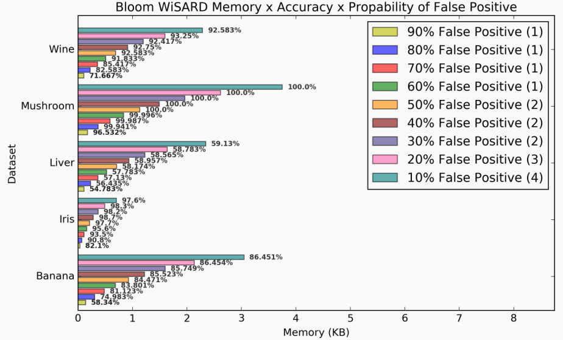  

# Memory x Accuracy x Probability of False Positive - Part 2  

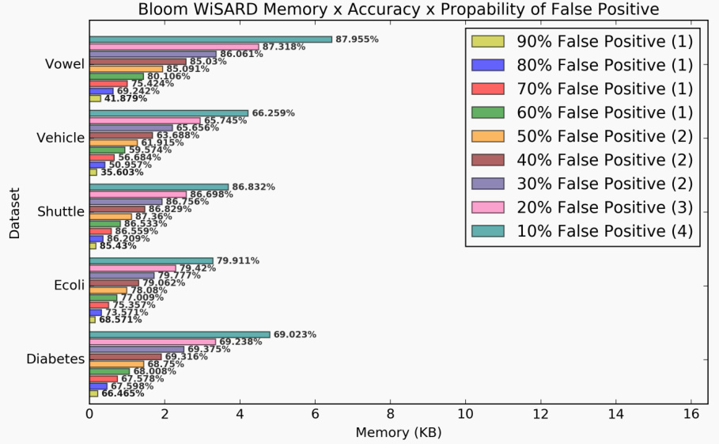  

# Memory x Accuracy x Probability of False Positive - Part 3  

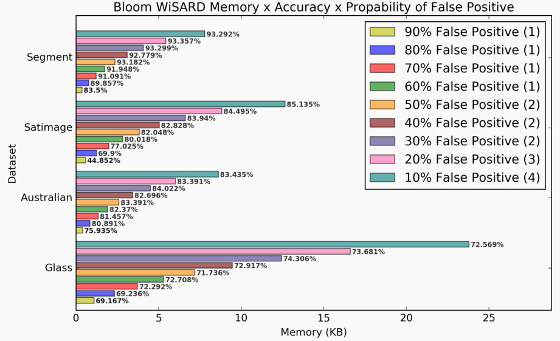  

# Memory x Accuracy x Probability of False Positive - Part 4  

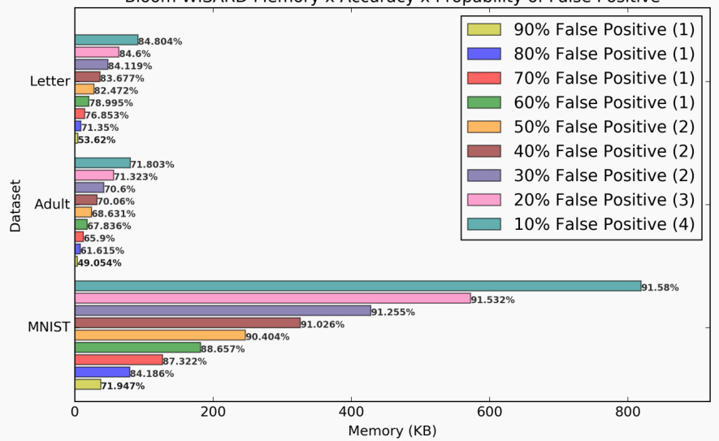  
Bloom WiSARD Memory × Accuracy× Propability of False Positive  

# Conclusão  

Bloom filter economiza mais recursos de memória do que o Dicionário  

Bloom filter com 10% de Falso Positivo mantêm boa precisão e reduz a memória em cerca de 7,7 vezes em comparação com a implementação de dicionários e até 6 ordens de magnitude quando comparados à implementação padrão do WiSARD  

Bloom filter com 50% de Falso Positivo também mantêm boa precisão e reduz a memória em cerca de 3,3 vezes em comparação com 10% da configuração de Falso Positivo  

# BTHOWeN  

# Motivação  

Crescimento da área de Edge Computing TinyML  

Evolução de aceleradores para Deep Learning GP-GPU: CUDA TPU: Tensor Processing Unit  

# Tipos de Hardware para AI  

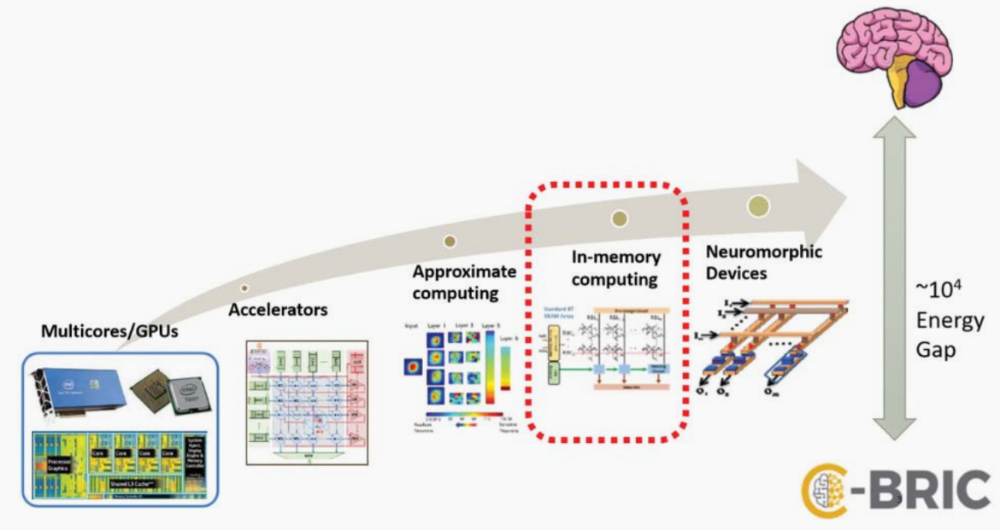  

# Reconfigurable Computing - FPGA  

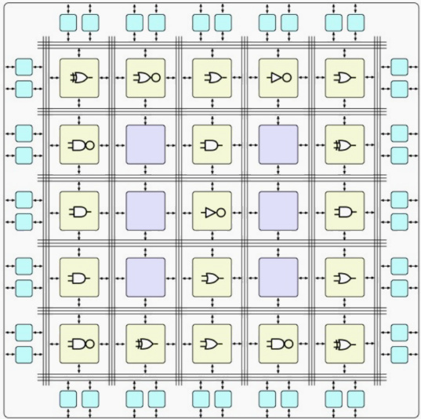  

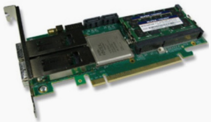  

# BTHOWeN  

BTHOWeN = Bleached Thermometer-encoded Hashed-input Optimized Weightless Neural Network  

Implementação de hardware para edge inference FPGA - System Verilog  

Técnicas utilizadas: Counting Bloom Filter Gaussian non-linear thermometer ◦ Bleaching (B-bleaching)  

# Counting Bloom Filter  

Bloom filter Inserção ◦ Query  

Counting Bloom filter Deleção  

# Counting Bloom Filter - Insertion Operation  

  

# Counting Bloom Filter - Insertion Operation  

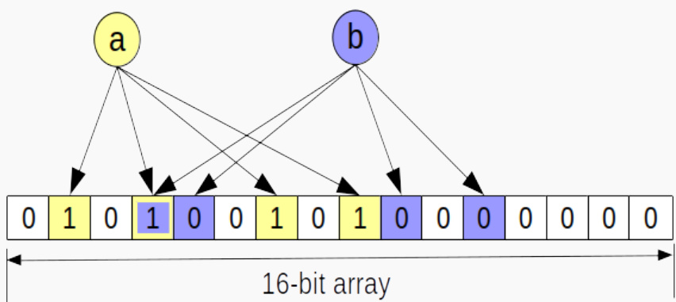  

# Counting Bloom Filter - Insertion Operation  

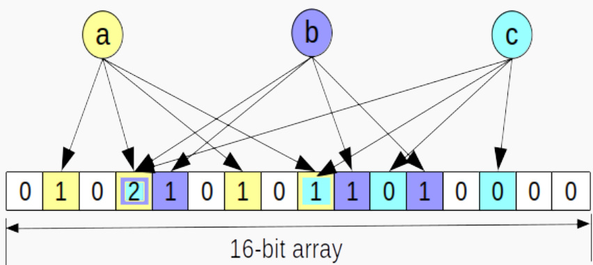  

# Counting Bloom Filter - Insertion Operation  

  

# Counting Bloom Filter - Query Operation  

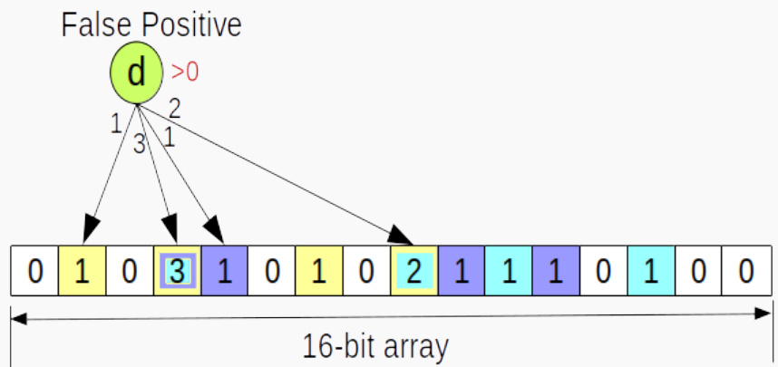  

# Counting Bloom Filter - Query Operation  

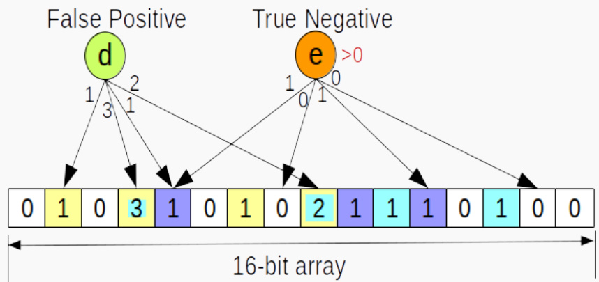  

# Counting Bloom Filter - Query Operation  

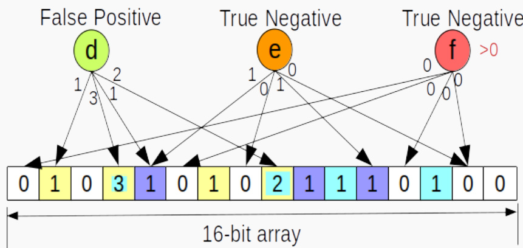  

# Counting Bloom Filter - Deletion Operation  

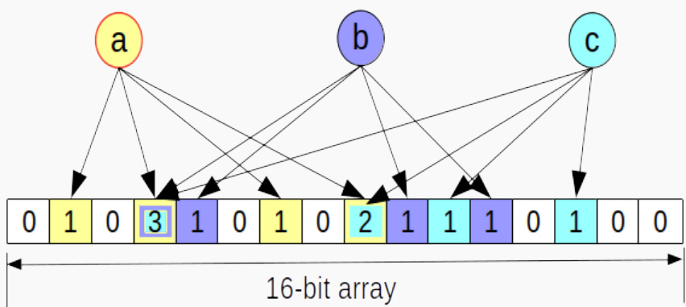  

# Counting Bloom Filter - Deletion Operation  

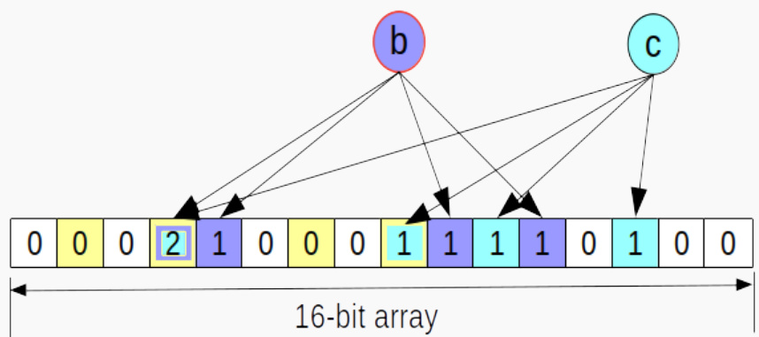  

# Counting Bloom Filter - Deletion Operation  

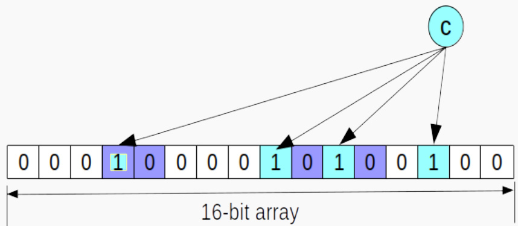  

# Counting Bloom Filter - Deletion Operation  

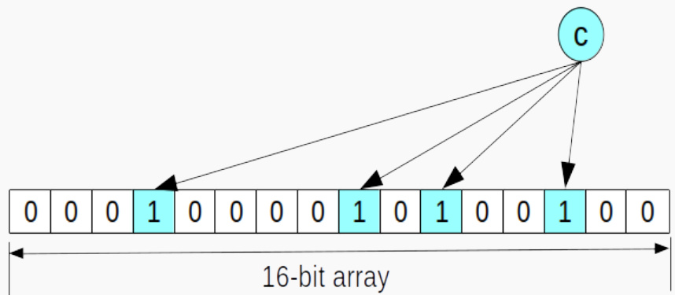  

# Bloom Filter Design  

Discriminadores = Conjunto de Counting Bloom Filters  

Função hash: H3 para mapear de n m bits Dimensão: x (1 x n), p (n x m)  

$$
h ( x ) = x [ 0 ] p _ { 0 } \oplus x [ 1 ] p _ { 1 } \oplus . . . \oplus x [ n - 1 ] p _ { n - 1 }
$$  

# Arquitetura do BTHOWeN  

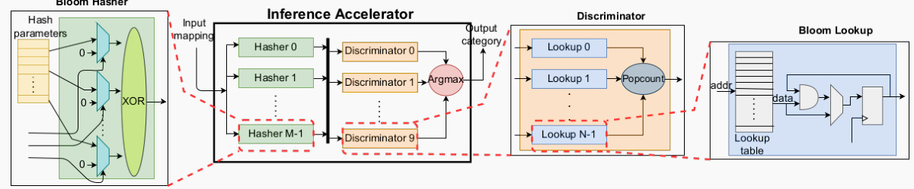  

# BTHOWeN - Treinamento  

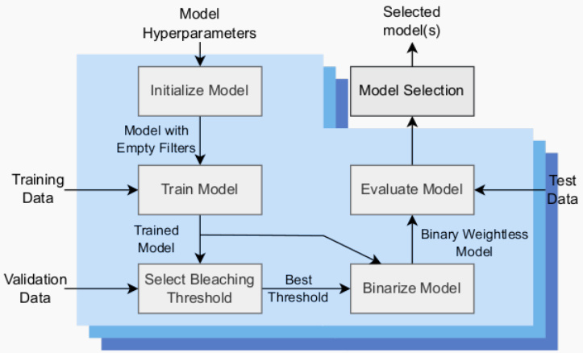  

# Experimental Setup  

Modelos: BTHOWeN O MLP C CNN - LeNet-1  

TensorFlow Lite (quantização com 8-bit) e hls4ml tool Total de 9 datasets  

# Acurácia dos Modelos do BTHOWeN  

<html><body><table><tr><td>Model Name</td><td>Bits /Input</td><td>Bits /Filter</td><td>Entries /Filter</td><td>Hashes /Filter</td><td>Size (KiB)</td><td>Test Acc.</td></tr><tr><td>MNIST-Small</td><td>2</td><td>28</td><td>1024</td><td>2</td><td>70.0</td><td>0.934</td></tr><tr><td>MNIST-Medium</td><td>3</td><td>28</td><td>2048</td><td>2</td><td>210</td><td>0.943</td></tr><tr><td>MNIST-Large</td><td>6</td><td>49</td><td>8192</td><td>4</td><td>960</td><td>0.952</td></tr><tr><td>Ecoli</td><td>10</td><td>10</td><td>128</td><td>2</td><td>0.875</td><td>0.875</td></tr><tr><td>Iris</td><td>3</td><td>2</td><td>128</td><td>1</td><td>0.281</td><td>0.980</td></tr><tr><td>Letter</td><td>15</td><td>20</td><td>2048</td><td>4</td><td>78.0</td><td>0.900</td></tr><tr><td>Satimage</td><td>8</td><td>12</td><td>512</td><td>4</td><td>9.00</td><td>0.880</td></tr><tr><td>Shuttle</td><td>9</td><td>27</td><td>1024</td><td>2</td><td>2.63</td><td>0.999</td></tr><tr><td>Vehicle</td><td>16</td><td>16</td><td>256</td><td>3</td><td>2.25</td><td>0.762</td></tr><tr><td>Vowel</td><td>15</td><td>15</td><td>256</td><td>4</td><td>3.44</td><td>0.900</td></tr><tr><td>Wine</td><td>9</td><td>13</td><td>128</td><td>3</td><td>0.422</td><td>0.983</td></tr></table></body></html>  

# Comparação BTHOWeN e DNN Quantizadas - Parte 1  

<html><body><table><tr><td>Dataset</td><td>Model</td><td>Bus Width</td><td>Cycles per Inf.</td><td>Hash Units</td><td>Dyn. Power (Tot. Power) (W)</td><td>Dyn. Energy (Tot. Energy) (nJ/Inf.)</td><td>LUTs</td><td>FFs</td><td>BRAMsDSPs (36Kb)</td><td></td><td> Accuracy</td></tr><tr><td rowspan="8">MNIST</td><td>BTHOWeN-Small</td><td>64</td><td>25</td><td>5</td><td>0.195 (0.303)</td><td>48.75 (75.8)</td><td>15756</td><td>3522</td><td>0</td><td>0</td><td>0.934</td></tr><tr><td>BTHOWeN-Medium</td><td>64</td><td>37</td><td>5</td><td>0.386 (0.497)</td><td>142.8 (183.9)</td><td>38912</td><td>6577</td><td>0</td><td>0</td><td>0.943</td></tr><tr><td>BTHOWeN-Large</td><td>64</td><td>74</td><td>6</td><td>3.007 (3.509)</td><td>2225 (2597)</td><td>151704</td><td>18796</td><td>0</td><td>0</td><td>0.952</td></tr><tr><td>BTHOWeN-Large*</td><td>256</td><td>19</td><td>24</td><td>3.158 (3.661)</td><td>600.0 (695.6)</td><td>158367</td><td>25905</td><td>0</td><td>0</td><td>0.952</td></tr><tr><td>MLP784-16-10</td><td>64</td><td>846</td><td>-</td><td>0.029 (0.134)</td><td>245 (1133)</td><td>2163</td><td>3007</td><td>8</td><td>28</td><td>0.946</td></tr><tr><td>CNN1 (LeNet1) [34]</td><td>64</td><td>33615</td><td>-</td><td>0.058 (0.163)</td><td>19497 (54792)</td><td>5753</td><td>3115</td><td>7</td><td>18</td><td>0.947</td></tr><tr><td>CNN 2 (LeNet1) [34]</td><td>64</td><td>33555</td><td>-</td><td>0.043 (0.148)</td><td>14429 (49661)</td><td>3718</td><td>2208</td><td>5</td><td>10</td><td>0.920</td></tr><tr><td>HashedWNN[19]</td><td>32</td><td>28</td><td>-</td><td>0.423 (0.528)</td><td>118.4 (147.8)</td><td>9636</td><td>4568</td><td>128.5</td><td>5</td><td>0.907</td></tr><tr><td rowspan="2">Ecoli</td><td>BTHOWeN</td><td>64</td><td>2</td><td>7</td><td>0.012 (0.117)</td><td>0.24 (2.34)</td><td>353</td><td>223</td><td>0</td><td>0</td><td>0.875</td></tr><tr><td>MLP7-8-8</td><td>64</td><td>14</td><td></td><td>0.03 (0.135)</td><td>4.2 (18.9)</td><td>1596</td><td>1615</td><td>0</td><td>0</td><td>0.875</td></tr><tr><td rowspan="2">Iris</td><td>BTHOWeN</td><td>64</td><td>1</td><td>6</td><td>0.005 (0.109)</td><td>0.05 (1.09)</td><td>57</td><td>90</td><td>0</td><td>0</td><td>0.980</td></tr><tr><td>MLP 4-4-3</td><td>64</td><td>10</td><td>-</td><td>0.008 (0.112)</td><td>0.8 (11.2)</td><td>427</td><td>488</td><td>0</td><td>0</td><td>0.980</td></tr></table></body></html>  

# Comparação BTHOWeN e DNN Quantizadas - Parte 2  

<html><body><table><tr><td rowspan="2">Dataset</td><td rowspan="2">Model</td><td rowspan="2">Bus Width</td><td rowspan="2">Cycles per</td><td rowspan="2">Hash Units</td><td rowspan="2">Dyn. Power (Tot.</td><td rowspan="2">Dyn. Energy (Tot. Energy)</td><td rowspan="2">LUTs</td><td rowspan="2">FFs</td><td rowspan="2">BRAMs (36Kb)</td><td rowspan="2">DSPs</td><td rowspan="2">Accuracy</td></tr><tr><td>(nJ/Inf.)</td></tr><tr><td rowspan="2">Letter</td><td>BTHOWeN</td><td>64</td><td>Inf. 4</td><td>12</td><td>Power) (W) 0.623 (0.738)</td><td>24.92 (29.52)</td><td>21603</td><td>2715</td><td>0</td><td>0</td><td>0.900</td></tr><tr><td>MLP 16-40-26</td><td>64</td><td>26</td><td>-</td><td>0.109 (0.259)</td><td>39.52 (67.34)</td><td>17305</td><td>15738</td><td>0</td><td>0</td><td>0.904</td></tr><tr><td rowspan="2"> Satimage</td><td></td><td></td><td></td><td></td><td></td><td></td><td></td><td></td><td></td><td></td><td></td></tr><tr><td>MBTHOWeN6</td><td>6464</td><td>525</td><td>24</td><td>0.084 (0.140)</td><td>4.2(9.5)</td><td>3771</td><td>1131</td><td>00</td><td>00</td><td>0.880</td></tr><tr><td rowspan="2">Shuttle</td><td></td><td>6464</td><td></td><td></td><td></td><td></td><td>593</td><td></td><td></td><td></td><td></td></tr><tr><td>BTHOWeN</td><td></td><td>24</td><td>3-</td><td>0.018 (0.12)</td><td>0.36 (2.462)</td><td></td><td>121</td><td>00</td><td>00</td><td>0.999</td></tr><tr><td rowspan="2">Vehicle</td><td>BTHOWeN</td><td>64</td><td>5</td><td>18</td><td>0.038 (0.143)</td><td>1.9 (7.15)</td><td>1781</td><td>597</td><td>0</td><td>0</td><td>0.762</td></tr><tr><td>MLP 18-16-4</td><td>64</td><td>15</td><td>-</td><td>0.024 (0.128)</td><td>3.6 (19.2)</td><td>2824</td><td>3035</td><td>0</td><td>0</td><td>0.766</td></tr><tr><td rowspan="2">Vowel</td><td>BTHOWeN</td><td>64</td><td>2</td><td>12</td><td>0.040 (0.145)</td><td>0.8 (2.9)</td><td>1559</td><td>756</td><td>0</td><td>0</td><td>0.900</td></tr><tr><td>MLP 10-18-11</td><td>64</td><td>18</td><td>-</td><td>0.070 (0.175)</td><td>12.6 (31.5)</td><td>5743</td><td>4663</td><td>0</td><td>0</td><td>0.903</td></tr><tr><td rowspan="2">Wine</td><td></td><td>6464</td><td>34</td><td>9-</td><td>0.01 (0.117)</td><td>0.36 (.1)</td><td>585</td><td>239</td><td>00</td><td>00</td><td></td></tr><tr><td>MLP13-103</td><td></td><td></td><td></td><td></td><td></td><td></td><td></td><td></td><td></td><td>0.983</td></tr></table></body></html>  

# BTHOWeN vs DNN - Latência e Energia Relativa  

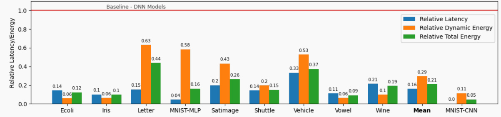  

# Conclusão  

Função H3 e Termômetro Gaussiano melhorou a acurácia do MNIST de 91.5% para 95.2%  

BTHOWeN é competitivo com outras arquiteturas: WNN, MLP e CNN  

Em relação a outras arquitetura de WNN, BTHOWeN reduz erro por 41% e o tamanho do modelo by 51% considerando os 9 datasets  

Comparado aos modelos MLP, BTHOWeN consome 20% da energia total enquanto reduz a latência em 85%  

As melhorias de energia/latência em relação às CNNs são ainda maiores, embora as CNNs tenham maior precisão  

# ULEEN  

# ULEEN  

ULEEN = Ultra-low-energy Edge Networks  

$$ Implementação de hardware para edge inference - FPGA  

Técnicas adicionais: Continuos Bloom Filter Ensemble Pruning Multi-pass training  

# Visão Geral da ULEEN  

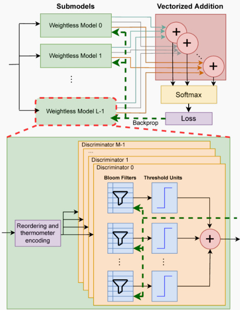  

# Continuos Bloom Filter  

→ Floating-point array → [-1, 1]  

Gradiente $\begin{array} { r } { s i g n ( x ) = \left\{ \begin{array} { l l } { - 1 \quad } & { x < 0 } \\ { 1 \quad } & { x \geq 0 } \end{array} \right. } \end{array}$  

$$
s i g n ^ { \prime } ( x ) = \left\{ \begin{array} { l l } { { + \infty } } & { { \quad x = 0 } } \\ { { 0 } } & { { \quad x \neq 0 } } \end{array} \right.
$$  

# Continuos Bloom Filter  

Straight-through estimator (STE) function  

# Gradiente  

$$
S T E ( x ) = \left\{ { \begin{array} { l l } { - 1 } & { \quad x < 0 } \\ { 1 } & { \quad x \geq 0 } \end{array} } \right.
$$  

$$
S T E ^ { \prime } ( x ) = { \left\{ \begin{array} { l l } { 1 } & { \quad | x | \leq 1 } \\ { 0 } & { \quad | x | > 1 } \end{array} \right. }
$$  

# Continuos Bloom Filter  

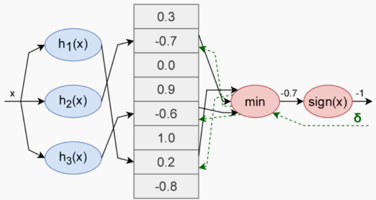  

# Ensemble  

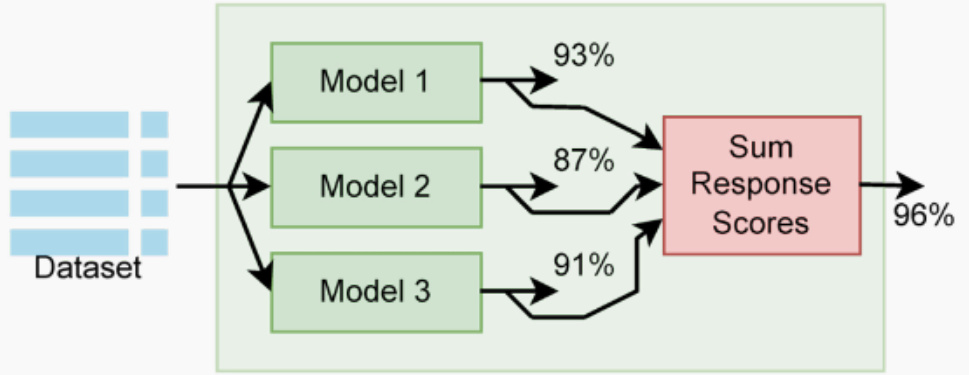  

# Pruning  

Discriminadores são testados com seus exemplos de treinamento. É analisado quais neurônios retornam 1  

Utility score (US) baseado nas taxas de falso (e verdadeiro) positivo (e negativo)  

$$
U S = ( M - 1 ) ( T P R - F N R ) + ( T N R - F P R )
$$  

Fração fixa de neurônios em cada discriminador com US mais baixas são removidos do modelo  

bias inteiro adicionado nas respostas dos neurônios que é aprendido  

# Pruning  

# Uniform Pruning  

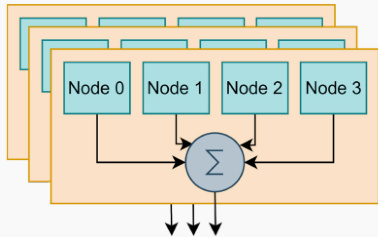  
No Pruning  

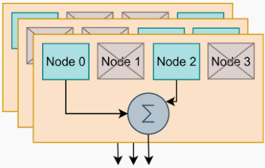  
Non-Uniform Pruning  

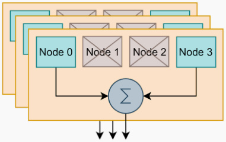  

# Multi-Pass Training  

Continuous Bloom filter são inicializados com valores aleatórios [-1, 1]  

Backpropation com STE  

Função de custo: Cross-entropy loss  

Dropout = 0.5, Adam optimizer, learning rate = 10−3  

Saída neurônio: {-1, 0, 1}  

# Multi-Pass Training  

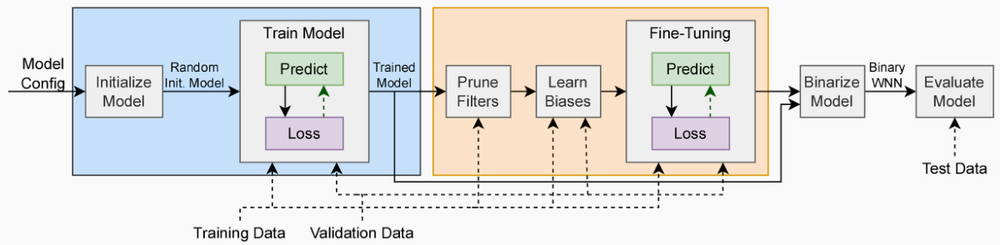  

# Inferência  

Countinuos Bloom filter é convertido em Bloom filter usando unit step function  

Saída neurônio: {-1, 1}  

# Arquitetura ULEEN  

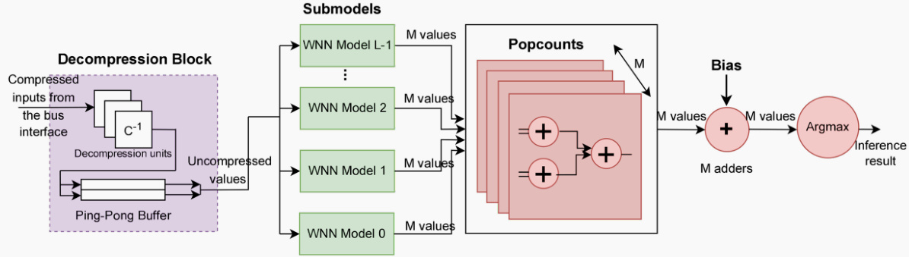  

# Implementação do Modelo  

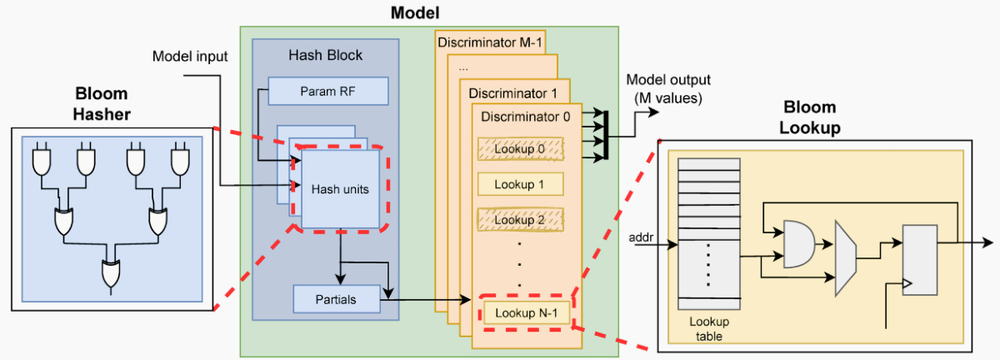  

# Experimental Setup  

Modelos: O ULEEN Xilinx FINN - (3 hidden layers) ? BTHOWeN  

Total de 5 datasets: MNIST + 4 MLPerf Tiny dataset  

# Acurácia: ULEEN vs FINN  

<html><body><table><tr><td rowspan="2">Dataset</td><td colspan="2">ULEEN</td><td colspan="3">FINN BNN Iso-accuracy</td><td colspan="3">FINN BNN Iso-size</td></tr><tr><td>Size (KiB)</td><td>Test Acc.%</td><td>Size (KiB)</td><td>Test Acc.%</td><td>Hidden layer size</td><td>Size (KiB)</td><td>Test Acc.%</td><td>Hidden layer size</td></tr><tr><td>MNIST-S</td><td>16.9</td><td>96.2</td><td>40.8</td><td>95.8</td><td>256 × 3 (SFC)</td><td>16.4</td><td>95.2</td><td>128 ×3</td></tr><tr><td>MNIST-M</td><td>101</td><td>97.8</td><td>114</td><td>97.7</td><td>512 ×3 (MFC)</td><td>103</td><td>97.7</td><td>480 ×3</td></tr><tr><td>MNIST-L</td><td>262</td><td>98.5</td><td>355</td><td>98.4</td><td>1,024 × 3 (LFC)</td><td>283</td><td>98.0</td><td>896×3</td></tr><tr><td>KWS</td><td>101</td><td>70.3</td><td>324</td><td>70.6</td><td>1,024 × 3</td><td>101</td><td>67.0</td><td>524×3</td></tr><tr><td>ToyADMOS</td><td>16.6</td><td>86.3</td><td>36.1</td><td>86.1</td><td>256×3</td><td>16.4</td><td>85.5</td><td>144×3</td></tr><tr><td>VWW</td><td>251</td><td>61.8</td><td>3,329*</td><td>57.1*</td><td>2,048 × 3*</td><td>264</td><td>55.7</td><td>224×3</td></tr><tr><td>CIFAR-10</td><td>1,379</td><td>54.2</td><td>19,466*</td><td>45.7*</td><td>8,192 × 3*</td><td>1,345</td><td>44.4</td><td>1,700 × 3</td></tr></table></body></html>  

# Detalhes Modelos ULEEN  

<html><body><table><tr><td>Dataset</td><td>Model</td><td>Submodel</td><td>Bits/Inp</td><td>Inputs/Filter</td><td>Entries/Filter</td><td>Size (KiB)</td><td>Test Acc.%</td></tr><tr><td rowspan="9">MNIST</td><td rowspan="3">ULN-S</td><td>Ensemble</td><td>2</td><td>1</td><td>1</td><td>16.9</td><td>96.20</td></tr><tr><td>SM0</td><td>2</td><td>12</td><td>64</td><td>7.19</td><td>92.91</td></tr><tr><td>SM1 SM2</td><td>2 2</td><td>16 20</td><td>64 64</td><td>5.39 4.38</td><td>90.25 86.16</td></tr><tr><td rowspan="2">ULN-M</td><td>Ensemble SM0</td><td>3 3</td><td>二 12</td><td>二 64</td><td>101 10.9</td><td>97.79 83.54</td></tr><tr><td>SM1 SM2 SM3 SM4</td><td>3 3 3 3</td><td>16 20 28 36</td><td>128 256 256</td><td>16.0 26.0 18.44</td><td>90.93 92.92 87.05</td></tr><tr><td rowspan="2">ULN-L</td><td>Ensemble SM0 SM1</td><td>7 7 7</td><td>二 12 16</td><td>512 二 64</td><td>29.38 262 25.0</td><td>80.93 98.46 88.78</td></tr><tr><td>SM2 SM3 SM4 SM5</td><td>7 7 7</td><td>20 24 28</td><td>128 128 256 256</td><td>37.7 30.2 50.3 43.1</td><td>93.24 92.44 93.92</td></tr></table></body></html>  

# Detalhes Modelos ULEEN  

<html><body><table><tr><td>Dataset</td><td>Model</td><td>Submodel</td><td>Bits/Inp</td><td>Inputs/Filter</td><td>Entries/Filter</td><td>Size (KiB)</td><td>Test Acc.%</td></tr><tr><td colspan="2" rowspan="3">KWS</td><td>Ensemble</td><td>12</td><td>二</td><td>二</td><td>101</td><td>70.34</td></tr><tr><td>SM0</td><td>12</td><td>5</td><td>8</td><td>9.62</td><td>56.93</td></tr><tr><td>SM1 SM2</td><td>12 12</td><td>6 7</td><td>16 32</td><td>16.1 27.5</td><td>59.32 59.94</td></tr><tr><td rowspan="5">ToyADMOS</td><td>SM3</td><td>12</td><td>8</td><td>64</td><td>48.12</td><td>61.01</td></tr><tr><td>Ensemble</td><td>6</td><td>二</td><td></td><td>16.6</td><td>86.33</td></tr><tr><td>SM0</td><td>6</td><td>7</td><td>64</td><td>6.88</td><td>83.61</td></tr><tr><td>SM1</td><td>6</td><td>9</td><td>64</td><td>5.34</td><td>82.32</td></tr><tr><td>SM2</td><td>6</td><td>11</td><td>64</td><td>4.38</td><td>79.85</td></tr><tr><td rowspan="5">VWW</td><td>Ensemble</td><td>12</td><td>二</td><td>二</td><td>251</td><td>61.76</td></tr><tr><td>SM0</td><td>12</td><td>5</td><td>8</td><td>30.2</td><td>59.07</td></tr><tr><td>SM1</td><td>12</td><td>7</td><td>16</td><td>43.2</td><td>57.78</td></tr><tr><td>SM2</td><td>12</td><td>9</td><td>32</td><td>67.2</td><td>59.20</td></tr><tr><td>SM3</td><td>12</td><td>11</td><td>64</td><td>110</td><td>58.96</td></tr><tr><td rowspan="5">CIFAR-10</td><td>Ensemble</td><td>8</td><td>二</td><td>二</td><td>1379</td><td>54.21</td></tr><tr><td>SM0</td><td>8</td><td>6</td><td>32</td><td>112</td><td>49.12</td></tr><tr><td>SM1</td><td>8</td><td>8</td><td>64</td><td>168</td><td>49.53</td></tr><tr><td>SM2</td><td>8</td><td>12</td><td>128</td><td>224</td><td>46.39</td></tr><tr><td>SM3</td><td>8</td><td>16</td><td>256</td><td>336</td><td>42.23</td></tr><tr><td></td><td>SM4</td><td>8</td><td>20</td><td>512</td><td>538</td><td>38.27</td></tr></table></body></html>  

# Eficiência Energética e de Área  

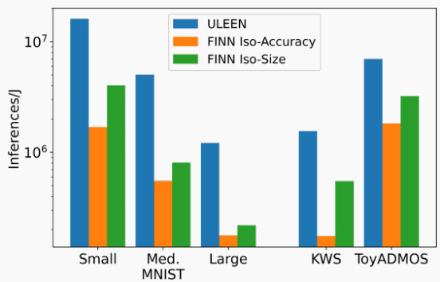  

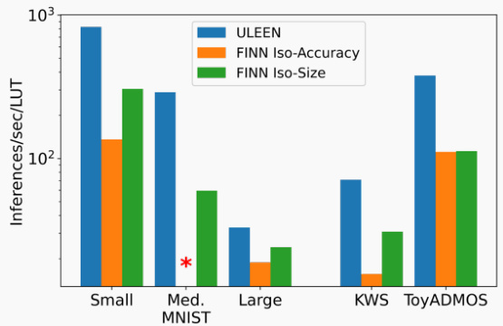  

# Conclusão  

Ensemble, pruning e multi-pass training melhoram a acurácia do modelo e reduz o tamanho dos parâmetros  

Comparação com FINN: melhora na eficiência energética em estado estacionário em 3,8–9,1x e area-delay product em 1,7–7,8x nos datasets MNIST, KWS e ToyADMOS/car  

ULEEN avança significativamente o estado da arte em precisão de WNN, demonstrando que WNNs podem superar até mesmo BNNs altamente otimizados para algumas aplicações  

# Conclusão  

# Comparação dos Modelos WNN  

<html><body><table><tr><td>Model</td><td>Bloom filters</td><td>Thermometer encoding</td><td>Submodel ensembles</td><td>Bleaching</td><td>Multi-pass training</td><td> Pruning</td></tr><tr><td>WiSARD [4]</td><td>X</td><td>X</td><td>X</td><td>X</td><td>X</td><td>X</td></tr><tr><td>Bloom WiSARD[55]</td><td>√</td><td>X</td><td>X</td><td>X</td><td>X</td><td>X</td></tr><tr><td>WiSARD Encodings [31]</td><td>X</td><td>√</td><td>X</td><td>√</td><td>X</td><td>X</td></tr><tr><td>Regression WiSARD [44]</td><td>X</td><td>√</td><td>√</td><td>√</td><td>X</td><td>X</td></tr><tr><td>BTHOWeN[57]</td><td>√</td><td>√</td><td>X</td><td>√</td><td>X</td><td>X</td></tr><tr><td>ULEEN (this work)</td><td>√</td><td>√</td><td>√</td><td>X*</td><td>√</td><td>√</td></tr></table></body></html>  

# WiSARD - Outros Tipos de Memória  

Ainda é possível reduzir os espaço de memória? Estrutura de Dados Esparsas - ex: SDM, SDR Redução da Tabela Verdade - Mapa de Karnaugh Gerar uma função que substitua memória - Problema XOR Outras representações de sistemas numéricos - RNS  

# Tópicos de Pesquisas  

Segurança-Assistida por Hardware Computação de Alto Desempenho Computação Reconfigurável $$ Inteligência Artificial Verde Redes Neurais sem Peso ◦ HyperDimensional Computing  

# Tópicos de Pesquisas  

HyperDimensional Computing Série Temporal - Forecasting e Nowcasting   
Processamento de Linguagem Natural Aprendizado Federado   
◦ TinyML  

# Redes Sem Peso WiSARD - Soluções para Memória Eficiente  

Leandro Santiago  

# leandro@ic.uff.br  